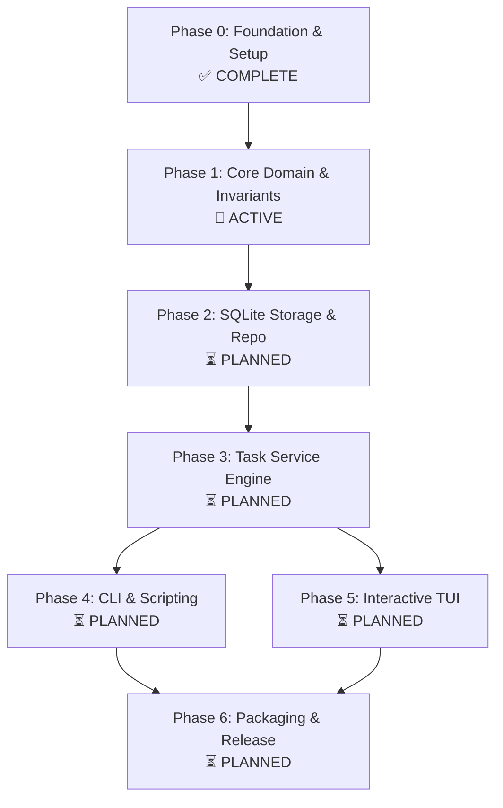

# Tusk Reboot: Checklist Masterplan & Orchestration Dashboard

**Current Status**: 🟢 Active Development  
**Active Phase**: Phase 1: Core Domain & Invariants  
**Active Implementation Target**: Unit 001-5 (Hierarchical Tree Traversal & Acyclic Cycle Detection)  
**Overall Completion**: 14% (1 of 7 Phases Complete)  
**Quality Gate**: `make validate` (Strict Format, Vet, Test, Race Detector)

---

## 1. Executive Masterplan Architecture

The Tusk reboot follows an uncompromising, evidence-first execution sequence. Work is decomposed into 7 strictly ordered phases. No phase may begin until the preceding phase's quality gates, unit tests, and workorder sign-offs are 100% complete and verified.

---

## 2. Phase-by-Phase Execution Checklist

### Phase 0: Reboot Ingestion, Audit & Multi-Agent Foundation
- **Status**: ✅ **COMPLETED** (2026-09-06)
- **Artifacts**: `docs/research/`, `AGENTS.md`, `CONCEPTS.md`, `Makefile`, `scripts/`

- [x] **0.1 Legacy Archival & Ingestion**
  - [x] Preserve commit `b57af46` as git tag `legacy/baseline`
  - [x] Extract legacy snapshots to `docs/research/legacy-audit/snapshots/`
  - [x] Initialize pristine `main` branch with zero legacy contamination
- [x] **0.2 Research & Post-Mortem Documentation**
  - [x] `docs/research/legacy-audit.md`: Hexagonal layering over-engineering, eager DB coupling, TUI `View()` mutation bugs
  - [x] `docs/research/modern-stack-2026.md`: Go 1.24+, embedded CGO-free SQLite, `sqlc` v2, pure Elm Bubble Tea
  - [x] `docs/research/constraints-and-insights.md`: Status lifecycle, acyclic subtask rules, mathematical progress rollup
- [x] **0.3 Product Contract & Brainstorm**
  - [x] Canonical Brainstorm: `docs/plans/2026-09-06-001-feat-tusk-modern-task-system-plan.md`
  - [x] Modular Plan Hierarchy & DAG: `docs/plans/README.md`
- [x] **0.4 Multi-Agent Steering Infrastructure**
  - [x] `AGENTS.md`: Authoritative personas, TDD protocol, canonical commands, prohibitions
  - [x] `.cursor/rules/`: 5 modular rules (`01-project-overview`, `02-tdd-mandate`, `03-go-conventions`, `04-tui-patterns`, `05-storage-sqlc`)
  - [x] `.claude/` and `.omp/`: Settings pointing to `AGENTS.md`
  - [x] `CONCEPTS.md`: Domain taxonomy and vocabulary
- [x] **0.5 Canonical Build System & Script TDD**
  - [x] `Makefile`: `setup`, `fmt`, `vet`, `test`, `test-unit`, `race`, `validate`, `build`, `clean`
  - [x] `scripts/setup.sh`: Go toolchain verification
  - [x] `scripts/fmt.sh`: Strict formatting enforcement
  - [x] `scripts/test/test_scripts.sh`: Self-testing test suite (5/5 passed)
  - [x] Minimal Go 1.24 scaffold in `cmd/tusk/`: `make validate` exits 0

---

### Phase 1: Feature 001 - Core Domain & Invariants
- **Status**: 🚀 **ACTIVE / READY FOR IMPLEMENTATION**
- **Plan**: `docs/plans/2026-09-06-001-feat-core-domain-and-invariants-plan.md`
- **Verification Plan**: `docs/verification-plans/2026-09-06-001-feat-core-domain-and-invariants-verification-plan.md`
- **Issue Workorder**: `docs/workorders/2026-09-06-001-feat-core-domain-and-invariants-issues-workorder.md`

- [ ] **1.1 Planning Pack (Ultrathink)**
  - [x] Deepened Implementation Plan with concrete Go signatures and algorithms
  - [x] Comprehensive Verification Plan covering all scenarios (Normal, Boundary, Injected Failure, Recovery, Benchmark)
  - [x] Issue Workorder with review lens sign-offs and empty release gate
- [x] **1.2 Unit 001-1: Domain Sentinels and Error Taxonomy**
  - [x] Red Test: `internal/core/errors_test.go` (`TestErrorsExist`, `TestErrors_SentinelIntegrity`)
  - [x] Implementation: `internal/core/errors.go` (11 sentinel errors)
  - [x] Green Verification: `go test -v -run TestErrors ./internal/core/...`
- [x] **1.3 Unit 001-2: Strongly Typed Value Objects (`Status`, `Priority`, `Tag`)**
  - [x] Red Tests: `status_test.go`, `priority_test.go`, `tag_test.go`
  - [x] Implementation: `status.go` (state machine, `CanTransitionTo`), `priority.go` (weights 1–4), `tag.go` (normalization, regex, deduplication)
  - [x] Green Verification: `go test -v -run "TestParse|TestNormalize|TestStatus" ./internal/core/...`
- [x] **1.4 Unit 001-3: Core Task Entity & Lifecycle**
  - [x] Red Tests: `task_test.go` (`TestNewTask_Validation`, `TestTask_TransitionToDone`, `TestTask_Reopen`, `TestTask_SetParent`, `TestTask_SetProgress_Validation`)
  - [x] Implementation: `task.go` (`Task` struct, `NewTask`, `TransitionTo`, `Update`, `SetParent`, `SetProgress`, `CompletedAt` lifecycle)
  - [x] Green Verification: `go test -v -run TestTask ./internal/core/...`
- [x] **1.5 Unit 001-4: Mathematical Progress Rollup Engine**
  - [x] Red Tests: `rollup_test.go` (`TestCalculateProgress_Leaf`, `TestCalculateProgress_Subtasks`, `TestCalculateProgress_FloorRounding`, `TestCalculateProgress_AllDone`)
  - [x] Implementation: `rollup.go` ($\lfloor \frac{\sum P}{N} \rfloor$ integer floor arithmetic)
  - [x] Green Verification: `go test -v -run TestCalculateProgress ./internal/core/...`
- [ ] **1.6 Unit 001-5: Hierarchical Tree Traversal & Acyclic Cycle Detection**
  - [ ] Red Tests: `tree_test.go` (`TestDetectCycles_DirectSelf`, `TestDetectCycles_TwoNodeLoop`, `TestDetectCycles_DeepLoop`, `TestValidateHierarchyDepth`, `TestBuildTree_Forest`)
  - [ ] Implementation: `tree.go` (`TaskNode`, `BuildTree`, `DetectCycles` with depth limits)
  - [ ] Benchmark: `BenchmarkDetectCycles` verifying $< 500\text{ns}$
  - [ ] Green Verification: `go test -v -run "TestDetectCycles|TestBuildTree" ./internal/core/...`
- [ ] **1.7 Unit 001-6: Task Filtering and Sorting Engine**
  - [ ] Red Tests: `filter_test.go` (`TestFilterTasks`, `TestSortTasks_MultiKey`)
  - [ ] Implementation: `filter.go` (`TaskFilter`, `FilterTasks`, `SortTasks`)
  - [ ] Green Verification: `go test -v -run "TestFilter|TestSort" ./internal/core/...`
- [ ] **1.8 Phase 1 Quality Gate & Release Sign-off**
  - [ ] `go test -race -v ./internal/core/...` passes with zero data races
  - [ ] `make validate` exits 0 cleanly
  - [ ] Populate execution record in `docs/verification-plans/2026-09-06-001-feat-core-domain-and-invariants-verification-plan.md`
  - [ ] Complete release gate checkboxes in `docs/workorders/2026-09-06-001-feat-core-domain-and-invariants-issues-workorder.md`

---

### Phase 2: Feature 002 - SQLite Storage & Repository
- **Status**: ⏳ **PLANNED** (Pending Phase 1 Completion)
- **Plan**: `docs/plans/2026-09-06-002-feat-sqlite-storage-and-repository-plan.md`

- [ ] **2.1 Ultrathink Planning Pack**
  - [ ] Deepened Plan (`docs/plans/2026-09-06-002-feat-sqlite-storage-and-repository-plan.md`)
  - [ ] Verification Plan (`docs/verification-plans/2026-09-06-002-feat-sqlite-storage-and-repository-verification-plan.md`)
  - [ ] Issue Workorder (`docs/workorders/2026-09-06-002-feat-sqlite-storage-and-repository-issues-workorder.md`)
- [ ] **2.2 Implementation Units**
  - [ ] Unit 002-1: Migration Engine & Embedded Schema (`db/migrations/001_initial_schema.sql`)
  - [ ] Unit 002-2: `sqlc` v2 Type-Safe Queries (`db/queries.sql`, `sqlc.yaml`)
  - [ ] Unit 002-3: SQLite Connection Manager (WAL mode, busy timeout 5000ms, single-writer pool)
  - [ ] Unit 002-4: Concrete `ports.TaskRepository` Implementation (`internal/storage/sqlite_repository.go`)
  - [ ] Unit 002-5: In-Memory SQLite Integration Test Suite (`file::memory:?cache=shared`)
- [ ] **2.3 Quality Gate & Release Sign-off**
  - [ ] Integration tests pass against in-memory SQLite
  - [ ] Concurrency stress test under `go test -race`
  - [ ] `make validate` passes

---

### Phase 3: Feature 003 - Task Service Engine
- **Status**: ⏳ **PLANNED** (Pending Phase 2 Completion)
- **Plan**: `docs/plans/2026-09-06-003-feat-task-service-engine-plan.md`

- [ ] **3.1 Ultrathink Planning Pack**
  - [ ] Deepened Plan (`docs/plans/2026-09-06-003-feat-task-service-engine-plan.md`)
  - [ ] Verification Plan (`docs/verification-plans/2026-09-06-003-feat-task-service-engine-verification-plan.md`)
  - [ ] Issue Workorder (`docs/workorders/2026-09-06-003-feat-task-service-engine-issues-workorder.md`)
- [ ] **3.2 Implementation Units**
  - [ ] Unit 003-1: Inbound Port & Service Interface (`internal/ports/task_service.go`)
  - [ ] Unit 003-2: Natural Language Date Parser (`internal/service/dateparse/`)
  - [ ] Unit 003-3: Upward Progress Rollup Orchestration across DB transactions
  - [ ] Unit 003-4: Task Service Orchestrator Implementation (`internal/service/task_service.go`)
  - [ ] Unit 003-5: Mock-backed Service Unit Test Suite
- [ ] **3.3 Quality Gate & Release Sign-off**
  - [ ] Unit and service integration tests pass
  - [ ] `make validate` passes

---

### Phase 4: Feature 004 - CLI Interface & Scripting
- **Status**: ⏳ **PLANNED** (Pending Phase 3 Completion)
- **Plan**: `docs/plans/2026-09-06-004-feat-cli-interface-and-scripting-plan.md`

- [ ] **4.1 Ultrathink Planning Pack**
  - [ ] Deepened Plan, Verification Plan, and Workorder
- [ ] **4.2 Implementation Units**
  - [ ] Unit 004-1: Cobra Root Command & Lazy DB Initializer (Zero-DB on `--help` and `--version`)
  - [ ] Unit 004-2: Core Commands: `add`, `list`, `done`, `edit`, `delete`
  - [ ] Unit 004-3: Hierarchy Commands: `tree`, `stats`
  - [ ] Unit 004-4: Lipgloss Tabular Formatter & Adaptive Terminal Theming
  - [ ] Unit 004-5: Machine-Readable `--json` Formatter & Strict Exit Code Contract (0, 1, 2)
  - [ ] Unit 004-6: Golden File & CLI Subprocess Test Harness
- [ ] **4.3 Quality Gate & Release Sign-off**
  - [ ] Cold start benchmark: `tusk --help` $< 5\text{ms}$
  - [ ] `make validate` passes

---

### Phase 5: Feature 005 - Interactive TUI Application
- **Status**: ⏳ **PLANNED** (Pending Phase 3 Completion)
- **Plan**: `docs/plans/2026-09-06-005-feat-interactive-tui-application-plan.md`

- [ ] **5.1 Ultrathink Planning Pack**
  - [ ] Deepened Plan, Verification Plan, and Workorder
- [ ] **5.2 Implementation Units**
  - [ ] Unit 005-1: Pure Elm Root Model & Idempotent `View()` Implementation
  - [ ] Unit 005-2: Multi-Panel Layout Engine (Left List, Right Details, Bottom Help)
  - [ ] Unit 005-3: Task Tree / List Navigation (`j/k`, `Space` toggle, visual cursor)
  - [ ] Unit 005-4: Detail Viewport & Markdown Notes Rendering
  - [ ] Unit 005-5: Modal Forms (Create, Edit, Delete Confirmation Overlay)
  - [ ] Unit 005-6: Headless Synthetic `tea.Msg` Test Suite
- [ ] **5.3 Quality Gate & Release Sign-off**
  - [ ] Pure `View()` test: 100 consecutive calls produce identical output with zero model mutation
  - [ ] Terminal resize resilience across 80x24, 120x40, 200x60
  - [ ] `make validate` passes

---

### Phase 6: Feature 006 - Automation, Packaging & Release
- **Status**: ⏳ **PLANNED** (Pending Phases 4 & 5 Completion)
- **Plan**: `docs/plans/2026-09-06-006-feat-automation-packaging-and-release-plan.md`

- [ ] **6.1 Ultrathink Planning Pack**
  - [ ] Deepened Plan, Verification Plan, and Workorder
- [ ] **6.2 Implementation Units**
  - [ ] Unit 006-1: GitHub Actions CI Matrix (Ubuntu, macOS, Windows)
  - [ ] Unit 006-2: GoReleaser Configuration for CGO-free Static Binaries
  - [ ] Unit 006-3: Shell Completions (Bash, Zsh, Fish) & Man Pages Generator
- [ ] **6.3 Quality Gate & Release Sign-off**
  - [ ] Dry-run GoReleaser snapshot build
  - [ ] Shell completion script syntax verification
  - [ ] Final end-to-end `make validate` across all platforms

---

## 3. Multi-Agent Orchestration Protocol

All AI coding agents (Codex, Opencode, Kilo, OMP, Claude Code, Cursor) must follow this protocol:

1. **Before Taking Any Action**:
   - Read `MASTERPLAN.md` to identify the current active phase, feature, and unit.
   - Verify that the active item is not blocked by unfinished prerequisites.
2. **Executing an Implementation Unit**:
   - Strictly adhere to the Red-First TDD cycle specified in `AGENTS.md`.
   - Never implement code without an existing failing test.
   - Keep changes scoped strictly to the files owned by that unit.
3. **Upon Completing a Unit or Phase**:
   - Execute `make validate` to guarantee no regressions.
   - Check off the completed unit in `MASTERPLAN.md`.
   - If a phase is completed, update the **Active Phase** and **Active Implementation Target** pointers in this document.
   - Update the companion issue workorder with verification evidence.
