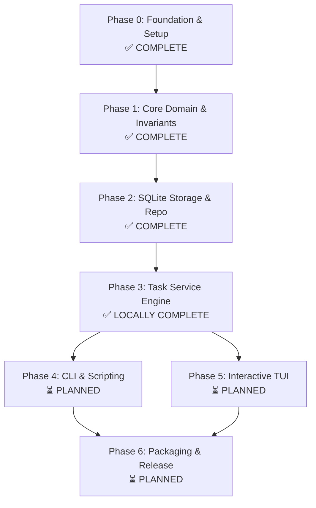

# Tusk Reboot: Checklist Masterplan & Orchestration Dashboard

**Current Status**: 🟢 Active Development
**Active Phase**: Phase 3 locally accepted; Feature 003 PR #3 bounded feedback watch active (lfg, 2026-09-09)
**Active Implementation Target**: PR #3 CI/review watch; next implementation requires the Feature 004 planning pack
**Overall Completion**: 57% (4 of 7 Phases Locally Complete)
**Quality Gate**: `make validate` (Strict Format, Vet, Test, Race Detector, Coverage)

### Feature 002 execution finding (2026-09-08)

Feature 002 is locally accepted after U6 -> U1 -> U2 -> U3 -> U4 -> U5. All units have separate validated commit boundaries. The original missed commit checkpoints were reconstructed in isolation and verified before advancing. Final make validate check-generated build passes with 97.6% storage coverage; Go 1.25 compatibility, final affected race tests and all five CGO-disabled storage/test builds pass. 67/68 feature scenarios are checked; native Windows V33 and native/hosted release proof remain Phase 6 obligations. See [durable acceptance evidence](docs/verification-evidence/002/README.md). At that Feature 002 checkpoint the next target was Feature 003 planning; subsequent service acceptance is recorded below.

### Product planning reconciliation (2026-09-08)

The requested [Modern Task System product plan](docs/plans/2026-09-06-001-feat-tusk-modern-task-system-plan.md) has a synchronized [verification plan](docs/verification-plans/2026-09-06-001-feat-tusk-modern-task-system-verification-plan.md) and [issue workorder](docs/workorders/2026-09-06-001-feat-tusk-modern-task-system-issues-workorder.md): 29 requirements, 24 cross-phase handoff units, and 73 planned scenarios. Product U24 is the new Feature 002 compatibility prerequisite; existing product U1–U23 keep their IDs.

The original product pass supplied the cross-phase contract. Feature 002 now has its own executable pack: 22 requirements, six units, and 68 planned scenarios, including transaction-scoped ports, metadata-only history, strict migration ownership, and disk WAL recovery. Its KTD1 selects Go 1.25.0, modernc v1.58.0 and libc v1.75.6; U6/002-6 must prove the runtime before migrations. Feature 003 subsequently completed its planning pack on 2026-09-09; Feature 004–006 outline metadata remains insufficient under G1. That planning reconciliation changed no implementation or release checkbox; the current runtime acceptance above was established by subsequent ce-work execution.

---

## 1. Executive Masterplan Architecture

The Tusk reboot follows an uncompromising, evidence-first execution sequence. Work is decomposed into 7 strictly ordered phases. No phase may begin until the preceding phase's quality gates, unit tests, and workorder sign-offs are 100% complete and verified.

---

## 2. Phase-by-Phase Execution Checklist

### Phase 0: Reboot Ingestion, Audit & Multi-Agent Foundation
- **Status**: ✅ **COMPLETED** (2026-09-06)
- **Artifacts**: `docs/research/`, `AGENTS.md`, `CONCEPTS.md`, `Makefile`, `scripts/`

- [x] **0.1 Legacy Archival & Ingestion**
  - [x] Preserve commit `b57af46` as git tag `legacy/baseline`
  - [x] Extract legacy snapshots to `docs/research/legacy-audit/snapshots/`
  - [x] Initialize pristine `main` branch with zero legacy contamination
- [x] **0.2 Research & Post-Mortem Documentation**
  - [x] `docs/research/legacy-audit.md`: Hexagonal layering over-engineering, eager DB coupling, TUI `View()` mutation bugs
  - [x] `docs/research/modern-stack-2026.md`: Go 1.24+, embedded CGO-free SQLite, `sqlc` v2, pure Elm Bubble Tea
  - [x] `docs/research/constraints-and-insights.md`: Status lifecycle, acyclic subtask rules, mathematical progress rollup
- [x] **0.3 Product Contract & Brainstorm**
  - [x] Canonical Brainstorm: `docs/plans/2026-09-06-001-feat-tusk-modern-task-system-plan.md`
  - [x] Modular Plan Hierarchy & DAG: `docs/plans/README.md`
- [x] **0.4 Multi-Agent Steering Infrastructure**
  - [x] `AGENTS.md`: Authoritative personas, TDD protocol, canonical commands, prohibitions
  - [x] `.cursor/rules/`: 5 modular rules (`01-project-overview`, `02-tdd-mandate`, `03-go-conventions`, `04-tui-patterns`, `05-storage-sqlc`)
  - [x] `.claude/` and `.omp/`: Settings pointing to `AGENTS.md`
  - [x] `CONCEPTS.md`: Domain taxonomy and vocabulary
- [x] **0.5 Canonical Build System & Script TDD**
  - [x] `Makefile`: `setup`, `fmt`, `vet`, `test`, `test-unit`, `race`, `validate`, `build`, `clean`
  - [x] `scripts/setup.sh`: Go toolchain verification
  - [x] `scripts/fmt.sh`: Strict formatting enforcement
  - [x] `scripts/test/test_scripts.sh`: Self-testing test suite (5/5 passed)
  - [x] Minimal Go 1.24 scaffold in `cmd/tusk/`: `make validate` exits 0

---

### Phase 1: Feature 001 - Core Domain & Invariants
- **Status**: ✅ **COMPLETED** (2026-09-06)
- **Plan**: `docs/plans/2026-09-06-001-feat-core-domain-and-invariants-plan.md`
- **Verification Plan**: `docs/verification-plans/2026-09-06-001-feat-core-domain-and-invariants-verification-plan.md`
- **Issue Workorder**: `docs/workorders/2026-09-06-001-feat-core-domain-and-invariants-issues-workorder.md`

- [x] **1.1 Planning Pack (Ultrathink)**
  - [x] Deepened Implementation Plan with concrete Go signatures and algorithms
  - [x] Comprehensive Verification Plan covering all scenarios (Normal, Boundary, Injected Failure, Recovery, Benchmark)
  - [x] Issue Workorder with review lens sign-offs and empty release gate
- [x] **1.2 Unit 001-1: Domain Sentinels and Error Taxonomy**
  - [x] Red Test: `internal/core/errors_test.go` (`TestErrorsExist`, `TestErrors_SentinelIntegrity`)
  - [x] Implementation: `internal/core/errors.go` (14 sentinel errors)
  - [x] Green Verification: `go test -v -run TestErrors ./internal/core/...`
- [x] **1.3 Unit 001-2: Strongly Typed Value Objects (`Status`, `Priority`, `Tag`)**
  - [x] Red Tests: `status_test.go`, `priority_test.go`, `tag_test.go`
  - [x] Implementation: `status.go` (state machine, `CanTransitionTo`), `priority.go` (weights 1–4), `tag.go` (normalization, regex, deduplication)
  - [x] Green Verification: `go test -v -run "TestParse|TestNormalize|TestStatus" ./internal/core/...`
- [x] **1.4 Unit 001-3: Core Task Entity & Lifecycle**
  - [x] Red Tests: `task_test.go` (`TestNewTask_Validation`, `TestTask_TransitionToDone_And_Reopen`, `TestTask_SetParent`, `TestTask_SetProgress_Validation`)
  - [x] Implementation: `task.go` (`Task` struct, `NewTask`, `TransitionTo`, `Update`, `SetParent`, `SetProgress`, `CompletedAt` lifecycle)
  - [x] Green Verification: `go test -v -run TestTask ./internal/core/...`
- [x] **1.5 Unit 001-4: Mathematical Progress Rollup Engine**
  - [x] Red Tests: `rollup_test.go` (`TestCalculateProgress_Leaf`, `TestCalculateProgress_Subtasks`, `TestCalculateProgress_FloorRounding`, `TestCalculateProgress_AllDone`)
  - [x] Implementation: `rollup.go` ($\lfloor \frac{\sum P}{N} \rfloor$ integer floor arithmetic)
  - [x] Green Verification: `go test -v -run TestCalculateProgress ./internal/core/...`
- [x] **1.6 Unit 001-5: Hierarchical Tree Traversal & Acyclic Cycle Detection**
  - [x] Red Tests: `tree_test.go` (`TestDetectCycles_DirectSelf`, `TestDetectCycles_RootPromotion`, `TestDetectCycles_TwoNodeLoop`, `TestDetectCycles_DeepLoop`, `TestValidateHierarchyDepth_Subtree`, `TestBuildTree_Forest`, `TestBuildTree_Errors`)
  - [x] Implementation: `tree.go` (`TaskNode`, `BuildTree`, `DetectCycles`, `ValidateHierarchyDepth` with stack buffer optimization)
  - [x] Benchmark: `BenchmarkTreeTraversal` verifying 314ns/op (< 500ns, 0 allocs)
  - [x] Green Verification: `go test -v -run "TestDetectCycles|TestBuildTree|TestValidateHierarchyDepth" ./internal/core/...`
- [x] **1.7 Unit 001-6: Task Filtering and Sorting Engine**
  - [x] Red Tests: `filter_test.go` (`TestFilterTasks`, `TestSortTasks_MultiKey`)
  - [x] Implementation: `filter.go` (`TaskFilter`, `FilterTasks`, `SortTasks`)
  - [x] Green Verification: `go test -v -run "TestFilter|TestSort" ./internal/core/...`
- [x] **1.8 Phase 1 Quality Gate & Release Sign-off**
  - [x] `go test -race -v ./internal/core/...` passes with zero data races
  - [x] `make validate` exits 0 cleanly
  - [x] Populate execution record in `docs/verification-plans/2026-09-06-001-feat-core-domain-and-invariants-verification-plan.md`
  - [x] Complete release gate checkboxes in `docs/workorders/2026-09-06-001-feat-core-domain-and-invariants-issues-workorder.md`

---

### Phase 2: Feature 002 - SQLite Storage & Repository
- **Status**: 🚀 **COMPLETE — LOCAL ACCEPTANCE; NATIVE/HOSTED RELEASE GATES DEFERRED**
- **Plan**: `docs/plans/2026-09-06-002-feat-sqlite-storage-and-repository-plan.md`
- **Verification Plan**: `docs/verification-plans/2026-09-06-002-feat-sqlite-storage-and-repository-verification-plan.md`
- **Issue Workorder**: `docs/workorders/2026-09-06-002-feat-sqlite-storage-and-repository-issues-workorder.md`

- [x] **2.1 Ultrathink Planning Pack**
  - [x] Deepened Plan (`docs/plans/2026-09-06-002-feat-sqlite-storage-and-repository-plan.md`)
  - [x] Verification Plan (`docs/verification-plans/2026-09-06-002-feat-sqlite-storage-and-repository-verification-plan.md`)
  - [x] Issue Workorder (`docs/workorders/2026-09-06-002-feat-sqlite-storage-and-repository-issues-workorder.md`)
- [x] **2.2 Implementation Units**
  - [x] Unit 002-6 / U6: Pinned Storage Runtime & Compatibility Proof (Go 1.25, SQLite 3.53.4, transaction modes, five CGO-disabled target builds; prerequisite to 002-1)
  - [x] Unit 002-1: Migration Engine & Embedded Schema (`db/migrations/001_initial_schema.sql`)
  - [x] Unit 002-2: Pinned sqlc v1.31.1 Queries & Reproducible Generation (configuration format v2)
  - [x] Unit 002-3: SQLite Connection Manager (WAL mode, busy timeout 5000ms, single-writer pool)
  - [x] Unit 002-4: Transaction-Scoped `ports.TaskRepository`, Strict Codecs & Metadata History
  - [x] Unit 002-5: Isolated Memory / Disk / Process Recovery Suite, Storage Benchmarks & Phase 3 Handoff
- [x] **2.3 Quality Gate & Release Sign-off**
  - [x] Minimum Go/compiler and pinned runtime compatibility proof passes
  - [x] Generated output consistency and negative script checks pass
  - [x] Repository semantics pass against unique in-memory fixtures
  - [x] Real disk WAL, concurrency, cancellation, process recovery and integrity scenarios pass under full/race gates
  - [x] CGO-disabled five-target storage builds pass; native target runtime proof remains a Phase 6 gate
  - [x] `make validate` passes

- [x] **2.4 Post-acceptance publication follow-up (user authorized 2026-09-08)**
  - [x] Simplification: reuse, quality and efficiency passes; no behavior-preserving change warranted
  - [x] Fresh code review and verification: zero actionable findings (independent review unavailable; recorded in publication-review.json)
  - [x] Capture durable learning and commit verified follow-up separately (transaction outcome redaction; glossary synchronized)
  - [x] Push branch and open [PR #2](https://github.com/newbpydev/tusk/pull/2); merge remains user-owned

---

### Phase 3: Feature 003 - Task Service Engine
- **Status**: ✅ **LOCALLY ACCEPTED** (2026-09-09; PR #3 open; hosted feedback watch active)
- **Plan**: `docs/plans/2026-09-06-003-feat-task-service-engine-plan.md`
- **Verification Plan**: `docs/verification-plans/2026-09-06-003-feat-task-service-engine-verification-plan.md`
- **Issue Workorder**: `docs/workorders/2026-09-06-003-feat-task-service-engine-issues-workorder.md`

- [x] **3.1 Ultrathink Planning Pack**
  - [x] Deepened Plan (`docs/plans/2026-09-06-003-feat-task-service-engine-plan.md`)
  - [x] Verification Plan (`docs/verification-plans/2026-09-06-003-feat-task-service-engine-verification-plan.md`)
  - [x] Issue Workorder (`docs/workorders/2026-09-06-003-feat-task-service-engine-issues-workorder.md`)
- [x] **3.2 Implementation Units**
  - [x] Unit 003-1 / U1: Inbound Contracts, Validation Seams & Safe Error Compatibility
  - [x] Unit 003-2 / U2: Calendar Parser & UUIDv7 Identity
  - [x] Unit 003-3 / U3: Transaction-local Hierarchy, Rollup & Event Engine
  - [x] Unit 003-6 / U6: Creation & Metadata Mutation Primitives (split from 003-4)
  - [x] Unit 003-7 / U7: Lifecycle, Moves & Confirmed Deletion (split from 003-4)
  - [x] Unit 003-4 / U4: Snapshot Queries & Complete Service Facade
  - [x] Unit 003-5 / U5: Disk Integration, Failure Proof, Compatibility & Consumer Handoff
- [x] **3.3 Quality Gate & Release Sign-off**
  - [x] All 91 Feature 003 scenarios have local execution evidence
  - [x] Each unit validated, synchronized and separately committed before the next
  - [x] Real disk WAL, concurrent mutations, stale consent and unknown-outcome recovery pass
  - [x] Minimum Go, five-target service cross-builds and service benchmarks recorded
  - [x] `make validate` passes
  - [x] Feature 004–006 consumer/native/hosted obligations handed off explicitly

- [x] **3.4 Final local review and publication**
  - [x] Simplification and sequential code review: no actionable findings; independent corroboration unavailable
  - [x] Push seven unit commits and open [PR #3](https://github.com/newbpydev/tusk/pull/3); bounded CI/review watch follows
  - [x] Reproduce and fix PR #3 UTC calendar-boundary feedback; regression tests and `make validate build` pass ([receipt](docs/verification-evidence/003/review-r1.json))

Feature 003 completed seven units in the declared order with separate canonical gates and commits. All 91 local scenarios have [execution receipts](docs/verification-evidence/003/README.md), including disk WAL concurrency, stale consent, rollback and process recovery. Final service coverage is 95.8%, parser 98.4%; minimum Go 1.25 full tests and five CGO-free builds pass. Benchmark baselines and [consumer handoffs](docs/service.md) are recorded. Native/hosted/CLI/TUI acceptance remains with Features 004–006. No later-phase implementation is authorized by this Feature 003 run.

---

### Phase 4: Feature 004 - CLI Interface & Scripting
- **Status**: ⏳ **PLANNED** (Pending Phase 3 Completion)
- **Plan**: `docs/plans/2026-09-06-004-feat-cli-interface-and-scripting-plan.md`

- [ ] **4.1 Ultrathink Planning Pack**
  - [ ] Deepened Plan, Verification Plan, and Workorder
- [ ] **4.2 Implementation Units**
  - [ ] Unit 004-1: Cobra Root Command & Lazy DB Initializer (Zero-DB on `--help` and `--version`)
  - [ ] Unit 004-2: Core Commands: `add`, `list`, `done`, `edit`, `delete`
  - [ ] Unit 004-3: Hierarchy Commands: `tree`, `stats`
  - [ ] Unit 004-4: Lipgloss Tabular Formatter & Adaptive Terminal Theming
  - [ ] Unit 004-5: Machine-Readable `--json` Formatter & Strict Exit Code Contract (0, 1, 2)
  - [ ] Unit 004-6: Golden File & CLI Subprocess Test Harness
- [ ] **4.3 Quality Gate & Release Sign-off**
  - [ ] Cold start benchmark: `tusk --help` $< 5\text{ms}$
  - [ ] `make validate` passes

---

### Phase 5: Feature 005 - Interactive TUI Application
- **Status**: ⏳ **PLANNED** (Pending Phase 3 Completion)
- **Plan**: `docs/plans/2026-09-06-005-feat-interactive-tui-application-plan.md`

- [ ] **5.1 Ultrathink Planning Pack**
  - [ ] Deepened Plan, Verification Plan, and Workorder
- [ ] **5.2 Implementation Units**
  - [ ] Unit 005-1: Pure Elm Root Model & Idempotent `View()` Implementation
  - [ ] Unit 005-2: Multi-Panel Layout Engine (Left List, Right Details, Bottom Help)
  - [ ] Unit 005-3: Task Tree / List Navigation (`j/k`, `Space` toggle, visual cursor)
  - [ ] Unit 005-4: Detail Viewport & Markdown Notes Rendering
  - [ ] Unit 005-5: Modal Forms (Create, Edit, Delete Confirmation Overlay)
  - [ ] Unit 005-6: Headless Synthetic `tea.Msg` Test Suite
- [ ] **5.3 Quality Gate & Release Sign-off**
  - [ ] Pure `View()` test: 100 consecutive calls produce identical output with zero model mutation
  - [ ] Terminal resize resilience across 80x24, 120x40, 200x60
  - [ ] `make validate` passes

---

### Phase 6: Feature 006 - Automation, Packaging & Release
- **Status**: ⏳ **PLANNED** (Pending Phases 4 & 5 Completion)
- **Plan**: `docs/plans/2026-09-06-006-feat-automation-packaging-and-release-plan.md`

- [ ] **6.1 Ultrathink Planning Pack**
  - [ ] Deepened Plan, Verification Plan, and Workorder
- [ ] **6.2 Implementation Units**
  - [ ] Unit 006-1: GitHub Actions CI Matrix (Ubuntu, macOS, Windows)
  - [ ] Unit 006-2: GoReleaser Configuration for CGO-free Static Binaries
  - [ ] Unit 006-3: Shell Completions (Bash, Zsh, Fish) & Man Pages Generator
- [ ] **6.3 Quality Gate & Release Sign-off**
  - [ ] Dry-run GoReleaser snapshot build
  - [ ] Shell completion script syntax verification
  - [ ] Final end-to-end `make validate` across all platforms

---

## 3. Multi-Agent Orchestration Protocol

All AI coding agents (Codex, Opencode, Kilo, OMP, Claude Code, Cursor) must follow this protocol:

1. **Before Taking Any Action**:
   - Read `MASTERPLAN.md` to identify the current active phase, feature, and unit.
   - Verify that the active item is not blocked by unfinished prerequisites.
2. **Executing an Implementation Unit**:
   - Strictly adhere to the Red-First TDD cycle specified in `AGENTS.md`.
   - Never implement code without an existing failing test.
   - Keep changes scoped strictly to the files owned by that unit.
3. **Upon Completing a Unit or Phase**:
   - Execute `make validate` to guarantee no regressions.
   - Check off the completed unit in `MASTERPLAN.md`.
   - If a phase is completed, update the **Active Phase** and **Active Implementation Target** pointers in this document.
   - Update the companion issue workorder with verification evidence.

### U4 commit reconstruction — 2026-09-08

The original red-first work was accumulated without per-unit commits. At the user's correction, this unit was reconstructed in an isolated worktree and make validate was rerun on its exact code contents before committing. The original chronological test receipts above remain historical evidence. Unit completion now includes a separate local commit before advancing; pushing and merging are outside this authorization.

### Feature 002 publication — 2026-09-08

[PR #2](https://github.com/newbpydev/tusk/pull/2) is open against main. Six implementation commits, a fresh review receipt, and the compounded learning are published separately. Local review has zero actionable findings and all canonical gates pass; independent review was unavailable. The PR monitor owns subsequent hosted checks and feedback. No merge or release is claimed.

- [x] **2.5 PR #2 callback-cause preservation**: six omissions reproduced; all 28 declared cause cases pass with private text redacted. make validate check-generated build and the minimum-Go focused race test pass. See docs/verification-evidence/002/callback-cause-followup.json; separate fix commit, then monitor hosted feedback.

- [x] **2.6 PR #2 joined error categories and statement fault coverage**

- [x] **2.7 PR #2 extended busy acquisition**

- [x] **2.8 PR #2 repository port contracts**

- [x] **2.9 PR #2 created file safety**

- [x] **2.10 PR #2 typed candidate parameters**

- [x] **2.11 PR #2 sqlc tooling usability**

- [x] **2.12 PR #2 follow-up review and compounded learning**

### Feature 003 U1 acceptance — 2026-09-09

Inbound contracts, detached preflight and base comparisons pass make validate. All eight new safe errors survive failed rollback individually and joined. See docs/verification-evidence/003/u1.json. Runtime-dependent assertions in V07/V09/V11/V12 remain open for later units; U1 exposes no partial public facade.

U2 acceptance: make validate passed; see docs/verification-evidence/003/u2.json for parser/identity red-first and calendar regression evidence.

U3 acceptance: make validate passed with real-writer graph/event tests and injected rollback cases. See docs/verification-evidence/003/u3.json.

U6 acceptance: make validate passed (service coverage 95.5%); see docs/verification-evidence/003/u6.json. All generated-ID collisions reject without replacing loaded rows.

U7 acceptance: make validate passed (service coverage 95.2%); real per-statement/event fault matrix proves rollback of five public mutation flows. See docs/verification-evidence/003/u7.json.

U4 acceptance: make validate passed; the concrete service now satisfies the entire inbound port. See docs/verification-evidence/003/u4.json.
