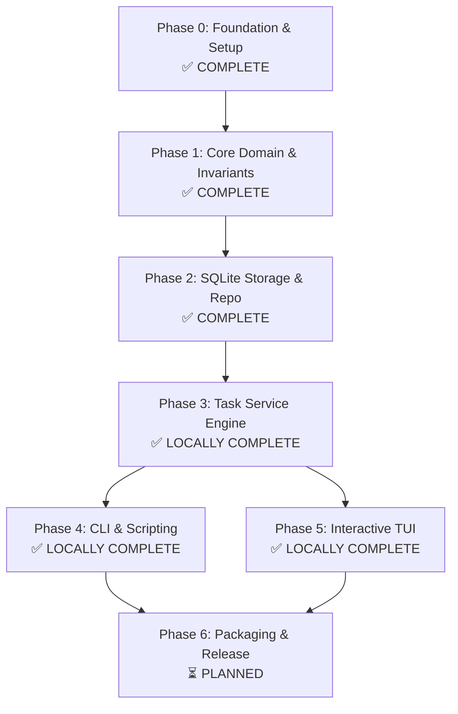

# Tusk Reboot: Checklist Masterplan & Orchestration Dashboard

**Current Status**: Feature 006 PR #6 published; thirteenth complete report batch locally validated; fresh hosted/native/release gates open
**Active Phase**: Phase 6 — Automation, Packaging, Release and Public Repository Readiness; local implementation
**Active Implementation Target**: Feature 006 — Publish the validated PR #6 documentation correction, then settle all fresh reports; native/release acceptance remains pending

### Feature 006 planning checkpoint (2026-10-01)

The synchronized Feature 006 pack defines 30 requirements, eight units ordered
U1 → U3 → U4 → U2 → U6 → U5 → U7 → U8 and 102 unexecuted verification scenarios.
It includes the requested GitHub repository metadata and evidence-backed README,
verified install/use guides, license/notices, native CI, deterministic completion
and manual generation, exact-byte candidate acceptance, Homebrew cask delivery
and explicitly authorized publication. The original U1/U2/U3 identities remain.

Live read-only inspection found no public releases/tags, Actions workflows,
topics/homepage or detected project license. License/rights selection, native
terminal access, tap ownership, security contact verification and concrete
release authority have named workorder gates. Planning closes product G1 for
Feature 006; native/hosted/publication G4 and inherited Feature 002–005 release
scenarios remain open. Document checks are planning evidence only. No README
implementation, GitHub mutation, application test/build/benchmark, commit, push,
tag or release occurred in this planning pass.

- [x] PR #5 review unit R1: stale-form save feedback, delete-dialog refresh and failed-toggle write pause.
- [x] PR #5 review unit R2: navigation, input and presentation consistency.
- [x] PR #5 review unit R3: lifecycle, environment and verification portability.
- [x] PR #5 follow-up R4: clear completed recovery/input messages and use dialog-neutral retry wording.
- [x] PR #5 follow-up R5: expose remaining blank filler/format characters while preserving script composition.
- [x] PR #5 follow-up R6: clear the matching failed-read browse notice after successful refresh.
- [x] PR #5 follow-up R7: document and test intentional script-shaping/variation exemptions.
- [x] PR #5 follow-up R8: clear refresh-dependent notices by source, preserving write receipts.
- [x] Calibrate and verify current-candidate CLI latency acceptance on the declared host; retain failed/control matrices.
- [x] PR #5 follow-up R9: protect retained reports and explain invalid benchmark profiles.
- [x] PR #5 follow-up R10: distinguish operational report-open failures from existing-output usage errors.
- [x] Settle all observed PR #5 feedback and current-head checks.
- [x] Merge PR #5 with owner authorization and an exact-head guard; remove local and remote feature branches and synchronize main.

- [x] Replace the eight unavailable Glamour gallery LFS pointers with verified
  upstream image bytes stored in regular Git; retain source provenance.
- [x] Observe the checkout regression Red/Green and pass `make validate`.
- [x] Publish the bounded PR #5 fix and verify Kilo passes workspace setup.

Startup repair commit `4236d83` passes canonical validation and a fresh GitHub
clone with a required failing LFS filter. Kilo's live session loaded the review
skill and ran PR-reading commands on that commit. See the
[startup receipt](docs/verification-evidence/005/pr5-reviewer-startup/README.md).
The full review result and merge readiness remain pending; no release gate is
closed by reviewer startup.

- [x] Re-review the full feature diff targeting all P0-P2 issues before cloud review.
- [x] Fix the four validator-confirmed findings (path-resolution duplication,
      double per-Update projection, parent-picker rescans, empty-filter header)
      with red/green evidence and canonical validation.
- [x] Cover the four review-flagged P2 coverage gaps with tests only (no
      production change): delete-consent retry/scroll/tab-wrap, recovery
      saved-state detail and keymap, Model.Update panic containment, and
      edit-diff notes/priority patches. TUI confirmKey/draft command/recovery
      content now 100%, model.go recover body exercised; package coverage
      97.2% -> 98.9%. make validate passes.
- [ ] Repeat the review to a clean pass before handing off to cloud reviewers.

A second full-branch ce-code-review round (11 reviewers, depth:full) confirmed
four findings; all four are fixed in one isolated review-fix commit. Storage now
exports the canonical DB-path resolver and the TUI factory delegates to it
(parity pinned by test); prepareFrame no longer re-projects the forest so each
Update projects once (keystroke benchmark 1000 tasks: ~3.4 ms -> ~2.8 ms,
allocations -27%); the parent picker precomputes search keys, matches once per
keystroke and windows the modal (10000-task typing: ~28 ms -> ~9 ms, allocations
-58%); applying an empty filter keeps the header truthful. make validate
(fmt+vet+test+race) passes; the two new Go benchmarks retain the deltas.
Owned-Kitty interactive re-verification was not re-run for this set: the changes
are behavior-preserving refactors plus the unit-asserted filter-label
truthfulness fix. Report-only items (P3 #14 modal keys below 80x24, demoted
testing gaps and residual risks) await the next pass. No new implementation
unit or publication has begun.

- [x] Complete systematic full-branch review and reproduce confirmed P0–P2 findings.
- [x] Fix confirmed findings with red/green evidence and applicable real-app checks.
- [x] Repeat review to a clean pass, run canonical validation and synchronize evidence.

Three sequential local review rounds fixed two P2 defects (relative-date action
clock and dependency source inventory) plus one P3 glossary inconsistency. The
final repeat review is clean. Canonical validation/build/generated checks,
Go 1.25 focused race tests, five-target cross-builds, owned Kitty checks and the
complete 84-case CLI/78-case TUI matrices pass. All failed measurements remain
retained. See the [review receipt](docs/verification-evidence/005/review-local/acceptance.json).
Independent review is unavailable: repository mapping requires main-thread
execution and the requested Claude peer failed authentication. At review return,
the fixes remained uncommitted under ce-code-review's dirty-tree rule. The owner
subsequently authorized local commits: approved compound guidance is dc6cd9f;
the containing review-fix commit records these corrections and synchronized
evidence. Fresh canonical validation passes before each commit. See the
[commit closure](docs/verification-evidence/005/review-local/commit-closure.json).
Native/hosted release proof remains Feature 006. No new implementation unit or
publication has begun.

- [x] Connect visible siblings and ancestor paths through title/metadata rows;
  reserve the last-child elbow for the final visible sibling.
- [x] Show equivalent completed direct items beside progress, including nested
  fractional credit, using authoritative service progress without changing rollup.
- [x] Match the owner-requested Darkmatter dark palette; preserve contrast,
  opaque surfaces and color-independent focus. Tree/count and palette approved.
- [x] Retain red/green, canonical, current-candidate timing, review and owned
  Kitty evidence; obtain visual confirmation and commit the follow-up locally.

The owner approved the final app checks. After the owner reported Cline CLI
shut down, the unchanged source passed all 84 CLI timing cases: worst query/help
p90 14.291/4.112 ms, with all tail guards passing. Fresh canonical validation
passes. The existing minimum-Go, owned Kitty, review and 78-case TUI evidence
matches the current source. Prior failed reports and every sample are retained.
See the [follow-up acceptance](docs/verification-evidence/005/u6-hierarchy/acceptance.json).
Implementation commit 246db8c and the containing acceptance commit close U6.
Feature 006 planning awaits instruction; no implementation or publication began.

The original U6 acceptance at 03c5381 remains historical evidence below.

The approved Spacious TUI, opaque surfaces, due-date calendar and input examples
are locally accepted. Canonical validation, Go 1.25 checks, five-target builds,
owned Kitty inspection and all 78 TUI measurement case-runs pass.
After the owner closed Zed and moved the session to Konsole, the unchanged
candidate passed all 84 CLI cases across three complete runs: worst query p90
13.873 ms and help/version p90 4.592 ms. All tail guards pass; all samples and
earlier failed reports remain retained. The limits were not changed or deferred.
V01–V110 and U1 → U7 → U2 → U3 → U4 → U5 → U8 → U6 are locally complete.
See the [acceptance receipt](docs/verification-evidence/005/u6-acceptance.json).
Feature 006 retains V111–V112 native/hosted release proof. No push, PR or release
has been performed or authorized by this acceptance.

**Overall Completion**: 86% (6 of 7 Phases Locally Complete)
**Quality Gate**: `make validate` (Strict Format, Vet, Test, Race Detector, Coverage)

### Historical Feature 004 PR #4 review remediation

- [x] Investigate all 21 review findings, implement 17 code/test/documentation
  outcomes, and document four evidence-based no-change decisions. Canonical
  validation, minimum-Go builds, isolated latency and owned Kitty checks pass.
  [Review evidence](docs/verification-evidence/004/review-pr4-r1.md).
- [x] Investigate all eight round 2 suggestions, document the signal policy
  decision, and verify diagnostics, test robustness and module gates.
  [Round 2 evidence](docs/verification-evidence/004/review-pr4-r2.md).
- [x] Re-verify current-head latency after owner-authorized remediation. A
  profiled JSON buffer reservation reduction passes canonical validation,
  minimum-Go JSON tests and all 84 reference case-runs. All samples are retained;
  query p90 <= 12.900 ms. [Performance evidence](docs/verification-evidence/004/review-pr4-r3.md).
- [x] Resolve all 32 observed threads and verify MERGEABLE/CLEAN with passing
  hosted checks on implementation commit `486dbcc`. Final documentation-only
  publication is watched separately; merge remains user-owned.
  [Settlement checkpoint](docs/verification-evidence/004/review-pr4-settlement.md).

### Feature 004 final local review follow-up

- [x] Review the full branch for P0–P2, fix two stale documentation contracts and
  recheck the applied diff to a clean pass. Fresh canonical validation passes;
  accepted runtime/test source is unchanged. [Review and coverage](docs/verification-evidence/004/review-final.md).

### Feature 004 simplification follow-up

- [x] Complete reuse, quality and efficiency review. One tree-buffer trial was
  reverted after a latency gate miss; no production/test changes retained.
  [Evaluation](docs/verification-evidence/004/simplify-review.md) preserves the
  patch, red/green, Kitty output and candidate/control measurements.

### Feature 005 planning checkpoint (2026-09-29)

The synchronized Feature 005 pack is ready for a later implementation instruction.
Its dependency, cold-View purity, single-operation lifecycle, raw-draft safety,
explicit delete consent and fresh-owner recovery decisions now have red-first
units and scenario ownership. Local Git records PR #4 merged at `e899491`;
the historical publication-watch wording below is no longer the active target.
No fresh hosted-check claim or implementation/release checkbox is added here.

### Feature 004 local acceptance (2026-09-28)

U6 passes `make validate build check-generated`, Go 1.25 full tests/five-target
cross-builds and all 84 reference case-runs under the owner-delegated distribution
policy. Worst query p90 is 14.621 ms; all tails and raw samples are retained.
Fresh Kitty verification and code review are complete. See the
[acceptance receipt](docs/verification-evidence/004/u6-acceptance.json).
The U6 local commit closes Phase 4. Feature 005 planning is next; implementation
and Feature 006 native/hosted release proof remain separate.

### Historical Feature 004 measurement-policy revision (2026-09-28)

The owner delegated best-practice measurement judgment. The current Feature 004
and product triplets now use three complete runs with p90 targets of 15 ms for
queries and 5 ms for help/version, explicit p95/p99/maximum guards, and every
sample retained. This supersedes the historical every-sample gate without
relabelling old failed reports. Red/green harness tests pass; the new reference
matrix and fresh code review are underway. U6 remains the active target.

### Historical Feature 004 Bash verification checkpoint (2026-09-28)

The owner clarified the verification surfaces: run automated Makefile checks and
latency measurements in Codex Bash; retain Kitty for required visible terminal
scenarios. AGENTS.md and the Feature 004 triplet now agree. Generated expected
schema data and batched tree node allocation pass `make validate build
check-generated`, Go 1.25 short tests and all five CLI/test cross-builds. Fresh
Kitty inspection confirms tree/progress/stats behavior. Balanced and temporary
performance-profile Bash latency runs still fail the unchanged strict limits.
U6/V87/ISS-023 remain open and uncommitted; Phase 5 must not start. The
[current receipt](docs/verification-evidence/004/u6-bash-checkpoint.json) records
source hashes, retained measurements, discarded experiments and remaining gates.

### Feature 004 earlier broader-optimization checkpoint (2026-09-28)

The owner retained the 15 ms bound. Broader storage/query allocation and sorting
changes pass canonical validation, generated checks, Go 1.25 tests/cross-builds,
and fresh visible Kitty checks. Typical 1,000-task queries are now about 9–11 ms,
but retained reference samples still exceed the limit. U6/V87/ISS-023 remain open;
Phase 5 must not start. The working changes are uncommitted and need a fresh
review after latency resolution. [Current receipt](docs/verification-evidence/004/u6-broader-checkpoint.json)
records exact source hashes, all experiment reports and resume obligations.

### Feature 002 execution finding (2026-09-08)

Feature 002 is locally accepted after U6 -> U1 -> U2 -> U3 -> U4 -> U5. All units have separate validated commit boundaries. The original missed commit checkpoints were reconstructed in isolation and verified before advancing. Final make validate check-generated build passes with 97.6% storage coverage; Go 1.25 compatibility, final affected race tests and all five CGO-disabled storage/test builds pass. 67/68 feature scenarios are checked; native Windows V33 and native/hosted release proof remain Phase 6 obligations. See [durable acceptance evidence](docs/verification-evidence/002/README.md). At that Feature 002 checkpoint the next target was Feature 003 planning; subsequent service acceptance is recorded below.

### Product planning reconciliation (2026-09-08)

The requested [Modern Task System product plan](docs/plans/2026-09-06-001-feat-tusk-modern-task-system-plan.md) has a synchronized [verification plan](docs/verification-plans/2026-09-06-001-feat-tusk-modern-task-system-verification-plan.md) and [issue workorder](docs/workorders/2026-09-06-001-feat-tusk-modern-task-system-issues-workorder.md): 29 requirements, 24 cross-phase handoff units, and 73 planned scenarios. Product U24 is the new Feature 002 compatibility prerequisite; existing product U1–U23 keep their IDs.

The original product pass supplied the cross-phase contract. Feature 002 now has its own executable pack: 22 requirements, six units, and 68 planned scenarios, including transaction-scoped ports, metadata-only history, strict migration ownership, and disk WAL recovery. Its KTD1 selects Go 1.25.0, modernc v1.58.0 and libc v1.75.6; U6/002-6 must prove the runtime before migrations. Features 003 and 004 subsequently completed their planning packs on 2026-09-09; Feature 005–006 outline metadata remains insufficient under G1. That planning reconciliation changed no implementation or release checkbox; the current runtime acceptance above was established by subsequent ce-work execution.

---

## 1. Executive Masterplan Architecture

The Tusk reboot follows an uncompromising, evidence-first execution sequence. Work is decomposed into 7 strictly ordered phases. No phase may begin until the preceding phase's quality gates, unit tests, and workorder sign-offs are 100% complete and verified.

```mermaid
graph TD
    P0[Phase 0: Foundation & Setup<br/>✅ COMPLETE] --> P1[Phase 1: Core Domain & Invariants<br/>✅ COMPLETE]
    P1 --> P2[Phase 2: SQLite Storage & Repo<br/>✅ COMPLETE]
    P2 --> P3[Phase 3: Task Service Engine<br/>✅ LOCALLY COMPLETE]
    P3 --> P4[Phase 4: CLI & Scripting<br/>✅ LOCALLY COMPLETE]
    P3 --> P5[Phase 5: Interactive TUI<br/>✅ LOCALLY COMPLETE]
    P4 --> P6[Phase 6: Packaging & Release<br/>⏳ PLANNED]
    P5 --> P6
```

---

## 2. Phase-by-Phase Execution Checklist

### Phase 0: Reboot Ingestion, Audit & Multi-Agent Foundation
- **Status**: ✅ **COMPLETED** (2026-09-06)
- **Artifacts**: `docs/research/`, `AGENTS.md`, `CONCEPTS.md`, `Makefile`, `scripts/`

- [x] **0.1 Legacy Archival & Ingestion**
  - [x] Preserve commit `b57af46` as git tag `legacy/baseline`
  - [x] Extract legacy snapshots to `docs/research/legacy-audit/snapshots/`
  - [x] Initialize pristine `main` branch with zero legacy contamination
- [x] **0.2 Research & Post-Mortem Documentation**
  - [x] `docs/research/legacy-audit.md`: Hexagonal layering over-engineering, eager DB coupling, TUI `View()` mutation bugs
  - [x] `docs/research/modern-stack-2026.md`: Go 1.24+, embedded CGO-free SQLite, `sqlc` v2, pure Elm Bubble Tea
  - [x] `docs/research/constraints-and-insights.md`: Status lifecycle, acyclic subtask rules, mathematical progress rollup
- [x] **0.3 Product Contract & Brainstorm**
  - [x] Canonical Brainstorm: `docs/plans/2026-09-06-001-feat-tusk-modern-task-system-plan.md`
  - [x] Modular Plan Hierarchy & DAG: `docs/plans/README.md`
- [x] **0.4 Multi-Agent Steering Infrastructure**
  - [x] `AGENTS.md`: Authoritative personas, TDD protocol, canonical commands, prohibitions
  - [x] `.cursor/rules/`: 5 modular rules (`01-project-overview`, `02-tdd-mandate`, `03-go-conventions`, `04-tui-patterns`, `05-storage-sqlc`)
  - [x] `.claude/` and `.omp/`: Settings pointing to `AGENTS.md`
  - [x] `CONCEPTS.md`: Domain taxonomy and vocabulary
- [x] **0.5 Canonical Build System & Script TDD**
  - [x] `Makefile`: `setup`, `fmt`, `vet`, `test`, `test-unit`, `race`, `validate`, `build`, `clean`
  - [x] `scripts/setup.sh`: Go toolchain verification
  - [x] `scripts/fmt.sh`: Strict formatting enforcement
  - [x] `scripts/test/test_scripts.sh`: Self-testing test suite (5/5 passed)
  - [x] Minimal Go 1.24 scaffold in `cmd/tusk/`: `make validate` exits 0

---

### Phase 1: Feature 001 - Core Domain & Invariants
- **Status**: ✅ **COMPLETED** (2026-09-06)
- **Plan**: `docs/plans/2026-09-06-001-feat-core-domain-and-invariants-plan.md`
- **Verification Plan**: `docs/verification-plans/2026-09-06-001-feat-core-domain-and-invariants-verification-plan.md`
- **Issue Workorder**: `docs/workorders/2026-09-06-001-feat-core-domain-and-invariants-issues-workorder.md`

- [x] **1.1 Planning Pack (Ultrathink)**
  - [x] Deepened Implementation Plan with concrete Go signatures and algorithms
  - [x] Comprehensive Verification Plan covering all scenarios (Normal, Boundary, Injected Failure, Recovery, Benchmark)
  - [x] Issue Workorder with review lens sign-offs and empty release gate
- [x] **1.2 Unit 001-1: Domain Sentinels and Error Taxonomy**
  - [x] Red Test: `internal/core/errors_test.go` (`TestErrorsExist`, `TestErrors_SentinelIntegrity`)
  - [x] Implementation: `internal/core/errors.go` (14 sentinel errors)
  - [x] Green Verification: `go test -v -run TestErrors ./internal/core/...`
- [x] **1.3 Unit 001-2: Strongly Typed Value Objects (`Status`, `Priority`, `Tag`)**
  - [x] Red Tests: `status_test.go`, `priority_test.go`, `tag_test.go`
  - [x] Implementation: `status.go` (state machine, `CanTransitionTo`), `priority.go` (weights 1–4), `tag.go` (normalization, regex, deduplication)
  - [x] Green Verification: `go test -v -run "TestParse|TestNormalize|TestStatus" ./internal/core/...`
- [x] **1.4 Unit 001-3: Core Task Entity & Lifecycle**
  - [x] Red Tests: `task_test.go` (`TestNewTask_Validation`, `TestTask_TransitionToDone_And_Reopen`, `TestTask_SetParent`, `TestTask_SetProgress_Validation`)
  - [x] Implementation: `task.go` (`Task` struct, `NewTask`, `TransitionTo`, `Update`, `SetParent`, `SetProgress`, `CompletedAt` lifecycle)
  - [x] Green Verification: `go test -v -run TestTask ./internal/core/...`
- [x] **1.5 Unit 001-4: Mathematical Progress Rollup Engine**
  - [x] Red Tests: `rollup_test.go` (`TestCalculateProgress_Leaf`, `TestCalculateProgress_Subtasks`, `TestCalculateProgress_FloorRounding`, `TestCalculateProgress_AllDone`)
  - [x] Implementation: `rollup.go` ($\lfloor \frac{\sum P}{N} \rfloor$ integer floor arithmetic)
  - [x] Green Verification: `go test -v -run TestCalculateProgress ./internal/core/...`
- [x] **1.6 Unit 001-5: Hierarchical Tree Traversal & Acyclic Cycle Detection**
  - [x] Red Tests: `tree_test.go` (`TestDetectCycles_DirectSelf`, `TestDetectCycles_RootPromotion`, `TestDetectCycles_TwoNodeLoop`, `TestDetectCycles_DeepLoop`, `TestValidateHierarchyDepth_Subtree`, `TestBuildTree_Forest`, `TestBuildTree_Errors`)
  - [x] Implementation: `tree.go` (`TaskNode`, `BuildTree`, `DetectCycles`, `ValidateHierarchyDepth` with stack buffer optimization)
  - [x] Benchmark: `BenchmarkTreeTraversal` verifying 314ns/op (< 500ns, 0 allocs)
  - [x] Green Verification: `go test -v -run "TestDetectCycles|TestBuildTree|TestValidateHierarchyDepth" ./internal/core/...`
- [x] **1.7 Unit 001-6: Task Filtering and Sorting Engine**
  - [x] Red Tests: `filter_test.go` (`TestFilterTasks`, `TestSortTasks_MultiKey`)
  - [x] Implementation: `filter.go` (`TaskFilter`, `FilterTasks`, `SortTasks`)
  - [x] Green Verification: `go test -v -run "TestFilter|TestSort" ./internal/core/...`
- [x] **1.8 Phase 1 Quality Gate & Release Sign-off**
  - [x] `go test -race -v ./internal/core/...` passes with zero data races
  - [x] `make validate` exits 0 cleanly
  - [x] Populate execution record in `docs/verification-plans/2026-09-06-001-feat-core-domain-and-invariants-verification-plan.md`
  - [x] Complete release gate checkboxes in `docs/workorders/2026-09-06-001-feat-core-domain-and-invariants-issues-workorder.md`

---

### Phase 2: Feature 002 - SQLite Storage & Repository
- **Status**: 🚀 **COMPLETE — LOCAL ACCEPTANCE; NATIVE/HOSTED RELEASE GATES DEFERRED**
- **Plan**: `docs/plans/2026-09-06-002-feat-sqlite-storage-and-repository-plan.md`
- **Verification Plan**: `docs/verification-plans/2026-09-06-002-feat-sqlite-storage-and-repository-verification-plan.md`
- **Issue Workorder**: `docs/workorders/2026-09-06-002-feat-sqlite-storage-and-repository-issues-workorder.md`

- [x] **2.1 Ultrathink Planning Pack**
  - [x] Deepened Plan (`docs/plans/2026-09-06-002-feat-sqlite-storage-and-repository-plan.md`)
  - [x] Verification Plan (`docs/verification-plans/2026-09-06-002-feat-sqlite-storage-and-repository-verification-plan.md`)
  - [x] Issue Workorder (`docs/workorders/2026-09-06-002-feat-sqlite-storage-and-repository-issues-workorder.md`)
- [x] **2.2 Implementation Units**
  - [x] Unit 002-6 / U6: Pinned Storage Runtime & Compatibility Proof (Go 1.25, SQLite 3.53.4, transaction modes, five CGO-disabled target builds; prerequisite to 002-1)
  - [x] Unit 002-1: Migration Engine & Embedded Schema (`db/migrations/001_initial_schema.sql`)
  - [x] Unit 002-2: Pinned sqlc v1.31.1 Queries & Reproducible Generation (configuration format v2)
  - [x] Unit 002-3: SQLite Connection Manager (WAL mode, busy timeout 5000ms, single-writer pool)
  - [x] Unit 002-4: Transaction-Scoped `ports.TaskRepository`, Strict Codecs & Metadata History
  - [x] Unit 002-5: Isolated Memory / Disk / Process Recovery Suite, Storage Benchmarks & Phase 3 Handoff
- [x] **2.3 Quality Gate & Release Sign-off**
  - [x] Minimum Go/compiler and pinned runtime compatibility proof passes
  - [x] Generated output consistency and negative script checks pass
  - [x] Repository semantics pass against unique in-memory fixtures
  - [x] Real disk WAL, concurrency, cancellation, process recovery and integrity scenarios pass under full/race gates
  - [x] CGO-disabled five-target storage builds pass; native target runtime proof remains a Phase 6 gate
  - [x] `make validate` passes

- [x] **2.4 Post-acceptance publication follow-up (user authorized 2026-09-08)**
  - [x] Simplification: reuse, quality and efficiency passes; no behavior-preserving change warranted
  - [x] Fresh code review and verification: zero actionable findings (independent review unavailable; recorded in publication-review.json)
  - [x] Capture durable learning and commit verified follow-up separately (transaction outcome redaction; glossary synchronized)
  - [x] Push branch and open [PR #2](https://github.com/newbpydev/tusk/pull/2); merge remains user-owned

---

### Phase 3: Feature 003 - Task Service Engine
- **Status**: ✅ **LOCALLY ACCEPTED AND MERGED** (2026-09-09; PR #3 merged as `859d6b1`)
- **Plan**: `docs/plans/2026-09-06-003-feat-task-service-engine-plan.md`
- **Verification Plan**: `docs/verification-plans/2026-09-06-003-feat-task-service-engine-verification-plan.md`
- **Issue Workorder**: `docs/workorders/2026-09-06-003-feat-task-service-engine-issues-workorder.md`

- [x] **3.1 Ultrathink Planning Pack**
  - [x] Deepened Plan (`docs/plans/2026-09-06-003-feat-task-service-engine-plan.md`)
  - [x] Verification Plan (`docs/verification-plans/2026-09-06-003-feat-task-service-engine-verification-plan.md`)
  - [x] Issue Workorder (`docs/workorders/2026-09-06-003-feat-task-service-engine-issues-workorder.md`)
- [x] **3.2 Implementation Units**
  - [x] Unit 003-1 / U1: Inbound Contracts, Validation Seams & Safe Error Compatibility
  - [x] Unit 003-2 / U2: Calendar Parser & UUIDv7 Identity
  - [x] Unit 003-3 / U3: Transaction-local Hierarchy, Rollup & Event Engine
  - [x] Unit 003-6 / U6: Creation & Metadata Mutation Primitives (split from 003-4)
  - [x] Unit 003-7 / U7: Lifecycle, Moves & Confirmed Deletion (split from 003-4)
  - [x] Unit 003-4 / U4: Snapshot Queries & Complete Service Facade
  - [x] Unit 003-5 / U5: Disk Integration, Failure Proof, Compatibility & Consumer Handoff
- [x] **3.3 Quality Gate & Release Sign-off**
  - [x] All 91 Feature 003 scenarios have local execution evidence
  - [x] Each unit validated, synchronized and separately committed before the next
  - [x] Real disk WAL, concurrent mutations, stale consent and unknown-outcome recovery pass
  - [x] Minimum Go, five-target service cross-builds and service benchmarks recorded
  - [x] `make validate` passes
  - [x] Feature 004–006 consumer/native/hosted obligations handed off explicitly

- [x] **3.4 Final local review and publication**
  - [x] Simplification and sequential code review: no actionable findings; independent corroboration unavailable
  - [x] Push seven unit commits and open [PR #3](https://github.com/newbpydev/tusk/pull/3); bounded CI/review watch completed
  - [x] Reproduce and fix PR #3 UTC calendar-boundary feedback; regression tests and `make validate build` pass ([receipt](docs/verification-evidence/003/review-r1.json))
  - [x] Address Kilo review: reopen error categories, test/recovery assertions, portable fixtures, benchmark limits and synchronized acceptance status; `make validate build` passes ([dispositions and evidence](docs/verification-evidence/003/review-r2.json))

- [x] **3.5 User-authorized merge and branch cleanup (2026-09-09)**
  - [x] Recheck head `aafe48f`: Kilo check passed, Codex review completed, no open review threads, current base mergeable
  - [x] Merge PR #3 as `859d6b12c9fd093dba93e7a491f40fdbdffb16e5`, preserving all individual commits
  - [x] Fast-forward local main and remove local/remote `feat/task-service-engine`

Feature 003 completed seven units in the declared order with separate canonical gates and commits. All 91 local scenarios have [execution receipts](docs/verification-evidence/003/README.md), including disk WAL concurrency, stale consent, rollback and process recovery. Final service coverage is 95.9%, parser 98.4%; minimum Go 1.25 full tests and five CGO-free builds pass. Benchmark baselines and [consumer handoffs](docs/service.md) are recorded. Native/hosted/CLI/TUI acceptance remains with Features 004–006. No later-phase implementation is authorized by this Feature 003 run.

---

### Phase 4: Feature 004 - CLI Interface & Scripting
- **Status**: ✅ **LOCALLY ACCEPTED** (2026-09-28; seven implementation units)
- **Plan**: [Feature 004](docs/plans/2026-09-06-004-feat-cli-interface-and-scripting-plan.md)
- **Verification Plan**: [Feature 004 matrix](docs/verification-plans/2026-09-06-004-feat-cli-interface-and-scripting-verification-plan.md)
- **Issue Workorder**: [Feature 004 findings](docs/workorders/2026-09-06-004-feat-cli-interface-and-scripting-issues-workorder.md)

- [x] **4.1 Ultrathink Planning Pack**
  - [x] Deepened Plan, Verification Plan, and Workorder (25 requirements, seven ordered units, 91 planned scenarios, 25 findings)
  - [x] Sequential planning/document review and synchronized product handoff; no runtime acceptance inferred
- [x] **4.2 Implementation Units** — execute U1 → U5 → U4 → U2 → U7 → U3 → U6; validate/synchronize/commit each before advancing
  - [x] Unit 004-1 / U1: Cobra Root, Lazy Composition & Dependency/Executable Compatibility
  - [x] Unit 004-5 / U5: Explicit JSON DTOs, Output Failures & Exit/Outcome Contract
  - [x] Unit 004-4 / U4: Safe Human Formatter, Unicode Width & Terminal Capability Styling
  - [x] Unit 004-2 / U2: Add, Edit & Complete Through the Accepted Service
  - [x] Unit 004-7 / U7: Preview, Default-No Consent & Authoritative Deletion (split from U2)
  - [x] Unit 004-3 / U3: List, Tree, Stats & Metadata History Queries
  - [x] Unit 004-6 / U6: Actual Executable/Disk Recovery, Latency & Consumer Handoff
- [x] **4.3 Quality Gate & Local Acceptance**
  - [x] All local scenarios V01–V89 have exact-revision evidence; V90–V91 remain Feature 006 release obligations
  - [x] Complete executable and test binaries cross-build CGO-free for five targets under Go 1.25
  - [x] Three reference runs meet help/version p90 <5ms and query p90 <15ms plus p95/p99/max guards; all samples retained
  - [x] Actual Linux terminal, cancellation, broken pipe and committed readback scenarios pass
  - [x] `make validate build check-generated` passes and unit commits/evidence are synchronized
  - [x] Feature 005 TUI and Feature 006 native/hosted/completion/release obligations handed off

Implementation was authorized on 2026-09-28. All seven units have separate local
commit boundaries, with U6 carrying actual process/PTY recovery, query/storage
optimizations, benchmark integrity and consumer handoff. Canonical checks run in
Codex Bash; owned Kitty checks provide visible terminal evidence.

Local V01–V89 pass, including V87 under the owner-delegated distribution policy.
ISS-023 is closed. Earlier failed reports are retained without relabeling.
V90–V91 remain Feature 006 exact-candidate native/hosted release obligations.
No Phase 5 implementation, push, PR or publication occurred.

---

### Phase 5: Feature 005 - Interactive TUI Application
- **Status**: ✅ **LOCALLY COMPLETE** (accepted 2026-09-30; native/hosted release proof remains Feature 006)
- **Plan**: [Feature 005 plan](docs/plans/2026-09-06-005-feat-interactive-tui-application-plan.md)
- **Verification Plan**: [Feature 005 verification](docs/verification-plans/2026-09-06-005-feat-interactive-tui-application-verification-plan.md)
- **Issue Workorder**: [Feature 005 workorder](docs/workorders/2026-09-06-005-feat-interactive-tui-application-issues-workorder.md)

- [x] **5.1 Ultrathink Planning Pack**
  - [x] Deepened Plan, Verification Plan, and Workorder: 28 requirements, eight units, 112 planned scenarios
- [x] **5.2 Implementation Units**
  - [x] Unit 005-1 / U1: Pure Root, v1 Dependency Graph and Deterministic Test Seams
  - [x] Unit 005-7 / U7: CLI Registration, Session Ownership and Terminal Lifecycle
  - [x] Unit 005-2 / U2: Bounded Multi-Panel Layout and Safe Terminal Text
  - [x] Unit 005-3 / U3: Forest Navigation, Filters, Search and Refresh Generations
  - [x] Unit 005-4 / U4: Details, Safe Markdown and Metadata Timeline
  - [x] Unit 005-5 / U5: Forms, Base-Checked Edits, Moves and Lifecycle Toggles
  - [x] Unit 005-8 / U8: Previewed Deletion and Unknown-Outcome Reconciliation
  - [x] Unit 005-6 / U6: Workflow, Performance, Owned Kitty Acceptance and Handoff
    - [x] Due-date calendar and input examples: owner approved; canonical/Go 1.25, owned Kitty and 78 TUI measurements pass ([receipt](docs/verification-evidence/005/u6-calendar.md)).
- [x] **5.3 Local Quality Gate & Release Handoff**
  - [x] Cold and populated View purity: 100 calls without nested/cache mutation
  - [x] Resize/focus/plain presentation and every required owned Kitty scenario
  - [x] Real disk concurrency, draft/consent conflicts, fresh-owner recovery and terminal cleanup
  - [x] Minimum Go 1.25, five CGO-free cross-builds and unchanged CLI contracts
  - [x] CLI distribution gate (84/84) and retained TUI frame-preparation measurements (78/78)
  - [x] V01–V110 local scenarios, current-candidate reviews and synchronized per-unit commits
  - [x] `make validate build check-generated` passes

Execution order is U1 → U7 → U2 → U3 → U4 → U5 → U8 → U6. U1–U6 keep their
original IDs; U7/U8 split lifecycle and destructive-action responsibilities.
All eight units have separate local commit boundaries. U6 workflow, terminal,
canonical, minimum-Go, performance and review acceptance pass on the recorded
candidate. Its [acceptance receipt](docs/verification-evidence/005/u6-acceptance.json)
binds source hashes, unit commits and distinct verification tiers. V111–V112
belong to Feature 006 native/hosted release proof. No push, PR or release is implied.

---

### Phase 6: Feature 006 - Automation, Packaging & Release
- **Status**: ⏳ **IMPLEMENTATION ACTIVE; RELEASE PENDING** (Phases 4 & 5 locally accepted and merged; U1 authorized on 2026-10-01)
- **Plan**: `docs/plans/2026-09-06-006-feat-automation-packaging-and-release-plan.md`
- **Verification Plan**: `docs/verification-plans/2026-09-06-006-feat-automation-packaging-and-release-verification-plan.md`
- **Issue Workorder**: `docs/workorders/2026-09-06-006-feat-automation-packaging-and-release-issues-workorder.md`

- [x] **6.1 Ultrathink Planning Pack**
  - [x] Deepened Plan, Verification Plan, and Workorder; 30 requirements, eight units, 102 planned scenarios
  - [x] Synchronize product handoffs, registry and masterplan; review applicable lenses sequentially
- [ ] **6.2 Implementation Units**
  - [x] Unit 006-1 / U1: Native CI Matrix and Portable Canonical Tooling — local engineering; exact-SHA hosted/native closure pending
  - [x] Unit 006-3 / U3: Storage-Free Completions and Deterministic Manuals — local acceptance
  - [x] Unit 006-4 / U4: README, Installation Guides, Community Files and License Readiness — local acceptance; public activation pending
  - [x] Unit 006-2 / U2: Reproducible CGO-Free Payloads and Immutable Version Metadata — local acceptance; hosted/native release evidence separate
  - [ ] Unit 006-6 / U6: Trusted Hosted Candidate Workflow and Artifact Provenance — actual hosted acceptance pending
    - [x] Local workflow/provenance engineering checkpoint; canonical/minimum/security fixtures accepted
  - [ ] Unit 006-5 / U5: Exact-Artifact Native Lifecycle, Terminal and Performance Acceptance
    - [x] Local drivers/selectors engineering checkpoint; canonical/minimum/five-target checks and preliminary Linux artifact passed
  - [ ] Unit 006-7 / U7: Homebrew Cask Candidate and Destination Readiness
    - [x] Local config/cask/provenance engineering checkpoint; real packager audit and canonical/minimum checks passed
  - [ ] Unit 006-8 / U8: Authorized Release, Public Metadata and Final Settlement
    - [x] Local promotion/readback/metadata engineering checkpoint; canonical/minimum/policy fixtures and real read-only previews passed
- [x] Final local simplification, completed code-review receipt, three Red/Green review fixes and coherent source-freeze checkpoint
- [ ] **6.3 Quality Gate & Release Sign-off**
  - [ ] Canonical validation/generated/module gates, minimum Go and five native candidate-SHA jobs
  - [x] Three real-shell completion checks and deterministic manuals on the applicable Linux host
  - [x] Complete licensed/checksummed local payloads; trusted hosted candidate pending
  - [ ] Trusted candidate/provenance plus exact-asset native CLI/TUI/install/backup/upgrade/remove acceptance
  - [ ] Owned Kitty/native Windows terminal and retained candidate CLI/TUI performance evidence
  - [ ] Owner license/rights, tap/security-contact and concrete publication decisions closed
    - [x] Owner-selected MIT and first-party redistribution rights; complete local grants/notices accepted
  - [ ] Authorized complete draft/public release, reviewed Homebrew cask and anonymous install verification
  - [ ] GitHub About/topics/homepage/social preview and rendered README/badges/links/license readback
  - [ ] All 102 applicable scenarios and inherited release obligations have matching receipts; product G4 closed

Implementation order is U1 → U3 → U4 → U2 → U6 → U5 → U7 → U8. Each unit needs
its own red/green, applicable review/evidence, synchronized governance and fresh
`make validate` before its coherent local commit. A local unit checkpoint never
closes an unexecuted hosted/native/publication gate. Planning and local commits
do not authorize pushing, tags, GitHub settings changes or release publication.
For U6/U5/U7/U8, committed local engineering checkpoints allow the next unit’s
local drivers/configuration to proceed under the synchronized plan's final-source
freeze contract. Parent release-unit and unexecuted hosted/native/publication
checkboxes remain open; local fixtures cannot waive those dependencies.

### Feature 006 U1 local checkpoint — 2026-10-01

Five native runner definitions, a separate Go 1.25.0 job, verified tool/Action
pins, portable formatting, read-only workflow contracts and native prerequisite
checks pass the observed negative fixtures. Go 1.27.1 and Go 1.25.0 canonical
validation/build/generated checks pass, as do all five minimum-Go application
and test cross-builds. govulncheck v1.4.0 supports the release compiler and finds
no reachable app vulnerability; its uncalled module finding remains in the log.
[Receipt](docs/verification-evidence/006/u1.json) retains Red/Green and review.
Owner selected MIT and confirmed first-party rights; U4 still owns grant/notices.
The workflow has not been pushed/dispatched. Native job URLs, Windows/macOS
runtime/terminal proof and release gates remain open. U1 is committed as 080426e.

### Feature 006 U3 local checkpoint — 2026-10-01

Storage-free Bash/Zsh/Fish generators, static completion requests and deterministic
manuals pass their Red/Green contracts and canonical validation. The doc generator
has 97.2% package coverage without exemptions. An owned Kitty window confirms
actual Tab completion in all three shells, readable manual argument syntax and
restoration to the shell; it was closed after inspection. Source hashes, failure
logs, generated outputs, compiler checks and captures are in the
[U3 receipt](docs/verification-evidence/006/u3.json). Sequential simplification
review moved callback registration off ordinary command startup. V17–V30 are
locally accepted; native Windows ACL execution and hosted target checks remain
pending. U4 follows the coherent U3 commit; MIT and first-party rights are approved.

### Feature 006 U4 local checkpoint — 2026-10-01

README, install/release guides, contributor/security guidance and issue/PR templates
are ready locally. The owner-confirmed MIT grant is present. Full upstream grant
texts cover all 71 selected modules, local replacements, Go/timezone data and
checked-in images; missing/unclassified/changed grants or assets block generation.
Current-source canonical checks, minimum-compiler fixtures, fresh source install,
closed-backup integrity/task/event comparison and local Chrome rendering pass.
The original sample screenshot retains its date/source and was inspected again.
[U4 receipt](docs/verification-evidence/006/u4.json) records the sequential review,
Red/Green and preview. Private GitHub reporting is verified disabled; the public
owner route does not promise confidentiality. Native binary installation and live
GitHub metadata/license/rendering remain U5/U8 gates. U3 is committed as e543502;
U2 starts after the coherent U4 commit.

### Feature 006 U2 local checkpoint — 2026-10-01

Immutable constant overlays, verified pinned GoReleaser and five CGO-free payloads
pass current canonical/generated/notices checks, minimum-Go compatibility and
negative manifest/archive/config/input fixtures. Inspector coverage is 95.9% with
no exemption. Two owned locations produce byte-identical nine-file candidate sets;
the real complete source archive builds under Go 1.25.0. Exact preliminary Linux
bytes run storage-free help/version, named-zone CLI/JSON and TUI/resize/q in an
owned Kitty window, now closed. Failed initial dist packaging and every observed
Red remain retained in [the U2 receipt](docs/verification-evidence/006/u2.json).
U4 is committed as 709015d. The preliminary private validation SHA is not final
source freeze or trusted hosted evidence. U6 local engineering follows the U2
commit; no push, dispatch, tag, release or settings action is authorized.

### Feature 006 U6 local engineering checkpoint — 2026-10-01

Manual exact-main-SHA candidate workflow reuses all six canonical CI jobs and
builds once; separate provenance attests all nine assets and the run receipt.
Verified Action pins, structured job/step boundaries, minimal-API repository
readback, no credential persistence, expiry/run/attempt checks and new-output
ownership pass observed failure fixtures and current canonical/minimum/actionlint
gates. [Receipt](docs/verification-evidence/006/u6.json) distinguishes fake policy
proof from missing actual hosted signatures/job/artifact URLs. U2 is committed as
171675d. U6's parent checkbox and V63–V72 remain open until an authorized hosted
run. After this coherent local engineering commit, U5's local drivers are next;
no GitHub write or trusted-candidate claim has occurred.

---

## 3. Multi-Agent Orchestration Protocol

All AI coding agents (Codex, Opencode, Kilo, OMP, Claude Code, Cursor) must follow this protocol:

1. **Before Taking Any Action**:
   - Read `MASTERPLAN.md` to identify the current active phase, feature, and unit.
   - Verify that the active item is not blocked by unfinished prerequisites.
2. **Executing an Implementation Unit**:
   - Strictly adhere to the Red-First TDD cycle specified in `AGENTS.md`.
   - Never implement code without an existing failing test.
   - Keep changes scoped strictly to the files owned by that unit.
3. **Upon Completing a Unit or Phase**:
   - Execute `make validate` to guarantee no regressions.
   - Check off the completed unit in `MASTERPLAN.md`.
   - If a phase is completed, update the **Active Phase** and **Active Implementation Target** pointers in this document.
   - Update the companion issue workorder with verification evidence.

### U4 commit reconstruction — 2026-09-08

The original red-first work was accumulated without per-unit commits. At the user's correction, this unit was reconstructed in an isolated worktree and make validate was rerun on its exact code contents before committing. The original chronological test receipts above remain historical evidence. Unit completion now includes a separate local commit before advancing; pushing and merging are outside this authorization.

### Feature 002 publication — 2026-09-08

[PR #2](https://github.com/newbpydev/tusk/pull/2) is open against main. Six implementation commits, a fresh review receipt, and the compounded learning are published separately. Local review has zero actionable findings and all canonical gates pass; independent review was unavailable. The PR monitor owns subsequent hosted checks and feedback. No merge or release is claimed.

- [x] **2.5 PR #2 callback-cause preservation**: six omissions reproduced; all 28 declared cause cases pass with private text redacted. make validate check-generated build and the minimum-Go focused race test pass. See docs/verification-evidence/002/callback-cause-followup.json; separate fix commit, then monitor hosted feedback.

- [x] **2.6 PR #2 joined error categories and statement fault coverage**

- [x] **2.7 PR #2 extended busy acquisition**

- [x] **2.8 PR #2 repository port contracts**

- [x] **2.9 PR #2 created file safety**

- [x] **2.10 PR #2 typed candidate parameters**

- [x] **2.11 PR #2 sqlc tooling usability**

- [x] **2.12 PR #2 follow-up review and compounded learning**

### Feature 003 U1 acceptance — 2026-09-09

Inbound contracts, detached preflight and base comparisons pass make validate. All eight new safe errors survive failed rollback individually and joined. See docs/verification-evidence/003/u1.json. Runtime-dependent assertions in V07/V09/V11/V12 remain open for later units; U1 exposes no partial public facade.

U2 acceptance: make validate passed; see docs/verification-evidence/003/u2.json for parser/identity red-first and calendar regression evidence.

U3 acceptance: make validate passed with real-writer graph/event tests and injected rollback cases. See docs/verification-evidence/003/u3.json.

U6 acceptance: make validate passed (service coverage 95.5%); see docs/verification-evidence/003/u6.json. All generated-ID collisions reject without replacing loaded rows.

U7 acceptance: make validate passed (service coverage 95.2%); real per-statement/event fault matrix proves rollback of five public mutation flows. See docs/verification-evidence/003/u7.json.

U4 acceptance: make validate passed; the concrete service now satisfies the entire inbound port. See docs/verification-evidence/003/u4.json.

### Feature 005 U1 acceptance — 2026-09-29

Pure prepared-frame root, dependency pins and deterministic test seams pass
`make validate build check-generated`; Go 1.25 short suite and all five
CGO-free application/test cross-builds pass. [Receipt](docs/verification-evidence/005/u1.json).
No visible session exists yet; U7 owns the first actual Kitty interactions.

### Feature 005 U7 acceptance — 2026-09-29

`tusk tui` lifecycle passes canonical, minimum-Go and five-target checks plus
real Kitty launch/quit/relaunch/Ctrl+C inspection. A source-pinned Bubble Tea
patch removes eager global terminal discovery. [Receipt](docs/verification-evidence/005/u7.json).
AGENTS.md explicitly keeps tests/builds/benchmarks in Bash and Kitty for real app
use only. The active next unit is U2.

### Feature 005 U2 acceptance — 2026-09-29

Bounded 40/60 layout, spacious rows, safe shared text, pure frames and modal
surfaces pass `make validate build check-generated`; minimum-Go race tests and
all five CGO-free builds pass. [Receipt](docs/verification-evidence/005/u2.json).
Actual Kitty use caught and fixed a hidden terminal descriptor that prevented
resize events; a real child PTY regression now covers shrink/restore. Color,
NO_COLOR, Unicode, 80x24/120x40/200x60 and modal shrink/restore were inspected.
Later selection, saving, form/consent and Markdown scenarios remain explicitly
open for their owning units. U3 is next; no navigation or form delivery is claimed.

### Feature 005 U3 acceptance — 2026-09-29

Navigation, search, filters and the bounded refresh scheduler pass canonical
validation (TUI coverage 99.0%), minimum-Go race checks and five CGO-free builds.
Actual Kitty external rename/reparent/delete, collapse restoration, filter
resize and monochrome checks pass. [Receipt](docs/verification-evidence/005/u3.json).
Later mutation/history/form/recovery portions of V50–V55 remain explicitly open
for U4/U5/U8; no write UI is claimed. U4 details/Markdown/history is next.

### Feature 005 U4 acceptance — 2026-09-29

Details, safe Markdown and actual metadata history pass canonical validation
(98.6% TUI coverage), minimum-Go/race and five CGO-free builds. Kitty confirms
all target sizes, monochrome output, long-note scrolling and selection changes.
[Receipt](docs/verification-evidence/005/u4.json). A large-word renderer stall now
uses bounded-formatting plain fallback without dropping text; End intent survives
pending render/resize. U5 forms/mutations is next; recovery UI remains U8.

### Feature 005 U5 acceptance (2026-09-29)

Forms, raw drafts, Base-checked edits, moves and lifecycle toggles pass canonical
validation, minimum-Go race/cross-build checks and real-app Kitty interaction.
Coverage is 98.4%; [receipt](docs/verification-evidence/005/u5.json) retains source,
logs and captures. Spacious rows and uniform modal surfaces remain intact. The
save admission/readback barrier prevents replay after an acknowledged commit;
conflict reload and dirty discard require explicit choices. U8 deletion and
fresh-owner recovery is next, followed by U6 acceptance/performance.

### Feature 005 U8 acceptance (2026-09-29)

Canonical validation, minimum-Go affected race/cross-build checks and real Kitty
consent/recovery checks pass. Preview-bound deletion renews consent after
conflicts. Unknown results keep intent read-only until fresh-owner readback and
explicit acknowledgment; no replay or inferred create identity. Uniform modal
backgrounds remain verified. [U8 receipt](docs/verification-evidence/005/u8.json).
U6 final workflow, performance, documentation and review is next.

### U5 local engineering checkpoint — 2026-10-01

Supplied-artifact selectors, native smoke drivers, retained owned fixtures and
reference measurement entry points pass canonical validation, Go 1.25 checks
and all five application/test cross-builds. The preliminary Linux payload passes
real CLI/docs/backup/replacement/newer-schema and child PTY checks with its hash
unchanged. [Receipt](docs/verification-evidence/006/u5.json) retains unsafe-output
Red/Green and the corrected SQLite metadata assertion. No production app change,
trusted candidate timing or other-platform native acceptance is claimed. All
V73–V86 and the parent U5 checkbox remain open. The coherent local engineering
commit enables U7 configuration; final source freeze requires a fresh hosted run.

### U7 local engineering checkpoint — 2026-10-01

Pinned GoReleaser creates a macOS-only Intel/ARM cask with the exact archive hashes,
12 manuals and three completions; upload is disabled. Real fresh local packaging
and strict declarative audit pass after retained ordering/comment failures. The
candidate workflow now uploads/attests the separate run-bound cask. Canonical and
minimum-compiler component checks pass; inspector coverage remains above 95%.
[Receipt](docs/verification-evidence/006/u7.json) retains source/hash/config and review.
Native Ruby/Homebrew/Intel/ARM security/runtime checks are unexecuted; current tap
readback is HTTP404. Parent U7 and V87–V94 remain open. The coherent local commit
enables U8 promotion/readback engineering, with final hosted candidate required.

### U8 local engineering checkpoint — 2026-10-02 UTC

Promotion and repository metadata helpers pass canonical Go 1.27.1 validation,
minimum-Go focused checks and strict Bash lint. Read-only preparation consumes the
real preliminary U7 C manifest/cask and emits nine exact asset digests plus the
approved About/topics/image preview, explicitly unaccepted/unapplied. Fake API
fixtures expose and fix stale main, duplicate timing cases, malformed memory
samples, missing tap, absent draft tag, failed source diff and inherited host/debug
or API-host redirection. Lost create/upload/publish responses reconcile existing
state and downloaded bytes without clobber/delete/retag. The current tap still
returns HTTP404. The custom host compiler notice failure and superseded mixed
source gate remain retained failures; the final pinned gate passes.

[Receipt](docs/verification-evidence/006/u8.json) records the local boundary scope.
No fixture approval is owner consent or real provenance/native/performance proof.
Parent U8 and V95–V102 remain open; local scenario closures stay 51. Final local
simplification/code review and source freeze follow the coherent engineering
commit. No push, workflow dispatch, remote tag/draft/release, metadata or tap write
has occurred. Hosted/native/publication acceptance requires its separate actual
evidence and concrete owner authorization.

### Final local review-fix and source-freeze checkpoint — 2026-10-02 UTC

All eight local checkpoints are committed. The actual ce-code-review receipt
(`status: complete`, run `20261002-000427-b58e9f8f`, reviewed c027114) retained three
validated findings. Caller-owned Red/Green fixes now require native gate target,
executable and archive digests to match the verified manifest; bound all four
GitHub helpers with a portable stdlib process driver; and require exactly one
candidate/overlay JSON value. The driver preserves streams/arguments/exit codes,
limits every operation to five minutes and joins the owned child/pipes. A shorter
positive `GH_REQUEST_TIMEOUT` is allowed; unbounded/longer values fail. Canonical
Go 1.27.1, Go 1.25 fast/script checks and strict ShellCheck pass; helper coverage
is 97.2%. The real bounded tap readback still returns HTTP404.

[Final local receipt](docs/verification-evidence/006/review-local/acceptance.json)
retains the completed report, peer admission decisions, all Red/Green/failure
logs and focused fix review. Local lenses/finish roles ran sequentially under the
Task mapping; Claude returned an authentication failure, and the alternate
Composer receipt did not verify its actual model/effort or serving family. No
independent model agreement is claimed. No justified review finding remains open.

The containing coherent review-fix commit is the local source freeze. Next is
separate owner authorization to push this branch and open its reviewable PR;
merge, main candidate dispatch, tags/releases, settings and tap writes remain
separate. Select the final main SHA only after authorized integration, generate
a fresh hosted candidate and rerun affected exact-byte native/cask/reference
gates. Earlier private local candidates are preliminary. Parent U6/U5/U7/U8,
Phase 6/G4 and unexecuted scenarios stay open; local scenario closures remain 51.

### Owner-requested renewed local review loop — 2026-10-02 UTC

The owner deferred publication and requested another ce-simplify-code pass, then
a full ce-code-review and Red/Green remediation loop for all confirmed P0–P2
findings. The prior acceptance at `72c5eeb` remains historical. The active target
is this local review loop; no push, PR, tag, workflow dispatch or release is
authorized. Each completed fix unit must pass canonical validation, synchronize
this triplet and MASTERPLAN, and be committed before advancing. Actual native,
hosted, tap and publication evidence remains pending; the 51 local scenario
closures do not close those parent gates.

### Renewed local review-fix checkpoint — 2026-10-02 UTC

The owner-requested simplification found no worthwhile behavior-preserving change
(0 reuse/quality/efficiency edits; three deliberate structures retained). Full
review `20261002-140940-86eb372b` confirmed two P2 issues; caller focused review
caught a third. Seven Red cases now refuse concatenated approval/acceptance/report
and verification objects; policy fixture hashes support shasum without GNU
sha256sum; a failed Windows native path conversion refuses selected-binary
acceptance. All existing identity, hash, sample and owner-approval guards remain.

[Receipt](docs/verification-evidence/006/review-r2/acceptance.json) retains the
original completed review, focused addendum, failed/incomplete fixtures, Green
checks and source hashes. Focused checks, Go 1.25 script suite and strict
ShellCheck pass. Fresh final canonical validation/build/generated/docs/notices/workflow checks
pass before this coherent local fix commit; repeat full review on the committed
head.
Local roles ran sequentially, Claude authentication failed and Composer serving
model/effort/independence is unverified. No independent agreement is claimed.

Local scenario closures remain 51; parent U6/U5/U7/U8, Phase 6/G4 and actual
native/hosted/tap/publication gates remain open. No remote mutation or publication
is authorized. The active target remains this review/fix loop.

### Renewed local review loop completion — 2026-10-02 UTC

- [x] Apply ce-simplify-code to the full Feature 006 branch (no worthwhile edits).
- [x] Fix all three confirmed P2 issues with observed Red/Green, focused review,
  minimum-Go/lint/canonical checks and coherent local commit `df10217`.
- [x] Repeat full ce-code-review on that committed head to a clean local pass.

Run `20261002-143551-fd10da2c` is complete with no remaining confirmed P0–P2
finding or unresolved review gate. [Clean repeat receipt](docs/verification-evidence/006/review-r3/acceptance.json)
retains full coverage, all five rejected peer claims with current guards and
source binding. Local lenses/finish roles ran sequentially; Claude returned
HTTP401 and Composer's actual model/effort/independence is unverified. No
independent agreement is claimed. Both consumed peer jobs are deleted.

Fresh closure canonical validation/build/generated/docs/notices/workflow checks
pass before the governance/evidence commit. The reviewed executable sources remain unchanged. The local review loop
is complete and publication remains deferred by the owner. Actual native/hosted,
tap, cask/performance and publication gates remain open; parent U6/U5/U7/U8,
Phase 6/G4 and the 51 local scenario count do not change. No push/PR, workflow
dispatch, tag, draft/release, settings or tap write occurred.

### Learning and authorized PR publication — 2026-10-02 UTC

The owner invoked ce-compound followed by ce-commit-push-pr, superseding the
previous publication hold for branch push and PR creation. The reviewed executable
sources remain unchanged from the clean repeat review at `df10217`. The
[release-check learning](docs/solutions/workflow-issues/prove-release-policy-rejection-at-the-intended-boundary.md)
records how to establish causal Red/Green evidence with controlled fixtures.
Full compounding ran sequentially under root AGENTS; frontmatter, links and six
behavior claims pass grounding checks. No glossary or instruction edit was needed.

- [x] Capture the verified learning and synchronize publication authority after a
  fresh canonical gate. [Receipt](docs/verification-evidence/006/publication/acceptance.json).

The containing documentation unit passed canonical validation before commit
and publication. The complete branch targets GitHub main for hosted review;
publication of a PR does not close release acceptance. Actual native terminals,
trusted-main candidate provenance, exact-byte cask/performance acceptance, tap
availability and release/settings/tap writes remain pending. Parent U6/U5/U7/U8,
Phase 6/G4 and the 51 local scenario count are unchanged. No merge, release tag,
workflow dispatch, repository settings or tap write is authorized by this request.

### PR #6 complete hosted report batch — 2026-10-02 UTC

[PR #6](https://github.com/newbpydev/tusk/pull/6) is open at
`ced4417a648c3dcd21d4e48a215788ca2cce3112`. The owner requested all reports
before one combined remediation pass. All six CI jobs and Kilo's review completed
on that unchanged commit. The 30 review threads were assessed together: 27
change items and three evidence-based replies. Six failing CI jobs reduce to
Windows tool provisioning, macOS fixture assumptions and undeclared ripgrep
in the shell policy fixtures. Additional instances of those portability
assumptions are included in the same bounded unit.

- [x] Apply the valid review/CI changes with causal Red/Green evidence.
- [x] Pass fresh current-state canonical validation and review the combined diff;
  prepare the complete batch as one coherent commit/push unit.
- [ ] Settle the complete post-push hosted report set before release acceptance.

These reports do not close the pending actual native terminal, exact-byte
performance, trusted-main candidate, cask/tap or release-publication gates.
The 51 local scenario closures and open parent units remain as recorded above.

Native preflight now checks the selected executable’s actual `--version` output.
Every native promotion receipt requires `observed_version` equal to the candidate
manifest version. Copied inventories are rechecked before finalize succeeds.
The complete batch is retained in [the R1 receipt](docs/verification-evidence/006/pr6-r1/acceptance.json).

The first combined canonical gate passed functional/race tests but rejected
release-inspector coverage at 92.6%. Malformed PE tables, ordinal imports and
bounded/corrupt timezone ZIPs now raise focused coverage to 95.5%; final
canonical validation is pending. The failed gate remains retained.

A follow-up inventory regression rejects a standalone notice that differs from
the accepted source even when its bundle hashes/checksums are repaired. The
minimal source-digest binding passed focused Red/Green; final current-state
canonical validation follows the already-passing intermediate gate.

The final current-state canonical gate passed: `make validate build
check-generated check-docs check-notices check-ci check-candidate-workflow
lint-release-promotion`, using official `GOTOOLCHAIN=go1.27.1`. Release-inspector
coverage is 95.2%. The containing commit is the coherent local remediation unit;
publication, visible thread replies/resolution and fresh hosted reports are
verified separately on PR #6. Pending native/release gates remain unchanged.

### PR #6 second complete hosted report batch — 2026-10-02 UTC

All six Native CI jobs and Kilo review completed on unchanged
`79646a31bae6b95980b8bd518b744c15944a4fb7` before this repair unit began.
Linux release/minimum compiler jobs pass. Both macOS runners pass functional
checks but reject release-inspector coverage at 94.9%. Windows now passes tool
setup and exposes build-output quoting, checkout-byte conversion and platform
fixture assumptions. One new import-policy suggestion and four carried summary
claims are assessed against current source and retained evidence together.

- [x] Repair the complete confirmed batch with causal Red/Green.
- [x] Pass fresh canonical validation and review the complete applied diff.
- [ ] Commit/push one coherent repair and settle all fresh hosted reports.

Parent units, the 51 local scenario closures and native/release acceptance
remain unchanged. No merge, release, tag, workflow dispatch, settings or tap
mutation is included.

The second combined repair passes frozen-state `make validate build
check-generated check-docs check-notices check-ci check-candidate-workflow
lint-release-promotion` with official `GOTOOLCHAIN=go1.27.1`. Inspector coverage
is 96.2% on Linux. Five-target verification-test compilation, the actual vendor
checkout inventories under `autocrlf=true`, and all 30 native-binding rejection
checks with zero fake GitHub calls pass. See [the R2 receipt](docs/verification-evidence/006/pr6-r2/acceptance.json).
The containing commit prepares one coherent repair. Windows ACL execution and
macOS/Windows coverage require the next complete hosted report set.

### PR #6 third complete report-batch repair (2026-10-02)

All seven reports finished on `eaa8791c2f82e1320620354fb2da95f5062cd52c`
before repair edits. Linux/minimum compiler and Kilo pass; both macOS jobs fail
at the release-smoke fixture's physical-path assertion, and Windows passes
functional/race tests but misses native coverage in confirmation and the CLI
measurement process launcher. Previous ACL, checkout-byte and inspector fixes
pass their native checks. This is progressive failure migration.

- [x] Collect the complete third hosted set before starting one combined pass.
- [x] Repair physical/native measurement paths and exercise native confirmation
      and process launching without weakening the 95% package coverage gate.
- [x] Validate the frozen repair and audit the complete applied diff.
- [ ] Commit/push one coherent repair and settle its fresh reports.

The minimum Go 1.25.0 hosted job passes the actual isolated build-output test,
refuting Kilo's new portability suggestion. Physical native terminal, trusted
candidate, exact-byte performance/cask and release/tap acceptance stay pending.

The third combined repair passes frozen-state `make validate build
check-generated check-docs check-notices check-ci check-candidate-workflow
lint-release-promotion` with official `GOTOOLCHAIN=go1.27.1`. Linux coverage is
96.1% for cmd/tusk, 95.6% for CLI measurements and 96.2% for the inspector.
Five-target CLI/verification tests compile. See [the R3 receipt](docs/verification-evidence/006/pr6-r3/acceptance.json).
The containing commit records one coherent repair. Fresh Windows EOF/cancellation
runtime and package coverage, both macOS smoke fixtures and all other current-head
hosted reports remain required; no native/release acceptance gate closes here.

### PR #6 fourth complete report-batch repair (2026-10-02)

All seven reports finished on `268f0c812c87a4dd894cbc4bec58b1885ac543a1`
before repair edits. Both macOS jobs, all three Linux jobs and Kilo pass. Windows
passes real EOF/answer/invalid-handle/cancellation tests and coverage (cmd/tusk
97.4%, CLI measurements 95.6%), then fails the first shell hash fixture. Git
Bash's default copy-style `ln -s` separates a restricted-PATH executable from
its adjacent runtime. A passing owned resolved-image control and copy-semantics
Red establish the fixture defect; native runtime confirmation remains required.
The related SQLC tool snapshots and archive-member refusal are reviewed together.

- [x] Collect the complete fourth hosted set before repair edits.
- [x] Preserve installed tool runtimes in restricted snapshots and prove the
      SQLC archive-member refusal at its intended boundary.
- [x] Pass frozen-state canonical validation and audit the applied diff.
- [ ] Commit/push one coherent repair and settle its fresh reports.

This remains progressive failure migration: the earlier native repairs pass and
the Windows job reaches a later gate. Coverage, latency and archive security
contracts remain unchanged; physical native and release acceptance stay pending.

The fourth combined repair passes frozen-state `make validate build
check-generated check-docs check-notices check-ci check-candidate-workflow
lint-release-promotion` with official `GOTOOLCHAIN=go1.27.1`. The complete shell
suite also passes the owned link-copy/runtime model, including exact archive
refusal and missing-prerequisite diagnostics. See [the R4 receipt](docs/verification-evidence/006/pr6-r4/acceptance.json).
The containing commit records one coherent fixture repair. Actual Windows
execution of the repaired snapshots and the full fresh hosted set remain required.
No native terminal or release acceptance gate closes here.

### PR #6 fifth complete report-batch repair (2026-10-02)

All seven reports finished on `79dd1e574481187dd568c63c1da81f4ce2e66a67`
before repair edits. Both macOS jobs, all three Linux jobs and Kilo pass. Windows
passes functional/race/coverage and both hash fixtures, then the negative CLI
Make test runs the real compiler instead of its extensionless shell fixture.
GNU Make 4.4.1's Windows lookup searches `.exe` across PATH first. The bounded
repair forces shell lookup only on Make calls injecting fake tools, including
recursive catalog generation, and checks the fake compiler trace and `Error 19`.
Actual native re-execution remains required; Linux checks alone cannot close it.

Kilo's one new suggestion assumes `command -v awk` resolves a symlink target.
It retains the command alias instead. The real BusyBox 1.35.0 awk applet passes
both ordinary and restricted hash fixtures; invoking the resolved target directly
fails as the reviewer describes, but that is not the generated launcher.
The evidence-based verdict is not-addressing; no launcher code change is needed.

- [x] Collect the complete fifth hosted set before repair edits.
- [x] Repair fake-tool selection and assert its intended failure boundary.
- [x] Pass frozen-state canonical validation and audit the applied diff.
- [ ] Commit/push one coherent repair and settle its fresh reports.

This remains progressive failure migration, with the old hash refusal repaired.
No test expectation, coverage threshold, tool pin or canonical recipe changes.
The 51 local scenario closures remain unchanged. Physical five-host terminals,
trusted-main candidate/provenance, exact-byte performance/cask and authorized
release/tap publication remain pending. See [the R5 receipt](docs/verification-evidence/006/pr6-r5/acceptance.json).
The frozen official-Go canonical gate and the full shell suite pass. The containing
commit records one coherent fixture repair; its fresh hosted set remains required.

### PR #6 sixth complete report-batch repair (2026-10-02)

All seven reports finished on `ffe87310c0b5970fec73ff32973ab4ff057accb9`
before repair edits. Both macOS jobs, all three Linux jobs and Kilo pass with
zero open review threads. Windows confirms both repaired negative CLI compiler
traces, then fails the next profile-output lexical assertion. MSYS converts the
POSIX path passed to native Make; the fixture still expects its original spelling.
The repair explicitly selects `cygpath -m` on MINGW/MSYS, preserves the spaced
absolute path, and checks both the dry recipe and actual fake-compiler arguments.

- [x] Collect the complete sixth hosted set before repair edits.
- [x] Reproduce the exact path-conversion assertion in an owned model, then pass
      the same minimum-Go model with both profile compiler arguments checked.
- [x] Pass frozen-state canonical validation and audit the applied diff.
- [ ] Commit/push one coherent repair and settle its fresh reports.

The native failing test and controlled Red/Green remain distinct. This is
progressive failure migration, not recurrence of the compiler lookup defect.
No canonical recipe, tool pin, coverage/latency threshold or test expectation
changes. The 51 local scenario closures and all physical native/release gates
remain unchanged. Fresh native Windows and complete hosted verification remain
required; see [the R6 receipt](docs/verification-evidence/006/pr6-r6/acceptance.json).
The frozen official-Go canonical gate passes. The containing commit records one
coherent fixture repair; its fresh hosted reports remain required.

### PR #6 seventh complete report-batch repair (2026-10-02)

All seven reports finished on `5c3f63ff9d818071deb6585b9ea6b5c0b12f9349`
before remediation. Both macOS jobs, all three Linux jobs and Kilo pass with no
open threads. Windows fails an unchanged no-LFS dependency-checkout fixture
before the profile repair executes. A failed-only same-head retry reproduces the
same Git staging failure after roughly ten seconds, invalidating the initial
transient-failure classification as a sufficient remedy.

The fixture shared one ten-second context across three Git operations. A controlled
five-second delay before each real operation reproduces the failure and passes
the same complete checkout after repair. Each operation now has its own bounded
30-second resource budget; cancellation is immediate and failures include context
expiry and elapsed time. This explicitly changes the fixture resource budget,
while preserving every no-LFS/pointer assertion and product latency/coverage limit.

- [x] Wait for the complete seventh set and preserve the failed same-head retry.
- [x] Observe the delayed real-Git checkout Red/Green and retain an owned stalled
      process negative that confirms deadline refusal.
- [x] Pass frozen-state canonical validation and audit the applied diff.
- [ ] Commit/push one coherent repair and settle its fresh reports.

The old native logs did not print `ctx.Err()`; precise expiry attribution remains
an inference supported by timing and the controlled reproducer. The 51 local
scenario closures and all physical native/release gates remain unchanged. Fresh
Windows execution and the complete new hosted set remain required; see [the R7 receipt](docs/verification-evidence/006/pr6-r7/acceptance.json).
The frozen official-Go canonical gate passes. The containing commit records one
coherent fixture repair; its fresh hosted reports remain required.

### PR #6 eighth complete report-batch repair (2026-10-02)

All seven reports finished on `c2e5039cd7664f5b2621261ddee461dbc7ff4c04`
before repair edits. Both macOS jobs, all three Linux jobs and Kilo pass with no
open threads. Windows confirms functional/race/coverage, the no-LFS checkout,
all 57 script assertions, profile arguments and restricted SQLC fixtures, then
fails one CI negative that expects the ambient Windows identity to be wrong.
On a native Windows host that identity is valid, so its successful exit is correct.

The bounded repair uses the existing owned windows/amd64 identity and explicitly
requests windows/arm64. It keeps exit 1 and asserts the exact OS/architecture
refusal diagnostic. A controlled Windows-identity full shell suite reproduces
the old false failure and validates the same guard after repair. Product and
workflow implementation, coverage/latency limits and tool pins are unchanged.

- [x] Wait for the complete eighth report set before edits.
- [x] Reproduce the native-identity negative in an owned control and require the
      intended rejection diagnostic after repair.
- [x] Pass frozen-state canonical validation and audit the applied diff.
- [ ] Commit/push one coherent repair and settle its fresh reports.

This is progressive failure migration: the earlier Windows repairs now execute
and pass. Controlled Linux fixture identities do not replace native re-execution.
The 51 local closures and physical five-host terminals, trusted-main provenance,
exact-byte performance/cask and authorized release/tap gates remain unchanged.
See [the R8 receipt](docs/verification-evidence/006/pr6-r8/acceptance.json).
The frozen official-Go canonical gate and controlled full shell suite pass.
The containing commit records one coherent fixture repair; all fresh hosted
reports remain required before declaring the PR settled.

### PR #6 ninth complete report-batch repair (2026-10-02)

All seven reports finished on `fbde2f8929377ef47c68214389580e28ed87f1c6`
before edits or replies. Five CI jobs pass; Windows confirms the architecture
negative and documentation gate, then its notices positive control fails with
an incomplete asset inventory. Kilo identifies missing negative coverage for the
OS operand of the native-job predicate. One combined pass handles both items.

The same owned windows/amd64 control now separately requests linux/amd64 and
requires the exact OS/architecture refusal diagnostic. An owned predicate
mutation escaped the old suite and is detected after repair; production identity
logic stays intact. A CRLF JSON-output notices control reproduces the exact
native refusal. Maintainer helpers, fixture producers and the Make compiler-pin
lookup explicitly use jq binary output, preserving LF paths/records without
changing JSON filters or source license bytes. jq 1.7+ is an explicit build-only
prerequisite. The full controlled JSON-output shell suite passes after repair.

- [x] Wait for the complete ninth report set before changes or replies.
- [x] Reproduce both gaps and pass the same bounded identity/line-ending controls.
- [x] Pass frozen-state canonical validation and audit the applied diff.
- [ ] Commit/push one coherent combined repair, reply with proof and settle every
      fresh hosted report.

Original native inventory lists were not retained by that job; precise CRLF
attribution remains a hypothesis supported by jq documentation and the matching
controlled refusal. Linux model checks do not replace fresh native execution.
The 51 local closures and physical native/trusted-main/exact-byte release gates
remain unchanged; see [the R9 receipt](docs/verification-evidence/006/pr6-r9/acceptance.json).
The frozen official-Go canonical gate, complete CRLF-output shell model and
precise OS-predicate mutation control pass. The containing commit records one
combined repair; fresh hosted/native reports remain required for settlement.

### PR #6 tenth complete report-batch repair (2026-10-02)

All seven reports on `79c34f9c8be00ff23c6fc9a2f560a142b88b95d3` completed before
this combined repair: both macOS gates passed, three Linux gates rejected the
Windows-only jq flag, Windows passed notices/OS controls and then selected
installed `gh.exe` instead of the owned candidate fixture, and Kilo identified
stale status headers plus missing actionable jq prerequisite checks.

Unix jq callers now omit binary mode; MSYS/Cygwin callers select it. Windows
setup/preflight probe binary-output support and name the jq 1.7+ prerequisite.
Native owned GitHub fixture launchers isolate candidate, promotion and metadata
API tests. New negative/control tests reproduce the prerequisites and preserve
literal argv, streams and exit codes. No product Go or production GitHub deadline
behavior changes. Current authority headers are synchronized with this unit.

- [x] Wait for all seven reports before changes or replies.
- [x] Observe Red for legacy Unix jq, unsupported Windows prerequisites and missing native fixture capability.
- [x] Pass focused controls, full legacy/CRLF shell models and the frozen canonical gate.
- [ ] Settle every fresh hosted report after combined repair publication.

The 51 local closures remain unchanged. Physical terminals, trusted-main candidate
provenance, exact-byte performance/cask/release acceptance and tap/settings/release
authority remain pending. See [the R10 receipt](docs/verification-evidence/006/pr6-r10/acceptance.json).

### PR #6 eleventh complete report-batch repair (2026-10-02)

All seven reports on `d28d44bb1349173a429fa5b90409e847c88d2622` completed before
this combined assessment. All Linux jobs and macOS arm64 passed. macOS amd64's
cancellation fixture panicked when a valid retry closed its unblock channel again.
Windows passed the candidate controls, then exposed installed-client selection in
the separate Homebrew fixture. Kilo identified signal-status fidelity, unnamed
launcher assertions and an unstated retained-model jq prerequisite.

The cancellation test now deliberately delays reader completion through a third
request and closes each synchronization channel once. Homebrew uses the same
owned native launcher as the other three API fixture families; its native stall
control avoids a Bash grandchild during deadline cancellation. Unix signal status
maps to 128 plus the signal, assertions name their contracts, and the retained R10
model records its observed jq 1.8.2 capability without rewriting measured bytes.
Production cancellation/deadline behavior and all acceptance thresholds are unchanged.

- [x] Wait for all seven reports before changes or replies.
- [x] Observe deterministic Red for the cancellation double-close and SIGTERM reported as 255.
- [x] Pass focused controls, cross-build the test launcher and pass the frozen canonical gate.
- [ ] Settle every fresh hosted report after combined repair publication.

The 51 local closures and physical/trusted-main/performance/cask/tap/release/settings
gates remain unchanged. See [the R11 receipt](docs/verification-evidence/006/pr6-r11/acceptance.json).

### PR #6 twelfth complete report-batch repair (2026-10-02)

All seven reports on `a23734eefc851ef4ca331b1c63c2c3a52d4c60b1` completed and
passed before this combined review. Fresh native macOS/Windows execution confirms
the preceding cancellation and API-fixture repairs. Kilo's five findings concern
stall configuration, canonical shellcheck coverage, hostile-environment fixture
consistency, the retained jq selector and cross-build evidence identity.

The finite native stall now requires an explicit positive timeout below one minute;
unsupported configurations fail with a named diagnostic. Deterministic controls
reproduce the prior stalled invalid configurations and verify immediate refusal.
The launcher test joins the existing lint target; Homebrew's base environment
consistently supplies hostile host/debug values. The model README selects/probes
MODEL_REAL_JQ explicitly. Fresh cross-build logs retain exact environment,
GOOS/GOARCH/GOVERSION, exit status and inspected binary settings; older measured
logs remain unchanged. Product behavior and acceptance thresholds remain unchanged.

- [x] Wait for all seven reports before assessment, changes or replies.
- [x] Observe Red for missing, malformed and non-short stall deadlines.
- [x] Pass focused/cross-build controls and the frozen canonical gate.
- [ ] Settle fresh hosted reports after combined repair publication.

The 51 local closures and physical/trusted-main/performance/cask/tap/release/settings
gates remain unchanged. See [the R12 receipt](docs/verification-evidence/006/pr6-r12/acceptance.json).

### PR #6 thirteenth complete report-batch correction (2026-10-02)

All seven reports on `83c8635b198ac8e84e5083483269a49064ced694` completed and
passed before this combined assessment. Kilo confirms the five preceding fixes
and identifies one P3 wording issue in the historical jq model README. Naming
the `--binary` capability directly removes an ambiguous referent. The selected
tool, capability contract, original wrapper bytes and measured logs are unchanged.
The trajectory assessment distinguishes this prose correction from the satisfied
model-tool identity invariant; it requires no third runtime repair.

- [x] Wait for the complete seven-report set before changes or replies.
- [x] Correct the capability referent and pass canonical validation/document checks.
- [ ] Settle fresh hosted reports after publication.

The 51 local closures and physical/trusted-main/performance/cask/tap/release/settings
gates remain unchanged. See [the R13 receipt](docs/verification-evidence/006/pr6-r13/acceptance.json).
