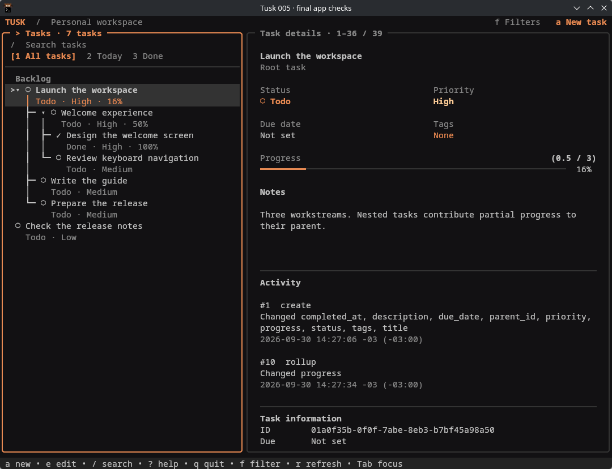

# Tusk

[](https://github.com/newbpydev/tusk/actions/workflows/ci.yml)
[](LICENSE)

Local task management in your terminal: a keyboard-driven TUI and scriptable
CLI, backed by SQLite. Keep tasks, subtasks, notes and activity history on your
computer. One binary; no daemon, account or network service.

Tusk is available through **source installation**. There is **no public release**
yet. Native source tests run on Linux, macOS and Windows through
[GitHub Actions](https://github.com/newbpydev/tusk/actions/workflows/ci.yml).
Packaged release verification is in progress.

Releases follow the [SemVer policy and release checklist](docs/releasing.md#version-policy).
See the [changelog](CHANGELOG.md) for changes awaiting publication. Source builds
report `dev`; packaged candidates carry their selected version.



Real app capture from 2026-09-30, using sample tasks in an isolated database.
[Image provenance](docs/assets/README.md).

## Install

Install Git, Go 1.25 or newer, GNU Make and Bash, then keep the whole checkout:

```sh
git clone https://github.com/newbpydev/tusk.git
cd tusk
make setup build
./bin/tusk --version
```

[Installation guide](docs/install.md) covers prerequisites, PATH, completions,
manuals, upgrades, removal and backup. Binary downloads and Homebrew remain
pending; the guide labels their draft instructions explicitly.

| Platform | Current evidence | Installation |
| --- | --- | --- |
| Linux amd64 | Native automated CI and local CLI/TUI acceptance | Source checkout |
| Linux arm64 | Native automated CI on Ubuntu arm64 | Source checkout |
| macOS Intel / Apple Silicon | Native automated CI on macOS 15, both architectures | Source checkout |
| Windows amd64 | Native automated CI on Windows Server 2025 | Source checkout with native Go and Git Bash |

CI checks the source build. Release verification checks the exact archived
binaries separately. Manual terminal inspection is currently available on
CachyOS amd64; hosted macOS and Windows results do not claim Windows 11 or
physical console inspection.

## Your first tasks

After adding `bin` to PATH as described in the install guide:

```sh
tusk --version
tusk add 'Plan the week' --priority high --due tomorrow
tusk list
tusk tree
tusk list --all --json
tusk tui
```

Copy the **full ID** shown by `add` to use `edit`, `done` or `history`. Press `a`
to create, `e` to edit, `?` for help and `q` to quit the TUI. Use a terminal of
at least 80 columns × 24 rows.

## Work with tasks

- Organize nested tasks and track progress through their children.
- Filter by status, priority, tags and due day; search titles and notes.
- Write Markdown notes and inspect metadata activity.
- Use clean JSON and documented exit codes in scripts.
- Generate static Bash, Zsh and Fish completions without opening task storage.

Read the [CLI guide](docs/cli.md), [TUI guide](docs/tui.md) or `tusk help COMMAND`.
Deleting a task removes its history too; there is no undo. `--force` skips consent
and `--recursive` permits subtree deletion independently.

## Data and configuration

Data defaults to `~/.local/share/tusk/tusk.db`. `TUSK_DB_PATH` selects an explicit
path; an absolute `XDG_DATA_HOME` changes the default data directory. CLI and TUI
share the same database. Invalid configuration fails without switching databases.

`--timezone` overrides `TUSK_TIMEZONE`; otherwise dates use the system timezone.
`NO_COLOR` disables color. [Configuration and dates](docs/cli.md#configuration-and-dates)
explains precedence and the Windows home fallback. See [backup and restore](docs/install.md#backup-and-restore)
before copying data. Keep DB/WAL/SHM files when investigating an unknown outcome;
read fresh tasks and history before retrying a write.

## Verification and support

[Local acceptance records](docs/verification-evidence/005/u6-hierarchy/README.md)
include real terminal checks and retained measurements on a declared Linux
amd64 Ryzen 5 4500U host. The recorded query/help worst p90 was 14.291/4.112 ms
across three complete runs. These finite samples do not promise latency on other
computers or prove a released binary. Native source CI passes on all five targets;
packaged release acceptance and additional manual platform checks remain pending.

Report bugs with OS, architecture, version and a sanitized reproduction through
[GitHub issues](https://github.com/newbpydev/tusk/issues).
See [contributing](CONTRIBUTING.md) and [security reporting](SECURITY.md).
First-party code and this sample capture use the [MIT license](LICENSE).
[Third-party notices](THIRD_PARTY_NOTICES.md) preserve separate upstream terms.
