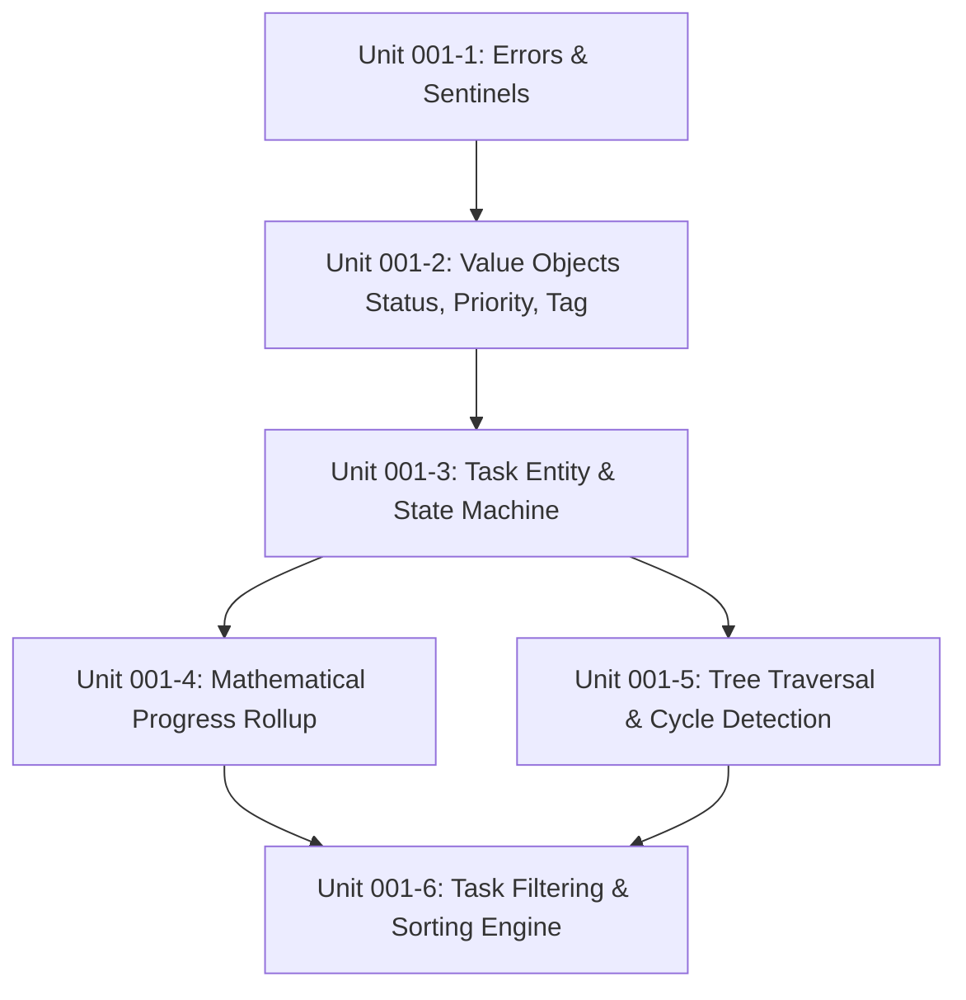

# Feature Plan 001: Core Domain Entities, Hierarchies & Business Invariants

## 1. Scope Capsule

### Goal & Operator Value
Provide the pure Go business logic and domain core for Tusk in `internal/core/`. This package establishes the inviolable rules of the task system: strongly typed states, priority weights, tag normalization, recursive subtask trees, cycle prevention, and mathematical progress rollups. By keeping this package 100% pure (zero database, zero network, zero CLI, zero UI dependencies), the system guarantees deterministic, microsecond-latency evaluation and unit test isolation.

### Actors & Affected Systems
- **Direct Consumers**: `internal/ports/`, `internal/service/`, `internal/storage/`.
- **Indirect Consumers**: `internal/cli/`, `internal/tui/`.
- **Isolation Guarantee**: `internal/core/` does not import any other package within `tusk/` and depends solely on the Go standard library (`time`, `fmt`, `strings`, `errors`, `regexp`, `unicode`).

### In Scope
- Strongly typed domain enums: `Status` (`todo`, `in-progress`, `blocked`, `done`) and `Priority` (`urgent`, `high`, `medium`, `low`).
- Entity definition: `Task` with ULID/UUID identifier, metadata, timestamps, and parent linkage.
- Tag value object with normalization rules (lowercase, alphanumeric + dashes, trimmed, deduped).
- Validated state transition machine with automatic `CompletedAt` lifecycle management.
- Mathematical subtask progress rollup calculation with deterministic integer floor arithmetic.
- Recursive tree model, acyclic cycle detection (`ErrCyclicDependency`), and max hierarchy depth enforcement (`ErrMaxDepthExceeded`).
- Task filtering query criteria and deterministic multi-key sorting rules.
- Strongly typed domain sentinel errors and error validation helpers.

### Out of Scope
- Persistence mechanisms, SQL queries, or SQLite drivers (owned by Feature 002).
- Natural language date string parsing (owned by Feature 003 service layer).
- Terminal rendering, Lipgloss styling, or Bubble Tea models (owned by Feature 005).
- CLI flag parsing and Cobra command definitions (owned by Feature 004).

### Surface Profiles
- **Library / Core Domain**: Pure Go exports, deterministic algorithms, thread-safe value copies, zero allocations on hot paths, 100% unit test coverage.

### Evidence Boundary
- **Local Evidence Only**: Pure Go unit tests (`go test -v ./internal/core/...`), race detection (`go test -race ./internal/core/...`), property-based assertions, and micro-benchmarks (`go test -bench=. ./internal/core/...`). No external infrastructure, daemons, or network access required.

---

## 2. Technical Design & Exact Public Contracts

### 2.1 Domain Errors (`internal/core/errors.go`)
```go
package core

import "errors"

var (
	ErrTaskNotFound            = errors.New("task not found")
	ErrEmptyTitle              = errors.New("task title cannot be empty")
	ErrTitleTooLong            = errors.New("task title exceeds maximum length of 255 characters")
	ErrInvalidStatus           = errors.New("invalid task status")
	ErrInvalidPriority         = errors.New("invalid task priority")
	ErrInvalidStatusTransition = errors.New("invalid status transition")
	ErrCyclicDependency        = errors.New("cyclic dependency detected: a task cannot be its own ancestor")
	ErrSelfParenting           = errors.New("task cannot reference itself as parent")
	ErrMaxDepthExceeded        = errors.New("maximum subtask hierarchy depth exceeded")
	ErrInvalidTag              = errors.New("invalid tag format: tags must be alphanumeric with hyphens")
)
```

### 2.2 Strongly Typed Enums (`internal/core/status.go` & `internal/core/priority.go`)

#### Status Enum & State Machine
```go
type Status string

const (
	StatusTodo       Status = "todo"
	StatusInProgress Status = "in-progress"
	StatusBlocked    Status = "blocked"
	StatusDone       Status = "done"
)

func ParseStatus(s string) (Status, error)
func (s Status) IsValid() bool
func (s Status) IsTerminal() bool // true for StatusDone
func (s Status) CanTransitionTo(next Status) bool
```
**Transition Matrix**:
- From `todo`: Can transition to `in-progress`, `blocked`, `done`.
- From `in-progress`: Can transition to `todo`, `blocked`, `done`.
- From `blocked`: Can transition to `todo`, `in-progress`, `done`.
- From `done`: Can transition to `todo`, `in-progress` (reopening). Transition to `blocked` directly is invalid.

#### Priority Enum
```go
type Priority int

const (
	PriorityLow    Priority = 1
	PriorityMedium Priority = 2
	PriorityHigh   Priority = 3
	PriorityUrgent Priority = 4
)

func ParsePriority(s string) (Priority, error)
func (p Priority) String() string
func (p Priority) Weight() int
func (p Priority) IsValid() bool
```

### 2.3 Tag Value Object (`internal/core/tag.go`)
```go
type Tag string

func NormalizeTag(raw string) (Tag, error)
func NormalizeTags(raw []string) ([]Tag, error)
func (t Tag) String() string
```
**Normalization Rules**:
1. Strip leading `#` if present.
2. Trim whitespace.
3. Convert to lowercase ASCII.
4. Validate regex: `^[a-z0-9]+(-[a-z0-9]+)*$` (length 1–32 chars).
5. Deduplicate and sort lexicographically.

### 2.4 Task Entity (`internal/core/task.go`)
```go
type Task struct {
	ID          string     `json:"id"`
	Title       string     `json:"title"`
	Description string     `json:"description,omitempty"`
	Status      Status     `json:"status"`
	Priority    Priority   `json:"priority"`
	ParentID    *string    `json:"parent_id,omitempty"`
	Progress    int        `json:"progress"` // 0 - 100
	Tags        []Tag      `json:"tags,omitempty"`
	DueDate     *time.Time `json:"due_date,omitempty"`
	CreatedAt   time.Time  `json:"created_at"`
	UpdatedAt   time.Time  `json:"updated_at"`
	CompletedAt *time.Time `json:"completed_at,omitempty"`
}

type NewTaskParams struct {
	ID          string
	Title       string
	Description string
	Priority    Priority
	ParentID    *string
	Tags        []string
	DueDate     *time.Time
	Now         time.Time
}

func NewTask(params NewTaskParams) (*Task, error)
func (t *Task) TransitionTo(next Status, now time.Time) error
func (t *Task) Update(title, desc string, priority Priority, tags []Tag, dueDate *time.Time, now time.Time) error
func (t *Task) SetProgress(progress int, now time.Time) error
func (t *Task) IsRoot() bool
func (t *Task) IsDone() bool
```

### 2.5 Progress Rollup Engine (`internal/core/rollup.go`)
```go
func CalculateProgress(subtasks []Task) int
```
**Mathematical Rules**:
1. If `len(subtasks) == 0`:
   $$\text{Progress} = \begin{cases} 100 & \text{if } t.\text{Status} == \text{StatusDone} \\ 0 & \text{otherwise} \end{cases}$$
2. If `len(subtasks) > 0`:
   $$\text{Progress} = \left\lfloor \frac{1}{N} \sum_{i=1}^N \text{subtask}_i.\text{Progress} \right\rfloor$$
   Clamped between $0$ and $100$.
3. If all subtasks are `StatusDone`, rollup progress is guaranteed to be $100\%$.
4. Reopening any subtask recalculates the parent's progress proportionally.

### 2.6 Tree Hierarchy & Cycle Detection (`internal/core/tree.go`)
```go
const MaxHierarchyDepth = 10

type TaskNode struct {
	Task     Task        `json:"task"`
	Children []*TaskNode `json:"children,omitempty"`
	Depth    int         `json:"depth"`
}

func BuildTree(tasks []Task) ([]*TaskNode, error)
func DetectCycles(taskID string, proposedParentID string, lookupParent func(id string) (*string, error)) error
func ValidateHierarchyDepth(taskID string, proposedParentID string, lookupParent func(id string) (*string, error)) error
```

### 2.7 Filter & Sorting Models (`internal/core/filter.go`)
```go
type SortField string

const (
	SortByPriority  SortField = "priority"
	SortByDueDate   SortField = "due_date"
	SortByCreatedAt SortField = "created_at"
	SortByTitle     SortField = "title"
)

type SortDirection string

const (
	SortAsc  SortDirection = "asc"
	SortDesc SortDirection = "desc"
)

type SortOrder struct {
	Field     SortField
	Direction SortDirection
}

type TaskFilter struct {
	Statuses   []Status
	Priorities []Priority
	Tags       []Tag
	ParentID   *string
	DueBefore  *time.Time
	DueAfter   *time.Time
	SearchTerm string
}

func FilterTasks(tasks []Task, filter TaskFilter) []Task
func SortTasks(tasks []Task, order []SortOrder)
```

---

## 3. Implementation Units & TDD Sequencing



### Unit 001-1: Domain Sentinels and Error Taxonomy
- **Goal**: Define domain error sentinels and validation helper predicates.
- **Files**:
  - `internal/core/errors.go`
  - `internal/core/errors_test.go`
- **Dependencies**: None.
- **Red Test**: `TestErrorsExist`: assert `errors.Is(ErrTaskNotFound, ErrTaskNotFound)`, ensure all sentinels are unique instances and have non-empty error strings.
- **Verification**: `go test -v -run TestErrors ./internal/core/...`
- **Review Lenses**: Correctness, simplicity.

### Unit 001-2: Strongly Typed Value Objects (`Status`, `Priority`, `Tag`)
- **Goal**: Implement enums, parsing, serialization, and normalization logic.
- **Files**:
  - `internal/core/status.go`, `internal/core/status_test.go`
  - `internal/core/priority.go`, `internal/core/priority_test.go`
  - `internal/core/tag.go`, `internal/core/tag_test.go`
- **Dependencies**: Unit 001-1.
- **Red Tests**:
  - `TestParseStatus`: Valid status parsing, invalid status returns `ErrInvalidStatus`.
  - `TestStatusTransitions`: Valid transitions pass; `done -> blocked` returns `ErrInvalidStatusTransition`.
  - `TestParsePriority`: Maps 1-4 and strings ("urgent", "high", "medium", "low"); rejects 0 or 5 with `ErrInvalidPriority`.
  - `TestNormalizeTag`: Strips `#`, converts `Backend` -> `backend`, rejects spaces/special chars with `ErrInvalidTag`.
- **Verification**: `go test -v -run "TestParse|TestNormalize|TestStatus" ./internal/core/...`
- **Review Lenses**: API contract, correctness.

### Unit 001-3: Task Entity & State Machine
- **Goal**: Implement `Task` entity, constructor `NewTask`, and mutation methods with timestamp lifecycle.
- **Files**:
  - `internal/core/task.go`
  - `internal/core/task_test.go`
- **Dependencies**: Unit 001-2.
- **Red Tests**:
  - `TestNewTask_Validation`: Reject empty title (`ErrEmptyTitle`), title > 255 chars (`ErrTitleTooLong`).
  - `TestTask_TransitionToDone`: Transitioning to `StatusDone` sets `CompletedAt` to `now`.
  - `TestTask_Reopen`: Transitioning from `StatusDone` to `StatusInProgress` clears `CompletedAt` (sets to `nil`).
- **Verification**: `go test -v -run TestTask ./internal/core/...`
- **Review Lenses**: Data integrity, state machine correctness.

### Unit 001-4: Mathematical Progress Rollup Engine
- **Goal**: Implement `CalculateProgress` with floor integer math and edge case handling.
- **Files**:
  - `internal/core/rollup.go`
  - `internal/core/rollup_test.go`
- **Dependencies**: Unit 001-3.
- **Red Tests**:
  - `TestCalculateProgress_Leaf`: 0% when `todo`, 100% when `done`.
  - `TestCalculateProgress_Subtasks`: 3 subtasks (100%, 50%, 0%) -> average is 50%.
  - `TestCalculateProgress_FloorRounding`: 3 subtasks (100%, 0%, 0%) -> 33% (integer floor).
  - `TestCalculateProgress_AllDone`: All subtasks done -> strictly 100%.
- **Verification**: `go test -v -run TestCalculateProgress ./internal/core/...`
- **Review Lenses**: Mathematical accuracy, boundaries.

### Unit 001-5: Hierarchical Tree Traversal and Cycle Detection
- **Goal**: Implement `DetectCycles`, `ValidateHierarchyDepth`, and `BuildTree`.
- **Files**:
  - `internal/core/tree.go`
  - `internal/core/tree_test.go`
- **Dependencies**: Unit 001-3.
- **Red Tests**:
  - `TestDetectCycles_DirectSelf`: Setting `taskA.parent = taskA` returns `ErrSelfParenting`.
  - `TestDetectCycles_TwoNodeLoop`: `taskA -> taskB`, setting `taskB -> taskA` returns `ErrCyclicDependency`.
  - `TestDetectCycles_DeepLoop`: 5-node chain `A -> B -> C -> D -> E`, setting `A.parent = E` returns `ErrCyclicDependency`.
  - `TestValidateHierarchyDepth`: Exceeding depth 10 returns `ErrMaxDepthExceeded`.
  - `TestBuildTree_Forest`: Correctly groups multiple roots and nested child slices.
- **Verification**: `go test -v -run "TestDetectCycles|TestBuildTree" ./internal/core/...`
- **Review Lenses**: Algorithmic correctness, performance.

### Unit 001-6: Task Filtering and Sorting Engine
- **Goal**: Implement in-memory filter evaluation and multi-key deterministic sorting.
- **Files**:
  - `internal/core/filter.go`
  - `internal/core/filter_test.go`
- **Dependencies**: Unit 001-4, Unit 001-5.
- **Red Tests**:
  - `TestFilterTasks`: Matches by Status, Priority, Tags, and substring SearchTerm in title.
  - `TestSortTasks_MultiKey`: Sort by Priority DESC, then DueDate ASC, then CreatedAt ASC. Verifies deterministic order.
- **Verification**: `go test -v -run "TestFilter|TestSort" ./internal/core/...`
- **Review Lenses**: Simplicity, deterministic behavior.

---

## 4. Verification Matrix

| Requirement | Unit | Scenario IDs | Evidence Tier |
| :--- | :--- | :--- | :--- |
| **Error Taxonomy** | Unit 001-1 | CORE-ERR-N1, CORE-ERR-B1 | Focused unit |
| **Status State Machine** | Unit 001-2 | CORE-STS-N1, CORE-STS-B1, CORE-STS-F1 | Focused unit |
| **Priority Weighting** | Unit 001-2 | CORE-PRI-N1, CORE-PRI-B1 | Focused unit |
| **Tag Normalization** | Unit 001-2 | CORE-TAG-N1, CORE-TAG-B1 | Focused unit |
| **Task Lifecycle & Dates** | Unit 001-3 | CORE-TSK-N1, CORE-TSK-B1, CORE-TSK-R1 | Focused unit |
| **Progress Rollup Math** | Unit 001-4 | CORE-ROL-N1, CORE-ROL-B1, CORE-ROL-P1 | Focused property/table |
| **Cycle & Tree Invariants** | Unit 001-5 | CORE-TRE-N1, CORE-TRE-B1, CORE-TRE-F1 | Focused graph/benchmark |
| **Filtering & Sorting** | Unit 001-6 | CORE-FLT-N1, CORE-FLT-B1, CORE-FLT-C1 | Focused unit |
| **Aggregate Domain Suite** | All | CORE-AGG-ALL | Aggregate `make validate` |
