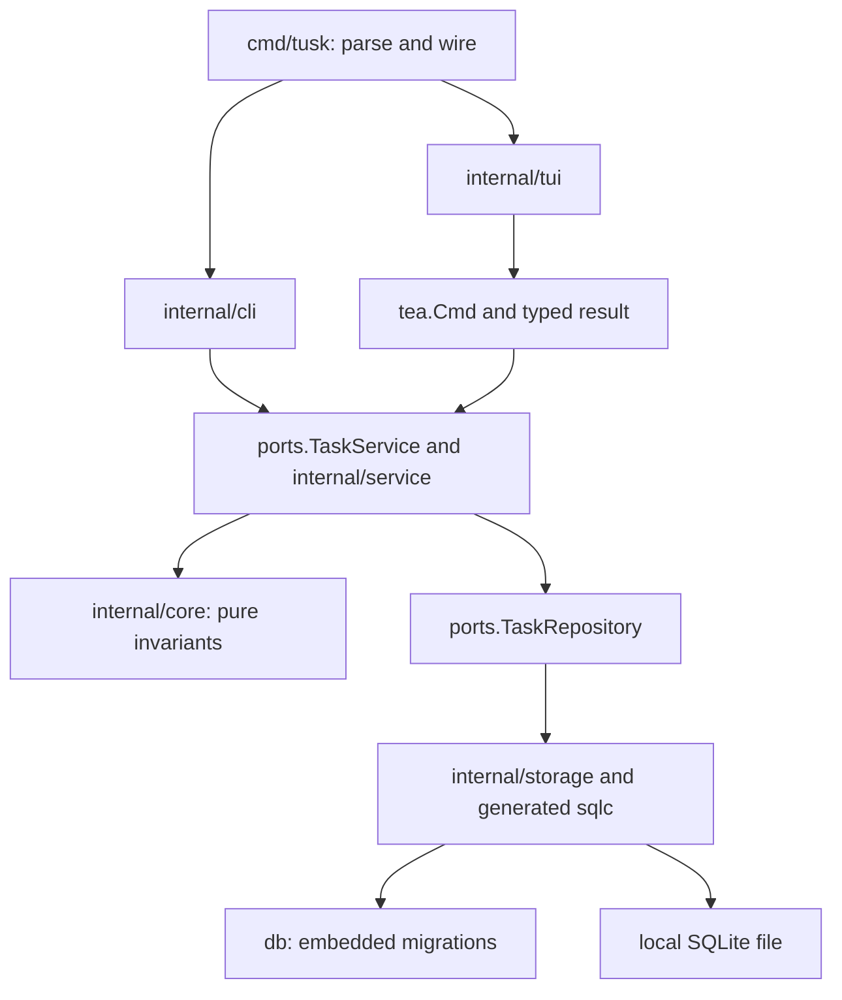

# Tusk Modern Task Management System - Plan

## Goal Capsule

Give developers a local task manager usable immediately from a terminal, shell script, or AI agent, with a keyboard-driven TUI over the same task operations. Use one binary, embedded SQLite, a pure Go domain core, and synchronous services called by CLI handlers or Bubble Tea commands.

- **Authority:** [AGENTS.md](../../AGENTS.md) governs engineering; [MASTERPLAN.md](../../MASTERPLAN.md) alone governs execution status and order.
- **Scope:** Product contracts and ordered handoffs for Features 002–006; Feature 001 is the existing compatibility baseline.
- **Surfaces:** CLI/TUI, internal library/service, persistence/migration, packaging/operations, documentation.
- **Artifact triplet:** This plan, its [verification plan](../verification-plans/2026-09-06-001-feat-tusk-modern-task-system-verification-plan.md), and [issue workorder](../workorders/2026-09-06-001-feat-tusk-modern-task-system-issues-workorder.md), under `docs/` in this first-party repository.
- **Readiness:** Deepened product planning baseline with explicit gates. This umbrella remains `requirements-only` as an execution entrypoint. It does not replace the phase-specific triplets or authorize implementation.
- **Current handoff:** [Feature 002](2026-09-06-002-feat-sqlite-storage-and-repository-plan.md) now owns the executable storage pack. Its first unit is **002-6 / feature U6**, the compatibility prerequisite added before migrations. Product U24 maps that new unit; product U6 still means the Phase 3 service contract. Later phases remain ordered by the masterplan.

## Product Contract

### Summary

Tusk provides recursive task hierarchies, progress rollup, tags, due dates, CLI automation, Markdown notes, and an interactive terminal workspace. Local use requires no daemon, network account, or database service.

### Problem Frame

The legacy application required PostgreSQL during startup, prompted for authentication in batch flows, and mutated TUI state during rendering. These behaviors prevented reliable scripting and caused stale or unstable terminal views. The [legacy audit](../research/legacy-audit.md) supplies regression cases; its implementation is archived, not a template for reuse.

### Preservation and live baseline

Product Contract restructured: original sections 2–5 map to R1–R27 below. Local operation, CLI/TUI identity, task fields, Markdown notes, optional parent completion, timeline history, and release platforms are retained. Clarifications reconcile original prose with shipped core behavior: depth 10, manual leaf progress, hyphenated tags, and exact state transitions. “Collision-free” becomes collision detection; “sub-millisecond” prose does not override the latency mandates.

Inspected revision: `6128d312921cecca2a024bc8647d959126822f0b` on `main`, 2026-09-08; worktree initially clean. `go.mod` declares Go 1.24.0 and no dependencies. Only `internal/core/` and a help/version scaffold in `cmd/tusk/` exist. Ports, storage, services, Cobra, TUI, schema, and hosted workflows do not exist. Phase 0/1 completion is recorded historical evidence in `MASTERPLAN.md`, not a fresh test result from this pass.

### Actors and flows

- A1. Developer: capture tasks, manage subtasks, review due work, and edit notes locally.
- A2. Script/AI agent: perform the same durable actions through explicit arguments, JSON, stable IDs, and no hidden prompt.
- A3. Maintainer: migrate data, reproduce defects, validate releases, and distribute binaries.
- F1. Capture: parse → validate metadata/date → create task and update ancestors atomically → return committed ID.
- F2. Mutate: read authoritative graph under a write transaction → validate → change affected descendants/ancestors and history → commit → refresh.
- F3. TUI: load through a command → navigate snapshot → submit form → accept matching result → reload authoritative data.
- F4. Upgrade: lazy open → check compatibility → migrate atomically if needed → serve command; failure preserves prior data.

### Requirements

#### Local runtime and task model

- R1. Local commands require no network, authentication, service, or daemon. Help, version, completion generation, and syntax errors never initialize storage or create directories.
- R2. Storage precedence: nonempty `TUSK_DB_PATH`, absolute `XDG_DATA_HOME/tusk/tusk.db`, then home plus `.local/share/tusk/tusk.db`. Relative explicit paths resolve against invocation directory; relative XDG values are ignored. The override is a filesystem path, never a user-controlled DSN. Invalid/unwritable paths return an operational error without silently choosing a different database.
- R3. Retain ID, title, description, status, priority, parent ID, progress, tags, due date, creation/update/completion timestamps. Core IDs remain opaque nonempty strings; service-created IDs use canonical lowercase UUIDv7. No prefix matching or automatic duplicate-insert retry.
- R4. Title: trimmed, 1–255 Unicode code points. Defaults: `todo`, `medium`, progress 0, empty notes, null optional fields. Tags use `core.NormalizeTags`: optional `#`, lowercase ASCII, single internal hyphens, 1–32 characters, sorted/deduplicated. Public adapters reject invalid UTF-8 and NUL without changing valid stored text.
- R5. Preserve the core state machine: open states can transition to any valid state; `done` reopens to `todo`/`in-progress`, not directly to `blocked`. Completion stamps UTC time; reopening clears it. Repeated satisfied commands do not change timestamps or create duplicate events.
- R6. Trees are acyclic, root depth 1, maximum 10 levels. Moves include descendant height in the depth check. Missing parents fail. Self-parenting matches both `ErrSelfParenting` and `ErrCyclicDependency` through `errors.Is`. No implicit orphan promotion.
- R7. Open leaf progress is manual 0–99; done is 100. Open parent progress is the floor average of immediate children; a non-done child parent with rollup 100 contributes 100. Reject manual progress on a parent. Losing the last child resets an open parent's progress to 0 and retains 100 for done; no restoration of historical manual progress.
- R8. Explicit completion marks target and every descendant done atomically. Reopening a leaf resets manual progress to 0. Reopening a parent preserves descendants and recalculates progress, possibly leaving it open at 100. Introducing/reopening an incomplete child below a done ancestor reopens that ancestor to `in-progress` before rollup.
- R9. Automatic parent completion defaults to false. If enabled, a mutation leaving a nonempty set of direct children all `done` completes that parent upward; rollup 100 alone does not trigger it. Explicit reopen wins for the targeted task during that operation. `--auto-complete-parent` overrides `TUSK_AUTO_COMPLETE_PARENT`; TUI receives the same policy. Invalid configuration returns 1; help remains usable.

#### Persistence, queries, and dates

- R10. A mutation's graph validation, task changes, ancestor rollups, and history appends share one transaction. Readers see a committed snapshot. No success before commit and no partial success on ancestor/event failure.
- R11. Embedded sequential migrations run on first data access. Reject unknown newer schema versions and changed applied checksums. Failed migration preserves the previous schema/data; never delete or recreate a database to recover from an error.
- R12. Disk databases use WAL, foreign keys ON, busy timeout 5000 ms, synchronous NORMAL. Lock waits and cancellation return errors when bounds expire. Disk fixtures prove WAL/concurrency/recovery; memory fixtures prove repository semantics only.
- R13. Filters OR within statuses/priorities and AND across fields; all requested tags must match. Search matches `core.FilterTasks` literal case-insensitive title/description substring semantics. Default list excludes done; explicit status selects exactly those states; `--all` includes done. Combining explicit status and `--all` returns 2.
- R14. Default order: priority descending, due ascending with null last, creation ascending, ID ascending. Apply to siblings independently. The glossary's pinned/active ordering is reserved terminology, not a persisted pin capability in this release.
- R15. Parse against one injected reference time and local zone; persist UTC. Support `today`, `tomorrow`, `tonight`, weekday abbreviations, positive `+Nd`, `+Nw`, `+Nm`, `YYYY-MM-DD`, and RFC3339 with offset. Day tokens/bare dates end at 23:59:59.999999999 local; `tonight` means 20:00 today even when past. Weekdays mean next occurrence including today. Offsets use calendar days/weeks; months clamp to last valid day. Reject overflow, invalid dates, and yearless `Sep 15`; no parse-error fallback to now.
- R16. `list --due <date>` selects the parsed local day with inclusive start and exclusive next-day boundary; undated tasks are excluded. Overdue means non-done and due strictly before reference time. Preserve core's exclusive `DueBefore`/`DueAfter`; the service owns the separate half-open day interval.
- R17. Statistics count all retained tasks, including parents: total, counts by status, done count, floor(done/total × 100), overdue count. Empty completion percent is 0. “Completed last 7 days” counts currently done tasks with `now - 168h < completed_at <= now`. Reopening/deleting removes them from that metric; do not describe it as immutable historical productivity.
- R18. Details timeline records create, metadata edit, status, move, manual-progress, and rollup changes with UTC time and stable sequence. Store event kind and changed field names, not old notes/titles or snapshots. Deleting a task deletes its timeline; no tombstones/undo. Expose it through CLI `history <id> --json` and the TUI.

#### CLI and machine contract

- R19. The grammar below covers every durable TUI action without a TTY. Omitted edit fields preserve values; explicit clear flags clear fields. Empty edits and contradictory clear/set flags return 2. A compound edit cannot combine manual progress with status/parent changes.
- R20. Parent deletion requires `--recursive`. Without `--force`, a TTY gets default-No confirmation naming target and subtree count; non-TTY/JSON fail with guidance. Force skips confirmation only, never implies recursion. Decline succeeds without mutation. Recheck the confirmed subtree under the writer lock; changed membership requires new confirmation unless forced.
- R21. `add`, `list`, `done`, `edit`, `delete`, `tree`, `stats`, and `history` support `--json`. Emit one compact UTF-8 JSON value plus LF on stdout; diagnostics on stderr. Pre-output errors leave stdout empty. Output failure never appends human text to JSON or replays a mutation.
- R22. Exit 0 success, 1 operational/domain/configuration/output failure, 2 syntax/unknown command/flag/arity. Cancellation before commit returns 1 without success. If commit succeeded before cancellation/output failure, retain committed state and require readback before retrying a mutation.
- R23. Human output omits ANSI when non-TTY, `NO_COLOR` is nonempty, or `TERM=dumb`. Stored text cannot inject terminal controls or OSC hyperlinks. JSON preserves text through JSON escaping. TUI requires terminal stdin/stdout; empty invocation shows help and does not start TUI.

#### TUI and delivery

- R24. Use the Bubble Tea v1 contract `View() string`. Constructors initialize components; `Update` changes state/layout/styles. Async loads, timers and writes are `tea.Cmd` with typed messages. View never mutates any model, pointer, slice, map, style, component, or cache.
- R25. States: loading, empty, filtered-empty, loaded, refreshing, load error, saving, save error, stale data. Preserve selection by ID; reject superseded responses. Failed writes preserve drafts; uncertain commits require reload before retry. A late response cannot overwrite newer data or a different form.
- R26. At least 80×24 supports list/details/help without overflow. Smaller terminals show a bounded resize message and allow quit, preserving drafts/selection. Support visible focus, non-color status labels, Unicode cell widths, scrolling, keyboard operation, and plain terminal presentation. Real terminal acceptance is separate from synthetic tests.
- R27. Release CGO-free binaries for Linux amd64/arm64, macOS amd64/arm64, Windows amd64, Bash/Zsh/Fish completion, and man pages. Keep local, hosted, manual, and publication evidence separate. Data survives executable replacement/removal.
- R28. Preserve query latency under 15 ms and help/version under 5 ms. Measure actual subprocess startup through exit, including formatting, using explicit fixtures. Report initialization, lock contention, slow output, and larger datasets separately; no benchmark proves the bound on all hardware or unbounded output.
- R29. Core stays independent; state is constructor-injected; verification uses Makefile gates. `make validate` currently includes fmt, vet, test, race, and at least 95% per-package coverage for nonexempt packages. Close a phase only after its scenarios, issue gates, and master checklist have execution evidence.

### Command grammar and data shapes

| Command | Arguments and flags | Result |
| --- | --- | --- |
| `add <title>` | `-p/--priority`, `-d/--due`, repeatable `-t/--tags`, `--parent`, `-n/--notes`, `--json` | Created Task |
| `list` | repeatable `-s/--status`, `-p/--priority`, `-t/--tags`; `--due`, `--search`, `--parent`, `--root`, `--all`, `--json` | Flat array |
| `done <id>` | `--json` | Selected Task after subtree completion |
| `edit <id>` | `--title`, `--notes`, `--priority`, `--status`, `--progress`, `--due`/`--clear-due`, repeatable `--tags`/`--clear-tags`, `--parent`/`--root`, `--json` | Task after atomic patch |
| `delete <id>` | `--recursive`, `--force`, `--json` | Delete result |
| `tree [id]` | `--json` | Forest or subtree, including done descendants |
| `stats` | `--json` | R17 metrics |
| `history <id>` | `--json` | Oldest-first event array |
| `tui` | common policy flag | Terminal session |
| `help`, `version`, `completion <shell>` | root `--help`/`--version` aliases | No storage |

Unknown flags, extra arguments, simultaneous `--root`/`--parent`, malformed numeric/boolean syntax return 2. Invalid domain values (status, date expression, out-of-range parsed progress) return 1. Titles beginning with `-` can follow `--`. Tags flatten repeated/comma-separated values; empty elements fail. Explicit empty notes clear notes. `edit --status done` uses subtree completion; `--status todo/in-progress` on a done task uses reopening. In a parent+status patch, validate/move first, apply status, then recalculate both ancestor chains atomically.

Wire DTOs are independent of core's existing `omitempty` tags:

- Task: `id`, `title`, `description` (including empty), `status` string, `priority` integer 1–4, `parent_id` string/null, `progress` integer, `tags` array (empty `[]`), `due_date`, `created_at`, `updated_at`, `completed_at` UTC RFC3339Nano strings; optional dates null.
- List: array, empty `[]`. Add/done/edit: one Task. Tree: array of `{task, children, depth}` with children `[]`; selected subtree root has display depth 1 without changing stored parent ID.
- Delete: `{id, deleted_ids, deleted_count, deleted}`; sorted IDs. JSON requires force and never prompts.
- Stats: `{total, by_status, done, completion_percent, overdue, completed_last_7_days}`, with all four status keys.
- History: array of `{sequence, task_id, kind, changed_fields, occurred_at}`; nonexistent task fails, existing task with no events returns `[]`.

No pagination or implicit JSON truncation in this release. Additive fields are compatible; field removal/type/null/array changes require an explicit compatibility revision and fixtures.

### Scope and assumptions

No network sync, external backend implementation, accounts, recurrence, reminders, collaboration, non-parent task dependencies, or event-sourced reconstruction. A future backend may implement the same port; no plugin framework is needed.

Planning defaults are R9 opt-in completion, R15 date times, R17 retained-task metrics, R18 metadata-only timeline, and R20 explicit recursive deletion. They are decisions for this pack, not claims of separate user approval. Changes require synchronized product and affected feature triplets. Timeline/history is retained original scope; its missing persistence support must be incorporated into Feature 002 before schema implementation.

## Planning Contract

### Technical decisions

- KTD1. **Phase plans own execution.** Units below are handoffs. Feature 002 has its complete execution triplet; Feature 003–006 outline metadata is not readiness. Gate G1 applies per feature. Follow the masterplan's phase order even where its DAG allows concurrency.
- KTD2. **Choose modernc SQLite, subject to G2.** Keep `database/sql` in storage. Require a patched SQLite engine and matching driver/libc/toolchain. No dependencies are installed in this pass.
- KTD3. **Migration-owning `db` package.** `db/embed.go` embeds adjacent `migrations/*.sql`; storage imports it. Embedding `../../db` from storage is invalid. Generate queries into `internal/storage/sqlc/`; test generated behavior through the adapter. [Go embed](https://pkg.go.dev/embed), [sqlc configuration](https://docs.sqlc.dev/en/latest/reference/config.html).
- KTD4. **One writer, bounded readers.** Use one writer connection and up to four reader connections. Begin writes IMMEDIATE before reading graph state; read snapshots use separate deferred transactions. Configure connection-scoped pragmas for every new/replacement connection. No transaction callback may borrow another write connection. Verify cancellation and driver transaction options at G2. Create new application-owned directories as 0700 and database files as 0600 on POSIX; preserve existing parent permissions and use the user's private profile ACL on Windows. Reject symlink/non-regular database targets; encode path characters as literal filename data when constructing an internal DSN. This is a single-user boundary, not protection against a malicious process with the same OS identity. [Driver documentation](https://pkg.go.dev/modernc.org/sqlite).
- KTD5. **Transaction-scoped ports.** `ports.TaskRepository` exposes reads and a write callback receiving a restricted query/writer interface. The callback uses that interface for all reads/writes/events and cannot retain or nest it. Storage owns begin/commit/rollback/close; service owns business decisions. Wrap failures with context and map known domain sentinels via `errors.Is`; typed port errors cover busy, conflict, children-present, corruption, and incompatible schema.
- KTD6. **Strict schema and decoded validation.** Tasks: non-null primary key, enum/range checks, nullable parent FK, self-parent check, done/progress/completion consistency, valid JSON tag arrays. Store UTC timestamps as fixed-width TEXT with nine fractional digits for chronological comparison. Cross-row cycle/depth/leaf/rollup rules remain service checks inside the write transaction. Corrupt decoded rows fail; never clamp and save them.
- KTD7. **Minimal history table.** `task_events`: integer sequence, task FK with cascade deletion, kind, changed-field JSON array, occurred-at. Index task/sequence. No old user text or state snapshots. Tasks remain authoritative. Parent FK also cascades, but service authorizes recursive deletion under R20.
- KTD8. **Query parity.** Index parent, status, priority, and due date; add composites only from query-plan evidence. Bind values; allowlist sorting. SQL narrows candidates; use core filtering for Unicode search rather than assuming SQLite NOCASE equals Go case conversion. Sort through core. Never pass a filtered list as a complete forest to `BuildTree`; fetch complete ancestry/subtree before projection.
- KTD9. **Ledger and recovery.** Acquire writer lock, re-read migration ledger, apply all pending migrations and checksums in one transaction. Current schemas need a compatibility read, not a migration write on each query. Check newer schemas before persistent journal changes. Canonical `db/migrations/NNN_name.sql` files contain forward SQL only; inverse fixture scripts live under `internal/storage/testdata/migrations/` and are never embedded or fed to sqlc. Down migrations are only for disposable test fixtures; installed data uses roll-forward or consistent offline-backup restoration. Keep the original and WAL sidecars on failure.
- KTD10. **Bound durability claims.** NORMAL is retained, without promising the last acknowledged transaction survives power loss. App termination, transaction rollback, reopen and integrity each have scenarios. SQLite owns WAL cleanup; never unlink WAL/SHM to repair data. Require suitable local filesystem semantics. [SQLite WAL](https://www.sqlite.org/wal.html), [pragmas and in-memory limits](https://www.sqlite.org/pragma.html).
- KTD11. **Inject identity/time.** One clock value per mutation, explicit location for dates. A small service helper constructs RFC 9562 UUIDv7 from supplied time and cryptographic randomness, without package mutable state. Entropy/duplicate failures abort; no retry after uncertain commit. Sort by R14, not assumed monotonic UUID order. [UUIDv7](https://www.rfc-editor.org/rfc/rfc9562.html#section-5.7).
- KTD12. **Prevent stale overwrite.** Apply only supplied patch fields to the latest task under writer lock. TUI forms compare their base editable fields to authoritative values; differences return conflict and retain draft. Confirmation compares subtree membership and target metadata. CLI patches operate on the latest row; no long-lived stale row replacement.
- KTD13. **Preserve v1 UI family.** Candidate pins: Bubble Tea v1.3.10, Lipgloss v1.1.0, Bubbles v0.21.0; validate combined graph in Phase 5. No silent v2 `View`/key API switch. [v1 source](https://raw.githubusercontent.com/charmbracelet/bubbletea/v1.3.10/tea.go), [Go baseline](https://raw.githubusercontent.com/charmbracelet/bubbletea/v1.3.10/go.mod).
- KTD14. **Refresh through commands.** Load at start, after mutation, on `r`, and every 2 seconds through a typed timer command. Use request generations, invalidate pending reads after writes, allow one write at a time, preserve drafts. Failed refresh keeps the snapshot labeled stale. No service cache/goroutine pool.
- KTD15. **Separate release from race builds.** CGO=0 for binaries; race gates retain compiler support. Document Bash/Make on Windows and check for formatting-induced diffs in CI. Keep immutable release version metadata using generated constants, not a mutable package variable.

### Architecture and transaction flow

Port operation contract (all I/O accepts context; names below are the planned API vocabulary, with final Go types owned by the phase-specific pack):

| Boundary | Operations | Ownership and result |
| --- | --- | --- |
| Repository reads | GetByID, List, ListChildren, GetSubtree, GetAncestors, ListEvents | Detached core tasks/event read models; missing singular task is ErrTaskNotFound; empty collections are non-nil |
| Repository read snapshot | WithRead | One callback sees a consistent task/event snapshot across multiple reads; no mutation methods exposed |
| Repository write transaction | WithWrite | Callback reads plus Create/Update/Delete/AppendEvent; callback/commit failure returns no success; nested callback rejected |
| Service mutations | CreateTask, UpdateTask, CompleteTask, ReopenTask, DeleteTask | Structured commands with supplied/clear intent, optional base snapshot/confirmation, one operation timestamp, committed result |
| Service queries | ListTasks, GetTaskTree, GetStats, GetTaskHistory | Validated filters, snapshot-consistent DTO/read model; tree root projection never changes stored task |

Do not expose `sql.DB`, `sql.Tx`, driver errors or generated query structs through ports. Delete preview and execution carry the exact sorted task IDs and target editable metadata for R20's equality check. Constructors own resource dependencies; only the composition root closes the opened storage instance. Calendar parsing must include portable zone data where the target OS cannot supply the named IANA fixtures; pin this behavior at G3.

These sketches define ownership and sequencing, not implementation code.



```mermaid
sequenceDiagram
  participant P as CLI or TUI command
  participant S as Task service
  participant T as Transaction-scoped repository
  P->>S: Intent and context
  S->>T: Acquire writer; BEGIN IMMEDIATE
  S->>T: Read task, subtree and ancestors
  S->>S: Validate conflict, cycles, depth and lifecycle
  S->>T: Write changed tasks and events
  alt failure before commit
    T-->>S: Rollback and wrapped error
    S-->>P: No confirmed mutation; retain input
  else commit succeeds
    T-->>S: Commit acknowledgment
    S-->>P: Committed result
    P->>S: Refresh snapshot
  end
```

### Mutation decisions

| Trigger | Target/subtree | Ancestors and events |
| --- | --- | --- |
| Add child | Validate parent/depth; create default-open child | Reopen done ancestors if incomplete; roll up deepest first |
| Complete | Target/descendants done with one operation time; existing done rows no-op | Recalculate ancestors; auto-complete only per R9 |
| Reopen leaf | Requested open status, progress 0, completion cleared | Reopen done ancestors; preserve siblings |
| Reopen parent | Preserve descendants, clear completion, recalculate progress | Suppress auto-completion of explicit target in this operation |
| Move/root promotion | Validate subtree/cycle/final depth; move once | Recalculate old/new chains deepest first; shared ancestors once after both branches |
| Delete | Recheck confirmation; delete authorized tasks/events | Recalculate old ancestors; apply last-child R7 |
| Metadata/progress | Atomic patch; reject parent manual progress | Roll up when relevant; append actual changed fields only |

### TUI interaction contract

Reserve borders and a bottom help/status row. Use about 40% remaining width for list and 60% for details. Compute nonnegative inner cell dimensions on resize. Empty/error/loading/task-count changes keep outer geometry fixed. Clip by terminal cells; scroll ten-level trees, long notes, and wide glyphs.

Root groups: Today (includes overdue open roots), Upcoming (future due roots), Backlog (undated open roots), Completed (done roots). Descendants stay under their root regardless of own date; due/search filters find cross-tree work. Search matches title/notes, retains ancestor context, and restores collapse state when cleared. Debounce 150 ms through typed timer generations. Losing selection selects a visible neighbor or the empty state.

| Context | Keys | Behavior |
| --- | --- | --- |
| List | `j/k`, arrows, `g/G` | Move selection and scroll |
| List | `h/l`, Left/Right | Collapse/expand branch; leaf no-op |
| Browsing | Tab/Shift+Tab | Cycle list/details; detail arrows scroll |
| Browsing | `a`, `e`, `d`, `x`/Space | Add, edit, confirm delete, toggle via R8 |
| Browsing | `/`, `r`, `?`, `q` | Search, refresh, help, quit |
| Search/form | Text, Tab, Enter, Esc | Input, focus, submit/accept search, cancel/restore focus |
| Modal | Ordinary text including `q`, `d`, `?` | Input only; no global mutation/navigation |
| Any | Ctrl+C | Cancel/exit and restore terminal |

One `d` opens confirmation; another `d` is not consent. Default button is Cancel. Forms expose title, notes, priority, due, tags and parent/root; status and manual leaf progress are edit-only, matching CLI parity and creation defaults. Field errors stay visible. Saving disables duplicate submit/modal close; Ctrl+C follows R22. Markdown is display-only: no remote fetch, link launch, or execution. Successful save followed by failed refresh says “saved; refresh failed”, never invites resubmission.

### Rollout and gates

| Gate | Owner and closure evidence | Blocking effect |
| --- | --- | --- |
| G1 | Each feature owner synchronizes its plan/verification/workorder with this product contract | Feature 002 pack completed; remains open for Features 003–006 |
| G2 | Feature 002 KTD1 selects Go 1.25.0, modernc v1.58.0, libc v1.75.6 and SQLite 3.53.4; product U24 / feature U6 proves it | Planning choice recorded; compatibility smoke blocks production schema work in U1. Actual module remains unchanged until implementation |
| G3 | Phase 4/5 owners pin CLI/UI dependencies before their first unit; U15/U20 add benchmark runners and evidence | Dependency choice blocks U11/U16; measurement blocks phase acceptance, not earlier implementation units or storage planning |
| G4 | Phase 6 maintainer proves exact candidate on OS/architectures and terminals, licenses, distribution destination, release metadata | Blocks publication; local green/cross-compilation are insufficient |

G2 planning choice is now owned by [Feature 002 KTD1](2026-09-06-002-feat-sqlite-storage-and-repository-plan.md#key-technical-decisions): raise the build minimum to Go 1.25 with the pinned patched driver/libc. This is a technical planning default, not a claim of explicit user approval or executed compatibility proof. The earlier affected Go 1.24 candidate is not selected. [Affected engine](https://pkg.go.dev/modernc.org/sqlite@v1.46.1), [WAL fix](https://www.sqlite.org/wal.html#walresetbug), [selected module](https://proxy.golang.org/modernc.org/sqlite/@v/v1.58.0.mod).

`sqlc` configuration `version: "2"` is a config format. Feature 002 pins the prebuilt [v1.31.1](https://github.com/sqlc-dev/sqlc/releases/tag/v1.31.1) executable and five host archive digests; its Go 1.26 source-build minimum stays outside the Go 1.25 runtime module.

First data command creates an empty database. Current installations check compatibility before migration. Later data-bearing upgrades require a consistent offline backup; down migrations only prove reversibility in test fixtures. Downgrade does not rewrite schema. Legacy PostgreSQL import needs a separate plan. Removing/replacing a binary must not delete data. Release automation must not publish without the release action being authorized.

## Implementation Units

These units are handoff contracts, not completed work or activation of future phases. Feature 001 remains the core baseline. Every new unit requires a red test before implementation, focused green evidence, applicable scenarios, and `make validate` before checklist closure. Tests excluded under `-short` must execute under full/race targets.

| Unit | Feature unit | Responsibility / primary files | Depends on |
| --- | --- | --- | --- |
| U24 | 002-6 | Pinned runtime and compatibility proof: `internal/storage/compatibility_test.go` | Feature 002 G1 and G2 planning choices; existing Feature 001 |
| U1 | 002-1 | Embedded schema and atomic migrations: `db/embed.go` | U24 compatibility proof |
| U2 | 002-2 | Reproducible sqlc queries: `db/queries.sql` | U1 |
| U3 | 002-3 | Connection and file lifecycle: `internal/storage/open.go` | U1/U2 |
| U4 | 002-4 | Repository and transaction contracts: `internal/ports/task_repository.go` | U3 |
| U5 | 002-5 | Disk concurrency and recovery proof: `internal/storage/concurrency_test.go` | U4 |
| U6 | 003-1 | Application commands and patch contracts: `internal/ports/task_service.go` | Phase 2 accepted; G1 for Feature 003 |
| U7 | 003-2 | Deterministic dates and identity: `internal/service/dateparse/` | U6 |
| U8 | 003-3 | Atomic hierarchy and rollup mutations: `internal/service/mutations.go` | U6/U7 |
| U9 | 003-4 | Queries, statistics and history orchestration: `internal/service/queries.go` | U8 |
| U10 | 003-5 | Service integration and stale-write proof: `internal/service/integration_test.go` | U9 |
| U11 | 004-1 | Lazy CLI routing and process exit: `internal/cli/root.go` | Phase 3 accepted; G1 and G3 dependency decision for Feature 004 |
| U12 | 004-2 | Scriptable mutation commands: `internal/cli/add.go` | U11 |
| U13 | 004-3 | List, tree, stats and history commands: `internal/cli/list.go` | U12 |
| U14 | 004-4/004-5 | Stable human and JSON formatting: `internal/cli/format.go` | U13 |
| U15 | 004-6 | Real CLI workflows and latency: `internal/cli/process_test.go` | U14 |
| U16 | 005-1/005-2 | Pure TUI model and deterministic layout: `internal/tui/model.go` | Phase 4 accepted per masterplan; G1 and G3 dependency decision for Feature 005 |
| U17 | 005-3 | Navigation, filtering and refresh generations: `internal/tui/navigation.go` | U16 |
| U18 | 005-4 | Details, Markdown and timeline: `internal/tui/details.go` | U17 |
| U19 | 005-5 | Forms and confirmed mutations: `internal/tui/forms.go` | U18 |
| U20 | 005-6 | TUI workflow and real terminal acceptance: `internal/tui/workflow_test.go` | U19 |
| U21 | 006-1 | Hosted platform quality gates: `.github/workflows/ci.yml` | Phases 4/5 accepted; G1 for Feature 006 |
| U22 | 006-2 | Release artifacts and installation lifecycle: `.goreleaser.yaml` | U21; G4 distribution decisions |
| U23 | 006-3 | Completions, documentation and final handoff: `internal/cli/completion.go` | U22 |

### U24. Pinned storage runtime and compatibility proof

- **Goal / requirements:** Prove the selected runtime before schema code; R12, R27, R29. Feature unit 002-6 / Feature 002 U6.
- **Dependencies:** Feature 002 planning pack, G2 planning choice, existing Feature 001.
- **Ownership:** `go.mod`, `go.sum`, `scripts/setup.sh`, `scripts/test/test_scripts.sh`, `Makefile`, `internal/storage/connection.go`, `internal/storage/compatibility_test.go`.
- **Approach:** Feature 002 KTD1/KTD3/KTD4 define the pinned graph and private connection factory. Prove engine version, minimum compiler, transaction mode, query-only readers and replacement pragmas before U1.
- **Red-first test:** TestSQLiteCompatibility fails on the absent driver/factory; fake setup compiler 1.24 is rejected. Record actual observations during execution.
- **Verification:** make test-compat and make build-storage (add here), make test, make race, make validate. TUSK-V01 and Feature 002 V01–V08; cross-builds do not prove native target execution.
- **Failure / recovery:** Failed compatibility blocks migration implementation; no silent pin or minimum change.
- **Reviews:** Feasibility, dependencies, concurrency, portability, evidence quality.

### U1. Embedded schema and atomic migrations

- **Goal / requirements:** Embedded schema and atomic migrations; R3–R12, R18, R29. Feature unit 002-1.
- **Dependencies:** U24 compatibility proof.
- **Ownership:** `.gitattributes`, `db/embed.go`, `db/embed_test.go`, `db/migrations/`, `internal/storage/migrations.go`, `internal/storage/migrations_test.go`, `internal/storage/schema_test.go`. Test paths are planned unless already present; do not overwrite another unit's files without coordination.
- **Approach:** KTD3/KTD6/KTD7/KTD9: ledger, tasks and task_events schema; transactional up/down fixture behavior; reject foreign/newer schemas before intentional persistent changes. Feature 002 adds application identity and LF-controlled migration hashes. `db/embed_test.go` proves inventory/content rather than adding a coverage exemption.
- **Red-first test:** TestMigrate_FailurePreservesPreviousVersion and TestMigrate_NewerSchemaUnchanged: missing migrator first fails to compile; injected second-statement failure must later leave old rows/schema/version intact.
- **Verification:** make test; make race. Scenarios TUSK-V02, TUSK-V03, TUSK-V04. Record actual red/green evidence during execution; these are expected failures, not observed results.
- **Failure / recovery:** Rollback the migration and retain original files; no automatic down-migration or delete/recreate on installed data.
- **Reviews:** Architecture, data integrity, migration, reliability. Close the unit only with the applicable aggregate gate and phase triplet/master checklist update.

### U2. Reproducible sqlc queries

- **Goal / requirements:** Reproducible sqlc queries; R10–R14, R18, R29. Feature unit 002-2.
- **Dependencies:** U1.
- **Ownership:** `db/queries.sql`, `sqlc.yaml`, `internal/storage/sqlc/`, `internal/storage/queries_test.go`, `scripts/sqlc.sh`, `Makefile`, `scripts/test/test_scripts.sh`. Test paths are planned unless already present; do not overwrite another unit's files without coordination.
- **Approach:** KTD3/KTD8: pin generator/checksum, compile SQLite queries, isolate generated output; add canonical generate/check-generated targets with script tests. Include transactional row/event and subtree/ancestor queries.
- **Red-first test:** TestQueries_FilterAndSubtreeParity fails on missing queries; malformed SQL fixture must make generation fail; stale generated output must fail check-generated.
- **Verification:** make test; make setup-sqlc, make generate, make check-generated and make test-scripts (add here). Scenarios TUSK-V05, TUSK-V06, TUSK-V07. Record actual red/green evidence during execution; these are expected failures, not observed results.
- **Failure / recovery:** Generation failure cannot overwrite checked-in output with partial files; preserve source and regenerate deterministically.
- **Reviews:** API contract, SQL correctness, performance, maintainability. Close the unit only with the applicable aggregate gate and phase triplet/master checklist update.

### U3. Connection and file lifecycle

- **Goal / requirements:** Connection and file lifecycle; R1, R2, R11, R12, R23, R29. Feature unit 002-3.
- **Dependencies:** U1/U2.
- **Ownership:** `internal/storage/open.go`, `internal/storage/path.go`, `internal/storage/open_test.go`, `internal/storage/path_test.go`. Test paths are planned unless already present; do not overwrite another unit's files without coordination.
- **Approach:** KTD4/KTD9: one writer/up to four readers, per-connection pragmas, lazy path opening, safe permissions, close ownership, disk and uniquely named memory fixture factories.
- **Red-first test:** TestOpen_PathPrecedenceAndLiteralFilename, TestOpen_ReplacementConnectionPragmas: absent opener fails; later failures expose ignored XDG, unsafe DSN, or unconfigured replacement connection.
- **Verification:** make test; make race. Scenarios TUSK-V08, TUSK-V09, TUSK-V10, TUSK-V11. Record actual red/green evidence during execution; these are expected failures, not observed results.
- **Failure / recovery:** Close partially opened handles on error; never switch to another path or remove DB/sidecars. Failed close returns context without masking the primary failure.
- **Reviews:** Security/privacy, lifecycle, concurrency, portability. Close the unit only with the applicable aggregate gate and phase triplet/master checklist update.

### U4. Repository and transaction contracts

- **Goal / requirements:** Repository and transaction contracts; R3–R7, R10, R13, R14, R18, R29. Feature unit 002-4.
- **Dependencies:** U3.
- **Ownership:** `internal/ports/task_repository.go`, `internal/ports/errors.go`, `internal/storage/sqlite_repository.go`, `internal/storage/sqlite_repository_test.go`. Test paths are planned unless already present; do not overwrite another unit's files without coordination.
- **Approach:** KTD5/KTD6/KTD8: explicit read/write callback ports, strict row conversion, bind-only SQL, nested transaction rejection, graph/metadata retrieval and error mapping.
- **Red-first test:** TestRepository_RoundTripAndDetachedValues and TestWithWrite_ChildAndHistoryRollback fail on missing methods; invalid decoded rows, missing IDs and callback error must never return partial success.
- **Verification:** make test; make race; make validate. Scenarios TUSK-V12, TUSK-V13, TUSK-V14, TUSK-V15. Record actual red/green evidence during execution; these are expected failures, not observed results.
- **Failure / recovery:** Rollback every failed callback; discard poisoned connection; preserve errors.Is/context errors. Returned values must not alias shared repository state.
- **Reviews:** Contract, correctness, data integrity, simplicity. Close the unit only with the applicable aggregate gate and phase triplet/master checklist update.

### U5. Disk concurrency and recovery proof

- **Goal / requirements:** Disk concurrency and recovery proof; R10–R12, R28, R29. Feature unit 002-5.
- **Dependencies:** U4.
- **Ownership:** `internal/storage/concurrency_test.go`, `internal/storage/recovery_test.go`, `internal/storage/storage_bench_test.go`, `internal/storage/testdata/`, `docs/storage.md`, `Makefile`, `phase 002 triplet`. Test paths are planned unless already present; do not overwrite another unit's files without coordination.
- **Approach:** Use deterministic lock barriers, two independent process connections, temporary disk files, crash checkpoints and SQLite integrity checks; memory tests never stand in for WAL evidence.
- **Red-first test:** TestConcurrentWriters_NoLostUpdate and TestRecovery_KilledWriterAtomic expose incomplete isolation/recovery. If existing behavior already passes, record characterization; introduce no implementation change without a distinct failing case.
- **Verification:** make test; make race; make validate. Scenarios TUSK-V16, TUSK-V17, TUSK-V18, TUSK-V19. Record actual red/green evidence during execution; these are expected failures, not observed results.
- **Failure / recovery:** Crash before commit leaves old state; after acknowledged commit and process termination read committed state. Keep locks/readers bounded and prove another operation works after cancellation.
- **Reviews:** Adversarial data integrity, concurrency, reliability, performance. Close the unit only with the applicable aggregate gate and phase triplet/master checklist update.

### U6. Application commands and patch contracts

- **Goal / requirements:** Application commands and patch contracts; R3–R10, R19, R20, R22, R29. Feature unit 003-1.
- **Dependencies:** Phase 2 accepted; G1 for Feature 003.
- **Ownership:** `internal/ports/task_service.go`, `internal/ports/task_commands.go`, `internal/service/task_service.go`, `internal/service/task_service_test.go`. Test paths are planned unless already present; do not overwrite another unit's files without coordination.
- **Approach:** Define create, atomic patch, complete, reopen, delete, list, tree, stats and history operations; inject repo, clock, ID source, zone, completion policy. Distinguish unchanged/set/clear and preserve no-op semantics.
- **Red-first test:** TestService_InvalidCommandDoesNotBeginWrite and TestService_PatchPresence fail on missing service then catch clear/omitted conflation.
- **Verification:** make test-unit; make test. Scenarios TUSK-V20, TUSK-V21. Record actual red/green evidence during execution; these are expected failures, not observed results.
- **Failure / recovery:** Reject invalid pure input before opening transaction; propagate I/O failure without mutating caller objects or losing draft data.
- **Reviews:** API contract, product parity, correctness, simplicity. Close the unit only with the applicable aggregate gate and phase triplet/master checklist update.

### U7. Deterministic dates and identity

- **Goal / requirements:** Deterministic dates and identity; R3, R4, R15, R16, R29. Feature unit 003-2.
- **Dependencies:** U6.
- **Ownership:** `internal/service/dateparse/`, `internal/service/id.go`, `internal/service/id_test.go`. Test paths are planned unless already present; do not overwrite another unit's files without coordination.
- **Approach:** KTD11 and R15/R16; table-driven calendar parsing and UUIDv7 bit/layout validation with injected entropy/time. Include zone/DST/month-end fixtures.
- **Red-first test:** TestParseDue_CalendarDSTAndInvalid, TestUUIDv7_EntropyFailure: missing helpers fail; elapsed-hour date arithmetic must fail DST cases and entropy failure must return no ID.
- **Verification:** make test-unit. Scenarios TUSK-V22, TUSK-V23, TUSK-V24, TUSK-V25. Record actual red/green evidence during execution; these are expected failures, not observed results.
- **Failure / recovery:** Invalid dates/overflow/entropy abort before write; never substitute now, random fallback, or partial normalized values.
- **Reviews:** Correctness, portability, API compatibility. Close the unit only with the applicable aggregate gate and phase triplet/master checklist update.

### U8. Atomic hierarchy and rollup mutations

- **Goal / requirements:** Atomic hierarchy and rollup mutations; R5–R10, R18, R20, R29. Feature unit 003-3.
- **Dependencies:** U6/U7.
- **Ownership:** `internal/service/mutations.go`, `internal/service/rollup.go`, `internal/service/mutations_test.go`. Test paths are planned unless already present; do not overwrite another unit's files without coordination.
- **Approach:** Run all mutation graph reads inside one write callback; calculate both move chains deepest first; enforce R7–R9 and append events only for actual changes.
- **Red-first test:** TestMove_RecalculatesBothAncestorChains, TestComplete_SubtreeAndEventsAtomic, TestReopen_OverridesAutoCompletion fail when propagation, rollback or explicit-intent precedence is missing.
- **Verification:** make test-unit; make test; make race. Scenarios TUSK-V26, TUSK-V27, TUSK-V28, TUSK-V29, TUSK-V30, TUSK-V31. Record actual red/green evidence during execution; these are expected failures, not observed results.
- **Failure / recovery:** Any child/ancestor/event write failure rolls back everything. Concurrent cycle-creating moves serialize so at most one succeeds.
- **Reviews:** Correctness, concurrency, data integrity, adversarial. Close the unit only with the applicable aggregate gate and phase triplet/master checklist update.

### U9. Queries, statistics and history orchestration

- **Goal / requirements:** Queries, statistics and history orchestration; R13–R18, R29. Feature unit 003-4.
- **Dependencies:** U8.
- **Ownership:** `internal/service/queries.go`, `internal/service/queries_test.go`, `internal/service/history.go`. Test paths are planned unless already present; do not overwrite another unit's files without coordination.
- **Approach:** Use committed snapshots, core filter/sort parity, local-day selection and R17 metrics. Build selected subtree from validated full data without persisting root projection changes.
- **Red-first test:** TestList_UnicodeAndDayBoundaryParity, TestStats_ReopenAndDelete, TestTree_FilteredAncestorContext fail on mismatched interval, retained completion or orphaned projections.
- **Verification:** make test-unit; make test. Scenarios TUSK-V32, TUSK-V33, TUSK-V34, TUSK-V35. Record actual red/green evidence during execution; these are expected failures, not observed results.
- **Failure / recovery:** Return errors on corrupt graph/history; no silent omission, partial metrics, or fabricated timeline from updated_at.
- **Reviews:** Query correctness, contract, performance. Close the unit only with the applicable aggregate gate and phase triplet/master checklist update.

### U10. Service integration and stale-write proof

- **Goal / requirements:** Service integration and stale-write proof; R6–R10, R18–R20, R22, R29. Feature unit 003-5.
- **Dependencies:** U9.
- **Ownership:** `internal/service/integration_test.go`, `internal/service/conflict_test.go`, `phase 003 triplet`. Test paths are planned unless already present; do not overwrite another unit's files without coordination.
- **Approach:** Replay lifecycle fixtures against real SQLite plus deterministic fake failures; prove stale draft/delete confirmation behavior and error recovery across process boundaries.
- **Red-first test:** TestStaleForm_ConflictPreservesNewerEdit and TestDelete_ChangedConfirmedSubtree expose missing authoritative rechecks; retain red evidence for any required fix.
- **Verification:** make test; make race; make validate. Scenarios TUSK-V36, TUSK-V37, TUSK-V38. Record actual red/green evidence during execution; these are expected failures, not observed results.
- **Failure / recovery:** Conflict preserves prior committed data and user intent; reload before retry. Write acknowledgment and read-refresh failure are distinct outcomes.
- **Reviews:** Adversarial correctness, concurrency, error propagation. Close the unit only with the applicable aggregate gate and phase triplet/master checklist update.

### U11. Lazy CLI routing and process exit

- **Goal / requirements:** Lazy CLI routing and process exit; R1, R2, R9, R19, R22, R23, R29. Feature unit 004-1.
- **Dependencies:** Phase 3 accepted; G1 and G3 dependency decision for Feature 004. U15 closes G3's later measurement portion.
- **Ownership:** `internal/cli/root.go`, `internal/cli/root_test.go`, `cmd/tusk/main.go`, `cmd/tusk/main_test.go`. Test paths are planned unless already present; do not overwrite another unit's files without coordination.
- **Approach:** Parse Cobra tree/arity/help before resolving data configuration; inject streams and a lazy service factory. Preserve immutable version behavior and help on empty invocation.
- **Red-first test:** TestRoot_SyntaxAndHelpNeverOpenStorage, TestRoot_ExitCodes fail against scaffold's unknown-command success and expose eager storage initialization.
- **Verification:** make test-unit; make test. Scenarios TUSK-V39, TUSK-V40, TUSK-V41. Record actual red/green evidence during execution; these are expected failures, not observed results.
- **Failure / recovery:** Usage only for syntax errors; operational errors do not dump usage or leak user notes. Close resources at command end and respect cancellation.
- **Reviews:** CLI contract, startup performance, reliability. Close the unit only with the applicable aggregate gate and phase triplet/master checklist update.

### U12. Scriptable mutation commands

- **Goal / requirements:** Scriptable mutation commands; R3–R9, R18–R23. Feature unit 004-2.
- **Dependencies:** U11.
- **Ownership:** `internal/cli/add.go`, `internal/cli/edit.go`, `internal/cli/done.go`, `internal/cli/delete.go`, `internal/cli/mutations_test.go`. Test paths are planned unless already present; do not overwrite another unit's files without coordination.
- **Approach:** Bind explicit patch/clear fields to service commands; no UI-owned domain logic. Implement recursive and force distinction, default-No prompt, policy flag and validation mapping.
- **Red-first test:** TestDelete_ForceDoesNotImplyRecursive, TestEdit_ClearVersusOmitted, TestDone_Descendants fail on missing flags/incorrect service mapping.
- **Verification:** make test-unit; make test. Scenarios TUSK-V42, TUSK-V43, TUSK-V44. Record actual red/green evidence during execution; these are expected failures, not observed results.
- **Failure / recovery:** Never prompt on JSON/non-TTY; no hidden destructive retries or partial output. Confirm conflicts return actionable error.
- **Reviews:** CLI ergonomics, destructive action boundary, agent parity. Close the unit only with the applicable aggregate gate and phase triplet/master checklist update.

### U13. List, tree, stats and history commands

- **Goal / requirements:** List, tree, stats and history commands; R13–R18, R19, R21–R23. Feature unit 004-3.
- **Dependencies:** U12.
- **Ownership:** `internal/cli/list.go`, `internal/cli/tree.go`, `internal/cli/stats.go`, `internal/cli/history.go`, `internal/cli/queries_test.go`. Test paths are planned unless already present; do not overwrite another unit's files without coordination.
- **Approach:** Map R13–R18 query contracts exactly; include full IDs and timeline access. Filters never implicitly change persisted state.
- **Red-first test:** TestQueries_EmptyAndMissingRoot, TestHistory_ParityWithDetails fail on missing routes or null/empty inconsistencies.
- **Verification:** make test-unit; make test. Scenarios TUSK-V45, TUSK-V46. Record actual red/green evidence during execution; these are expected failures, not observed results.
- **Failure / recovery:** Corruption/query failure emits no fabricated empty-success response; no diagnostics on stdout.
- **Reviews:** API contract, product completeness, query correctness. Close the unit only with the applicable aggregate gate and phase triplet/master checklist update.

### U14. Stable human and JSON formatting

- **Goal / requirements:** Stable human and JSON formatting; R14, R19, R21–R23, R28. Feature unit 004-4/004-5.
- **Dependencies:** U13.
- **Ownership:** `internal/cli/format.go`, `internal/cli/json.go`, `internal/cli/format_test.go`, `internal/cli/testdata/`. Test paths are planned unless already present; do not overwrite another unit's files without coordination.
- **Approach:** Explicit Task/tree/stats/event DTOs, one JSON value+LF, tabular colors only under R23, cell-aware truncation and terminal-control sanitization. Golden files test deliberate format, not incidental styling.
- **Red-first test:** TestJSON_ExplicitNullsAndArrays, TestFormat_ControlSequencesAndUnicode, TestOutputFailure_NoMutationRetry fail on core omitempty, unsafe control text or ignored writer errors.
- **Verification:** make test-unit; make test. Scenarios TUSK-V47, TUSK-V48, TUSK-V49. Record actual red/green evidence during execution; these are expected failures, not observed results.
- **Failure / recovery:** Encoding before output may fail cleanly; a broken output stream may be partial but never contains injected human text or triggers replay.
- **Reviews:** Serialization, security, accessibility, compatibility. Close the unit only with the applicable aggregate gate and phase triplet/master checklist update.

### U15. Real CLI workflows and latency

- **Goal / requirements:** Real CLI workflows and latency; R1, R2, R5–R10, R19–R23, R28, R29. Feature unit 004-6.
- **Dependencies:** U14.
- **Ownership:** `internal/cli/process_test.go`, `scripts/bench_cli.go`, `scripts/test/test_scripts.sh`, `Makefile`, `phase 004 triplet`. Test paths are planned unless already present; do not overwrite another unit's files without coordination.
- **Approach:** Add canonical test-cli/bench-cli; build once via make build, run real subprocesses against temp homes/files. Measure launch through exit with encoded output consumed, not go run or core microbenchmarks.
- **Red-first test:** TestProcess_CaptureCompleteReopenDelete and TestHelp_NoFilesystemEffects fail against any adapter integration regressions; latency assertions start only with a documented stable fixture.
- **Verification:** make test; make race; make test-cli and make bench-cli (add here); make validate. Scenarios TUSK-V50, TUSK-V51, TUSK-V52, TUSK-V53. Record actual red/green evidence during execution; these are expected failures, not observed results.
- **Failure / recovery:** Retain raw samples/outliers and exact binary revision; slow/busy runs are not silently discarded. Query committed state after interrupted mutations.
- **Reviews:** End-to-end, performance, non-regression. Close the unit only with the applicable aggregate gate and phase triplet/master checklist update.

### U16. Pure TUI model and deterministic layout

- **Goal / requirements:** Pure TUI model and deterministic layout; R23–R26, R29. Feature unit 005-1/005-2.
- **Dependencies:** Phase 4 accepted per masterplan; G1 and G3 dependency decision for Feature 005. U20 closes G3's later measurement portion.
- **Ownership:** `internal/tui/model.go`, `internal/tui/layout.go`, `internal/tui/model_test.go`, `internal/tui/layout_test.go`. Test paths are planned unless already present; do not overwrite another unit's files without coordination.
- **Approach:** KTD13/R24–R26: constructor-initialized components, typed commands, layout in Update, bounded small-terminal state and content-independent geometry.
- **Red-first test:** TestView_RepeatedCallsDeepStateUnchanged and TestResize_CellBounds fail on missing model or any slice/style mutation and overflow.
- **Verification:** make test-unit; make test. Scenarios TUSK-V54, TUSK-V55. Record actual red/green evidence during execution; these are expected failures, not observed results.
- **Failure / recovery:** Load/resize errors show a bounded visible state; no panic, negative dimensions, hidden draft loss, or View-triggered work.
- **Reviews:** UI correctness, purity, layout, accessibility. Close the unit only with the applicable aggregate gate and phase triplet/master checklist update.

### U17. Navigation, filtering and refresh generations

- **Goal / requirements:** Navigation, filtering and refresh generations; R13, R14, R24–R26. Feature unit 005-3.
- **Dependencies:** U16.
- **Ownership:** `internal/tui/navigation.go`, `internal/tui/messages.go`, `internal/tui/navigation_test.go`, `internal/tui/refresh_test.go`. Test paths are planned unless already present; do not overwrite another unit's files without coordination.
- **Approach:** KTD14, TUI grouping/key table, selection by ID, collapsed ancestor context, typed debounce/periodic refresh, stale-read invalidation.
- **Red-first test:** TestRefresh_OldResultCannotOverwriteNewerSnapshot, TestSearch_RestoresSelectionAndCollapse fail under reversed result order and shrinking results.
- **Verification:** make test-unit; make race. Scenarios TUSK-V56, TUSK-V57, TUSK-V58. Record actual red/green evidence during execution; these are expected failures, not observed results.
- **Failure / recovery:** Failed refresh preserves labeled stale snapshot; no reply may target a newer modal; all key paths remain usable on empty data.
- **Reviews:** Async races, interaction completeness, accessibility. Close the unit only with the applicable aggregate gate and phase triplet/master checklist update.

### U18. Details, Markdown and timeline

- **Goal / requirements:** Details, Markdown and timeline; R7, R15, R18, R23–R26. Feature unit 005-4.
- **Dependencies:** U17.
- **Ownership:** `internal/tui/details.go`, `internal/tui/details_test.go`, `internal/tui/testdata/`. Test paths are planned unless already present; do not overwrite another unit's files without coordination.
- **Approach:** Scroll bounded Markdown/details/history; UTC storage/local display; sanitize terminal controls without changing persisted text. No network or link execution.
- **Red-first test:** TestDetails_LongUnicodeAndUntrustedMarkdown, TestTimeline_RefreshShowsCommittedEvents fail on overflow, hidden network behavior or fabricated history.
- **Verification:** make test-unit; make test. Scenarios TUSK-V59, TUSK-V60. Record actual red/green evidence during execution; these are expected failures, not observed results.
- **Failure / recovery:** Missing selection clears details; render errors show safe plain text; last good task cannot be mislabeled as another task.
- **Reviews:** Security/privacy, UI usability, parity. Close the unit only with the applicable aggregate gate and phase triplet/master checklist update.

### U19. Forms and confirmed mutations

- **Goal / requirements:** Forms and confirmed mutations; R4–R10, R18–R20, R22, R24–R26. Feature unit 005-5.
- **Dependencies:** U18.
- **Ownership:** `internal/tui/forms.go`, `internal/tui/forms_test.go`, `internal/tui/confirm.go`, `internal/tui/confirm_test.go`. Test paths are planned unless already present; do not overwrite another unit's files without coordination.
- **Approach:** Fields cover R19 parity; focus trapped in modal; draft/base snapshot tracked; no duplicate submissions; one-key delete confirmation defaults Cancel.
- **Red-first test:** TestForm_QDoesNotQuitAndFailureKeepsDraft, TestSave_RefreshFailureDoesNotResubmit, TestConfirm_ChangedSubtreeConflict fail on missing focus/commit tracking.
- **Verification:** make test-unit; make test; make race. Scenarios TUSK-V61, TUSK-V62, TUSK-V63. Record actual red/green evidence during execution; these are expected failures, not observed results.
- **Failure / recovery:** Validation/conflict/failure retain draft; successful commit closes saved form even if refresh fails; uncertain commit requires reload.
- **Reviews:** Race conditions, destructive action UX, correctness, parity. Close the unit only with the applicable aggregate gate and phase triplet/master checklist update.

### U20. TUI workflow and real terminal acceptance

- **Goal / requirements:** TUI workflow and real terminal acceptance; R23–R26, R28, R29. Feature unit 005-6.
- **Dependencies:** U19.
- **Ownership:** `internal/tui/workflow_test.go`, `internal/tui/bench_test.go`, `Makefile`, `phase 005 triplet`. Test paths are planned unless already present; do not overwrite another unit's files without coordination.
- **Approach:** Synthetic message sequences cover normal/empty/error/recovery states. Add canonical bench-tui. Separately record real PTY/terminal resize, keyboard, plain-mode readability and cleanup.
- **Red-first test:** TestWorkflow_LoadEditConflictRecoverAndQuit exposes sequence defects; pure View benchmark is characterization until a measured regression produces a red test.
- **Verification:** make test; make race; make bench-tui (add here); make validate; manual terminal matrix. Scenarios TUSK-V64, TUSK-V65, TUSK-V66. Record actual red/green evidence during execution; these are expected failures, not observed results.
- **Failure / recovery:** Cancelled/failed launch restores terminal; rerun app afterward. Headless green cannot close real-terminal acceptance.
- **Reviews:** End-to-end UI, accessibility, lifecycle, performance. Close the unit only with the applicable aggregate gate and phase triplet/master checklist update.

### U21. Hosted platform quality gates

- **Goal / requirements:** Hosted platform quality gates; R1, R12, R27–R29. Feature unit 006-1.
- **Dependencies:** Phases 4/5 accepted; G1 for Feature 006.
- **Ownership:** `.github/workflows/ci.yml`, `scripts/setup.sh`, `scripts/test/test_scripts.sh`, `Makefile`. Test paths are planned unless already present; do not overwrite another unit's files without coordination.
- **Approach:** Pin actions/tools, run canonical validation/native build on Linux/macOS/Windows, document Bash/Make and race compiler availability, catch formatting drift and generated-query drift.
- **Red-first test:** Script fixture with absent compiler/wrong generator must fail the intended prerequisite; workflow validation must reject missing platform/race gates before final configuration.
- **Verification:** make setup; make validate; hosted matrix on candidate SHA. Scenarios TUSK-V67, TUSK-V68. Record actual red/green evidence during execution; these are expected failures, not observed results.
- **Failure / recovery:** Missing architecture/runtime proof remains pending, not silently skipped; least-privilege read-only PR jobs do not publish artifacts as a release.
- **Reviews:** Portability, deployment, supply chain, evidence quality. Close the unit only with the applicable aggregate gate and phase triplet/master checklist update.

### U22. Release artifacts and installation lifecycle

- **Goal / requirements:** Release artifacts and installation lifecycle; R1, R2, R11, R12, R27–R29. Feature unit 006-2.
- **Dependencies:** U21; G4 distribution decisions.
- **Ownership:** `.goreleaser.yaml`, `Makefile`, `scripts/release_check.sh`, `scripts/test/test_scripts.sh`, `release documentation`. Test paths are planned unless already present; do not overwrite another unit's files without coordination.
- **Approach:** Add release-check/release-snapshot, pinned GoReleaser, CGO-free target matrix, checksums/licenses/version constants, clean-home smoke, upgrade/downgrade/remove preservation. Homebrew destination is a G4 prerequisite.
- **Red-first test:** Release manifest fixture missing architecture/checksum/license must fail; existing-data upgrade fixture must detect recreation or destructive downgrade.
- **Verification:** make release-check and make release-snapshot (add here); hosted artifact execution; make validate. Scenarios TUSK-V69, TUSK-V70, TUSK-V71. Record actual red/green evidence during execution; these are expected failures, not observed results.
- **Failure / recovery:** Snapshot never publishes; failed upgrade preserves original DB; no unsigned/unverified artifact is represented as published/accepted.
- **Reviews:** Deployment, data lifecycle, portability, supply chain. Close the unit only with the applicable aggregate gate and phase triplet/master checklist update.

### U23. Completions, documentation and final handoff

- **Goal / requirements:** Completions, documentation and final handoff; R1, R19, R27, R29. Feature unit 006-3.
- **Dependencies:** U22.
- **Ownership:** `internal/cli/completion.go`, `internal/cli/completion_test.go`, `scripts/test/test_completions.sh`, `Makefile`, `docs/usage.md`, `phase 006 triplet`. Test paths are planned unless already present; do not overwrite another unit's files without coordination.
- **Approach:** Add test-completions for Bash/Zsh/Fish; generate man pages without storage; document JSON schema, delete/cancel semantics, data paths, NORMAL durability, backup procedure and real support matrix.
- **Red-first test:** TestCompletion_NoStorageWithBrokenPath and shell parse fixtures fail for eager initialization or malformed output; documentation examples must reproduce declared CLI behavior.
- **Verification:** make test; make test-completions (add here); make validate; G4 evidence review. Scenarios TUSK-V72, TUSK-V73. Record actual red/green evidence during execution; these are expected failures, not observed results.
- **Failure / recovery:** Missing shell/host evidence is recorded pending; neither docs nor master checklist claims publication before release actually occurs.
- **Reviews:** Documentation usability, CLI compatibility, release evidence. Close the unit only with the applicable aggregate gate and phase triplet/master checklist update.

## Verification Contract

The [verification plan](../verification-plans/2026-09-06-001-feat-tusk-modern-task-system-verification-plan.md) maps requirements to units/scenarios. The [workorder](../workorders/2026-09-06-001-feat-tusk-modern-task-system-issues-workorder.md) separates planning resolutions from open gates/runtime defects.

Existing commands: `make setup`, `make test-unit`, `make test`, `make race`, `make validate`, `make build`, `make coverage`, `make bench-tree`, `make bench-build`. The Makefile has no TEST/PKG/RUN filtering variables; do not pass ignored variables as supposed focused proof. Run the canonical suite containing the named red test until filtering support is deliberately added and tested.

Planned additions, not available now: `make test-compat`, `make build-storage`, `make setup-sqlc`, `make generate`, `make check-generated`, `make test-scripts`, `make bench-storage`, `make test-cli`, `make bench-cli`, `make bench-tui`, `make release-check`, `make release-snapshot`, `make test-completions`. Ownership is in the units. Current build is native-only. Never expand `make clean` to remove an installed database.

This planning pass inspects documents/source/manifests and audits links, IDs, tables, status, and whitespace. It does not run application tests or install dependencies. Execution records later require date, exact revision, environment, command, red/green result, and evidence location. Test-file presence is not a passing scenario.

## Definition of Done

Planning is complete when the triplet is coherent, contracts are preserved or explicitly reconciled, all units have dependencies/ownership/red tests/failure behavior/reviews, all requirements map to scenarios, and every gate has an owner/action/closure condition. Product planning completion does not close G1 or make this umbrella executable.

Implementation completion requires local scenarios, canonical gates, hosted checks, and manual terminal/lifecycle acceptance on the candidate revision. Remove abandoned experiments, settle issues, update the phase triplet and master checklist. Implementation/release boxes remain unchecked until evidence exists. Publication is separate from local acceptance.

## Sources and Research

Repository: [task lifecycle](../../internal/core/task.go), [tree](../../internal/core/tree.go), [rollup](../../internal/core/rollup.go), [filter/sort](../../internal/core/filter.go), [errors](../../internal/core/errors.go), [Makefile](../../Makefile), [concepts](../../CONCEPTS.md), [feature registry](README.md), [research baseline](../research/modern-stack-2026.md).

External documentation checked 2026-09-08 is cited beside the decisions. Module inspection is planning evidence; no dependency graph was installed/executed. Recheck pins at G2/G3. Path rules follow [XDG](https://specifications.freedesktop.org/basedir/latest/); Tusk's home fallback is a cross-platform product choice, not a claim every OS uses XDG natively.
