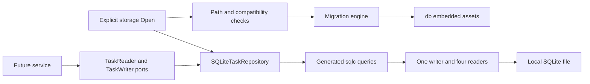
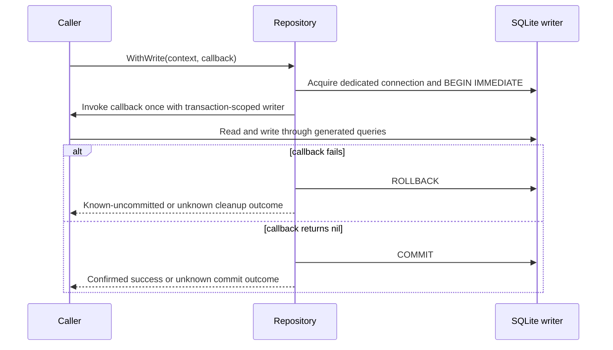
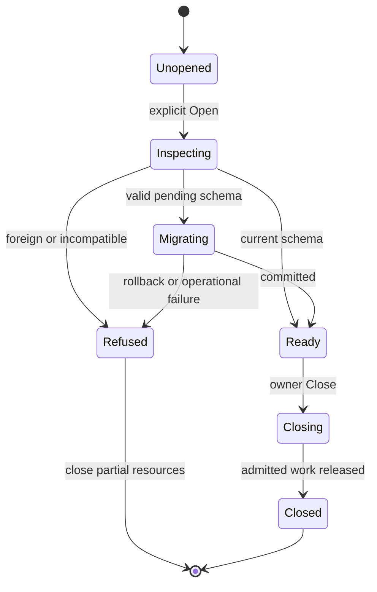

# Feature Plan 002: SQLite Storage and Repository

## Goal Capsule

**Objective:** A caller can save task changes, reopen Tusk, and read the same committed tasks and history without running a database service.

**Means:** Embedded SQLite and generated SQL behind transaction-scoped repository ports (KTD1, KTD4, KTD7).

**Authority:** Current user direction, [AGENTS.md](../../AGENTS.md), [MASTERPLAN.md](../../MASTERPLAN.md), live core contracts, then the [product plan](2026-09-06-001-feat-tusk-modern-task-system-plan.md). This is the Feature 002 execution entrypoint; the product plan remains an umbrella.

**Pack:** This plan, the [verification plan](../verification-plans/2026-09-06-002-feat-sqlite-storage-and-repository-verification-plan.md), and the [issue workorder](../workorders/2026-09-06-002-feat-sqlite-storage-and-repository-issues-workorder.md). Artifacts stay in this first-party repository under `docs/`.

**Execution direction:** Red-first TDD, sequential units, local verification through Make. U6 is the new prerequisite, followed by U1, U2, U3, U4, U5. Existing 002-1 through 002-5 identities are retained. An executor starts at the masterplan's active unit and advances only with its evidence and a separate validated unit commit.

**Stop conditions:** An incompatible dependency graph, failed compatibility probe, unrecognized database, or failed unit gate stops dependent implementation. Never choose an affected SQLite engine, weaken tests, or recreate user data to proceed. The subsequent ce-work request authorized implementation; publication remains outside scope.

---

## Product Contract

### Summary

Provide persistent task and metadata-only history storage for the future service. Supply complete reads and a single transaction boundary for graph changes. Keep CLI/TUI routing and business orchestration in their later phases.

### Problem Frame

The shipped domain objects currently live only in memory. The old storage outline did not define transaction ownership, identify application databases, or distinguish in-memory tests from disk WAL behavior. An implementer would have had to invent these contracts before safely storing user data.

Product Contract preservation: the original Feature 002 scope is retained and reconciled with product R1–R18, R27–R29. History, snapshot callbacks, strict decoding, and safe file lifecycle implement existing umbrella decisions. Go/tool choices are tracked in KTD1/KTD2. No service, CLI, or TUI implementation is added.

### Actors and flows

- A1. Service caller, acting for a developer or script: loads detached tasks and commits an authorized task/event change set. Carries product A1/A2 and F1/F2.
- A2. Maintainer: opens or upgrades a recognized database, receives bounded failure, and preserves recoverable data. Carries product A3/F4.
- F1. Open: resolve literal path → identify database → configure disk journal → migrate when needed → expose repository.
- F2. Read: acquire reader → begin snapshot → materialize and validate all requested rows → return detached values → release.
- F3. Write: acquire writer → begin IMMEDIATE → run caller reads/writes → commit once → return outcome.
- F4. Recover: retain files after failure → close poisoned resources → reopen and inspect before any retry.

### Requirements

#### Runtime and file lifecycle

- R1. The storage runtime must build without CGO on the five product targets, using the pinned dependency baseline in KTD1.
- R2. Path resolution and connector construction perform no database or directory I/O; only an explicit storage Open performs first access.
- R3. Resolve nonempty `TUSK_DB_PATH`, then absolute `XDG_DATA_HOME/tusk/tusk.db`, then home plus `.local/share/tusk/tusk.db`; invalid explicit paths fail without fallback.
- R4. Treat overrides as literal filesystem paths, reject database symlinks/non-regular targets, and create application-owned POSIX directories/files with 0700/0600 permissions.
- R5. Own one writer connection and at most four reader connections, with all resources closed on failed Open or explicit Close.

#### Identity, migration, and data

- R6. Open only an empty database or a recognized Tusk schema; refuse foreign, newer, gapped, or checksum-mismatched schemas before intentional persistent changes.
- R7. Apply all pending embedded migrations and their ledger entries in one write transaction; a failed migration preserves the previous logical schema and data.
- R8. Store the task row contract in KTD5, preserving opaque IDs, nullable optional fields, and valid open-parent progress of 100.
- R9. Validate rows on encoding and decoding; malformed stored data returns corruption without normalization, repair, or partial results.
- R10. Persist metadata-only events with task identity, sequence, kind, changed field names, and time; task deletion cascades to its events.

#### Repository and transaction behavior

- R11. Return detached task/event values and non-nil empty collections; a missing requested task returns `core.ErrTaskNotFound`.
- R12. Repository List matches the shipped core filter and default sort semantics; it applies no CLI-specific default exclusion of done tasks.
- R13. Supply immediate children, full subtree, and ancestor reads without rewriting stored parents; malformed graphs cannot hang recursive queries.
- R14. WithRead supplies one committed snapshot and WithWrite supplies one IMMEDIATE transaction for all callback reads, task writes, and event writes.
- R15. Transaction callbacks are non-nil, synchronous, and cannot nest or escape their lifetime; rejection or panic cannot leave an active transaction in a reusable connection.
- R16. Errors preserve domain/context matching and distinguish a known rollback from an unknown commit outcome; the repository never replays a callback.
- R17. Storage enforces row constraints and foreign keys; the service owns graph mutation rules, rollups, event selection, stale-edit checks, and recursive-delete authorization.

#### Verification and handoff

- R18. Generate all application CRUD/tree/history queries with the pinned sqlc tool and detect any stale or partially generated output without changing the checkout during the check.
- R19. Use unique in-memory fixtures for repository semantics and temporary disk files for WAL, locking, persistence, and recovery evidence.
- R20. Disk readers see committed snapshots during competing writes, and bounded lock/cancellation failures leave the repository recoverable.
- R21. Execute red-first scenarios and canonical full/race/coverage gates before closing each implementation unit; planning records no software pass result.
- R22. Hand Phase 3 a tested repository contract and operational notes; storage measurements and cross-compilation remain distinct from later CLI latency and native release acceptance.

### Scope boundaries

In scope: connection primitives, schema/ledger, generated queries, repository ports and implementation, path/open/close behavior, strict row codecs, retained events, isolated fixtures, dependency/tool pins, and the canonical verification targets needed for this feature.

Deferred to follow-up work: UUID creation, date expressions, status transitions, rollup/move orchestration, stale forms, statistics DTOs, CLI/TUI wiring, imports, user backup commands, hosted CI, native release acceptance, and publication. Their owners remain Features 003–006. Service transaction tests in Phase 3 must prove the business rules that storage alone cannot establish.

Outside this product's scope: external database services, network sync, account management, automatic data repair, event-sourced reconstruction, and down-migration of an installed database.

### Acceptance examples

- AE1. Covers R7/R14: a callback updates a child, updates an ancestor, and appends history; an event-write failure leaves all three changes absent after reopen.
- AE2. Covers R6: opening a newer Tusk schema returns incompatible-schema while its task/ledger contents and main/WAL bytes remain unchanged; transient shared-memory locking files are not part of that byte comparison.
- AE3. Covers R12: searching `Ä`, `%`, or `_` yields the same ordered IDs as core filtering over the equivalent fixture; SQL wildcard semantics cannot change the result.
- AE4. Covers R14/R20: a reader sees the old title twice in one snapshot while a writer commits a new title; a subsequent snapshot sees the new title.
- AE5. Covers R16: a failure after commit is attempted reports an unknown outcome; the caller must read back before retrying, and no internal replay adds duplicate events.

---

## Planning Contract

### Repository grounding

Inspected `main` at `21bb210` on 2026-09-08 with a clean worktree. `go.mod` declares Go 1.24.0 and no dependencies. The installed toolchain reports `go1.27.1-X:nodwarf5 linux/amd64`; this does not prove the minimum supported compiler works. There is no storage, ports, schema, service, CLI package, or TUI package yet. No CE config, `CLAUDE.md`, `STRATEGY.md`, or `docs/solutions/` exists.

Follow `internal/core/errors.go` for immutable sentinels, `task.go` for detached values and lifecycle constraints, `filter.go` for the exact query oracle, and `tree.go` for depth/cycle validation. The adapter must not call `NewTask` to decode stored rows because that constructor supplies defaults and may read the clock.

The current Makefile has no test filtering variables or generation targets. `make validate` includes fmt, vet, full tests, race, and at least 95% coverage for each nonexempt package. `internal/ports` and `sqlc` are existing coverage exemptions; handwritten storage and the new `db` package are not. Historical research's unlimited depth, lock-free WAL, shared anonymous memory URI, DATETIME schema, and source-built “sqlc v2” assumptions are superseded by this contract.

### Key technical decisions

- KTD1. **Pin the runtime graph.** Select Go 1.25.0 minimum, `modernc.org/sqlite v1.58.0`, and its required `modernc.org/libc v1.75.6`. The driver documents SQLite 3.53.4 on the five product targets, beyond the WAL-reset fix. This is the recommended technical planning default, not a claim of explicit user approval or completed compatibility tests. U6 proves the selected graph, exact engine, and minimum toolchain before schema implementation. Sources: [driver](https://pkg.go.dev/modernc.org/sqlite@v1.58.0), [module](https://proxy.golang.org/modernc.org/sqlite/@v/v1.58.0.mod), [libc module](https://proxy.golang.org/modernc.org/libc/@v/v1.75.6.mod), [WAL fix](https://www.sqlite.org/wal.html#walresetbug). Governs R1/R20/R21.
- KTD2. **Keep the generator outside the runtime module.** Use prebuilt sqlc v1.31.1 and config format `version: "2"`; commit generated Go. Its source module requires Go 1.26, so do not add a tool dependency to Tusk's Go 1.25 module. Verify the downloaded archive against the release asset digest in the tool table. Sources: [release](https://github.com/sqlc-dev/sqlc/releases/tag/v1.31.1), [generator module](https://proxy.golang.org/github.com/sqlc-dev/sqlc/@v/v1.31.1.mod). Governs R18.
- KTD3. **Separate open policy from connection mechanics.** A private connector factory builds writer/read-only reader configurations; `storage.Open` owns paths, compatibility, migration, and cleanup. Use `sqlite.NewConnector` with `sql.OpenDB`, without registering per-repository drivers or global hooks. Connector DSNs contain only encoded filenames and application-owned parameters. Governs R2–R5.
- KTD4. **Use driver-backed transactions.** Writer connections set `_txlock=immediate`; reader connections use deferred transactions and `query_only=ON`. The driver's read-only transaction flag controls begin mode but does not enforce write protection by itself. Use `database/sql` transaction ownership, never mix manual BEGIN with `sql.Tx`. Execution reconciliation for 002-ISS-021: cancellable writer acquisition uses a private connector wrapper with at most 25-ms SQLite busy waits and a five-second total acquisition budget. Retry only a failed driver BeginTx returning primary SQLITE_BUSY, before any callback or application statement; check context between attempts. Restore busy_timeout=5000 before exposing the transaction or returning the connection. Cleanup failure discards the physical connection. Never retry application statements, callbacks or commits. Sources: [transaction source](https://github.com/modernc-org/sqlite/blob/v1.58.0/tx.go), [connector source](https://github.com/modernc-org/sqlite/blob/v1.58.0/connector.go), [SQLite busy handler](https://www.sqlite.org/c3ref/busy_handler.html). Governs R14–R16/R20.
- KTD5. **Store explicit, canonical records.** Use STRICT tables and the schema/codec contract below. Store UTC dates as fixed-width TEXT rather than driver-interpreted DATETIME; use core parsing/validation without changing valid user content. Governs R8/R9/R17.
- KTD6. **Make migrations transactional and identifiable.** Use application ID `0x5455534B`, a SHA-256 ledger, and sequential embedded forward SQL. `db/embed.go` owns the compiler-populated, unexported read-only `embed.FS`; never export or reassign that asset binding. Runtime connections, clocks, maps, and callbacks remain instance-owned. Sources: [Go embed](https://pkg.go.dev/embed), [SQLite application ID](https://www.sqlite.org/pragma.html#pragma_application_id). Governs R6/R7.
- KTD7. **Keep ports small and transaction-scoped.** Readers expose materialized domain values; writers add CRUD and event append. No SQL handles, generated structs, open cursors, or concrete driver errors cross the port. Full operation semantics are in the boundary table. Governs R10–R17.
- KTD8. **Narrow in SQL, finish with core.** Bind enum/date/parent filters in generated SQL, then apply `core.FilterTasks` and `core.SortTasks`. Search and tag intersection use core until measured evidence justifies more SQL. This preserves Unicode/literal behavior and avoids a query-builder framework. Governs R12/R13/R18.
- KTD9. **Preserve files on failure.** Keep WAL and foreign keys for disk stores, busy timeout 5000 ms, synchronous NORMAL, and default automatic checkpoint behavior. NORMAL preserves consistency but does not promise the last acknowledged commit survives hardware power loss. No automatic checkpoint loop, VACUUM, down migration, or deletion repairs an open failure. Sources: [WAL](https://www.sqlite.org/wal.html), [synchronous](https://www.sqlite.org/pragma.html#pragma_synchronous). Governs R7/R16/R19/R20.
- KTD10. **Prove behavior at the owning boundary.** Use real SQLite for constraints, snapshots and process recovery; use a private test connector wrapper for begin/statement/commit/rollback/close failure injection. No global failure switches or runtime crash hooks. Benchmarks diagnose storage cost; later Feature 004 proves whole-process CLI latency. Governs R19–R22.

### Connection and filesystem lifecycle

Path resolution takes injected environment lookup, home lookup, and working directory inputs. Relative explicit paths resolve against the invocation directory; relative XDG values are ignored. An empty explicit variable behaves as unset. `:memory:` and `file:` in the user override are ordinary filename text, not testing modes or DSNs. Reject empty resolved paths, NUL, and invalid UTF-8; platform-invalid filenames fail as path errors. Do not expand `~` or environment text inside an override.

For a new target, create missing application directories, then create the file exclusively with the intended permissions. An existence race revalidates the existing target. Preserve existing parent permissions and existing regular-file permissions. On Windows use the user's private profile ACL and reject non-regular/reparse database targets; mode-bit tests are POSIX-only. Existing ancestor symlinks may resolve normally, including a symlinked home; the final database target cannot be a symlink. This is a single-user local-filesystem boundary, with no claim of protection against a malicious process running as the same OS user.

For an existing nonempty file, use a short-lived read-only compatibility connection before opening a writer. Check application ID, known tables and the full ledger. An unbranded database with user objects is foreign. An empty database with no user objects may be initialized. A branded database with absent or malformed ledger is corruption. Refuse a newer or changed applied migration before changing journal mode. SQLite may access existing WAL or create transient SHM while reading; refusal never writes task/schema/ledger data or changes journal mode.

After identification, open the writer with foreign keys ON, busy timeout 5000, synchronous NORMAL. Set and verify WAL outside a transaction for disk only. Under an IMMEDIATE transaction, recheck identity and ledger after acquiring the writer lock; then migrate if needed. A current database uses a compatibility read and does not acquire a migration write lock on every query. Only after success create the reader pool. Reader replacement connections repeat connection-scoped pragmas and enforce `query_only=ON`; they do not issue journal-mode changes.

Keep writer max-open/max-idle at 1 and reader max-open/max-idle at 4, with no periodic connection churn. A uniquely named in-memory test store uses private internal `mode=memory&cache=shared` URIs and keeps its writer alive until every reader closes. Read back memory journal mode as MEMORY, never assert WAL there. Disk mode never enables shared cache.

Open checks context before file work and between stages. Pool acquisition and queries honor context; the driver's native file-open call cannot be interrupted midway. Busy timeout bounds SQLite lock waits, not arbitrary OS I/O or a stuck caller callback. Commit/Rollback in this driver use a background context, so an earlier cancellation cannot be advertised as immediate commit cancellation. Close is idempotent, stops new admissions, waits for admitted callbacks to release, and closes readers and writer; calls after Close return closed-repository. An instance-owned admission guard lets existing callback handles finish while rejecting new repository operations. Calling owner Close inside a callback is prohibited because it would wait for itself.

### Schema and record codecs

All schema migrations are under `db/migrations/NNN_name.sql`, starting at 001 with contiguous numeric versions. They contain forward SQL only and no transaction-control, ATTACH, VACUUM, or journal-mode statements. Applied SQL bytes never change. U1 adds `.gitattributes` with LF checkout normalization for `db/migrations/*.sql`, so Windows checkout conversion cannot change embedded hashes. Tests may inject an `fs.FS` with additional fixture migrations. Disposable inverse scripts live under `internal/storage/testdata/migrations/`; they are not embedded or passed to sqlc.

| Table | Columns and constraints | Indexes / ownership |
| --- | --- | --- |
| `schema_migrations` | Positive integer version primary key, unique filename, 64-character lowercase SHA-256, non-null canonical applied-at time | Full ordered ledger checked against embedded inventory; no second version source |
| `tasks` | Non-null TEXT ID primary key; title and description non-null; status enum; priority 1–4; progress 0–100; nullable self-referencing parent; JSON-array tags; created/updated timestamps non-null; due/completed nullable | Status, priority, parent, due indexes; parent FK ON DELETE CASCADE; self-parent forbidden |
| `task_events` | INTEGER PRIMARY KEY AUTOINCREMENT sequence; non-null task FK; kind enum; JSON-array changed fields; non-null occurred-at | Task/sequence index; FK ON DELETE CASCADE; generated sequence is database-wide, gaps valid |

SQL CHECK constraints enforce nonempty ID, title length 1–255, valid enums/ranges, JSON array shape, and completion consistency: done requires progress 100 and a completion time; open requires null completion time. SQL permits open progress 100 because valid parents can have that rollup. JSON elements and text/time canonicalization receive the stricter codec validation below. Do not duplicate the service's cross-row progress rules in triggers.

Encode validates without repairing: canonical trimmed nonempty ID/parent/title; title at most 255 code points; valid UTF-8 and no NUL in all strings; known status/priority; normalized sorted unique tags; completion consistency; nonzero created/updated times. Nil tags encode as `[]`; description encodes as empty string when empty. Input times convert to UTC with years 0001–9999 and exactly nine fractional digits. Do not require timestamp ordering, since clocks can move backward. Update preserves the stored ID and creation time; an attempted creation-time change fails validation.

Decode requires exactly that canonical stored representation, including a parse-and-format timestamp round trip and canonical tag element values/order. Distinguish a nullable time from an empty string. Valid user text is returned unchanged. Decode never invokes domain mutations or defaults. Any invalid row aborts the entire read with corruption; no partially decoded slice is returned. An SQL CHECK success is not sufficient evidence that a row is semantically valid.

Event kinds are `create`, `metadata`, `status`, `move`, `progress`, `rollup`. Changed-field names are a sorted nonempty unique subset of `title`, `description`, `status`, `priority`, `parent_id`, `progress`, `tags`, `due_date`, `completed_at`. Store no previous text, values, snapshots, or delete tombstones. The service supplies which event applies and when; the repository validates and appends it, without automatic event generation or no-op inference. AUTOINCREMENT prevents reuse of a committed sequence after deletion; gaps and rolled-back allocations are not event counts.

Migration idempotency is enforced by the ledger: re-open runs no already-applied migration. Before any pending SQL, validate filenames, uniqueness, contiguity, hashes, and exact applied-prefix equality. Identity, ledger and catalog inspection share one read snapshot; recheck them in the write transaction. Compare catalog definitions against the applied canonical migration prefix evaluated in an isolated private memory database, avoiding a second handwritten schema definition. Unknown files, missing versions, edited bytes, or unknown database objects fail closed. Ledger creation, application ID, all pending DDL/data changes, and ledger inserts share the same transaction. Do not hide drift with unconditional `IF NOT EXISTS`. A migration fixture failing on its second statement or ledger insert must restore the prior logical database. On a newly created file, failure may leave an empty file/directories; it never deletes them automatically.

### Repository boundary

This table fixes inputs, outputs, ownership, and observable behavior. Exact Go declarations remain implementation work.

| Boundary / operation | Input | Result and contract |
| --- | --- | --- |
| `TaskRepository` reads | Context plus read operation below | A convenience read owns a short snapshot; callers needing related reads use WithRead |
| `WithRead` | Context and synchronous callback receiving callback context and `TaskReader` | One read-only transaction; callback error propagates; no write methods exposed |
| `WithWrite` | Context and synchronous callback receiving callback context and `TaskWriter` | One IMMEDIATE transaction; callback invoked once after lock acquisition; nil only after confirmed commit |
| `GetByID` | Full opaque task ID | One detached task; missing ID is `core.ErrTaskNotFound` |
| `List` | `core.TaskFilter` | Non-nil detached flat slice in default product order; empty filter includes done |
| `ListChildren` | Existing parent ID | Immediate children in default order; leaf returns empty; missing parent fails |
| `GetSubtree` | Existing task ID | Target plus all descendants as detached flat rows, target first then depth-first sibling order; stored parent values unchanged |
| `GetAncestors` | Existing task ID | Parent first through root, excluding target; root returns empty; missing target/ancestor fails |
| `ListEvents` | Existing task ID | Detached events in ascending sequence; existing task without events returns empty |
| `Create` / `Update` | Fully validated task value | Insert once or update existing row; duplicate ID maps to `core.ErrDuplicateTaskID`; missing update fails |
| `Delete` | Existing task ID and explicit recursive boolean | Sorted deleted task IDs; children with recursive false return children-present; true deletes subtree and events atomically |
| `AppendEvent` | Task ID, event kind, changed fields, operation time | Generated sequence; nonexistent task fails; callback rollback also removes event |

All operations accept context. A nil callback fails before acquisition. Callback context carries an instance-specific transaction marker: re-entering any repository method with that context returns nested-transaction instead of taking a second pool connection. The callback uses its provided reader/writer for every operation. A retained reader/writer is invalidated on callback exit; later use returns transaction-closed. Sharing a callback handle concurrently is unsupported and must be rejected with a per-handle guard instead of racing. Callback completion waits for any admitted handle operation before transaction cleanup. Passing a different/background context to evade the marker is contract misuse, not supported nesting detection.

The first failed operation on a write handle latches the transaction failure, including a failed read used by that mutation. Later operations on that handle return the latched failure. WithWrite rolls back even if the callback ignores the original error and returns nil. This prevents a failed event append from committing earlier task changes. Service code must not use a failed write-handle read as optional control flow; existence checks belong to a successful query result or a separate read operation.

Values collected inside a callback are provisional until the outer WithRead/WithWrite returns nil. The service must discard its collected response on an outer error and cannot publish a callback-produced ID as committed early.

For List, enum/date/parent SQL predicates are a candidate superset of core's final result. Bind JSON enum arrays to `json_each`; never interpolate values. RootOnly with ParentID returns empty, matching core. Invalid enum values never match, while valid alternatives in the same filter still can; date bounds remain exclusive. Apply search/tag intersection and sort in core. No pagination, implicit limit, CLI default status, or SQL LIKE search is introduced.

Recursive CTEs collect distinct IDs with UNION, not UNION ALL over an unbounded cycle. Materialize task rows and validate the returned graph plus the requested node's full ancestor chain in the same snapshot. GetSubtree may temporarily project a cloned target to root for core validation, but returned rows keep their original parent IDs and validate stored depth including ancestors. GetAncestors uses a visited set and the same depth ceiling. Missing links, cycles, and depth overflow return corruption wrapping the applicable core sentinel. List remains a flat filtered result and is never passed to BuildTree as a complete forest.

R17 is a trusted internal boundary: storage does not independently prevent every invalid multi-row business mutation. The future service must validate the graph under WithWrite before calling writes, including opposite concurrent moves. Storage reads detect corrupt traversals, and FK/CHECK constraints reject local violations. Delete's recursive boolean is a structural safeguard; user confirmation and stale membership comparison remain service responsibilities.

Delete obtains and validates the subtree before executing its delete query, so it can return exact IDs and refuse corrupt traversals. It is not an implicit corrupt-data repair command.

### Error and outcome contract

| Condition | Port-visible result | State / caller action |
| --- | --- | --- |
| Missing task / duplicate ID / bad task field | Matching core sentinel with operation context | No successful write for that statement; callback failure rolls back |
| Invalid record without an existing core sentinel | Immutable invalid-record port error | Reject supplied data; no repair |
| Missing parent FK | `core.ErrTaskNotFound` with parent context | Roll back callback |
| Busy / locked | Immutable busy port error | No callback replay; caller may retry a known-uncommitted operation later |
| Invalid stored row / graph / database | Corruption port error, plus applicable core sentinel | Preserve files and return no partial result |
| Newer/foreign/drifted schema | Incompatible-schema or corruption with bounded metadata context | Refuse open; no journal-mode/schema/data change |
| Context before commit attempt | `context.Canceled` or `context.DeadlineExceeded` | Roll back and return known-uncommitted only if rollback is confirmed |
| Callback panic | Roll back, invalidate handle, then re-panic original value | Do not convert programmer panic to success |
| Commit returns error or cleanup cannot establish rollback | Transaction error with `outcome=unknown` and sanitized cause category | Discard connection; preserve files; read back before retry |
| Commit succeeds, then context cancels | Success from WithWrite | Durable logical mutation acknowledged; later output/refresh cannot replay it |
| Closed / nested / concurrent handle use | Closed-repository / nested-transaction / transaction-in-use | Fail before issuing SQL |

Port error constants follow core's immutable value pattern. A transaction-outcome error is an immutable value carrying operation, cause category, and outcome; support `errors.Is` for the mapped domain/context cause. Do not expose a concrete SQLite error in its unwrap chain or include raw SQL/user note values in messages. Driver extended error codes are translated inside storage. Disk-full/I/O failures stay operational errors unless the commit boundary makes the outcome uncertain.

Reserve a dedicated physical connection for each callback so failed commit/rollback can be discarded rather than returned to the pool. The driver attempts rollback after commit errors, but that is not proof every error is uncommitted. Test-only connector wrappers observe calls and inject boundary failures. Discard through the supported database/sql bad-connection path, not by closing a borrowed driver handle behind the pool. Read transaction cleanup failure invalidates the connection and returns an error with no partial slice.

### High-level technical design

### Generator and build tooling

U2 adds `make setup-sqlc`, `make generate`, `make check-generated`, and `make test-scripts`. `make setup` remains an environment check; normal builds/tests use committed generated files and perform no tool download. Store sqlc at ignored `bin/tools/sqlc` (`.exe` on Windows). Only setup-sqlc downloads, to a temporary archive, validates digest and archive members, then installs the expected executable. Reject unsupported hosts, wrong version/digest, partial downloads, and path-traversal members. Do not execute archive scripts.

Pinned tar.gz release asset digests, read from the [GitHub release API](https://api.github.com/repos/sqlc-dev/sqlc/releases/tags/v1.31.1) on 2026-09-08:

| Host | SHA-256 |
| --- | --- |
| darwin amd64 | `c5af76772e3785d21663a62697056b383f07629979b1bd25b93872e73dbd519b` |
| darwin arm64 | `21602158c99eb1f2bae197a66abfb1941d1e9e50b23125bb193349c6b1acc71e` |
| linux amd64 | `497ae4fcdfa64c5b0c311ffe4c2bd991e43991e82e5367792ed78bc2dca27354` |
| linux arm64 | `b7cae247740d0c51a1e657479e5b2d21e6fef428f596682a01bc55bf4ab8a23d` |
| windows amd64 | `40d138ec18b1cc80d2be7305917fd4deceda4e0c32d78ba5d8faa4bfa3bc0fc0` |

Use sqlc's SQLite engine, `database/sql`, package `sqlc`, output `internal/storage/sqlc`, and non-nil empty slices. The schema input is `db/migrations`; queries input is `db/queries.sql`. No network plugins or cloud analyzer. Generate into a scratch copy of these inputs, then compare the full expected output set, including obsolete files. A failed generator or check leaves checked-in output untouched. A successful generate replaces only the owned generated directory. Check-generated must not rely on Git tracking so it works before first commit and in source archives. Source and generated code must agree after formatting.

U6 adds canonical `make test-compat` and `make build-storage`. The former runs the compatibility test and checks the Go minimum rejection fixture; the latter compiles the storage package with CGO disabled, first natively and then for linux amd64/arm64, darwin amd64/arm64, windows amd64. It is a build gate, not execution proof on those OSes. U5 adds `make bench-storage`, with fixture setup outside timed loops and reported allocations for get/list/subtree plus open-current versus first-create. Keep the existing CLI latency mandate for Feature 004.

### Alternatives and handoff risks

| Alternative | Decision and consequence |
| --- | --- |
| Independent CRUD calls from the service | Rejected: cannot atomically validate a graph, update ancestors, and append events |
| One pool for reads and writes | Rejected: a one-connection pool blocks readers behind a held callback; a larger pool loses the explicit writer bound |
| Custom migration framework or ORM | Rejected: a small forward ledger and generated SQL meet current scope |
| Source-build sqlc inside Tusk's module | Rejected: generator Go 1.26 requirement would raise the runtime graph minimum |
| In-memory tests as WAL evidence | Rejected: memory journal behavior differs; disk and process fixtures are required |

Phase 3 must adopt these callback contracts when it deepens its own outline. Do not edit its implementation ahead of Phase 2 acceptance. A future migration changes the embedded inventory and fixtures in its own reviewed change; a pre-upgrade backup must be a consistent offline database plus required WAL state, never a live main-file copy. Local evidence cannot claim native Windows/macOS behavior or hardware-power-loss durability.

---

## Implementation Units

### U6. Pin and prove the storage runtime (002-6)

**Goal:** Establish the build and transaction primitives every later storage unit needs.

**Requirements:** R1/R2/R5/R14/R16/R20/R21; KTD1/KTD3/KTD4/KTD10.

**Dependencies:** Completed Feature 001 and this reviewed planning pack. U6 is a newly split prerequisite, so the existing U1–U5 IDs do not move.

**Files:** `go.mod`, new `go.sum`, `scripts/setup.sh`, `scripts/test/test_scripts.sh`, `Makefile`, new `internal/storage/connection.go`, `internal/storage/compatibility_test.go`, `internal/storage/connection_test.go`. Own only compatibility/connection primitives; do not add schema or public file-opening policy here.

**Approach:** Introduce the private connector factory, pinned graph, and canonical compatibility/build targets. Update Go-minimum diagnostics and fake-toolchain fixtures. Keep runtime global settings untouched.

**Red-first tests:** `TestSQLiteCompatibility` first fails because the selected dependency/factory is absent. `TestSetupGoMinimum` rejects fake Go 1.24 and accepts 1.25/installed toolchain. These are planned failure reasons, not observed results.

**Test scenarios:**

1. Exact runtime engine is SQLite 3.53.4 and selected libc is 1.75.6; supported minimum toolchain compiles it.
2. Writer begins IMMEDIATE, reader is query-only/deferred, replacement connections retain pragmas, and context cancellation prevents work or interrupts a short-deadline lock wait before the full 5000-ms busy limit.
3. CGO-disabled builds cover the five targets while race tests use a supported CGO/compiler environment.

**Verification:** `make test-compat`, `make build-storage`, `make test`, `make race`, `make validate`; 002-V01–002-V08. Run the minimum-version proof with that compiler explicitly selected, not merely the newer installed compiler.

**Failure / recovery:** A failed engine, API, minimum-toolchain, or target probe blocks U1. Resolve the compatibility finding; never silently upgrade/downgrade the pin or claim a newer compiler proves the minimum.

**Required reviews:** Feasibility, API/transaction semantics, dependency/security, portability, test evidence.

### U1. Embedded schema and atomic migrations (002-1)

**Goal:** Initialize and advance only recognized databases without partial schema changes.

**Requirements:** R6–R10/R17/R19/R21; F1/F4, AE2; KTD5/KTD6/KTD9.

**Dependencies:** U6 proves the driver and supplies private connection primitives; no public opener or generated queries is needed to test migration mechanics.

**Files:** New `.gitattributes`, `db/embed.go`, `db/embed_test.go`, `db/migrations/001_initial_schema.sql`, `internal/storage/migrations.go`, `internal/storage/migrations_test.go`, `internal/storage/schema_test.go`, `internal/storage/migration_fault_test.go`, `internal/storage/migration_process_test.go`, and fixture migrations under `internal/storage/testdata/migrations/`.

**Approach:** Separate immutable inventory validation, compatibility inspection, and transaction application. Test against injected fixture filesystems and disposable real databases. Cover the `db` package with inventory/content tests instead of excluding it from coverage.

**Red-first tests:** `TestMigrate_FailurePreservesPreviousVersion` and `TestMigrate_RefusesForeignOrNewer` fail on the missing migrator, then target failure after the first DDL/data change and before ledger commit.

**Test scenarios:**

1. Empty database creates expected tables/indexes/ledger; reopen applies nothing and preserves rows.
2. Changed applied bytes, gaps, invalid names, newer version, foreign application ID, and unbranded user tables refuse migration.
3. Failed second migration, ledger insert, commit, or concurrent initializer leaves an atomic recognized state with all resources released.
4. Schema constraints reject invalid rows and cascade task/event deletion in fixtures; disposable inverse fixtures never enter the embedded inventory.

**Verification:** `make test`, `make race`, `make validate`; 002-V09–002-V20. Record logical pre/post schema, application ID, ledger, and fixture rows.

**Failure / recovery:** Preserve previous data and all files. Refusal uses read-only inspection before journal-mode changes; unknown outcomes require reopen/readback. No production down migration.

**Required reviews:** Data integrity, migration, adversarial failure handling, coherence, coverage.

### U2. Reproducible generated queries (002-2)

**Goal:** Compile and reproduce all repository SQL without exposing generated types to callers.

**Requirements:** R10–R13/R18/R21; AE3; KTD2/KTD7/KTD8.

**Dependencies:** U1 supplies canonical schema; U6 supplies test connections.

**Files:** New `db/queries.sql`, `sqlc.yaml`, `internal/storage/sqlc/`, `internal/storage/queries_test.go`, `scripts/sqlc.sh`, `scripts/test/test_sqlc.sh`; modify `Makefile`, `scripts/test/test_scripts.sh`, `scripts/coverage.sh` (correct Go output parsing while preserving existing exemptions), and `.gitignore` only if the local tool path is not already ignored.

**Approach:** Generate fixed CRUD, filtered candidate, children/subtree/ancestor, and event queries. Keep migration ledger and PRAGMA/transaction control in the migration/connection owner because those bootstrap operations precede generation. Add pinned setup/generation/check targets and negative script fixtures.

**Red-first tests:** `TestQueries_RoundTripAndTraversal` fails on missing generated methods. A deliberately stale output fixture fails check-generated; malformed SQL fails generation while preserving prior files.

**Test scenarios:**

1. CRUD, affected-row counts, parent joins, subtree/ancestor ID sets, and event ordering use the real schema.
2. Bound values containing SQL syntax or wildcard characters cannot alter query shape; candidate filtering never drops a core match.
3. Wrong executable version/digest, stale/extra/missing output, generation failure, and untracked generated files are detected.

**Verification:** `make setup-sqlc` when the tool is absent, `make generate`, `make check-generated`, `make test-scripts`, `make test`, `make validate`; 002-V21–002-V28. Normal verification does not download tooling implicitly.

**Failure / recovery:** Preserve previous generated output on failure; keep source SQL authoritative. No hand edits to generated files or new runtime dependency for tooling.

**Required reviews:** SQL correctness, injection boundary, reproducibility, maintainability, API contract.

### U3. Explicit Open, path policy, and resource lifecycle (002-3)

**Goal:** Expose storage only after safe path resolution, compatibility, and successful migration.

**Requirements:** R2–R7/R16/R19–R21; F1/F4, AE2; KTD3/KTD4/KTD6/KTD9.

**Dependencies:** U1 migration and U6 connection primitives. Execute after U2 to preserve the phase's established order.

**Files:** New `internal/storage/path.go`, `internal/storage/path_test.go`, `internal/storage/open.go`, `internal/storage/open_test.go`, `internal/storage/path_unix_test.go`, `internal/storage/path_windows_test.go`, `internal/storage/path_unix.go`, `internal/storage/path_windows.go`, `internal/storage/open_fault_test.go`, `internal/storage/memory_test.go`; adapt private connection/migration files only to integrate their decided contracts.

**Approach:** Implement the lifecycle specified above, with injected path inputs and a private constructor seam for connector failures. Keep public user configuration distinct from internal memory-fixture configuration. Do not wire `cmd/tusk` to storage in this phase.

**Red-first tests:** `TestOpen_PathPrecedenceAndLiteralFilename` and `TestOpen_ClosesPartialResources` fail on the missing opener, then expose fallback/DSN injection or leaked partial handles.

**Test scenarios:**

1. Environment precedence, relative explicit paths, relative-XDG fallback, spaces/Unicode/percent/query punctuation, invalid targets, and existing permissions.
2. Failure at directory creation, compatibility, WAL selection, migration, writer creation, or reader creation releases all handles and preserves files.
3. Zero-I/O resolver/connector construction, per-repository isolation, repeated Close, post-close calls, and memory-anchor lifetime.

**Verification:** `make test`, `make race`, `make validate`; 002-V29–002-V39. POSIX permission proof and native Windows path/reparse proof are distinct records.

**Failure / recovery:** Never choose another path or delete database/sidecars. Subsequent Open on a valid path works after any failure; canceled callers receive the documented boundary behavior.

**Required reviews:** Filesystem security/privacy, resource ownership, concurrency, portability, reliability.

### U4. Transaction-scoped repository and codecs (002-4)

**Goal:** Provide the complete storage port with atomic changes and detached, validated reads.

**Requirements:** R8–R17/R20/R21; F2/F3, AE1/AE3/AE4/AE5; KTD4/KTD5/KTD7/KTD8/KTD10.

**Dependencies:** U2 generated queries and U3 opened storage instance.

**Files:** New `internal/ports/task_repository.go`, `internal/ports/task_event.go`, `internal/ports/errors.go`, `internal/storage/sqlite_repository.go`, `internal/storage/codec.go`, `internal/storage/errors.go`, `internal/storage/transaction.go`, and corresponding `sqlite_repository_test.go`, `codec_test.go`, `errors_test.go`, `transaction_test.go`, `repository_contract_test.go`, `repository_fault_test.go` under `internal/storage/`.

**Approach:** Implement the boundary table using instance-owned dependencies and guarded transaction handles. Test codecs directly, then exercise generated queries through the real adapter. Keep business mutations in the future service; no service mocks are needed to claim adapter behavior.

**Red-first tests:** `TestRepository_RoundTripAndDetachedValues` and `TestWithWrite_ChildAndHistoryRollback` fail on absent ports/adapter. Malformed records and fault-injected commit/rollback paths then require distinct assertions.

**Test scenarios:**

1. All task/event fields round-trip, null and empty forms remain distinct, and caller mutation cannot alias future reads.
2. Core filtering/sorting matches on boundaries, Unicode, literal wildcard text, root/parent combinations, and invalid filters.
3. Tree reads include target/ancestors as specified, retain parent IDs, and reject corrupt loops/orphans/depth overflow without hanging.
4. Callback error/panic, escaped/nested/concurrent handles, reader write attempts, domain mappings, commit uncertainty, and cleanup failures preserve the stated outcome.
5. Recursive deletion removes exactly the chosen subtree/events; false recursion rejects children and leaves unrelated rows intact.

**Verification:** `make test`, `make race`, `make check-generated`, `make validate`; 002-V40–002-V58. Include the compile-time repository conformance assertion and tests of `errors.Is` behavior.

**Failure / recovery:** Return no partial reads and no success before commit. Discard uncertain/poisoned connections and preserve context/domain matching; never retry automatically.

**Required reviews:** API contract, correctness, data integrity, security/privacy, concurrency, simplicity, coverage.

### U5. Disk concurrency, recovery, and phase handoff (002-5)

**Goal:** Prove the integrated storage survives contention, process termination, and reopening.

**Requirements:** R1/R5–R7/R14–R16/R19–R22; F4, AE1/AE4/AE5; KTD9/KTD10.

**Dependencies:** U4 complete. Characterization tests that already pass are valid evidence, not a reason to change working production code without a new failing case.

**Files:** New `internal/storage/concurrency_test.go`, `internal/storage/recovery_test.go`, `internal/storage/storage_bench_test.go`, `internal/storage/inspection_cancellation_test.go`, test-only fixtures under `internal/storage/testdata/`, `docs/storage.md`; update `Makefile`, this feature triplet, and masterplan evidence. Production fixes remain limited to a reproduced failing storage contract.

**Approach:** Use barriers and bounded child-process handshakes around transaction boundaries. Give each fixture a unique database and close all handles before cleanup. Benchmark storage components with fixed data and record reference hardware; document next-phase obligations.

**Red-first tests:** `TestDiskReaders_SnapshotAcrossWriterCommit`, `TestDiskWriters_NoLostUpdate`, and `TestRecovery_KilledWriterAtomic` first characterize the integrated behavior. Any failure must be recorded before the corresponding fix.

**Test scenarios:**

1. Two independent repositories/processes contend on one disk database, serialize changes, and preserve readers' snapshots.
2. A held external writer times out or is canceled within the documented lock bound; a later write succeeds.
3. Kill before commit versus after acknowledged commit, reopen, compare task/event sets, and run integrity/foreign-key checks.
4. Validate resource cleanup, minimum/current compiler builds, generated consistency, coverage, and documented operations with isolated fixtures.

**Verification:** `make test`, `make race`, `make bench-storage`, `make build-storage`, `make check-generated`, `make test-scripts`, `make validate`; 002-V59–002-V68. Record storage benchmarks without claiming whole-CLI performance or native cross-platform execution.

**Failure / recovery:** Keep failed fixtures long enough to diagnose them in a private temporary location, redact user data, reap children, and retain an open workorder entry until the affected tests pass. No release publication occurs here.

**Required reviews:** Reliability, migration/data integrity, performance, deployment/operations, evidence integrity.

---

## Verification Contract

**Execution update, 2026-09-08:** All six units are locally accepted. See U5 acceptance and separate unit-commit evidence; native/hosted release gates remain pending.

The [verification plan](../verification-plans/2026-09-06-002-feat-sqlite-storage-and-repository-verification-plan.md) owns 002-V01–002-V68 fixtures, failure placement, and evidence tiers. The [workorder](../workorders/2026-09-06-002-feat-sqlite-storage-and-repository-issues-workorder.md) records planning corrections separately from runtime findings.

Existing canonical commands are `make setup`, `make test-unit`, `make test`, `make race`, `make coverage`, `make validate`, and `make build`. Test-unit may skip disk/process tests, but full/race must include them. Tests must assert that the intended cases ran. Existing targets accept no filtering variables; use the suite until a documented new target exists.

Planned additions: U6 owns `make test-compat` and `make build-storage`; U2 owns `make setup-sqlc`, `make generate`, `make check-generated`, `make test-scripts`; U5 owns `make bench-storage`. New script checks join `make validate` when implemented. Generation consistency is a separate explicit gate requiring the preinstalled pinned tool; it must not make ordinary tests download software.

Every unit needs observed red evidence before implementation changes, focused green proof, applicable negative/recovery scenarios, and `make validate`. Runtime coverage must remain at least 95% for handwritten nonexempt packages. Do not broaden exemptions to hide missing tests. No application tests, generator, build, or dependency installation run during this planning pass; the workorder records only documentation/source audits.

---

## Definition of Done

Feature 002 is complete when all six units and local scenarios have recorded execution evidence, the repository boundary matches this plan, generated output is reproducible, and the canonical gates pass on the actual candidate revision. Remove abandoned experimental code and fixtures containing user data. Close planning/runtime issues only with their required evidence and synchronize the triplet and masterplan.

Native Windows/macOS execution and release-target runtime acceptance remain explicit Phase 6 gates. Phase 2 supplies portable tests and CGO-disabled cross-build proof; Linux execution cannot check native evidence boxes. Feature 003 planning may begin only after Phase 2 local acceptance and a recorded handoff. CLI latency, full user workflows, hosted CI, and publication remain with their owning phases.

### U4 execution receipt — 2026-09-08

Base 4bbc639 plus uncommitted implementation. make validate check-generated passed; handwritten storage coverage 97.0%. Go 1.25 test-compat and five CGO-disabled storage/test builds passed. Repository round-trip, exact core filtering, tree corruption, deletion, history, snapshot, lifetime/concurrent-handle, cancellation, commit/rollback uncertainty and driver-fault tests cover 002-V40–002-V58. Observed regressions before fixes: public Open leaked OS paths; ListChildren unnecessarily decoded corrupt grandchildren; rollback cleanup failures lost the original context/domain cause. Sanitized categories, immediate-child reads and joined safe causes resolve those failures. Callback replay remains prohibited, provisional failed reads return no data, and the read handle exposes no writer interface. U4 is locally accepted; U5 is active. Native/hosted execution is not claimed.

### U4 commit reconstruction — 2026-09-08

The original red-first work was accumulated without per-unit commits. At the user's correction, this unit was reconstructed in an isolated worktree and make validate was rerun on its exact code contents before committing. The original chronological test receipts above remain historical evidence. Unit completion now includes a separate local commit before advancing; pushing and merging are outside this authorization.

### U5 acceptance receipt — 2026-09-08

All applicable Feature 002 local scenarios are accepted: 67/68 checked, with only native Windows 002-V33 deferred to Phase 6. Current Go 1.27.1-X:nodwarf5 make validate check-generated build passed after the review fixes (storage coverage 97.6%, db/cmd 100%, core 98.2%; existing ports/sqlc exemptions unchanged). Explicit Go 1.25 previously passed the full gate; after the final mapper changes it again passed test-compat, all five CGO-disabled storage/test builds, check-generated and focused migration/inspection race tests. make setup and the final Btrfs make bench-storage run passed. No hosted or native macOS/Windows runtime result is claimed.

Two helper processes preserve all 40 read-modify-write increments and 40 events; a reader retains its snapshot across another process's commit. External writer cancellation returns in 102.5 ms (105.3 ms under race), while the uncanceled wait returns busy in 5.01 s; later writes succeed. Killing and reaping a writer before commit preserves the old task/event set; killing after acknowledgment preserves exactly one committed set. Independent reopen checks integrity and foreign keys. Held-reader WAL growth is followed by automatic restart sequence 0 -> 5 with bounded file reuse, without explicit checkpoint SQL. Normally closed offline backup reopens without modifying its source.

Observed red-first U5 fixes restore the default Make target, preserve migration statement/ledger/commit/rollback cancellation causes, preserve inspection cancellation, and retain unknown migration outcomes alongside schema categories. The completed ce-code-review receipt reported two actionable findings; both were reproduced and fixed, with no unapplied actionable residual. Review passes ran sequentially in the parent context per repository tool mapping; both independent peer routes failed before producing a review, so independent corroboration is unavailable. ce-simplify-code found no warranted behavior-preserving edit.

[Durable evidence, commit sequence and review resolution](../verification-evidence/002/README.md), [raw benchmarks](../verification-evidence/002/storage-benchmarks.txt), [code fingerprint and gate receipt](../verification-evidence/002/acceptance.json), and [operations/service handoff](../storage.md) retain the evidence. The separate U5 commit closes Phase 2; the next active target is Phase 3 planning, not Feature 003 implementation. No push, PR, merge or release is authorized by this acceptance.

### Post-acceptance publication follow-up — 2026-09-08

The user authorized simplify, review to zero actionable findings, compound, then commit/push/PR. MASTERPLAN target 2.4 tracks this follow-up; the six validated implementation commits remain separate. Simplification found no worthwhile behavior-preserving changes. Fresh review reports zero actionable findings; make validate check-generated build passes with 97.6% storage coverage. Both external review routes failed before producing usable review evidence; nine local passes ran sequentially in the parent context. See ../verification-evidence/002/publication-review.json. The reusable transaction-outcome/redaction lesson is captured in ../solutions/database-issues/preserve-transaction-outcomes-through-error-redaction.md with parser, link and source grounding checks. The branch is published as [PR #2](https://github.com/newbpydev/tusk/pull/2) against main; merge remains user-owned. Hosted checks and feedback are handled by the PR monitor, separately from local acceptance. Feature 003 implementation remains out of scope; V33 native Windows remains a Phase 6 obligation.

### PR #2 callback-cause follow-up — 2026-09-08

Hosted review identified incomplete safe-sentinel coverage when callback failure and rollback failure coincide. Target 2.5 reproduced six omissions and now preserves all declared safe core/port categories without exposing original private error text. All 28 cause cases pass, along with make validate check-generated build and the minimum-Go focused race test. See ../verification-evidence/002/callback-cause-followup.json for the updated code manifest; earlier acceptance and review artifacts remain historical snapshots.

### PR #2 review unit 2.6: Preserve joined categories and complete statement fault coverage

Red: all six hierarchy/corruption pairs lost ErrCorrupt during failed rollback. Green: preserve every recognized safe sentinel, retain unknown outcome, redact private wrapper text. Real SQLite constraint codes 1555/2067/787 and CreateTask statement failure now have explicit tests. Focused regression and make validate check-generated pass. Earlier acceptance manifests remain historical snapshots. See ../verification-evidence/002/hosted-review-followups.json. Each unit passes make validate and is committed before the next begins.

### PR #2 review unit 2.7: Retry extended busy results before transaction admission

Red: a real SQLite WAL snapshot conflict (517) injected at BeginTx aborted acquisition after one attempt. Green: primary-code masking admits the second attempt within the existing budget. No callback, statement or commit retry added. Focused regression and make validate check-generated pass; storage coverage remains 97.6%. Earlier acceptance manifests remain historical snapshots. See ../verification-evidence/002/hosted-review-followups.json. Each unit passes make validate and is committed before the next begins.

### PR #2 review unit 2.8: Harden and document repository ports

Red: formatting NewTransactionError with nil cause panicked. Green: nil and zero-value errors match ErrStorage and preserve unknown outcome without Unwrap. Port tests pass; callback contexts, metadata fields, ordered unpaginated events, recursive deletion and conservative migration authoring contracts are documented. make validate check-generated passes. Earlier acceptance manifests remain historical snapshots. See ../verification-evidence/002/hosted-review-followups.json. Each unit passes make validate and is committed before the next begins.

### PR #2 review unit 2.9: Validate newly created database handles

Red: injected creation returning an actual device handle bypassed the regular-file check. Green: stat and close created handles before the shared regular/reparse validation, reject devices and prove rejection closes the handle. The per-call file creator seam is private and carries no mutable global state. Focused regression and make validate check-generated pass. Native Windows V33 remains deferred; injection is not native proof. Earlier acceptance manifests remain historical snapshots. See ../verification-evidence/002/hosted-review-followups.json. Each unit passes make validate and is committed before the next begins.

### PR #2 review unit 2.10: Generate typed nullable candidate parameters

Red: compile-time NullString assignments rejected all three generated interface{} parameters. Green: explicit nullable TEXT casts let pinned sqlc generate concrete sql.NullString fields; callers bind typed values, fixtures normalize timestamps to UTC. Candidate/core parity and zero-value null semantics pass; make generate and make validate check-generated pass. Earlier acceptance manifests remain historical snapshots. See ../verification-evidence/002/hosted-review-followups.json. Each unit passes make validate and is committed before the next begins.

### PR #2 review unit 2.11: Make sqlc tooling directly executable with explicit prerequisites

Red: direct entrypoints lacked executable bits; missing curl produced only command-not-found. Green: both scripts are executable, setup/generate/check diagnose their curl/gofmt/diff requirements before work, and restricted-PATH fixtures cover each missing tool. Focused script tests and make validate check-generated build pass. Earlier acceptance manifests remain historical snapshots. See ../verification-evidence/002/hosted-review-followups.json. Each unit passes make validate and is committed before the next begins.

### PR #2 review unit 2.12: Review hosted fixes and compound joined-error lessons

Reviewed the six remediation commits against correctness, standards, tests, maintainability, security, performance, API, data integrity, reliability and compound-failure scenarios. No additional actionable finding. Seventeen of 23 hosted comments have fixes; six retain documented boundaries with evidence. Replies await publication. Updated the compounded lesson for joined safe categories; frontmatter and source/link checks pass. Current make validate check-generated build, explicit minimum-Go compatibility, five target builds and minimum-Go focused race regressions pass. Earlier acceptance manifests remain historical snapshots. See ../verification-evidence/002/hosted-review-followups.json. Each unit passes make validate and is committed before the next begins.
