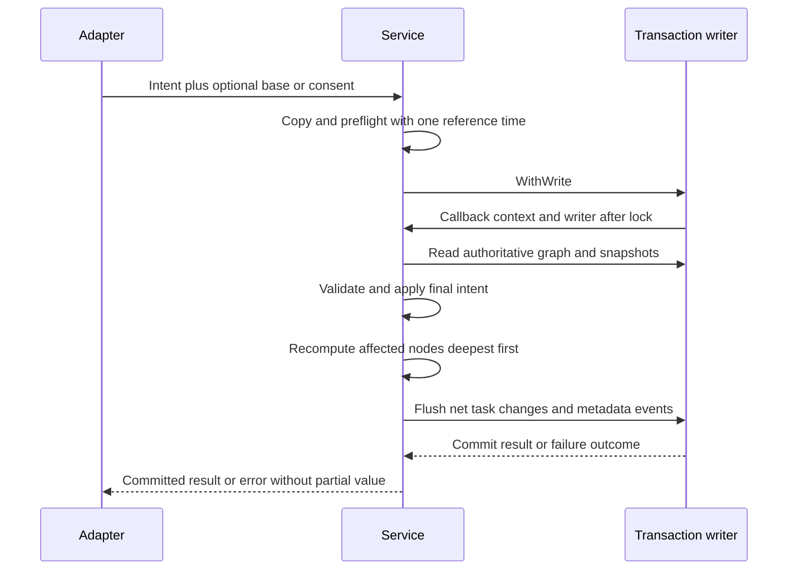

# Task Service Engine - Plan

## Goal Capsule

Provide synchronous, context-aware task operations that CLI, TUI, and automation adapters can share. Each mutation validates the current graph, updates affected tasks and metadata history, and returns a result only after the repository confirms commit.

- **Authority:** [MASTERPLAN.md](../../MASTERPLAN.md) controls activation; [AGENTS.md](../../AGENTS.md) controls engineering. This is the Phase 3 execution contract, subordinate to the [product contract](2026-09-06-001-feat-tusk-modern-task-system-plan.md).
- **Planning pack:** This plan, the [verification plan](../verification-plans/2026-09-06-003-feat-task-service-engine-verification-plan.md), and the [issue workorder](../workorders/2026-09-06-003-feat-task-service-engine-issues-workorder.md). Artifacts belong under `docs/` in this first-party repository.
- **Surfaces:** Internal service/API, library, transactional persistence, concurrency, calendar/identity portability, and documentation. CLI/TUI are consumers; their UI, flags, serialization and process behavior remain later phases.
- **Prerequisite:** Feature 002 is locally accepted according to the masterplan and its [durable evidence](../verification-evidence/002/README.md). Native/hosted release evidence remains a Phase 6 obligation.
- **Execution order:** U1 → U2 → U3 → U6 → U7 → U4 → U5. New U6/U7 split the original broad orchestrator unit; original U1–U5 identifiers retain their responsibilities.
- **Evidence boundary:** Readiness describes the contract. The 2026-09-09 lfg invocation authorizes execution through an open PR. Unit acceptance and remaining scenarios are recorded in the [execution evidence](../verification-evidence/003/README.md), verification plan and masterplan; no later phase or merge is authorized.

---

## Product Contract

### Summary and problem frame

Storage can persist valid rows and transaction groups, but does not decide legal task transitions, stale-edit conflicts, hierarchy moves or rollup results. The original service outline lacks the command shapes and failure semantics needed to make those operations consistent across adapters.

Product Contract unchanged. This feature instantiates product R3–R10, R13–R20, R22 and R29, with service-side contributions to R1, R23, R25, R27 and R28. Product actors A1/A2 use the same port; A3 needs deterministic failure/recovery evidence. Product F1/F2 are implemented here; F3 receives read models and conflict semantics, while F4 remains storage/release ownership. Product requirements below are referred to as `product Rn`; unqualified R-IDs are feature-local.

### Requirements

**Boundary and determinism**

- R1. Keep service orchestration independent of SQL, CLI and TUI, with constructor-injected repository, clock, ID source, location and completion policy.
- R2. Define complete create, patch, complete, reopen, delete-preview/delete, get/list/tree, statistics and history contracts with detached results.
- R3. Validate and normalize supplied input before repository admission where possible; preserve omitted/set/clear intent and reject conflicting patch directives.
- R4. Generate lowercase UUIDv7 from one operation timestamp and injected entropy; reject invalid clock, entropy and collision failures without fallback or retry.
- R5. Parse the product's bounded date grammar with explicit local zone, calendar arithmetic, strict range checking and UTC results.
- R6. Preserve cancellation causes and unknown transaction outcomes, returning no partial result or automatic write replay.

**Mutations and integrity**

- R7. Create default todo/medium/0 tasks and append creation history in the same transaction as ancestor changes.
- R8. Apply a patch to the latest stored task, optionally enforce a base snapshot, and preserve timestamps/history for an effective no-op.
- R9. Validate existence, cycle freedom and final subtree depth under the writer lock before any hierarchy mutation.
- R10. Recompute affected ancestors deepest first, including both move chains, and reset an open parent losing its final child to 0.
- R11. Complete the target subtree atomically and preserve timestamps/events of already-satisfied tasks.
- R12. Reopen leaves to manual 0 and parents to recomputed progress while preserving descendants; reopen done ancestors when an open descendant is introduced.
- R13. Apply opt-in automatic parent completion only to a nonempty set of direct children all in status done; explicit reopen suppresses it for that target in the operation.
- R14. Reject manual progress on a parent and reject combining manual progress with status or parent intent in one patch.
- R15. Recheck delete consent against exact subtree membership and target metadata; force bypasses consent but never implies recursion.
- R16. Append deterministic metadata-only events for net changes, with no event for no-op and no retained events for deleted tasks.

**Queries and proof**

- R17. Match core filter/sort semantics, with default open statuses, explicit all/status selection and a separate half-open local-day filter.
- R18. Return complete forests or selected subtrees with display depth rebased to 1 while retaining stored parent IDs.
- R19. Compute retained-task statistics and metadata history from committed snapshots without silent omissions or fabricated history.
- R20. Prove service atomicity, stale-write protection and no lost rollups using real disk WAL fixtures as well as deterministic transaction doubles.
- R21. Preserve the Go 1.25 and five-target CGO-free contract, document service resource/recovery ownership, and measure representative service workloads without claiming CLI latency acceptance.
- R22. Keep red-first evidence, at least 95% coverage for service packages, canonical Makefile gates, and synchronized per-unit acceptance records.

### Scope boundaries

In scope: subtree-wide completion/deletion as the outline's atomic bulk operations; no arbitrary multi-ID batch endpoint. The product grammar offers no general batch command. Queries include get/details, delete preview, forest, stats and history to close existing product flows.

Outside scope: network services, accounts, recurrence, reminders, plugin frameworks, undo/tombstones, event sourcing, background workers, general date NLP, prefix IDs, pagination, user-selectable sort orders and new schema/index migrations.

Deferred to Follow-Up Work: Feature 004 owns CLI grammar, JSON/exit mapping, environment/flag policy parsing and production timezone-data embedding; Feature 005 owns forms, refresh generations, terminal accessibility and policy consumption; Feature 006 owns native/hosted release proof. No UI acceptance is inferred from service tests.

### Acceptance examples

- AE1. Complete two siblings under a three-level hierarchy concurrently. Both completions persist, every ancestor has the final calculated progress, and history has one event set per actual mutation. Covers product F2; R10, R11, R16, R20.
- AE2. A parent has two done children. Explicitly reopen the parent with auto-completion enabled. It remains open at 100, its children remain done, and a repeated identical reopen is a no-op. Covers R8, R12, R13.
- AE3. A form's base notes differ from the latest notes. Submitting the patch returns conflict and changes neither tasks nor history; a CLI patch without a base applies supplied fields to the current row. Covers R8.
- AE4. Preview deletion, then add a descendant through a second repository. Confirmed non-forced deletion fails with conflict; forced nonrecursive deletion still fails with children-present. Covers R15, R20.
- AE5. In New York, `tomorrow` across spring DST means the following civil day's end; a due-day query includes its start and excludes the next day's start. Covers R5, R17.

---

## Planning Contract

### Live baseline and reconciled assumptions

Rechecked for lfg execution 2026-09-09: clean `main` at `f2fd0e35f16edb78ef5e57c0f4a68ffa7a1b9fa0`. `go.mod` selects Go 1.25.0, modernc SQLite v1.58.0 and libc v1.75.6. `internal/core`, `internal/ports` and `internal/storage` exist; `internal/service` and the inbound port do not. No new dependency is needed for this feature. The lfg invocation authorizes this plan's implementation, per-unit commits and publication through an open PR; merge remains outside this run.

The original outline's readiness label was unsupported. Its seven-method sketch is superseded by the operation table below; in particular deletion uses structured consent/result types and tree returns a forest-shaped slice. Its suggestion to update parent status on any rollup is replaced by product R8/R9. Mock-only acceptance is replaced by disk integration. [Storage operations](../storage.md) and the [transaction-error learning](../solutions/database-issues/preserve-transaction-outcomes-through-error-redaction.md) govern the handoff.

### Key technical decisions

- KTD1. **One injected service.** `service.NewTaskService` takes a `ports.TaskRepository` plus `service.Options` and returns a concrete service or error. Options contain `Clock` (returns time), `NewID` (takes that time, returns ID/error), non-nil `Location`, and `AutoCompleteParent` (zero value false). Repository/clock/ID function/location are required. Construction performs no I/O or dependency calls. The composition root owns closing storage; service has no Close method, cache or goroutines. Custom injected functions must support concurrent callers; tests provide concurrency-safe doubles. Typed-nil dependencies are a caller programming error, not a reflection-based discovery feature.
- KTD2. **Typed commands, small vocabulary.** Put inbound interface/read models/commands and immutable service sentinels in `internal/ports/task_service.go` and `service_errors.go`. Use ordinary pointers for optional scalar patch fields plus explicit clear booleans for nullable due/parent. No generic command bus, patch framework, mutable sentinel or ORM. Internal DTOs need no JSON tags; Feature 004 owns wire DTOs.
- KTD3. **Current data under one writer.** Preflight copies/normalizes commands; then every graph/base/consent read, change, event and rollup uses the provided writer and callback context. Never call repository convenience reads or nest callbacks inside a callback. Read calls use one WithRead. CPU loops check context per task and before flushing. Hold no service-level lock across repository I/O.
- KTD4. **One time; no replay.** Capture one nonzero reference time per mutation or time-dependent query before admission, strip monotonic data, and normalize UTC. Stored times must have UTC year 1–9999; create additionally requires representable UUID time. A successful commit remains success even if context is canceled afterward. No post-commit refresh inside a mutation. Any callback/commit/cleanup error discards staged results. Unknown outcome requires caller-owned fresh-repository readback, never a second callback.
- KTD5. **Deterministic dates and UUIDs.** Implement the exact grammar below using the standard library. Generate UUIDv7 with supplied time and a supplied `io.Reader` entropy source; production wiring later supplies cryptographic randomness. No dependency on the indirect UUID package or a global monotonic counter. IDs expose millisecond creation time and are identifiers, not secrets.
- KTD6. **Operation-local change set.** Cache detached original/current tasks and child memberships only inside one callback. Gather affected subtree/ancestor chains through transaction handles, apply final intent, then process their union deepest first with ID ascending ties. Shared ancestors are processed once after both move branches; recompute final depths after a move. Persist only net-different rows and their events. This is bounded operation state, not a persistent repository mirror.
- KTD7. **No-op uses value equality.** Compare canonical fields and instants, not pointers or time struct identity. Nil/empty tags compare as the same canonical empty set. Ignore a setter's timestamp-only changes; preserve original UpdatedAt unless a substantive field changed. Base/consent validation happens even for a no-op. Unrelated branches and metadata-only edits do not trigger graph-wide reconciliation.
- KTD8. **Errors survive failed cleanup.** Ordinary callback errors pass through on successful rollback; failed rollback sanitizes them through `storageCause`. Add the new port categories to that existing allowlist and test individual/joined causes with private wrapper text. Preserve `errors.As` to `ports.TransactionError` and `errors.Is` to every applicable cause. Do not unwrap or expose driver/entropy errors. This small storage-boundary extension belongs to U1; no repository API/schema change is required.
- KTD9. **Snapshot queries, no premature SQL.** Reuse repository List and core sorting. The service applies due-day membership after candidate filtering instead of translating an inclusive start into exclusive core bounds. Tree gets complete graph context, never a filtered forest. Service metrics are in-memory reductions over one snapshot. Record baseline cost before considering a new index or query API.
- KTD10. **Evidence before advancement.** Every future unit starts with a named failing test and ends with `make validate`, synchronized triplet/master records and one coherent local commit before the next unit once implementation/commit work is authorized. Do not accumulate units into a single commit. Planning performs documentation inspection/audit only.

### Operation and data contracts

All operations take context first. Errors have nil pointer/slice results or a zero value result with `Deleted=false`. Successful collections are non-nil. Returned task pointer/slice fields and event fields are detached from input and future results.

| Operation | Input after context | Success result and behavior |
| --- | --- | --- |
| CreateTask | `CreateTaskCommand` | Pointer to committed `core.Task` |
| UpdateTask | `UpdateTaskCommand` | Pointer to final selected task after all rollups |
| CompleteTask | `TaskCommand` with ID and optional Base | Pointer to selected task after subtree completion |
| ReopenTask | `ReopenTaskCommand` with ID, Status and optional Base | Pointer to selected task; Status accepts todo/in-progress only |
| PreviewDeleteTask | ID | `DeletePreview` containing detached Target and sorted exact subtree IDs |
| DeleteTask | `DeleteTaskCommand` | `DeleteResult` containing ID, sorted DeletedIDs, DeletedCount and Deleted=true |
| GetTask | ID | Pointer to current task for details/base capture |
| ListTasks | `TaskQuery` | Flat task slice in default order |
| GetTaskTree | root ID; empty string selects forest | Slice of task-node pointers; nonempty ID returns exactly one root |
| GetStats | no query | `TaskStats` with Total, ByStatus, Done, CompletionPercent, Overdue, CompletedLast7Days |
| GetTaskHistory | ID | All `ports.TaskEvent` values in ascending persisted sequence |

| Type | Fields and rules |
| --- | --- |
| CreateTaskCommand | Title/Description strings, Priority core.Priority (0 defaults medium), Tags string slice, ParentID optional string, Due optional expression string. No caller ID/status/progress/timestamp overrides. |
| UpdateTaskCommand | ID; Title/Description pointers; Priority/Status/Progress typed pointers; Tags pointer to string slice; Due and ParentID string pointers with ClearDue/ClearParent booleans; optional Base pointer to core.Task. Nil means omitted. Present empty Description clears notes; present empty Tags clears tags. Empty Due/ParentID is invalid, not clear. |
| TaskCommand | ID and optional Base pointer to core.Task. No hidden toggling operation; adapters choose complete/reopen explicitly. |
| ReopenTaskCommand | ID, requested Status (todo/in-progress), optional Base. A zero status is invalid; adapters choose the intended status. |
| DeleteTaskCommand | ID, Recursive, Force, optional Expected pointer to DeletePreview. Non-forced execution requires Expected even for a leaf. Force+Expected is invalid syntax to keep consent mode unambiguous. |
| DeletePreview | Target core.Task and sorted unique IDs including target. Preview includes all descendants regardless of whether an adapter later requests recursion. It is a local snapshot, not an authorization token. |
| TaskQuery | Filter core.TaskFilter, All bool, Due optional expression string. No custom sort field. Empty Statuses with All=false expands to todo/in-progress/blocked; nonempty Statuses+All is invalid. Due intersects other valid filters. |
| TaskStats | Integer counters; ByStatus map contains all four status keys even when zero. The caller owns its detached map. |

Input precedence: check canceled context; command shape; ID/text/enums/tags/progress; reference time/date; ID generation for create; repository admission; target existence; Base/Expected conflict; recursion/hierarchy/state-dependent validation; mutation. Tests requiring a specific error isolate that failing rule. No external clock/ID/transaction call is required for syntactically invalid input.

Trim IDs, titles, tag elements and date expressions at the inbound boundary. Stored IDs remain opaque full IDs; a supplied non-UUID ID may address an existing core/storage task. Preserve Description bytes exactly after rejecting invalid UTF-8/NUL. Reject invalid UTF-8/NUL in all supplied text, including search and snapshots. Use core domain errors for title/ID/status/priority/tag/progress/cycle/depth validation. Create priority 0 defaults; patch priority 0 fails. Tags use core normalization, not comma splitting (adapter ownership). Compare canonical tags after normalization.

Set+clear for the same field, manual-progress plus any status/parent directive, All+Statuses, RootOnly+ParentID, Force+Expected, and malformed snapshot shape return `ports.ErrInvalidCommand`. Empty service patches are allowed read/no-ops for compatibility with product TUSK-V21; the CLI later rejects empty edits as syntax. Out-of-range numeric values use domain errors, not syntax errors. Conflicting date bounds with DueAfter >= DueBefore yield an empty list by core semantics, not an error. Validate all enum/filter inputs rather than relying on silent core nonmatches.

New immutable `ports.Error` categories: `ErrInvalidCommand` (service: invalid command), `ErrInvalidText` (service: invalid text), `ErrInvalidDate` (service: invalid date), `ErrInvalidReferenceTime` (service: invalid reference time), `ErrIdentityGeneration` (service: identity generation failed), `ErrConflict` (service: task changed), `ErrConfirmationRequired` (service: delete confirmation required), `ErrInvalidServiceOptions` (service: invalid options). These strings contain no input. Preflight errors use these categories or existing domain sentinels; safe contextual wrappers name operation/field only. Failed entropy maps to ErrIdentityGeneration without leaking the reader error. Duplicate insertion remains core.ErrDuplicateTaskID. A generated ID already present in the operation-local cache is also a duplicate, never an update candidate.

### Base and delete consent equality

Base is optional on patch/complete/reopen. If present, require canonical ID matching the command and compare CreatedAt (incarnation), Title, Description, Priority, Status, ParentID, Tags and DueDate against the current row. Compare Progress only when the authoritative target is a leaf; parent progress is derived, not a form-editable field. UpdatedAt and CompletedAt are excluded. A field changed then restored to equal values is accepted; this is value-based conflict detection, not revision tracking. Compare every listed editable field, not only the patch's fields. Related-task changes alone do not conflict unless they change the target's compared values. Delete/complete missing targets return not-found; no idempotent missing-task success.

Expected deletion compares target ID/CreatedAt and the same editable metadata, with Progress included for leaves, plus exact sorted subtree IDs. Validate the preview is canonical (IDs sorted, unique, target included); malformed preview is ErrInvalidCommand. Metadata/member differences return ErrConflict before deletion. Prompting, target labels/count display and default-No are adapters' responsibility. Neither preview nor equality grants access against an adversarial same-user caller. Force skips only equality/confirmation; target existence and Recursive remain mandatory.

### Calendar and identity contract

`dateparse.ParseDue` accepts expression, reference time and location and returns one UTC time/error. `dateparse.DayBounds` accepts the same inputs and returns UTC start/end-exclusive instants/error. Both are pure and never consult time.Local, environment, filesystem or time.Now. Empty input fails; optional absence is handled by commands. Trim exterior whitespace and case-fold word/unit tokens; ISO syntax retains uppercase T/Z.

| Input | Decision |
| --- | --- |
| today / tomorrow | Reference local date or next civil date, due at 23:59:59.999999999 local |
| tonight | 20:00 on reference local date, even if already past |
| mon/tue/wed/thu/fri/sat/sun | Next matching weekday including reference date, due at end of day |
| +Nd / +Nw | Positive base-10 integer, calendar days or seven times as many days, due at end of destination day; leading zero digits accepted, zero/negative/fraction rejected |
| +Nm | Positive calendar months from reference date, clamping day to destination month's final day; due at end of day |
| YYYY-MM-DD | Exactly four-digit year and two-digit month/day, valid Gregorian date, due at local end of day |
| RFC3339 with offset | Exact supplied instant; permit 0–9 fractional decimal digits, Z or ±HH:MM, seconds 00–59 and offset hour 00–23/minute 00–59. Reject comma fractions, yearless input, absent offset, lowercase t/z, trailing text and precision loss. |

Check arithmetic before multiplication/conversion and final UTC year 1–9999; never represent a multi-year calendar offset as time.Duration. DayBounds resolves the parsed instant's local civil date, so an offset timestamp near midnight may select a different local day. Preserve [core exclusive date filters](../../internal/core/filter.go); day matching is separately start <= DueDate < end. Returned bounds and due instants must be representable; failure returns no partial bounds.

DST decisions: normal 23/25-hour days retain their civil boundaries. A nonexistent requested wall time or midnight boundary is rejected with ErrInvalidDate; never silently normalize into a different day/time. Repeated wall times resolve to the earlier instant. Implement wall-time resolution by considering the offsets on each side of the enclosing/adjacent `time.ZoneBounds` transitions and round-tripping candidate instants; deduplicate candidates, choose the earliest exact match, and reject no-match. A skipped whole date fails. This conservative rule also applies to a missing next-day midnight, and is documented for historical midnight-transition zones. RFC3339 offsets denote instants and do not undergo wall-time ambiguity resolution. Tests must cover these cases explicitly, including a synthetic zone fixture if needed. The implemented resolver must distinguish an unset candidate from the valid UTC midnight at year 1; due/day bounds support every representable instant even though a zero reference time is invalid.

Go's AddDate normalizes overflowing month days; implement clamping explicitly. Go also leaves ambiguous wall-time selection unspecified, motivating the resolver above. [Go 1.25 time](https://pkg.go.dev/time@go1.25.0#Time.AddDate), [time.Date](https://pkg.go.dev/time@go1.25.0#Date).

`service.NewUUIDv7` accepts reference time and entropy reader. Validate nonnegative Unix milliseconds fitting 48 bits and UTC year <=9999 before consuming entropy. Read enough entropy for the random fields (10 bytes via io.ReadFull), assign 48 timestamp bits, version 7 and variant 10, and encode canonical lowercase 8-4-4-4-12 text. All-zero injected entropy is valid in deterministic tests; short reads/errors fail. Multiple creations in one millisecond use fresh entropy; clock reversal has no monotonic-order promise. Validate even injected NewID output is canonical UUIDv7 before a write. [RFC 9562 section 5.7](https://www.rfc-editor.org/rfc/rfc9562.html#section-5.7).

Named-zone tests embed standard-library `time/tzdata` in test code. Feature 004 must embed it at the application composition root for portable single-binary operation; the parser library does not choose application data packaging. This handoff is required before production date commands ship. [Go tzdata ownership](https://pkg.go.dev/time/tzdata@go1.25.0).

### Mutation algorithm and lifecycle

Use core.Clone, NewTask, Update, SetParent, TransitionTo, DetectCycles, ValidateHierarchyDepth, CalculateProgress, SetRollupProgress and ResetLeaf. Core is unchanged unless an independently reproduced defect blocks the contract; record such a blocker instead of silently rewriting Phase 1.

For moves, load target subtree including its current ancestors before projection. Obtain subtree height in edges and destination parent depth; require destination depth + 1 + subtree height <=10. Root promotion uses 1 + subtree height <=10. Use writer-backed parent lookup for core cycle/depth helpers. Collect old/new ancestor chains before changing membership, update child membership, and recalculate their union in final deepest-first order. Missing parent/self/two-node/deep cycle/height overflow abort without writes. Never use a filtered query to validate a graph.

| Trigger | Selected task and descendants | Ancestors / final behavior |
| --- | --- | --- |
| Create | New todo task with canonical metadata, date and generated ID | Reconcile parent chain; reopen done ancestors when new open child is attached |
| Metadata-only patch | Apply supplied fields; retain all others | No ancestor reconciliation; effective no-op emits nothing |
| Manual progress | Require current leaf and core range; done permits only 100 | Recalculate ancestors only if progress changed; supplied equal progress is a no-op |
| Complete / patch status done | Transition every non-done descendant and target to done using one time | Existing satisfied done rows retain original times; reconcile ancestor chain |
| Reopen / patch done to todo or in-progress | Leaf becomes 0; parent preserves descendants and recalculates; target suppressed from auto-completion | Reopen done ancestors to in-progress, then roll up |
| Patch open status | Preserve leaf progress or recalculate parent progress; obey core transitions | Supplied open status suppresses target auto-completion during this operation |
| Parent + status patch | Validate/move first, then apply status to target/subtree | Process both final ancestor chains; explicit target open intent wins |
| Move without status | Move once; descendants unchanged | Reconcile old/new chains; newly attached open child reopens done ancestors even if its derived progress is 100 |
| Delete | Recheck consent; writer.Delete removes target/subtree and their events | Use retained old ancestor chain; open parent losing final child resets to 0, done remains 100 |

An open descendant includes an explicitly reopened parent at 100: progress does not make its status done. A done ancestor receiving an open child becomes in-progress and clears CompletedAt before CalculateProgress can return its done-first shortcut. An explicit complete makes the subtree uniformly done. A repeated complete also repairs open descendants if the target was already done; do not return early from target status alone.

For a non-done node with children, CalculateProgress determines final progress. With policy true and all direct children status done, transition to done unless this is the explicitly opened target; policy false never changes status merely because progress reaches 100. Empty children never auto-complete. Losing the last child uses ResetLeaf(0) for open and ResetLeaf(100) for done, without restoring earlier manual progress. Track actual child removal explicitly: visiting an unchanged leaf must preserve its manual progress. Do not stop ascending merely because numeric progress is unchanged: status-only changes can reopen or auto-complete higher ancestors. Treat malformed stored graph/rows as corruption; do not clamp and persist them.

Stage net changes before flush. Persist surviving task rows deepest-first with ascending ID ties; parent creation is not a bulk operation, so a newly created task always refers to an existing parent. Delete uses the repository's exact deleted-ID result and removes those nodes from the staged set. Other staging writes and ancestor/events remain in the same transaction. A deletion mismatch against the validated membership is a failure, never partial success. Return the staged final target only after WithWrite succeeds.

### Event attribution and query rules

Creation emits one EventCreate with all nine allowed ChangedFields sorted: completed_at, description, due_date, parent_id, priority, progress, status, tags, title. It describes initialization, including default/null values. No event stores the values themselves.

For existing tasks, diff original versus final state over the allowed fields, excluding created_at/updated_at. Emit at most one event per applicable category in this order per task: metadata, move, status, progress, rollup. Metadata owns title/description/priority/tags/due_date; move owns parent_id; status owns status/completed_at; manual-progress owns an explicit manual progress change. Progress changed by explicit subtree completion or leaf reopening belongs in status; other derived parent progress belongs in rollup. No field is duplicated between events. Status events may therefore carry progress as well as status/completed_at. A category with no changed fields emits no event. Use sorted unique fields, Sequence=0 for append, and the single operation time. Process tasks in the same deterministic order as their flush. Sequences are globally increasing identifiers, not guaranteed gapless timestamps.

List defaults: priority descending, due ascending/null last, created ascending, ID ascending. Status/priority OR, field/tag AND and literal Unicode search delegate to repository/core. Validate copied filters and normalize tags; do not mutate caller filters. Empty list is a non-nil slice. The service does not expose unused custom-sort choices from core.

Forest reads fetch all tasks, including done, through the same read snapshot and call BuildTree on complete data. Selected subtree reads fetch validated subtree plus ancestors in one snapshot; BuildTree receives complete ancestry so stored parent links stay intact. Select the requested node from the detached tree and subtract its original depth minus one recursively. Sort each sibling set through the canonical core order. Empty forest succeeds; missing selected root fails. No synthetic root, ParentID mutation or silent orphan promotion.

GetStats includes every retained task, including parents. Total is count, Done equals done status count, CompletionPercent is floor(100 * Done / Total) using overflow-safe arithmetic (0 for empty). Overdue counts non-done tasks with non-nil due strictly before reference time. CompletedLast7Days counts currently done tasks where reference-168h < CompletedAt <= reference. ByStatus always has all four keys. No pagination, caching, hidden date filter or immutable productivity claim. History delegates to ListEvents; missing task fails, existing task with no events returns an empty slice.

### Failure and recovery boundary

Known pre-commit failure with successful rollback leaves old state. A returned TransactionError may accompany any safe cause, including cancellation/conflict/corruption; its unknown outcome takes precedence over any suggestion to retry. Return no success DTO. The composition root must stop using that repository, close it, open a fresh one and read tasks/history before a new deliberate action. Service neither closes shared storage nor claims automatic recovery. A read callback cleanup failure similarly discards any assembled results.

No service logs, network, shell execution or text rendering are added. Error wrappers use fixed labels; metadata history never holds raw notes/title values. Valid stored Markdown/control bytes are preserved for adapters to escape/sanitize at display; invalid UTF-8/NUL is refused on input. Cancellation is cooperative around bounded graph work; underlying filesystem calls and injected functions are not promised to be interruptible.

### Dependencies, alternatives and handoffs

Reuse the existing callback repository instead of adding Begin/Commit or an alternate backend. Use a small operation-local change set instead of full-database replacement or repeated writes/events at each move-chain visit. Use standard-library deterministic date grammar instead of a broad NLP package. Use field-value base comparisons instead of a schema version column; ABA-to-equal acceptance is explicit.

There is no unresolved product decision blocking plan readiness. Execution gates remain: U1 safe-error compatibility, U2 date/identity fixtures, U5 disk/recovery/coverage and consumer handoff evidence. Performance is measured on the implementation host with fixture sizes 0/100/1000/10000; measured regressions become workorder findings. No service benchmark alone closes the product's end-to-end sub-15ms or help/version sub-5ms gates.

---

## Implementation Units

All filenames below are planned additions unless the live-baseline section identifies them as existing. Every unit also owns its execution entries in the Feature 003 verification/workorder and the corresponding master checklist. Work sequentially under the repository tool mapping; preserve unrelated changes and use selective staging if later authorized.

### U1. Inbound contracts, validation seams and safe error compatibility

- **Goal / requirements:** Define the common service boundary and failure vocabulary; R1–R3, R6, R8, R15, R22; product U6 / 003-1, F1/F2.
- **Dependencies:** Feature 002 local acceptance and this reviewed planning pack. No service implementation may precede this boundary.
- **Files:** `internal/ports/task_service.go`, `internal/ports/service_errors.go`, `internal/ports/service_errors_test.go`; `internal/service/task_service.go`, `commands.go`, `commands_test.go`, `task_service_test.go`, `test_helpers_test.go`; narrowly extend existing `internal/storage/errors.go`, `transaction_test.go` for new safe categories.
- **Approach:** KTD1–KTD4/KTD7/KTD8. Define interface/types, constructor, copied-input preflight and optional-base comparison helpers. Add small hand-written callback doubles for behavior, not call-order mocks. Do not stub unimplemented public methods or assert the whole service interface until U4.
- **Red-first tests:** TestServiceOptions_NoIO; TestCommandValidation_PatchIntent; TestCommandValidation_DetachesInput; TestServiceErrors_RollbackFailure. Missing contracts/helpers fail compilation initially; after declaring errors, failed rollback loses a new category until allowlist extension. Include every new sentinel individually and joined with corruption/cancellation, with private wrapper text.
- **Verification:** `make test-unit` contains focused assertions; `make test`, `make race`, `make validate` prove the boundary including storage faults. 003-V01–003-V12 and 003-V88: U1 proves contracts and preflight helpers; row-dependent, public-result and concurrency assertions remain for U6/U7/U4/U5 when those methods exist. No future Make filtering variables are assumed.
- **Failure / recovery:** Invalid options/shape return safe errors with zero dependency calls. Failed cleanup preserves unknown outcome and cause. No schema or driver changes; a contract blocker stops advancement.
- **Reviews / evidence:** Architecture, API contract, security/privacy, reliability, tests and simplicity; capture exact red/green outputs and separate validated unit commit.

### U2. Calendar parser and UUIDv7 identity

- **Goal / requirements:** Supply deterministic dates/identity; R4, R5, R17, R21, R22; product U7 / 003-2, AE5.
- **Dependencies:** U1 error vocabulary and injectable seams.
- **Files:** `internal/service/dateparse/dateparse.go`, `dateparse_test.go`, optional `testdata/` zone fixture; `internal/service/id.go`, `id_test.go`.
- **Approach:** KTD4/KTD5 and the calendar/identity table. Bounded parsing, month clamping, wall-time round-trip resolution, UTC range validation and RFC layout/entropy control. Test-only embedded tzdata; production application embedding is a Feature 004 handoff.
- **Red-first tests:** TestParseDue_Calendar; TestDayBounds_DST; TestParseDue_InvalidAndAmbiguous; TestUUIDv7_LayoutAndFailure. Missing helpers fail, naive 24h/month normalization fails fixed cases, short entropy must not return an ID. Include known RFC vector, clock range and injected ID format validation.
- **Verification:** `make test-unit`, `make test`, `make race`, `make validate`; 003-V13–003-V27 and 003-V89. No parser dependency install or environment-global timezone changes.
- **Failure / recovery:** No date/ID fallback, partial bounds or DB admission on error. Preserve the caller's reference/location/entropy ownership; changing timezone policy requires triplet synchronization.
- **Reviews / evidence:** Correctness, API compatibility, portability, performance and tests; record fixed-zone/DST fixtures and red/green evidence.

### U3. Transaction-local hierarchy and rollup engine

- **Goal / requirements:** Compute final affected graph state once; R9, R10, R12–R14, R16, R22; product U8 rollup portion / 003-3, AE1/AE2.
- **Dependencies:** U1/U2. Tests pass a transaction writer directly; this unit does not open a second transaction or expose incomplete orchestration.
- **Files:** `internal/service/rollup.go`, `changes.go`, `events.go`, `rollup_test.go`, `changes_test.go`, `events_test.go`; extend `test_helpers_test.go` only for these semantics.
- **Approach:** KTD6/KTD7, mutation and event tables. Child membership and task clones are operation-local; final-depth postorder handles shared ancestors and status-only effects. Strict core setters persist computed values; no core implementation changes planned.
- **Red-first tests:** TestRollup_ChainAndLastChild; TestRollup_SharedAncestorOnce; TestRollup_OpenHundredAndPolicy; TestEvents_NetDiff. Cases include 100/0/0 =>33, non-done intermediate 100, last-child reset, done-parent reopening, explicit reopen suppression and unchanged numeric progress with changed status.
- **Verification:** `make test-unit`, `make test`, `make race`, `make validate`; 003-V28–003-V38. Compare expected graph and metadata, not helper call order.
- **Failure / recovery:** Error/cancel stops recomputation and exposes no staged result; helper never commits. Corrupt graph is rejected, not repaired by clamping. Later orchestrators own atomic flush.
- **Reviews / evidence:** Correctness, data integrity, concurrency, adversarial failure reasoning, simplicity and tests; include edge-depth and shared-chain proof.

### U6. Creation and metadata mutation primitives

- **Goal / requirements:** Implement committed creation and latest-row metadata patch primitives; R3, R4, R6–R8, R10, R14, R16, R22; split from product U8/003-4, F1, AE3.
- **Dependencies:** U3 after U1/U2, so every creation can update its ancestors/history atomically.
- **Files:** `internal/service/create.go`, `patch.go`, `create_test.go`, `patch_test.go`; extend constructor helpers only where needed.
- **Approach:** Expose CreateTask; implement private writer-scoped patch application for U7. Do not publish a partial UpdateTask dispatcher. Validate generated UUID, use one WithWrite, apply copied fields to current row, diff after normalization and flush creation/metadata/progress with rollups as appropriate.
- **Red-first tests:** TestCreate_AtomicDefaultsAndParent; TestCreate_IdentityFailureAndCollision; TestPatch_SetClearNoOp; TestPatch_BaseConflict. Expect absent behavior, stale replacement, duplicate/no-op events or partial create/ancestor/history under injected failure.
- **Verification:** `make test-unit`, `make test`, `make race`, `make validate`; 003-V39–003-V48. Cover 255-rune title and exact notes, optional clear/null/tags, leaf manual progress and preflight zero-write cases.
- **Failure / recovery:** Return no task before successful outer commit; retain inputs on every error. Callback failure rolls back create and ancestors/events; unknown outcome is surfaced without replay.
- **Reviews / evidence:** API parity, correctness, data integrity, error propagation and tests; one coherent validated unit commit before U7.

### U7. Lifecycle, moves and confirmed deletion orchestration

- **Goal / requirements:** Complete the public mutation surface; R6, R8–R16, R20, R22; split from product U8/U10 / 003-4, F2, AE1–AE4.
- **Dependencies:** U6 provides common patch/create primitives; U3 owns final graph recomputation.
- **Files:** `internal/service/mutations.go`, `delete.go`, `mutations_test.go`, `delete_test.go`; extend `patch.go`, `patch_test.go` for compound dispatch.
- **Approach:** Expose UpdateTask/CompleteTask/ReopenTask/PreviewDeleteTask/DeleteTask. Validate base/consent and full graph before writes, move before status, cascade explicit completion, suppress explicit open-target auto-completion, check exact deletion IDs and flush remaining ancestors/events.
- **Red-first tests:** TestComplete_SubtreeAndRepeat; TestReopen_ParentAtHundred; TestMove_SharedChainsAndDepth; TestDelete_ConsentChanged; TestMutation_FailureAtEveryWrite. Missing methods fail; intentionally naive target-only completion, early rollup and stale consent must fail behavioral fixtures.
- **Verification:** `make test-unit`, `make test`, `make race`, `make validate`; 003-V49–003-V64. Named cases cover every legal/illegal state edge and both policy settings.
- **Failure / recovery:** Any descendant/ancestor/event/delete error fails the whole callback. Force does not bypass recursive guard; no retry on missing/unknown outcome. Read-only preview does not lock across user interaction.
- **Reviews / evidence:** Adversarial correctness, API contract, concurrency, destructive-action boundary, privacy and tests; record actual outcomes and synchronized unit acceptance.

### U4. Queries and complete service facade

- **Goal / requirements:** Finish read models and assert the full inbound port; R1, R2, R5, R6, R17–R19, R22; product U9 / 003-4, F3 handoff, AE5.
- **Dependencies:** U7 completes public mutations; U2 supplies date/day helpers.
- **Files:** `internal/service/queries.go`, `queries_test.go`, `history.go`, `history_test.go`; `task_service.go`, `task_service_test.go` for full compile-time port conformance.
- **Approach:** KTD9 and query rules. One snapshot per operation; deep-copy results, validate filters, apply local-day membership separately, preserve complete ancestry for selected tree projection, compute exact retained-task statistics.
- **Red-first tests:** TestList_DefaultsParityAndDay; TestTree_SelectedRootPreservesParent; TestStats_RetainedWindow; TestHistory_EmptyMissingAndCleanup. Missing read API, inclusive-boundary loss, filtered forest or partial-result leakage should fail.
- **Verification:** `make test-unit`, `make test`, `make race`, `make validate`; 003-V65–003-V76. Full `ports.TaskService` conformance is now required without stubs.
- **Failure / recovery:** Read cleanup/cancellation/corruption returns no list/tree/stats/history result; no state mutation, refresh write or history reconstruction.
- **Reviews / evidence:** Query correctness, API compatibility, performance, data integrity and tests; prove empty/nonempty/error shape and detached results.

### U5. Disk integration, failure proof and consumer handoff

- **Goal / requirements:** Prove the public service over accepted storage and close Phase 3 locally; R1–R22, especially R20–R22; product U10 / 003-5, AE1–AE5.
- **Dependencies:** U4 full service, all prior focused cases and validated unit boundaries.
- **Files:** `internal/service/integration_test.go`, `concurrency_test.go`, `recovery_test.go`, `benchmark_test.go`; `Makefile`, `scripts/test/test_scripts.sh` for planned service benchmark/compatibility targets; `docs/service.md`, `docs/storage.md`, and Feature 003 evidence under `docs/verification-evidence/003/`.
- **Approach:** Use temporary disk storage.Open fixtures, two independent repository owners, channel/process barriers and writer decorators that fail one real statement or event. Keep doubles for post-commit/cleanup outcomes without exporting storage fault seams. Add `bench-service` and `build-service` as canonical targets; the latter compiles service/tests on five CGO=0 targets. Wire script smoke checks into existing script gates. No CLI/TUI or migration implementation.
- **Red-first tests:** TestService_ConcurrentSiblingCompletion; TestService_OppositeMoves; TestService_StalePatchAndDeletePreview; TestService_RollbackAndUnknownOutcome; TestService_CommittedThenCanceled. If earlier units already pass, record characterization; fix only a newly reproduced defect with its red case.
- **Verification:** `make test`, `make race`, `make validate`, planned `make bench-service`, planned `GOTOOLCHAIN=go1.25.0 make test build-service`; existing `make check-generated` only if query/generator inputs unexpectedly change. 003-V77–003-V91. All earlier scenarios are included in phase acceptance.
- **Failure / recovery:** Before-commit injection preserves old graph/events; commit-after-ack simulation preserves complete new state yet returns unknown. Fresh owner readback decides state. Never unlink WAL/SHM, use the user's DB, export driver fault hooks or silently retry. If a production defect lies outside these units, record/reconcile its owner before editing.
- **Reviews / evidence:** Correctness, reliability, concurrency, security/privacy, performance, portability, simplicity and evidence quality. Record local environment/commit/logs; native/hosted/UI/CLI latency remain explicit later gates.

---

## Verification Contract

The [verification plan](../verification-plans/2026-09-06-003-feat-task-service-engine-verification-plan.md) maps 22 requirements to 91 planned scenarios and defines fixtures, injection, commands and evidence tiers. Application test presence is not execution evidence. Completed unit receipts are indexed in [Feature 003 execution evidence](../verification-evidence/003/README.md); aggregate acceptance remains U5.

Existing Makefile targets: setup, fmt, vet, test-unit, test, race, coverage, validate, build, test-compat, build-storage, bench-storage, test-scripts and generator targets. There are no PKG/RUN/TEST selection variables; focused named tests run within the canonical containing suite until intentionally tested filtering exists. `make validate` includes fmt/vet/full tests/race/coverage/script tests, with service and dateparse subject to the existing 95% per-package floor. Do not weaken coverage exemptions or retry failures to obtain green output.

`bench-service` and `build-service` do not exist yet; U5 owns their test-first addition. Benchmark warm read operations and subtree mutations separately with fixture population/reset outside measured loops; include allocation/query-count observations and host metadata. Report first-open, contention, larger outputs and concurrency separately. CLI startup/format/output timing is a Feature 004 gate, native binaries a Feature 006 gate.

Planning validation is document-only: link/anchor, ID/coverage, unit-field, table/fence, status, master-pointer and whitespace audits through a temporary Make recipe. No application tests, `make validate`, compatibility builds or benchmarks run during this pass.

---

## Definition of Done

Planning: synchronized triplet and master/registry links; every requirement mapped, every unit bounded with red-first tests, every finding resolved in the contract or assigned an explicit gate owner. A planning checkbox may close; implementation/release checkboxes remain open.

Implementation: U1/U2/U3/U6/U7/U4/U5 are separately validated and committed under later implementation authority; all 91 local feature scenarios have dated revision/environment/command/result evidence; service and parser satisfy coverage; disk concurrency/recovery pass; consumer contracts/runbook and master/verification/workorder are synchronized. Outstanding implementation defects block Phase 3 acceptance. Documented Feature 004–006 handoffs remain pending in their owning phases and cannot be claimed as executed here.

---

## Sources and Research

- Current authority: [masterplan](../../MASTERPLAN.md), [go.mod](../../go.mod), [Makefile](../../Makefile), [concepts](../../CONCEPTS.md), [product requirements](2026-09-06-001-feat-tusk-modern-task-system-plan.md).
- Repository contracts: [repository port](../../internal/ports/task_repository.go), [events](../../internal/ports/task_event.go), [errors](../../internal/ports/errors.go), [transaction lifecycle](../../internal/storage/transaction.go), [safe cause mapper](../../internal/storage/errors.go), [core task](../../internal/core/task.go), [tree](../../internal/core/tree.go), [rollup](../../internal/core/rollup.go), [filters](../../internal/core/filter.go).
- Test patterns: [storage transaction faults](../../internal/storage/transaction_test.go), [repository contracts](../../internal/storage/repository_contract_test.go), [disk recovery](../../internal/storage/recovery_test.go), [coverage gate](../../scripts/coverage.sh).
- Official references checked 2026-09-09 are attached to the calendar, UUID and timezone-data decisions above. They inform implementation guidance; no library/runtime probe or dependency installation was performed.
