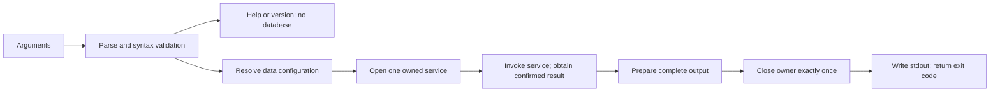

# Feature Plan 004: CLI Interface & Scripting

## Goal Capsule

Expose the accepted task service through a local, scriptable Cobra CLI. Developers get readable terminal output; scripts and agents get complete JSON, exact IDs, predictable exit codes and explicit destructive intent.

- **Authority:** [MASTERPLAN.md](../../MASTERPLAN.md), [AGENTS.md](../../AGENTS.md), then the [product contract](2026-09-06-001-feat-tusk-modern-task-system-plan.md). This request authorizes planning only.
- **Pack:** This plan, its [verification plan](../verification-plans/2026-09-06-004-feat-cli-interface-and-scripting-verification-plan.md) and [workorder](../workorders/2026-09-06-004-feat-cli-interface-and-scripting-issues-workorder.md), in this first-party repository's `docs/`.
- **Prerequisite:** Phase 3 locally accepted and merged; its [consumer handoff](../service.md) is the implementation baseline.
- **Surfaces:** CLI, service adapter/library contracts, persistence lifecycle, process/terminal portability, documentation. No browser or interactive TUI implementation.
- **Order:** U1 → U5 → U4 → U2 → U7 → U3 → U6. Existing 004-1 through 004-6 IDs retain their concepts; new U7 splits deletion from U2. Formatting precedes consumers.
- **Evidence:** Readiness means decisions and tests are specified. No Feature 004 runtime scenario, dependency build, quality gate or release gate has executed during this planning pass.

## Product Contract

### Preservation and scope

Product Contract unchanged. Feature-local R-IDs below instantiate product R1–R23 and R27–R29. Product A1 developers and A2 scripts/agents share durable operations; A3 maintainers receive reproducible evidence. Product F1/F2 are CLI capture/mutation, F4 is lazy storage admission; F3 TUI consumption remains Feature 005.

The original outline's unqualified implementation-ready metadata is superseded by this complete pack. Its due-date-range and velocity prose is superseded by product R16/R17: one local civil day and currently retained completions. History was omitted from the outline but is mandatory product R18 scope. `tui` launches in Feature 005; completion/man-page generation in Feature 006. Neither command is advertised or installed as a placeholder here; disable Cobra's default completion command until Feature 006.

In scope: add/list/done/edit/delete/tree/stats/history, help/version, lazy composition, policy/timezone selection, human/JSON output, deterministic and real-process tests, production timezone data, local latency evidence and consumer documentation.

Outside this feature: schema changes, service redesign, network services, bulk multi-ID commands, abbreviated IDs, pagination, configurable sorting, shell execution, editor/pager integration, notes files/stdin import, configuration files, undo, a new public get/reopen command, TUI and release publication. Query `list --all --json` and `history <id> --json` provide readback; `edit --status` provides reopening.

### Requirements

**Invocation and composition**

- R1. Preserve empty invocation/help/version aliases with no storage/path creation, no configuration validation and no terminal query traffic.
- R2. Classify grammar failures as exit 2 before opening storage; preserve argument boundaries, `--`, scalar/repeated flags and explicit patch intent.
- R3. Resolve policy/timezone only for valid data invocations; flag overrides environment, then defaults. Reuse storage path precedence and never fall back after an open failure.
- R4. Construct a fresh command tree per invocation and inject service factory, streams, terminal facts and confirmation seam; only the composition root owns storage.
- R5. Keep Go 1.25, the accepted SQLite graph and five CGO-free targets; pin compatible Cobra/Lipgloss dependencies and embed production timezone data.
**Commands and durable behavior**

- R6. Create tasks through CreateTask with title, notes, priority, date, tags and parent; preserve service defaults and validation.
- R7. Patch only supplied edit fields against current data, including explicit clears, moves, status and manual leaf progress; never split a compound patch into separate writes.
- R8. Complete a whole subtree through CompleteTask; reopening through UpdateTask preserves service lifecycle, no-op and parent policy semantics.
- R9. Require recursion independently from force, preview non-forced deletion, confirm default-No only in an eligible terminal, and pass exact preview back for authoritative recheck.
- R10. Implement list OR-within/AND-across filters, default open statuses, all/status exclusion, search, parent/root and half-open local-day due selection.
- R11. Render complete forests or selected subtrees, including done nodes, stable sibling order and display depth 1 without changing stored parents.
- R12. Expose retained-task statistics and oldest-first metadata history without inventing velocity or event snapshots.
**Output, failures and terminal safety**

- R13. Publish independent, explicit JSON DTOs with stable fields/types/nulls/arrays, exact opaque IDs and full data.
- R14. Emit one compact JSON value plus LF on stdout; diagnostics go to stderr. Buffer serialization before output, propagate encoding/short-write failures and never append human text to JSON.
- R15. Distinguish syntax, domain/config/runtime, cancellation, unknown transaction outcome, known commit and output/close failure; no automatic mutation replay.
- R16. Close an opened owner exactly once on every return path before publishing the result. A close failure discards pending output and retains known commit information.
- R17. Human output is readable with explicit status labels, complete IDs, deterministic columns/empty states and terminal-cell-aware clipping.
- R18. Sanitize untrusted human text and diagnostics against controls/OSC/bidi presentation; JSON preserves valid stored text through encoding. Notes never execute or fetch resources.
- R19. Disable color for non-TTY stdout, nonempty NO_COLOR or TERM=dumb; use invocation-owned styling without terminal background probes or global renderer mutation.
- R20. Read stdin only for eligible delete confirmation; support LF/CRLF and cancellation, and never prompt in JSON or redirected input/output/error flows.
**Integration, performance and delivery**

- R21. Prove the real executable's exit/stdout/stderr, storage isolation, committed recovery and concurrent mutation behavior on temporary disk databases.
- R22. Measure launch-through-exit help/version under 5 ms and each query under 15 ms with fixed reference fixtures; preserve every sample and record larger/cold/busy/slow-output observations separately.
- R23. Test dependency/runtime compatibility and safe platform behavior locally; leave native Windows/macOS and hosted release acceptance explicitly with Feature 006.
- R24. Keep CLI independent of concrete storage/service; cover all durable TUI actions through scriptable commands and document the shared service/config handoff to Feature 005.
- R25. Record red/green, canonical Make gates, review dispositions and a separate local commit per implementation unit; synchronize this triplet and masterplan before advancing.

### Acceptance examples

- AE1 / F1: Add a Unicode title with notes, tomorrow and normalized tags using JSON; capture its full ID and find the identical stored fields in list.
- AE2 / F2: Complete a parent, reopen it through edit, move a child and clear its due date; each invocation is atomic and service rollups/history remain authoritative.
- AE3 / F2: Forced nonrecursive deletion of a parent fails with exit 1. A confirmed recursive deletion conflicts if another process adds a child after preview.
- AE4 / F4: Invalid flags or help with a bad database path/zone do not touch storage. A valid data command with invalid configuration exits 1 without data changes.
- AE5: A committed add followed by a broken output pipe exits 1 and preserves exactly one task. Fresh readback determines state before the caller considers a retry.

## Planning Contract

### Live grounding and confidence

Inspected 2026-09-09 on initially clean `main` at `85bf117`: core, ports, storage and service exist; `internal/cli` does not. The main scaffold prints help for unknown commands and does not own stderr/context. `go.mod` declares Go 1.25.0, modernc SQLite v1.58.0 and libc v1.75.6. Cobra/Lipgloss are absent. `make build` builds only `cmd/tusk/main.go`, which would omit future sibling composition/signal files.

Authority references: [service port](../../internal/ports/task_service.go), [service options](../../internal/service/task_service.go), [query validation](../../internal/service/commands.go), [path resolution](../../internal/storage/path.go), [transaction errors](../../internal/ports/errors.go), [durable recovery learning](../solutions/database-issues/preserve-transaction-outcomes-through-error-redaction.md), [Makefile](../../Makefile). Existing acceptance receipts belong to Features 002/003; they do not prove this adapter.

Initial confidence gaps selected for deepening: command/scope traceability; dependency/composition design; failure/output lifecycle; implementation order; verification and latency evidence. Each lacked multiple decisions or a usable execution boundary. The completed pack resolves those gaps with the contracts below. Combined dependency builds, actual latency and native terminal behavior remain execution gates, not unresolved product decisions.

### KTD1. Pin the existing API family and prove composition first

Select Cobra v1.10.2 (pflag v1.0.9), Lipgloss v1.1.0, charmbracelet/x/ansi v0.8.0, charmbracelet/x/term v0.2.1, and muesli/termenv v0.16.0 where directly imported. These pins retain the product's v1 UI family and avoid an unnecessary v2 migration. The selected modules declare Go minima below 1.25; that is source evidence, not combined-graph proof. Existing minimum-version selection may retain newer already-pinned transitive modules. Never downgrade SQLite/libc or blindly replace the module graph.

U1 adds pins and a compatibility test that imports/constructs the selected presentation dependencies without probing a terminal, then verifies minimum compiler/full executable cross-build; U4 proves rendering. Import `time/tzdata` in the production composition root. Change `make build` to build `./cmd/tusk` with CGO_ENABLED=0, preserving `bin/tusk`; keep race gates CGO-enabled. No mutable version variable or linker-injected global: retain immutable Version and exact `tusk version <Version>\n`.

Sources inspected 2026-09-09: [Cobra manifest](https://raw.githubusercontent.com/spf13/cobra/v1.10.2/go.mod), [Lipgloss manifest](https://raw.githubusercontent.com/charmbracelet/lipgloss/v1.1.0/go.mod), [terminal manifest](https://raw.githubusercontent.com/charmbracelet/x/term/v0.2.1/term/go.mod). No claim these are the latest releases.

### KTD2. Parse first, open once, close before output

`internal/cli` depends on core, ports and presentation libraries; `cmd/tusk` supplies concrete storage/service, cryptographic entropy, clock, OS streams/environment and terminal facts. A small CLI Options/Dependencies value carries those inputs; an OpenService callback returns a TaskService plus one close callback. No service locator, framework or per-command repository.

A new command tree and option storage are created for every Run. The CLI returns an exit code; only main calls os.Exit, after Run cleanup. Factory success transfers ownership; factory failure cleans any partially opened repository itself. Set Cobra SilenceErrors/SilenceUsage and explicit Args/flag-validation hooks. Unknown command/flag/arity and malformed numeric/bool syntax are classified at the parse boundary, never by matching error strings. Command-specific relational syntax checks run before the factory.

Help/version and root without a command stop after parsing. Do not put Open in PersistentPreRun or global init. Suppress Cobra's incidental suggestions/default completion until their contracts exist. Help uses the existing banner, explicit command usage/flags/examples and plain text. Capture help/version into an invocation-local buffer (Cobra help callbacks do not return writer errors), then use the same checked output writer; an unwritable help/version stream is exit 1. Factory success requires a nonnil service and close callback; malformed injected dependencies are an operational error, never a panic.

Errors from any stage converge on cleanup, then one sanitized stderr diagnostic. A service error discards any accompanying result. A formatter or close error before emission leaves stdout empty. A write failure may leave partial stdout. Keep a local outcome flag for confirmed mutation success; never infer it solely from error cause.

### KTD3. Configuration and input grammar

No config file or new database flag. Storage continues to resolve nonempty TUSK_DB_PATH, absolute XDG_DATA_HOME, then home/.local/share/tusk/tusk.db; relative explicit paths resolve from the invocation directory. Pass a literal path via storage Options only when the composition root has an explicit override; never construct a user DSN.

Common data options: `--auto-complete-parent[=bool]` over TUSK_AUTO_COMPLETE_PARENT over false; `--timezone <IANA-name>` over nonempty TUSK_TIMEZONE over Go time.Local. Explicit false wins over an invalid environment value. Parse booleans with strconv.ParseBool; invalid environment is exit 1, invalid flag syntax exit 2. An explicitly empty/unknown timezone is configuration exit 1; UTC is valid. The local default follows Go/OS local-zone behavior (which may be UTC on a system without local-zone configuration). Resolve only the winning value, only for data commands; do not change time.Local or TZ globally. U1 documents this technical configuration default and Feature 005 reuses it.

Scalar flags use last occurrence; repeated status/priority/tag flags accumulate. Tags flatten comma-separated elements from each occurrence without CSV quoting, then core normalizes; empty elements fail with exit 1. Statuses/priorities each take one value per occurrence and use core parsers (trim/case normalization, priority names or 1–4). Do not split titles or descriptions. Validate UTF-8/NUL at the adapter boundary for supplied text; service remains authoritative for domain rules. IDs are trimmed opaque full strings, never UUID-only or prefix matched.

Progress accepts signed base-10 int64 syntax; malformed/overflow is exit 2, parsed values outside domain range are exit 1 before architecture-sized conversion. No implicit stdin values. Boolean controls act only when true; explicit false does not clear a field or constitute an edit.

### KTD4. Command contract

All data commands support local `--json` and inherit common data configuration flags. They take exact arity; arbitrary positional batches are rejected.

| Command | Inputs | Service call / successful result |
| --- | --- | --- |
| `add <title>` | `-p/--priority`, `-d/--due`, repeated `-t/--tags`, `--parent`, `-n/--notes` | CreateTask; Task |
| `list` | repeated `-s/--status`, `-p/--priority`, `-t/--tags`; `--due`, `--search`, `--parent`, `--root`, `--all` | ListTasks; Task array |
| `done <id>` | no mutation flags | CompleteTask; selected Task after subtree completion |
| `edit <id>` | `--title`, `-n/--notes`, `-p/--priority`, `-s/--status`, `--progress`, `-d/--due` / `--clear-due`, repeated `-t/--tags` / `--clear-tags`, `--parent` / `--root` | UpdateTask once; Task |
| `delete <id>` | `--recursive`, `--force` | PreviewDeleteTask when needed, then DeleteTask; DeleteResult |
| `tree [id]` | optional exact ID | GetTaskTree; forest array |
| `stats` | no query flags | GetStats; stats object |
| `history <id>` | exact ID | GetTaskHistory; event array |

Syntax exit 2: empty edit; set+clear due/tags; parent+root; status+all; progress with status or parent/root intent; extra/missing args; unknown flag/command. For edit, Changed determines supplied values, including empty notes; true clear-tags maps to a supplied empty slice, clear-due/root to their explicit service clear fields. Set fields containing empty domain values fail with 1; they do not mean clear.

An equal-but-supplied edit is valid and can be a service no-op. CLI Base remains nil: patch the latest task, never pre-read and replace it. Status+parent is one UpdateTask; it already owns move-before-status semantics. Date expressions go unchanged to the service parser using the resolved location and one service reference time. `list --due` is a day predicate, not a range flag. Do not re-sort results or reconstruct a tree from filtered lists.

Existing `-h/--help`, `help [command]`, `-v/--version`, `version` remain. Root no-args shows help. A malformed supplied flag still fails before help; otherwise help short-circuits data arity/config validation. `--` permits a title starting with a dash.

### KTD5. Delete consent is a separate unit

For `--force`, invoke DeleteTask with Force=true and the independent Recursive value; do not preview or read stdin. Otherwise JSON or any nonterminal stdin/stdout/stderr fails with exit 1 and guidance to supply force and recursion when appropriate, before opening storage. A terminal caller previews without holding a transaction while waiting; if descendants exist and recursive is absent, fail without prompting.

Show sanitized target title, full ID and exact preview count on stderr, then `Delete <count> task(s)? [y/N] `. Consent is one trimmed, case-insensitive y/yes line; any other complete line or EOF declines, exits 0, emits no stdout and a plain `Deletion canceled.\n` on stderr. CRLF and LF work. Prompt/write/read failures or context cancellation return 1, never call DeleteTask. Bound input to 4096 bytes; an oversized line fails, no reprompt loop.

Pass the same preview as Expected. A changed target or subtree produces conflict; do not silently re-preview or obtain broader consent. The user starts a new invocation. Successful deletion emits sorted IDs/count. No tombstone, undo, `--force`-implied recursion or concurrent transaction held across the prompt.

Production confirmation reads through a context-aware terminal input adapter. On Unix, keep canonical terminal mode and poll the sole input descriptor in at most 50 ms readiness intervals, checking context before consuming available bytes; no concurrent input consumer. On Windows, use one process-owned synchronous console reader pinned to its OS thread and cancel pending thread I/O on context cancellation, then join completion before releasing handles/thread ownership. Cancellation can race normal completion: recheck context before accepting consent, handle a no-pending-I/O response and never interpret a cancellation request as proof the reader stopped. If cancellation setup is unavailable, fail before starting a blocking read. Use the existing x/sys dependency for platform calls and a narrowly scoped local Win32 binding if an export is absent; do not introduce a console framework. Tests inject the confirmation function and platform call seam, never close arbitrary injected readers. No background domain worker or unbounded goroutine per prompt. See [Win32 synchronous cancellation contract](https://learn.microsoft.com/en-us/windows/win32/api/ioapiset/nf-ioapiset-cancelsynchronousio); native console behavior remains V90.

### KTD6. Explicit JSON schema version 1

DTOs in `internal/cli/json.go` are independent of core omitempty tags; keep typed conversion helpers, not a generic reflection mapper. Schema version 1 is a documented compatibility name, not a new envelope or field. Arrays never become null.

| Value | Exact keys / shape |
| --- | --- |
| Task | id, title, description (including empty), status string, priority integer 1–4, parent_id string/null, progress integer, tags string array, due_date string/null, created_at string, updated_at string, completed_at string/null |
| List | array of Task; empty [] |
| Add/done/edit | one Task |
| Tree | array of {task: Task, children: array of same node shape, depth: integer}; root display depth 1; stored parent_id unchanged |
| Delete | {id: string, deleted_ids: sorted string array, deleted_count: integer, deleted: boolean} |
| Stats | {total, by_status, done, completion_percent, overdue, completed_last_7_days}; integer counts; by_status has todo/in-progress/blocked/done even when zero |
| History | array of {sequence: int64 JSON number, task_id: string, kind: string, changed_fields: sorted string array, occurred_at: string} |

All timestamps UTC RFC3339Nano with Z, nullable dates explicit null, data preserves Unicode/control content through JSON escapes. Consumers requiring exact 64-bit history sequence must use an integer-capable parser (for Go, UseNumber); no coercion to float64 in tests. Encoder escapes HTML characters by default; no indent, one final LF, no BOM/ANSI/notices. Preserve service order. Keep task IDs intact and never truncate JSON. Version/help remain plain text and reject --json.

Buffer the full result using encoding/json before writing. A successful write must consume all bytes; short writes and errors return 1. This is one JSON document, not NDJSON. Memory scales with returned data and encoded bytes; no hidden cap. Additive fields are compatible; removed/type/nullability/array changes require an explicit contract revision and fixture review.

### KTD7. Outcome and diagnostic rules

One error classifier owns public exit behavior. Parsing records syntax errors explicitly; service/config/encoding/open/close/output errors map to 1. Human error text is plain and sanitized, begins `tusk: `, ends LF, and does not print raw driver errors, paths, SQL, notes or rejected values. Syntax errors include the command usage and help hint on stderr only; operational errors omit usage. Stable categories, not full English strings, drive internal tests.

Check errors.As for ports.TransactionError before errors.Is for cancellation/busy/conflict. Detect value or pointer forms if wrapped by an adapter. Unknown outcome always discards results, closes the owner and says outcome unknown; reopen/read tasks and history before retry. No same-owner readback or automatic write replay. A later invocation provides fresh ownership. For unknown add, use list --all --json and supplied metadata because there may be no confirmed ID; do not guess an ID or infer noncommit from a missing success response.

| Condition | Exit / stdout | Recovery |
| --- | --- | --- |
| Parse/relational syntax | 2 / empty | Correct invocation; no storage open |
| Invalid domain/date/config, missing task, children, conflict, busy/storage/schema | 1 / empty | Safe category and applicable hint; conflicts need fresh preview |
| Context canceled/deadline before confirmed commit | 1 / empty | Do not show success; unknown outcome takes priority if present |
| Commit confirmed, context canceled afterward | 0 if encode/close/write succeed | Keep confirmed result; do not reclassify known success solely from context |
| Unknown transaction outcome | 1 / empty | Close, fresh readback, no retry |
| Confirmed mutation then encode/close failure | 1 / empty | State committed; diagnostic says saved/deleted but output/cleanup failed |
| Stdout broken/short write | 1 / possibly partial | No appended stdout diagnostic; no replay; readback for mutations |
| Successful query, then close failure | 1 / empty | Discard pending query output; fresh owner on next invocation |

Do not retry stderr failures or recursively report them. On Unix install process-local SIGPIPE handling so fd1/fd2 EPIPE reaches Run instead of signal exit 141; isolate signal code with explicit Unix/Windows build constraints (a _unix.go filename alone is not a Go OS selector). Signal handlers are installed only at the executable boundary and stopped on return; shared in-process command tests use injected contexts. Cancellation uses signal.NotifyContext for interrupt and Unix termination; stop notification and clean resources before os.Exit. Tests use direct contexts except dedicated subprocess signal tests. Source: [Go SIGPIPE behavior](https://pkg.go.dev/os/signal#hdr-SIGPIPE).

### KTD8. Human format, terminal safety and accessibility

Task-returning mutations and list use the same tabular rows. Plain redirected output is TSV with header `ID STATUS PRIORITY PROGRESS DUE TITLE` (tab separators), full IDs, all rows, UTC RFC3339Nano due or "-", priority name, integer percent and sanitized one-line title. Empty list emits the header alone. JSON is the complete notes/tags retrieval surface.

Terminal output uses these columns with two-space gutters, no outer border. Reserve fixed widths ID=36 minimum (expand for longer opaque IDs), STATUS=11, PRIORITY=6, PROGRESS=8, DUE=10 (YYYY-MM-DD in configured zone), then TITLE gets remaining cells. If the fixed columns plus a 12-cell title cannot fit, use stacked records with full ID on its own line; wrap that ID if necessary rather than abbreviating it. Width is queried once from stdout; failure falls back to 80, nonpositive width clamps to 1. Reflow only at command start; no alternate screen.

Tree uses ASCII branches, full IDs, status/progress and title; carry ancestor prefixes and display depth. Narrow tree lines wrap continuation text with indentation, never drop tasks. Empty tree says `No tasks.\n`. Stats is a deterministic metric/value table in DTO key order, expanding status counts in todo/in-progress/blocked/done order; label the last metric "Completed last 7 days". History uses SEQUENCE OCCURRED_AT KIND CHANGED_FIELDS (comma-separated field names); existing empty history prints header only. Delete prints `Deleted <count> task(s): <sorted full IDs>\n`. Narrow terminal tables other than task rows use wrapped key/value records. All human result paths support their JSON alternatives.

Sanitize before width calculation/styling: render C0/C1 controls, DEL, ESC, CR/LF/TAB, Unicode line/paragraph separators and bidi embedding/override/isolate controls as visible ASCII escapes. Preserve ordinary Unicode, combining marks, emoji variation selectors and ZWJ. In particular an OSC payload contains no active ESC/BEL after escaping. Do not globally strip Unicode format characters. Diagnostics/consent use the same sanitizer.

Use x/ansi cell width and grapheme-safe truncation/wrapping, with "…" for clipped terminal titles. No byte/rune-count width assumptions; test combining/CJK/emoji and width 1. When one grapheme exceeds the available width, use visible ASCII code-point escapes and wrap those escapes; never emit half a grapheme or enter a zero-progress wrapping loop. Expand narrow indentation to at most width minus one, retaining depth via wrapped text if branches cannot fit. Lipgloss styles come from one invocation renderer with explicitly set profile/background. Select plain versus ANSI 16-color profile from TTY, NO_COLOR and TERM only; fixed green/yellow/blue/red status foregrounds with bold labels, no background. This is adaptive capability/theming without OSC background queries. Do not call package-global style setters or terminal-probing AdaptiveColor. Help/JSON construct no renderer. Sources: [renderer ownership](https://raw.githubusercontent.com/charmbracelet/lipgloss/v1.1.0/renderer.go), [terminal size API](https://raw.githubusercontent.com/charmbracelet/x/term/v0.2.1/term/term.go).

### KTD9. Verification seams and evidence

Use a TaskService spy returning detached fixtures, recording exact call counts/command payloads and injecting joined/typed failures. Inject clock/ID/zone in real-service fixtures, terminal facts and confirmation in CLI tests, and a counting/failing writer plus close callback. Never use the developer's database. Process environment is an allowlist plus temporary HOME/USERPROFILE/XDG_DATA_HOME/TUSK_DB_PATH and explicit timezone/policy; no inherited user configuration.

Test each feature at its unit, not only in U6. Add canonical `make test-cli` in U1 with optional CLI_TEST_RUN selecting names; it runs cmd/tusk and internal/cli tests with standard Go test flags and propagates failure. `make build-cli` in U1 cross-builds the complete executable and compiles CLI/main test binaries for linux amd64/arm64, darwin amd64/arm64, windows amd64 into temporary paths. These are planned targets, absent today. Main package tests that need an actual binary invoke make build once per suite with isolated output and no recursive test target; add a BUILD_OUTPUT override without changing default bin/tusk.

U6 adds `make bench-cli` and a Go benchmark harness under `scripts/cli-bench/`, with meaningful tests and normal coverage (no new exemptions). Benchmark builds happen through make build outside timing. Use a cached executable/OS page cache but a new process for every sample, temporary existing current-schema disk DB, reference UTC, deterministic IDs/timestamps, no contention, a fast fully drained output pipe. Record five warmup invocations separately for each case; then collect 100 consecutive samples for help/version and every list/tree/stats/history query in human and JSON modes. Measure start before process.Start through Wait and complete pipe drain. Every measured sample must be <5 ms for help/version and <15 ms for queries; report min/median/p95/max and violation counts, no trimming or percentile-only acceptance.

Reference fixtures follow the product verification protocol: empty current DB (history uses a separately labeled existing zero-event task seeded by fixture), then 100 and 1,000 retained tasks with 10% roots, a ten-level branch, all statuses/priorities/due variants, 64-rune titles, 128-character notes and three tags/task; queried history has 20 events and output byte counts are recorded. Run help/version with both clean and invalid DB configuration. Separate non-gating measurements: absent DB initialization, 10,000 tasks, 1 MiB notes, held writer lock and throttled output. Violations in those observations stay visible as workorder findings; classification never waives the product mandate. Freeze CPU/OS/filesystem/power mode/Go/binary hash and commands before collecting samples. Performance failures block local phase acceptance pending a fix or explicit product decision.

### KTD10. Rollout and cross-phase handoff

This feature adds an adapter over the current schema and service. Existing databases open through storage's compatibility/migration checks; preserve files and WAL/SHM on any failure. Roll back an executable only to a compatible version, with no database deletion or down-migration. No direct storage/schema edits are planned. A discovered service defect is a new red-first workorder finding requiring scope/active-target reconciliation before changing prior-phase code.

U6 writes `docs/cli.md` with shell quoting, -- handling, exact grammar/DTOs, explicit-force deletion, timezone/policy, complete ID readback, error/cancellation/committed-output recovery, paths and latency limits. Synchronize `docs/service.md` consumer handoff. Feature 005 owns TUI command registration and same policy/zone/error/sanitizer contract; avoid a shared framework until a real second consumer exists. Feature 006 owns completion/man pages, candidate-native Windows/macOS/architecture runtime, terminal acceptance, hosted CI and publication. Local Linux process/terminal proof and five cross-builds are distinct.

## Implementation Units

Every unit has one owner in execution; work sequentially in this repository. Shared orchestration files may be updated only at that unit's declared boundary. All listed new test paths/targets are planned, not present or run. Each unit records its observed red failure, green evidence, applicable lenses and make validate, synchronizes the triplet/masterplan, then gets one coherent local commit before the next. Push/PR/merge/release need separate authorization.

### U1 / 004-1. Cobra root, lazy composition and compatibility

- **Goal / requirements:** R1–R5, R15–R16, R20, R23–R25; AE4/F4.
- **Depends on:** Phase 3 acceptance and this planning pack. This is the first target after implementation authorization.
- **Owns:** go.mod/go.sum; cmd/tusk/main.go, app.go, signal_unix.go, signal_windows.go and matching tests; internal/cli/root.go, config.go, errors.go, compatibility_test.go and tests; Makefile, scripts/test/test_scripts.sh. No concrete imports in internal/cli.
- **Approach:** KTD1–3/KTD7; introduce root/help/version and lazy factory lifetime using a test-only command fixture. Later units register their real commands; no public stub commands. Add Make build/test-cli/build-cli package wiring and tzdata.
- **Red first:** TestRoot_UnknownCommand fails because current scaffold returns 0; TestRoot_NoStorageForHelp and TestRun_CloseAndOutcome exercise absent injection/lifetime; script test rejects file-only build omitting a sibling file.
- **Verification:** make test-cli (add here); make test-unit; GOTOOLCHAIN=go1.25.0 make test build-cli; make validate. V01–V15 and V84.
- **Failure / recovery:** Abort admission on configuration/dependency incompatibility, no file fallback, partial factory cleanup once. Preserve known outcome through cleanup.
- **Reviews:** Architecture, contracts, dependency feasibility, reliability, portability and evidence. Unit receipt includes resolved module graph and complete-package cross-build output.

### U5 / 004-5. JSON DTOs and output contract

- **Goal / requirements:** R13–R16, R18, R25.
- **Depends on:** U1 exit/lifetime seams.
- **Owns:** internal/cli/json.go, output.go, json_test.go, output_test.go, testdata/json/.
- **Approach:** KTD6/KTD7; explicit converters and buffered serialization for every result type, one output boundary, outcome-aware failure messages.
- **Red first:** TestJSON_ExplicitFields fails on omitted null/empty fields; TestOutput_ShortWrite fails on ignored byte count; TestOutput_UnknownOutcomePrecedesCause prevents false retry guidance.
- **Verification:** make test-cli CLI_TEST_RUN='TestJSON|TestOutput'; make validate. V16–V27.
- **Failure / recovery:** Pre-output failure produces no bytes; partial writes never replay service calls or append stdout notices.
- **Reviews:** API compatibility, correctness, error redaction, simplicity. Evidence includes parsed key/type/value assertions and writer failure counters.

### U4 / 004-4. Safe human formatter and terminal presentation

- **Goal / requirements:** R17–R20, R24–R25.
- **Depends on:** U1 terminal facts; U5 output boundary.
- **Owns:** internal/cli/format.go, sanitize.go, terminal.go, associated tests, testdata/human/.
- **Approach:** KTD8; deterministic layouts, visible labels, capability-owned renderer and one shared display sanitizer.
- **Red first:** TestFormat_UntrustedControls exposes raw ESC/OSC; TestFormat_CellWidths catches split clusters/overflow; TestFormat_NoTerminalProbe expects zero input/output probe traffic.
- **Verification:** make test-cli CLI_TEST_RUN='TestFormat|TestSanitize|TestTerminal'; make validate. V28–V39.
- **Failure / recovery:** Width lookup falls back safely; injected writer failure propagates through U5. Formatting never mutates service data.
- **Reviews:** Terminal design/accessibility, privacy, performance, maintainability. Evidence includes fixtures at 1/20/40/80/120/200 cells and control/Unicode cases.

### U2 / 004-2. Add, edit and complete

- **Goal / requirements:** R2–R3, R6–R8, R13–R18, R24–R25; AE1–AE2/F1–F2.
- **Depends on:** U1/U5/U4.
- **Owns:** internal/cli/add.go, edit.go, done.go, flags.go, mutations_test.go; command registration in root.go.
- **Approach:** KTD3/KTD4; bind supplied values, normalize repeated input, invoke one service method and format the returned committed task.
- **Red first:** TestAdd_ExactCommand fails on missing command/field mapping; TestEdit_OmittedVersusClear protects explicit intent; TestDone_SubtreeAndReopen verifies service ownership.
- **Verification:** make test-cli CLI_TEST_RUN='TestAdd|TestEdit|TestDone|TestMutation'; make validate. V40–V51.
- **Failure / recovery:** Invalid relational syntax never opens; domain/service rejection returns no task. No retry, pre-read replacement or duplicate status/move writes.
- **Reviews:** CLI ergonomics, API/agent parity, lifecycle correctness, TDD evidence. Include real-service fixtures for combined patches/no-op.

### U7 / 004-7. Preview, consent and deletion

- **Goal / requirements:** R2, R9, R14–R16, R18, R20–R21, R24–R25; AE3/F2.
- **Depends on:** U2 plus common formatting/lifetime.
- **Owns:** internal/cli/delete.go, delete_test.go; cmd/tusk/confirm.go, platform input helpers and tests; root.go registration.
- **Approach:** KTD5; no prompt for force/JSON/pipes, display exact preview, bounded cancelable input, consent membership passed unchanged.
- **Red first:** TestDelete_ForceNeverImpliesRecursive; TestDelete_NonTTYNeverReads; TestDelete_StalePreview; TestConfirm_CancelJoinsReader.
- **Verification:** make test-cli CLI_TEST_RUN='TestDelete|TestConfirm'; make test; make race; make validate. V52–V63.
- **Failure / recovery:** Decline 0/no mutation; cancellation/fault 1; conflict requires new invocation. Close all acquired resources and reader work.
- **Reviews:** Destructive action correctness, concurrency, terminal consent, cancellation/privacy. Disk preview barrier proves stale consent rejection.

### U3 / 004-3. List, tree, stats and history

- **Goal / requirements:** R2–R3, R10–R19, R24–R25.
- **Depends on:** U7 for sequential delivery; U1/U5/U4 provide technical dependencies.
- **Owns:** internal/cli/list.go, tree.go, stats.go, history.go, queries_test.go; root.go registration.
- **Approach:** KTD4/KTD6/KTD8; map filters to TaskQuery, pass exact tree/history IDs and format returned detached read models without reimplementing service calculations.
- **Red first:** TestList_FilterContract; TestTree_StoredParentAndDepth; TestStats_RetainedCompletions; TestHistory_EmptyVersusMissing.
- **Verification:** make test-cli CLI_TEST_RUN='TestList|TestTree|TestStats|TestHistory|TestQuery'; make validate. V64–V75.
- **Failure / recovery:** Any read/cleanup error suppresses all pending data; no partial forest, silent drop or fabricated metrics.
- **Reviews:** Query contract, Unicode/date semantics, serialization, performance and agent context parity.

### U6 / 004-6. Real executable, recovery, latency and handoff

- **Goal / requirements:** R1–R25 integration; especially R21–R25 and AE1–AE5.
- **Depends on:** All earlier units.
- **Owns:** internal/cli/process_test.go and disk fixtures; cmd/tusk process/PTY tests; scripts/cli-bench/; Makefile benchmark wiring and script tests; docs/cli.md, docs/service.md; this triplet, product handoff and MASTERPLAN.md.
- **Approach:** KTD9/KTD10; build actual binary once outside timed execution, use controlled process/barrier failures, measure every query/format and hand off native/hosted gates honestly.
- **Red first:** TestProcess_Workflow; TestProcess_BrokenPipePreservesCommit; TestProcess_HelpFilesystemIsolation; TestCLIBenchmark_RejectsViolationAndMissingSamples fail against missing integration/runner behavior. If an integration scenario already passes, record it as non-regression; do not manufacture a failure. Every implementation fix still requires its own observed red.
- **Verification:** make test-cli; make validate build check-generated; GOTOOLCHAIN=go1.25.0 make test build-cli; make bench-cli (add here). V76–V83, V85–V89; V90–V91 are later native/hosted gates.
- **Failure / recovery:** Retain failures/outliers, never clean real databases or WAL sidecars, no auto replay. Native/hosted absence does not erase local evidence or count as pass.
- **Reviews:** Adversarial end-to-end correctness, performance, portability, recovery, documentation and evidence quality. Local acceptance requires V01–V89 with receipts; deferred release obligations remain separately open.

## Verification Contract and Definition of Done

The [verification matrix](../verification-plans/2026-09-06-004-feat-cli-interface-and-scripting-verification-plan.md) is the scenario authority: 25 requirements, seven units, 91 scenarios, all unchecked at planning completion. Requirements share cross-cutting scenarios intentionally. The [workorder](../workorders/2026-09-06-004-feat-cli-interface-and-scripting-issues-workorder.md) records planning fixes and open execution gates.

No current source, tests, dependencies or release files are changed by this pack. Existing canonical gates remain make test-unit/test/race/validate/build/check-generated. New targets are explicitly owned above. make validate includes formatting, vet, full tests, race, 95% nonexempt per-package coverage and script tests; do not weaken it for new CLI/main/harness packages.

- [ ] U1 → U5 → U4 → U2 → U7 → U3 → U6 implemented and separately committed with red/green and canonical evidence.
- [ ] V01–V89 locally executed with exact SHA/environment/commands/results, including process failure and benchmark raw samples.
- [ ] Go 1.25 combined graph and complete executable/test cross-builds pass without SQLite/libc regression.
- [ ] Real Linux terminal consent/color/width and signal/broken-pipe behavior recorded separately from fakes.
- [ ] Documentation, masterplan, product handoff, verification and workorder synchronized; no unresolved local acceptance blocker.
- [ ] V90–V91 native Windows/macOS and hosted release acceptance handed to Feature 006 with explicit pending status; completion/man pages and TUI stay in their phases.

## Open Questions and Decision Owners

No unresolved product decision blocks implementation planning. Technical defaults here are planner decisions grounded in the product/live code, not claims of separate user approval.

U1 owns actual combined-graph/signal compatibility; U6 owns reference-host manifest, cancellation/PTY proof and latency results before local acceptance. If a bound cannot be met, create a finding and resolve it with the project owner; do not waive the mandate. Feature 006 owns native/hosted release evidence before publication. Implementation begins only under a new instruction activating U1 in MASTERPLAN.md.
