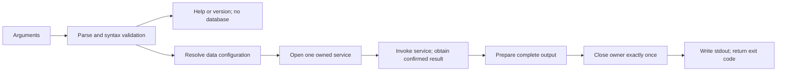

# Feature Plan 004: CLI Interface & Scripting

### Current latency acceptance policy (owner-delegated judgment)

The owner authorized best-practice measurement judgment to prevent incidental
measurement noise from blocking useful progress while preserving the speed goal.
This explicitly supersedes the earlier every-sample policy; historical failing
reports below remain failures under their original policy and are not relabeled.
The exact limits below are an engineering decision for Tusk, not a standard
prescribed by the cited sources.

| Fresh-process case | p90 target | p95 guard | p99 guard | Maximum guard |
|---|---:|---:|---:|---:|
| Help/version, clean or invalid configuration | <5 ms | <7.5 ms | <10 ms | <15 ms |
| List/tree/stats/history, human and JSON | <15 ms | <20 ms | <30 ms | <50 ms |

`make bench-cli` collects three complete runs on the declared reference host.
Each case in each run retains five warmups and 100 consecutive measured samples;
every case in every run must pass independently. Percentiles use nearest rank.
Retain min/p50/p90/p95/p99/max, counts at or above the p90 target, all raw durations,
output size and correctness, exit results, exact binary hash, compiler, OS,
filesystem, CPU, governor, power profile and coordinator GOMAXPROCS. No trimming,
subtracting estimated overhead, selecting the best run, or retrying until green.
The maximum guards prevent severe pauses from disappearing behind a percentile.
These are finite-sample acceptance criteria, not population confidence bounds or
hard real-time guarantees. Retained target misses remain visible even on a pass;
no miss is automatically attributed to host noise.

The timer still covers fresh process launch through exit and complete pipe drain;
builds and isolated fixture setup stay outside timing. Use default Codex Bash,
a cached executable/current-schema disk database, balanced power profile and no
concurrent verification workload. Fixtures and all functional requirements are
unchanged. First use, 10,000 tasks, 1 MiB notes, contention and slow output remain
separate observations. Regressions in p90, bounded tails or correctness still block.

Rationale: [Google SRE](https://sre.google/sre-book/service-level-objectives/)
recommends distributions rather than averages alone and discusses why demanding
100% attainment can obstruct useful delivery. [pyperf's system guidance](https://pyperf.readthedocs.io/en/latest/system.html)
explains scheduler/power-related variance and environment metadata. Those sources
support the method; the thresholds above preserve Tusk's fast interactive purpose.

## Goal Capsule

Expose the accepted task service through a local, scriptable Cobra CLI. Developers get readable terminal output; scripts and agents get complete JSON, exact IDs, predictable exit codes and explicit destructive intent.

- **Authority:** [MASTERPLAN.md](../../MASTERPLAN.md), [AGENTS.md](../../AGENTS.md), then the [product contract](2026-09-06-001-feat-tusk-modern-task-system-plan.md). The original request authorized planning only; ce-work execution was authorized on 2026-09-28.
- **Pack:** This plan, its [verification plan](../verification-plans/2026-09-06-004-feat-cli-interface-and-scripting-verification-plan.md) and [workorder](../workorders/2026-09-06-004-feat-cli-interface-and-scripting-issues-workorder.md), in this first-party repository's `docs/`.
- **Prerequisite:** Phase 3 locally accepted and merged; its [consumer handoff](../service.md) is the implementation baseline.
- **Surfaces:** CLI, service adapter/library contracts, persistence lifecycle, process/terminal portability, documentation. No browser or interactive TUI implementation.
- **Order:** U1 → U5 → U4 → U2 → U7 → U3 → U6. Existing 004-1 through 004-6 IDs retain their concepts; new U7 splits deletion from U2. Formatting precedes consumers.
- **Evidence:** Readiness means decisions and tests are specified. The planning pass supplied decisions only; subsequent local acceptance evidence is recorded below. U6 reference latency passed the current distribution policy; native/hosted release proof remains with Feature 006.

## Product Contract

### Preservation and scope

Product Contract unchanged. Feature-local R-IDs below instantiate product R1–R23 and R27–R29. Product A1 developers and A2 scripts/agents share durable operations; A3 maintainers receive reproducible evidence. Product F1/F2 are CLI capture/mutation, F4 is lazy storage admission; F3 TUI consumption remains Feature 005.

The original outline's unqualified implementation-ready metadata is superseded by this complete pack. Its due-date-range and velocity prose is superseded by product R16/R17: one local civil day and currently retained completions. History was omitted from the outline but is mandatory product R18 scope. `tui` launches in Feature 005; completion/man-page generation in Feature 006. Neither command is advertised or installed as a placeholder here; disable Cobra's default completion command until Feature 006.

In scope: add/list/done/edit/delete/tree/stats/history, help/version, lazy composition, policy/timezone selection, human/JSON output, deterministic and real-process tests, production timezone data, local latency evidence and consumer documentation.

Outside this feature: schema changes, service redesign, network services, bulk multi-ID commands, abbreviated IDs, pagination, configurable sorting, shell execution, editor/pager integration, notes files/stdin import, configuration files, undo, a new public get/reopen command, TUI and release publication. Query `list --all --json` and `history <id> --json` provide readback; `edit --status` provides reopening.

### Requirements

**Invocation and composition**

- R1. Preserve empty invocation/help/version aliases with no storage/path creation, no configuration validation and no terminal query traffic.
- R2. Classify grammar failures as exit 2 before opening storage; preserve argument boundaries, `--`, scalar/repeated flags and explicit patch intent.
- R3. Resolve policy/timezone only for valid data invocations; flag overrides environment, then defaults. Reuse storage path precedence and never fall back after an open failure.
- R4. Construct a fresh command tree per invocation and inject service factory, streams, terminal facts and confirmation seam; only the composition root owns storage.
- R5. Keep Go 1.25, the accepted SQLite graph and five CGO-free targets; pin compatible Cobra/Lipgloss dependencies and embed production timezone data.
**Commands and durable behavior**

- R6. Create tasks through CreateTask with title, notes, priority, date, tags and parent; preserve service defaults and validation.
- R7. Patch only supplied edit fields against current data, including explicit clears, moves, status and manual leaf progress; never split a compound patch into separate writes.
- R8. Complete a whole subtree through CompleteTask; reopening through UpdateTask preserves service lifecycle, no-op and parent policy semantics.
- R9. Require recursion independently from force, preview non-forced deletion, confirm default-No only in an eligible terminal, and pass exact preview back for authoritative recheck.
- R10. Implement list OR-within/AND-across filters, default open statuses, all/status exclusion, search, parent/root and half-open local-day due selection.
- R11. Render complete forests or selected subtrees, including done nodes, stable sibling order and display depth 1 without changing stored parents.
- R12. Expose retained-task statistics and oldest-first metadata history without inventing velocity or event snapshots.
**Output, failures and terminal safety**

- R13. Publish independent, explicit JSON DTOs with stable fields/types/nulls/arrays, exact opaque IDs and full data.
- R14. Emit one compact JSON value plus LF on stdout; diagnostics go to stderr. Buffer serialization before output, propagate encoding/short-write failures and never append human text to JSON.
- R15. Distinguish syntax, domain/config/runtime, cancellation, unknown transaction outcome, known commit and output/close failure; no automatic mutation replay.
- R16. Close an opened owner exactly once on every return path before publishing the result. A close failure discards pending output and retains known commit information.
- R17. Human output is readable with explicit status labels, complete IDs, deterministic columns/empty states and terminal-cell-aware clipping.
- R18. Sanitize untrusted human text and diagnostics against controls/OSC/bidi presentation; JSON preserves valid stored text through encoding. Notes never execute or fetch resources.
- R19. Disable color for non-TTY stdout, nonempty NO_COLOR or TERM=dumb; use invocation-owned styling without terminal background probes or global renderer mutation.
- R20. Read stdin only for eligible delete confirmation; support LF/CRLF and cancellation, and never prompt in JSON or redirected input/output/error flows.
**Integration, performance and delivery**

- R21. Prove the real executable's exit/stdout/stderr, storage isolation, committed recovery and concurrent mutation behavior on temporary disk databases.
- R22. Measure launch-through-exit p90 below 5 ms for help/version and below 15 ms for queries, with the current tail guards and fixed reference fixtures; preserve every sample and record larger/cold/busy/slow-output observations separately.
- R23. Test dependency/runtime compatibility and safe platform behavior locally; leave native Windows/macOS and hosted release acceptance explicitly with Feature 006.
- R24. Keep CLI independent of concrete storage/service; cover all durable TUI actions through scriptable commands and document the shared service/config handoff to Feature 005.
- R25. Record red/green, canonical Make gates, review dispositions and a separate local commit per implementation unit; synchronize this triplet and masterplan before advancing.

### Acceptance examples

- AE1 / F1: Add a Unicode title with notes, tomorrow and normalized tags using JSON; capture its full ID and find the identical stored fields in list.
- AE2 / F2: Complete a parent, reopen it through edit, move a child and clear its due date; each invocation is atomic and service rollups/history remain authoritative.
- AE3 / F2: Forced nonrecursive deletion of a parent fails with exit 1. A confirmed recursive deletion conflicts if another process adds a child after preview.
- AE4 / F4: Invalid flags or help with a bad database path/zone do not touch storage. A valid data command with invalid configuration exits 1 without data changes.
- AE5: A committed add followed by a broken output pipe exits 1 and preserves exactly one task. Fresh readback determines state before the caller considers a retry.

## Planning Contract

### Live grounding and confidence

Inspected 2026-09-09 on initially clean `main` at `85bf117`: core, ports, storage and service exist; `internal/cli` does not. The main scaffold prints help for unknown commands and does not own stderr/context. `go.mod` declares Go 1.25.0, modernc SQLite v1.58.0 and libc v1.75.6. Cobra/Lipgloss are absent. `make build` builds only `cmd/tusk/main.go`, which would omit future sibling composition/signal files.

Authority references: [service port](../../internal/ports/task_service.go), [service options](../../internal/service/task_service.go), [query validation](../../internal/service/commands.go), [path resolution](../../internal/storage/path.go), [transaction errors](../../internal/ports/errors.go), [durable recovery learning](../solutions/database-issues/preserve-transaction-outcomes-through-error-redaction.md), [Makefile](../../Makefile). Existing acceptance receipts belong to Features 002/003; they do not prove this adapter.

Initial confidence gaps selected for deepening: command/scope traceability; dependency/composition design; failure/output lifecycle; implementation order; verification and latency evidence. Each lacked multiple decisions or a usable execution boundary. The completed pack resolves those gaps with the contracts below. Combined dependency builds, actual latency and native terminal behavior remain execution gates, not unresolved product decisions.

### KTD1. Pin the existing API family and prove composition first

Select Cobra v1.10.2 (pflag v1.0.9), Lipgloss v1.1.0, charmbracelet/x/ansi v0.8.0, charmbracelet/x/term v0.2.1, and muesli/termenv v0.16.0 where directly imported. These pins retain the product's v1 UI family and avoid an unnecessary v2 migration. The selected modules declare Go minima below 1.25; that is source evidence, not combined-graph proof. Existing minimum-version selection may retain newer already-pinned transitive modules. Never downgrade SQLite/libc or blindly replace the module graph.

U1 adds pins and a compatibility test that imports/constructs the selected presentation dependencies without probing a terminal, then verifies minimum compiler/full executable cross-build; U4 proves rendering. Import `time/tzdata` in the production composition root. Change `make build` to build `./cmd/tusk` with CGO_ENABLED=0, preserving `bin/tusk`; keep race gates CGO-enabled. No mutable version variable or linker-injected global: retain immutable Version and exact `tusk version <Version>\n`.

Sources inspected 2026-09-09: [Cobra manifest](https://raw.githubusercontent.com/spf13/cobra/v1.10.2/go.mod), [Lipgloss manifest](https://raw.githubusercontent.com/charmbracelet/lipgloss/v1.1.0/go.mod), [terminal manifest](https://raw.githubusercontent.com/charmbracelet/x/term/v0.2.1/term/go.mod). No claim these are the latest releases.

### KTD2. Parse first, open once, close before output

`internal/cli` depends on core, ports and presentation libraries; `cmd/tusk` supplies concrete storage/service, cryptographic entropy, clock, OS streams/environment and terminal facts. A small CLI Options/Dependencies value carries those inputs; an OpenService callback returns a TaskService plus one close callback. No service locator, framework or per-command repository.

A new command tree and option storage are created for every Run. The CLI returns an exit code; only main calls os.Exit, after Run cleanup. Factory success transfers ownership; factory failure cleans any partially opened repository itself. Set Cobra SilenceErrors/SilenceUsage and explicit Args/flag-validation hooks. Unknown command/flag/arity and malformed numeric/bool syntax are classified at the parse boundary, never by matching error strings. Command-specific relational syntax checks run before the factory.

Help/version and root without a command stop after parsing. Do not put Open in PersistentPreRun or global init. Suppress Cobra's incidental suggestions/default completion until their contracts exist. Help uses the existing banner, explicit command usage/flags/examples and plain text. Capture help/version into an invocation-local buffer (Cobra help callbacks do not return writer errors), then use the same checked output writer; an unwritable help/version stream is exit 1. Factory success requires a nonnil service and close callback; malformed injected dependencies are an operational error, never a panic.

```mermaid
flowchart LR
  Args[Arguments] --> Grammar[Parse and syntax validation]
  Grammar --> Help[Help or version; no database]
  Grammar --> Config[Resolve data configuration]
  Config --> Open[Open one owned service]
  Open --> Call[Invoke service; obtain confirmed result]
  Call --> Encode[Prepare complete output]
  Encode --> Close[Close owner exactly once]
  Close --> Emit[Write stdout; return exit code]
```

Errors from any stage converge on cleanup, then one sanitized stderr diagnostic. A service error discards any accompanying result. A formatter or close error before emission leaves stdout empty. A write failure may leave partial stdout. Keep a local outcome flag for confirmed mutation success; never infer it solely from error cause.

### KTD3. Configuration and input grammar

No config file or new database flag. Storage continues to resolve nonempty TUSK_DB_PATH, absolute XDG_DATA_HOME, then home/.local/share/tusk/tusk.db; relative explicit paths resolve from the invocation directory. Pass a literal path via storage Options only when the composition root has an explicit override; never construct a user DSN.

Common data options: `--auto-complete-parent[=bool]` over TUSK_AUTO_COMPLETE_PARENT over false; `--timezone <IANA-name>` over nonempty TUSK_TIMEZONE over Go time.Local. Explicit false wins over an invalid environment value. Parse booleans with strconv.ParseBool; invalid environment is exit 1, invalid flag syntax exit 2. An explicitly empty/unknown timezone is configuration exit 1; UTC is valid. The local default follows Go/OS local-zone behavior (which may be UTC on a system without local-zone configuration). Resolve only the winning value, only for data commands; do not change time.Local or TZ globally. U1 documents this technical configuration default and Feature 005 reuses it.

Scalar flags use last occurrence; repeated status/priority/tag flags accumulate. Tags flatten comma-separated elements from each occurrence without CSV quoting, then core normalizes; empty elements fail with exit 1. Statuses/priorities each take one value per occurrence and use core parsers (trim/case normalization, priority names or 1–4). Do not split titles or descriptions. Validate UTF-8/NUL at the adapter boundary for supplied text; service remains authoritative for domain rules. IDs are trimmed opaque full strings, never UUID-only or prefix matched.

Progress accepts signed base-10 int64 syntax; malformed/overflow is exit 2, parsed values outside domain range are exit 1 before architecture-sized conversion. No implicit stdin values. Boolean controls act only when true; explicit false does not clear a field or constitute an edit.

### KTD4. Command contract

All data commands support local `--json` and inherit common data configuration flags. They take exact arity; arbitrary positional batches are rejected.

| Command | Inputs | Service call / successful result |
| --- | --- | --- |
| `add <title>` | `-p/--priority`, `-d/--due`, repeated `-t/--tags`, `--parent`, `-n/--notes` | CreateTask; Task |
| `list` | repeated `-s/--status`, `-p/--priority`, `-t/--tags`; `--due`, `--search`, `--parent`, `--root`, `--all` | ListTasks; Task array |
| `done <id>` | no mutation flags | CompleteTask; selected Task after subtree completion |
| `edit <id>` | `--title`, `-n/--notes`, `-p/--priority`, `-s/--status`, `--progress`, `-d/--due` / `--clear-due`, repeated `-t/--tags` / `--clear-tags`, `--parent` / `--root` | UpdateTask once; Task |
| `delete <id>` | `--recursive`, `--force` | PreviewDeleteTask when needed, then DeleteTask; DeleteResult |
| `tree [id]` | optional exact ID | GetTaskTree; forest array |
| `stats` | no query flags | GetStats; stats object |
| `history <id>` | exact ID | GetTaskHistory; event array |

Syntax exit 2: empty edit; set+clear due/tags; parent+root; status+all; progress with status or parent/root intent; extra/missing args; unknown flag/command. For edit, Changed determines supplied values, including empty notes; true clear-tags maps to a supplied empty slice, clear-due/root to their explicit service clear fields. Set fields containing empty domain values fail with 1; they do not mean clear.

An equal-but-supplied edit is valid and can be a service no-op. CLI Base remains nil: patch the latest task, never pre-read and replace it. Status+parent is one UpdateTask; it already owns move-before-status semantics. Date expressions go unchanged to the service parser using the resolved location and one service reference time. `list --due` is a day predicate, not a range flag. Do not re-sort results or reconstruct a tree from filtered lists.

Existing `-h/--help`, `help [command]`, `-v/--version`, `version` remain. Root no-args shows help. A malformed supplied flag still fails before help; otherwise help short-circuits data arity/config validation. `--` permits a title starting with a dash.

### KTD5. Delete consent is a separate unit

For `--force`, invoke DeleteTask with Force=true and the independent Recursive value; do not preview or read stdin. Otherwise JSON or any nonterminal stdin/stdout/stderr fails with exit 1 and guidance to supply force and recursion when appropriate, before opening storage. A terminal caller previews without holding a transaction while waiting; if descendants exist and recursive is absent, fail without prompting.

Show sanitized target title, full ID and exact preview count on stderr, then `Delete <count> task(s)? [y/N] `. Consent is one trimmed, case-insensitive y/yes line; any other complete line or EOF declines, exits 0, emits no stdout and a plain `Deletion canceled.\n` on stderr. CRLF and LF work. Prompt/write/read failures or context cancellation return 1, never call DeleteTask. Bound input to 4096 bytes; an oversized line fails, no reprompt loop.

Pass the same preview as Expected. A changed target or subtree produces conflict; do not silently re-preview or obtain broader consent. The user starts a new invocation. Successful deletion emits sorted IDs/count. No tombstone, undo, `--force`-implied recursion or concurrent transaction held across the prompt.

Production confirmation reads through a context-aware terminal input adapter. On Unix, keep canonical terminal mode and poll the sole input descriptor in at most 50 ms readiness intervals, checking context before consuming available bytes; no concurrent input consumer. On Windows, use one process-owned synchronous console reader pinned to its OS thread and cancel pending thread I/O on context cancellation, then join completion before releasing handles/thread ownership. Cancellation can race normal completion: recheck context before accepting consent, handle a no-pending-I/O response and never interpret a cancellation request as proof the reader stopped. If cancellation setup is unavailable, fail before starting a blocking read. Use the existing x/sys dependency for platform calls and a narrowly scoped local Win32 binding if an export is absent; do not introduce a console framework. Tests inject the confirmation function and platform call seam, never close arbitrary injected readers. No background domain worker or unbounded goroutine per prompt. See [Win32 synchronous cancellation contract](https://learn.microsoft.com/en-us/windows/win32/api/ioapiset/nf-ioapiset-cancelsynchronousio); native console behavior remains V90.

### KTD6. Explicit JSON schema version 1

DTOs in `internal/cli/json.go` are independent of core omitempty tags; keep typed conversion helpers, not a generic reflection mapper. Schema version 1 is a documented compatibility name, not a new envelope or field. Arrays never become null.

| Value | Exact keys / shape |
| --- | --- |
| Task | id, title, description (including empty), status string, priority integer 1–4, parent_id string/null, progress integer, tags string array, due_date string/null, created_at string, updated_at string, completed_at string/null |
| List | array of Task; empty [] |
| Add/done/edit | one Task |
| Tree | array of {task: Task, children: array of same node shape, depth: integer}; root display depth 1; stored parent_id unchanged |
| Delete | {id: string, deleted_ids: sorted string array, deleted_count: integer, deleted: boolean} |
| Stats | {total, by_status, done, completion_percent, overdue, completed_last_7_days}; integer counts; by_status has todo/in-progress/blocked/done even when zero |
| History | array of {sequence: int64 JSON number, task_id: string, kind: string, changed_fields: sorted string array, occurred_at: string} |

All timestamps UTC RFC3339Nano with Z, nullable dates explicit null, data preserves Unicode/control content through JSON escapes. Consumers requiring exact 64-bit history sequence must use an integer-capable parser (for Go, UseNumber); no coercion to float64 in tests. Encoder escapes HTML characters by default; no indent, one final LF, no BOM/ANSI/notices. Preserve service order. Keep task IDs intact and never truncate JSON. Version/help remain plain text and reject --json.

Buffer the full result using encoding/json before writing. A successful write must consume all bytes; short writes and errors return 1. This is one JSON document, not NDJSON. Memory scales with returned data and encoded bytes; no hidden cap. Additive fields are compatible; removed/type/nullability/array changes require an explicit contract revision and fixture review.

### KTD7. Outcome and diagnostic rules

One error classifier owns public exit behavior. Parsing records syntax errors explicitly; service/config/encoding/open/close/output errors map to 1. Human error text is plain and sanitized, begins `tusk: `, ends LF, and does not print raw driver errors, paths, SQL, notes or rejected values. Syntax errors include the command usage and help hint on stderr only; operational errors omit usage. Stable categories, not full English strings, drive internal tests.

Check errors.As for ports.TransactionError before errors.Is for cancellation/busy/conflict. Detect value or pointer forms if wrapped by an adapter. Unknown outcome always discards results, closes the owner and says outcome unknown; reopen/read tasks and history before retry. No same-owner readback or automatic write replay. A later invocation provides fresh ownership. For unknown add, use list --all --json and supplied metadata because there may be no confirmed ID; do not guess an ID or infer noncommit from a missing success response.

| Condition | Exit / stdout | Recovery |
| --- | --- | --- |
| Parse/relational syntax | 2 / empty | Correct invocation; no storage open |
| Invalid domain/date/config, missing task, children, conflict, busy/storage/schema | 1 / empty | Safe category and applicable hint; conflicts need fresh preview |
| Context canceled/deadline before confirmed commit | 1 / empty | Do not show success; unknown outcome takes priority if present |
| Commit confirmed, context canceled afterward | 0 if encode/close/write succeed | Keep confirmed result; do not reclassify known success solely from context |
| Unknown transaction outcome | 1 / empty | Close, fresh readback, no retry |
| Confirmed mutation then encode/close failure | 1 / empty | State committed; diagnostic says saved/deleted but output/cleanup failed |
| Stdout broken/short write | 1 / possibly partial | No appended stdout diagnostic; no replay; readback for mutations |
| Successful query, then close failure | 1 / empty | Discard pending query output; fresh owner on next invocation |

Do not retry stderr failures or recursively report them. On Unix install process-local SIGPIPE handling so fd1/fd2 EPIPE reaches Run instead of signal exit 141; isolate signal code with explicit Unix/Windows build constraints (a _unix.go filename alone is not a Go OS selector). Signal handlers are installed only at the executable boundary and stopped on return; shared in-process command tests use injected contexts. The first interrupt or Unix termination restores prior signal handling before publishing context cancellation. With the normal inherited disposition, a signal delivered afterward can force termination even during progressing cleanup, possibly truncating output. There is no grace timer or exact signal-count guarantee: rapid signals may coalesce. After force termination reopen and inspect state before retrying a mutation. Normal cancellation joins the confirmation reader; no live reader is abandoned to simulate cleanup. Stop notification and clean resources before os.Exit. Tests use direct contexts except dedicated subprocess signal tests. Source: [Go SIGPIPE behavior](https://pkg.go.dev/os/signal#hdr-SIGPIPE).

### KTD8. Human format, terminal safety and accessibility

Task-returning mutations and list use the same tabular rows. Plain redirected output is TSV with header `ID STATUS PRIORITY PROGRESS DUE TITLE` (tab separators), full IDs, all rows, UTC RFC3339Nano due or "-", priority name, integer percent and sanitized one-line title. Empty list emits the header alone. JSON is the complete notes/tags retrieval surface.

Terminal output uses these columns with two-space gutters, no outer border. Reserve fixed widths ID=36 minimum (expand for longer opaque IDs), STATUS=11, PRIORITY=6, PROGRESS=8, DUE=10 (YYYY-MM-DD in configured zone), then TITLE gets remaining cells. If the fixed columns plus a 12-cell title cannot fit, use stacked records with full ID on its own line; wrap that ID if necessary rather than abbreviating it. Width is queried once from stdout; failure falls back to 80, nonpositive width clamps to 1. Reflow only at command start; no alternate screen.

Tree uses ASCII branches, full IDs, status/progress and title; carry ancestor prefixes and display depth. Narrow tree lines wrap continuation text with indentation, never drop tasks. Empty tree says `No tasks.\n`. Stats is a deterministic metric/value table in DTO key order, expanding status counts in todo/in-progress/blocked/done order; label the last metric "Completed last 7 days". History uses SEQUENCE OCCURRED_AT KIND CHANGED_FIELDS (comma-separated field names); existing empty history prints header only. Delete prints `Deleted <count> task(s): <sorted full IDs>\n`. Narrow terminal tables other than task rows use wrapped key/value records. All human result paths support their JSON alternatives.

Sanitize before width calculation/styling: render C0/C1 controls, DEL, ESC, CR/LF/TAB, Unicode line/paragraph separators and bidi embedding/override/isolate controls as visible ASCII escapes. Preserve ordinary Unicode, combining marks, emoji variation selectors and ZWJ. In particular an OSC payload contains no active ESC/BEL after escaping. Do not globally strip Unicode format characters. Diagnostics/consent use the same sanitizer.

Use x/ansi cell width and grapheme-safe truncation/wrapping, with "…" for clipped terminal titles. No byte/rune-count width assumptions; test combining/CJK/emoji and width 1. When one grapheme exceeds the available width, use visible ASCII code-point escapes and wrap those escapes; never emit half a grapheme or enter a zero-progress wrapping loop. Expand narrow indentation to at most width minus one, retaining depth via wrapped text if branches cannot fit. Lipgloss styles come from one invocation renderer with explicitly set profile/background. Select plain versus ANSI 16-color profile from TTY, NO_COLOR and TERM only; absent/empty TERM selects plain output; fixed green/yellow/blue/red status foregrounds with bold labels, no background. This is adaptive capability/theming without OSC background queries. Do not call package-global style setters or terminal-probing AdaptiveColor. Help/JSON construct no renderer. Sources: [renderer ownership](https://raw.githubusercontent.com/charmbracelet/lipgloss/v1.1.0/renderer.go), [terminal size API](https://raw.githubusercontent.com/charmbracelet/x/term/v0.2.1/term/term.go).

### KTD9. Verification seams and evidence

Use a TaskService spy returning detached fixtures, recording exact call counts/command payloads and injecting joined/typed failures. Inject clock/ID/zone in real-service fixtures, terminal facts and confirmation in CLI tests, and a counting/failing writer plus close callback. Never use the developer's database. Process environment is an allowlist plus temporary HOME/USERPROFILE/XDG_DATA_HOME/TUSK_DB_PATH and explicit timezone/policy; no inherited user configuration.

Test each feature at its unit, not only in U6. Add canonical `make test-cli` in U1 with optional CLI_TEST_RUN selecting names; it runs cmd/tusk and internal/cli tests with standard Go test flags and propagates failure. `make build-cli` in U1 cross-builds the complete executable and compiles CLI/main test binaries for linux amd64/arm64, darwin amd64/arm64, windows amd64 into temporary paths. These are planned targets, absent today. Main package tests that need an actual binary invoke make build once per suite with isolated output and no recursive test target; add a BUILD_OUTPUT override without changing default bin/tusk.

U6 adds `make bench-cli` and a Go benchmark harness under `scripts/cli-bench/`, with meaningful tests and normal coverage (no new exemptions). Benchmark builds happen through make build outside timing. Use a cached executable/OS page cache but a new process for every sample, temporary existing current-schema disk DB, reference UTC, deterministic IDs/timestamps, no contention, a fast fully drained output pipe. Record five warmup invocations separately for each case; then collect 100 consecutive samples for help/version and every list/tree/stats/history query in human and JSON modes. Measure start before process.Start through Wait and complete pipe drain. Repeat the complete matrix three times and apply the current latency acceptance policy above to every case independently. Retain every sample and target miss; report min/p50/p90/p95/p99/max.

Reference fixtures follow the product verification protocol: empty current DB (history uses a separately labeled existing zero-event task seeded by fixture), then 100 and 1,000 retained tasks with 10% roots, a ten-level branch, all statuses/priorities/due variants, 64-rune titles, 128-character notes and three tags/task; queried history has 20 events and output byte counts are recorded. Run help/version with both clean and invalid DB configuration. Separate non-gating measurements: absent DB initialization, 10,000 tasks, 1 MiB notes, held writer lock and throttled output. Violations in those observations stay visible as workorder findings; classification never waives the product mandate. Freeze CPU/OS/filesystem/power mode/Go/binary hash and commands before collecting samples. Performance failures block local phase acceptance pending a fix or explicit product decision.

### KTD10. Rollout and cross-phase handoff

This feature adds an adapter over the current schema and service. Existing databases open through storage's compatibility/migration checks; preserve files and WAL/SHM on any failure. Roll back an executable only to a compatible version, with no database deletion or down-migration. The original adapter scope had no storage/schema edits; the owner-directed U6 performance remediation below amends code scope while preserving the schema. A discovered service defect is a new red-first workorder finding requiring scope/active-target reconciliation before changing prior-phase code.

U6 writes `docs/cli.md` with shell quoting, -- handling, exact grammar/DTOs, explicit-force deletion, timezone/policy, complete ID readback, error/cancellation/committed-output recovery, paths and latency limits. Synchronize `docs/service.md` consumer handoff. Feature 005 owns TUI command registration and same policy/zone/error/sanitizer contract; avoid a shared framework until a real second consumer exists. Feature 006 owns completion/man pages, candidate-native Windows/macOS/architecture runtime, terminal acceptance, hosted CI and publication. Local Linux process/terminal proof and five cross-builds are distinct.

## Implementation Units

Every unit has one owner in execution; work sequentially in this repository. Shared orchestration files may be updated only at that unit's declared boundary. At planning completion the listed new test paths/targets were unimplemented; current execution receipts below supersede that historical availability. Each unit records its observed red failure, green evidence, applicable lenses and make validate, synchronizes the triplet/masterplan, then gets one coherent local commit before the next. Push/PR/merge/release need separate authorization.

### U1 / 004-1. Cobra root, lazy composition and compatibility

- **Goal / requirements:** R1–R5, R15–R16, R20, R23–R25; AE4/F4.
- **Depends on:** Phase 3 acceptance and this planning pack. This is the first target after implementation authorization.
- **Owns:** go.mod/go.sum; cmd/tusk/main.go, app.go, signal_unix.go, signal_windows.go and matching tests; internal/cli/root.go, config.go, errors.go, compatibility_test.go and tests; Makefile, scripts/test/test_scripts.sh. No concrete imports in internal/cli.
- **Approach:** KTD1–3/KTD7; introduce root/help/version and lazy factory lifetime using a test-only command fixture. Later units register their real commands; no public stub commands. Add Make build/test-cli/build-cli package wiring and tzdata.
- **Red first:** TestRoot_UnknownCommand fails because current scaffold returns 0; TestRoot_NoStorageForHelp and TestRun_CloseAndOutcome exercise absent injection/lifetime; script test rejects file-only build omitting a sibling file.
- **Verification:** make test-cli (add here); make test-unit; GOTOOLCHAIN=go1.25.0 make test build-cli; make validate. V01–V15 and V84.
- **Failure / recovery:** Abort admission on configuration/dependency incompatibility, no file fallback, partial factory cleanup once. Preserve known outcome through cleanup.
- **Reviews:** Architecture, contracts, dependency feasibility, reliability, portability and evidence. Unit receipt includes resolved module graph and complete-package cross-build output.

### U5 / 004-5. JSON DTOs and output contract

- **Goal / requirements:** R13–R16, R18, R25.
- **Depends on:** U1 exit/lifetime seams.
- **Owns:** internal/cli/json.go, output.go, json_test.go, output_test.go, testdata/json/.
- **Approach:** KTD6/KTD7; explicit converters and buffered serialization for every result type, one output boundary, outcome-aware failure messages.
- **Red first:** TestJSON_ExplicitFields fails on omitted null/empty fields; TestOutput_ShortWrite fails on ignored byte count; TestOutput_UnknownOutcomePrecedesCause prevents false retry guidance.
- **Verification:** make test-cli CLI_TEST_RUN='TestJSON|TestOutput'; make validate. V16–V27.
- **Failure / recovery:** Pre-output failure produces no bytes; partial writes never replay service calls or append stdout notices.
- **Reviews:** API compatibility, correctness, error redaction, simplicity. Evidence includes parsed key/type/value assertions and writer failure counters.

### U4 / 004-4. Safe human formatter and terminal presentation

- **Goal / requirements:** R17–R20, R24–R25.
- **Depends on:** U1 terminal facts; U5 output boundary.
- **Owns:** internal/cli/format.go, sanitize.go, terminal.go, associated tests, testdata/human/.
- **Approach:** KTD8; deterministic layouts, visible labels, capability-owned renderer and one shared display sanitizer.
- **Red first:** TestFormat_UntrustedControls exposes raw ESC/OSC; TestFormat_CellWidths catches split clusters/overflow; TestFormat_NoTerminalProbe expects zero input/output probe traffic.
- **Verification:** make test-cli CLI_TEST_RUN='TestFormat|TestSanitize|TestTerminal'; make validate. V28–V39.
- **Failure / recovery:** Width lookup falls back safely; injected writer failure propagates through U5. Formatting never mutates service data.
- **Reviews:** Terminal design/accessibility, privacy, performance, maintainability. Evidence includes fixtures at 1/20/40/80/120/200 cells and control/Unicode cases.

### U2 / 004-2. Add, edit and complete

- **Goal / requirements:** R2–R3, R6–R8, R13–R18, R24–R25; AE1–AE2/F1–F2.
- **Depends on:** U1/U5/U4.
- **Owns:** internal/cli/add.go, edit.go, done.go, flags.go, mutations_test.go; command registration in root.go.
- **Approach:** KTD3/KTD4; bind supplied values, normalize repeated input, invoke one service method and format the returned committed task.
- **Red first:** TestAdd_ExactCommand fails on missing command/field mapping; TestEdit_OmittedVersusClear protects explicit intent; TestDone_SubtreeAndReopen verifies service ownership.
- **Verification:** make test-cli CLI_TEST_RUN='TestAdd|TestEdit|TestDone|TestMutation'; make validate. V40–V51.
- **Failure / recovery:** Invalid relational syntax never opens; domain/service rejection returns no task. No retry, pre-read replacement or duplicate status/move writes.
- **Reviews:** CLI ergonomics, API/agent parity, lifecycle correctness, TDD evidence. Include real-service fixtures for combined patches/no-op.

### U7 / 004-7. Preview, consent and deletion

- **Goal / requirements:** R2, R9, R14–R16, R18, R20–R21, R24–R25; AE3/F2.
- **Depends on:** U2 plus common formatting/lifetime.
- **Owns:** internal/cli/delete.go, delete_test.go; cmd/tusk/confirm.go, platform input helpers and tests; root.go registration.
- **Approach:** KTD5; no prompt for force/JSON/pipes, display exact preview, bounded cancelable input, consent membership passed unchanged.
- **Red first:** TestDelete_ForceNeverImpliesRecursive; TestDelete_NonTTYNeverReads; TestDelete_StalePreview; TestConfirm_CancelJoinsReader.
- **Verification:** make test-cli CLI_TEST_RUN='TestDelete|TestConfirm'; make test; make race; make validate. V52–V63.
- **Failure / recovery:** Decline 0/no mutation; cancellation/fault 1; conflict requires new invocation. Close all acquired resources and reader work.
- **Reviews:** Destructive action correctness, concurrency, terminal consent, cancellation/privacy. Disk preview barrier proves stale consent rejection.

### U3 / 004-3. List, tree, stats and history

- **Goal / requirements:** R2–R3, R10–R19, R24–R25.
- **Depends on:** U7 for sequential delivery; U1/U5/U4 provide technical dependencies.
- **Owns:** internal/cli/list.go, tree.go, stats.go, history.go, queries_test.go; root.go registration.
- **Approach:** KTD4/KTD6/KTD8; map filters to TaskQuery, pass exact tree/history IDs and format returned detached read models without reimplementing service calculations.
- **Red first:** TestList_FilterContract; TestTree_StoredParentAndDepth; TestStats_RetainedCompletions; TestHistory_EmptyVersusMissing.
- **Verification:** make test-cli CLI_TEST_RUN='TestList|TestTree|TestStats|TestHistory|TestQuery'; make validate. V64–V75.
- **Failure / recovery:** Any read/cleanup error suppresses all pending data; no partial forest, silent drop or fabricated metrics.
- **Reviews:** Query contract, Unicode/date semantics, serialization, performance and agent context parity.

### U6 / 004-6. Real executable, recovery, latency and handoff

- **Goal / requirements:** R1–R25 integration; especially R21–R25 and AE1–AE5.
- **Depends on:** All earlier units.
- **Owns:** internal/cli/process_test.go and disk fixtures; cmd/tusk process/PTY tests; scripts/cli-bench/; Makefile benchmark wiring and script tests; docs/cli.md, docs/service.md; this triplet, product handoff and MASTERPLAN.md.
- **Approach:** KTD9/KTD10; build actual binary once outside timed execution, use controlled process/barrier failures, measure every query/format and hand off native/hosted gates honestly.
- **Red first:** TestProcess_Workflow; TestProcess_BrokenPipePreservesCommit; TestProcess_HelpFilesystemIsolation; TestCLIBenchmark_RejectsViolationAndMissingSamples fail against missing integration/runner behavior. If an integration scenario already passes, record it as non-regression; do not manufacture a failure. Every implementation fix still requires its own observed red.
- **Verification:** make test-cli; make validate build check-generated; GOTOOLCHAIN=go1.25.0 make test build-cli; make bench-cli (add here). V76–V83, V85–V89; V90–V91 are later native/hosted gates.
- **Failure / recovery:** Retain failures/outliers, never clean real databases or WAL sidecars, no auto replay. Native/hosted absence does not erase local evidence or count as pass.
- **Reviews:** Adversarial end-to-end correctness, performance, portability, recovery, documentation and evidence quality. Local acceptance requires V01–V89 with receipts; deferred release obligations remain separately open.

## Verification Contract and Definition of Done

The [verification matrix](../verification-plans/2026-09-06-004-feat-cli-interface-and-scripting-verification-plan.md) is the scenario authority: 25 requirements, seven units, 91 scenarios, all unchecked at planning completion. Requirements share cross-cutting scenarios intentionally. The [workorder](../workorders/2026-09-06-004-feat-cli-interface-and-scripting-issues-workorder.md) records planning fixes and open execution gates.

At planning completion this pack changed no implementation; execution is recorded below. Existing canonical gates remain make test-unit/test/race/validate/build/check-generated. New targets are explicitly owned above. make validate includes formatting, vet, full tests, race, 95% nonexempt per-package coverage and script tests; do not weaken it for new CLI/main/harness packages.

- [x] U1 → U5 → U4 → U2 → U7 → U3 → U6 implemented and separately committed with red/green and canonical evidence.
- [x] V01–V89 locally executed with exact SHA/environment/commands/results, including process failure and benchmark raw samples.
- [x] Go 1.25 combined graph and complete executable/test cross-builds pass without SQLite/libc regression.
- [x] Real Linux terminal consent/color/width and signal/broken-pipe behavior recorded separately from fakes.
- [x] Documentation, masterplan, product handoff, verification and workorder synchronized; no unresolved local acceptance blocker.
- [x] V90–V91 native Windows/macOS and hosted release acceptance handed to Feature 006 with explicit pending status; completion/man pages and TUI stay in their phases.

## Open Questions and Decision Owners

No unresolved product decision blocks implementation planning. Technical defaults here are planner decisions grounded in the product/live code, not claims of separate user approval.

U1 owns actual combined-graph/signal compatibility; U6 owns reference-host manifest, cancellation/PTY proof and latency results before local acceptance. If a bound cannot be met, create a finding and resolve it with the project owner; do not waive the mandate. Feature 006 owns native/hosted release evidence before publication. Implementation was authorized on 2026-09-28; MASTERPLAN.md records U6 local acceptance and the next planning target.

## Execution checkpoint — 2026-09-28

U1 implements the root/configuration/lifetime seams, concrete composition, signal
handling, presentation dependency pins and complete-package Make targets. Observed
red tests and passing headless results are retained in the [execution evidence](../verification-evidence/004/README.md).
The user now requires verification in Kitty for every unit; AGENTS.md records that
requirement. Both Wayland and X11 Kitty launches failed to connect to the desktop.
Headless checks do not satisfy Kitty acceptance. U1 is uncommitted and remains
active; U5 and subsequent units have not started. No local scenario or release
checkbox is advanced by this partial checkpoint.

Follow-up diagnosis proves that Kitty is installed and the session sandbox denies
both desktop socket connections with EPERM. The Git metadata mount is read-only.
Resume requires session permission changes; no dependency installation is needed.

### U1 acceptance after session permissions restored

U1 now passes `make validate build test-cli` in an owned Kitty 0.49.1 window.
Help, version and syntax failure output were inspected on the actual desktop;
[receipt and screenshot](../verification-evidence/004/README.md) are retained.
Go 1.25 tests and all five executable/test builds pass. Sequential architecture,
contract, reliability and portability review found no blocking U1 issue. The prior
permission blockers are resolved. U5 begins only after the U1 local commit.

### U5 local acceptance — 2026-09-28

Explicit JSON DTOs preserve complete task and query data, nulls and arrays, UTC times and exact history sequence numbers. Output failures retain known committed state; unknown outcomes and private error redaction remain intact.

Canonical `make validate` passed in an owned Kitty window; current CLI output
was inspected there. [Receipt](../verification-evidence/004/u5-accepted.json)
retains red/green logs and source hashes. Scenarios 16-27 are locally
verified; native release acceptance remains separate. Advance to U4
only after this unit commit.

### U4 local acceptance — 2026-09-28

Human output escapes terminal controls and bidi directives, preserves complete IDs, wraps by grapheme cell width, and uses invocation-owned styling without background probes. Actual Kitty inspection found and fixed header alignment; the six-cell terminal priority header is PRIO, while TSV remains PRIORITY.

Canonical `make validate` passed in an owned Kitty window; current CLI output
was inspected there. [Receipt](../verification-evidence/004/u4-accepted.json)
retains red/green logs and source hashes. Scenarios 28-39 are locally
verified; native release acceptance remains separate. Advance to U2
only after this unit commit.

### U2 local acceptance — 2026-09-28

Add, edit and done map exact argument intent to one accepted service call. Disk integration proves subtree lifecycle, atomic combined patches, no-op history, parent policy, and supported service dates (+1d/+1w/+1m). The built CLI was exercised in Kitty on an isolated database. Shared-code reuse, quality and efficiency review ran sequentially with no behavior-preserving change warranted.

Canonical `make validate` passed in an owned Kitty window; current CLI output
was inspected there. [Receipt](../verification-evidence/004/u2-accepted.json)
retains red/green logs and source hashes. Scenarios 40-51 are locally
verified; native release acceptance remains separate. Advance to U7
only after this unit commit.

### U7 local acceptance — 2026-09-28

Deletion requires independent recursion and force intent, defaults to no in an eligible terminal, and passes unchanged preview consent to the service. Second-owner add/remove/move/metadata races reject stale consent. Unix input uses bounded polling; Windows cancellation joins its pinned reader, including the no-pending-I/O race. Actual Kitty decline, acceptance and recursion refusal passed.

Canonical `make validate` passed in an owned Kitty window; current CLI output
was inspected there. [Receipt](../verification-evidence/004/u7-accepted.json)
retains red/green logs and source hashes. Scenarios 52-63 are locally
verified; native release acceptance remains separate. Advance to U3
only after this unit commit.

### U3 local acceptance — 2026-09-28

List, tree, stats and metadata history consume authoritative service read models without resorting or recomputing. Tests cover exact filters, empty/missing results, retained completions and failure suppression. Actual Kitty query inspection improved long history output to labeled records when aligned columns cannot fit.

Canonical `make validate` passed in an owned Kitty window; current CLI output
was inspected there. [Receipt](../verification-evidence/004/u3-accepted.json)
retains red/green logs and source hashes. Scenarios 64-75 are locally
verified; native release acceptance remains separate. Advance to U6
only after this unit commit.

## U6 measured performance remediation (2026-09-28)

The first full reference runs failed the 1,000-task list/tree bounds on both
Go 1.27.1 and minimum Go 1.25.0; all raw samples are retained. Profiling attributes
substantial time to task decoding, timestamp parsing/formatting and allocation.
U6 therefore includes a narrow storage codec optimization, without schema or
service-contract changes. A failing zero-allocation timestamp test precedes the
change; exhaustive single-byte canonical-format parity and existing corrupt-row
tests guard disk compatibility. This is an explicit performance remediation of
ISS-023. The latency gate remains pending until a complete reference run passes;
no fixture reduction, percentile substitution or discarded outlier is allowed.

## U6 execution checkpoint — 2026-09-28

The [U6 receipt](../verification-evidence/004/u6-checkpoint.json) and
[evidence index](../verification-evidence/004/README.md) bind source hashes to
canonical logs, actual process/PTY tests, Kitty screenshots and complete raw reports.
`make validate build check-generated` passes, including race and coverage gates;
minimum Go full tests and five CGO-free executable/test builds pass. V01–V86 and
V88–V89 are locally verified. V90–V91 remain Feature 006 release obligations.

ISS-022 and ISS-025 are closed locally: actual executable lifecycle, unsafe-path
refusal, concurrent writers, broken stdout/stderr, cancellation, unknown outcomes
and hard-kill readback pass. Actual Linux PTY tests cover yes/no/EOF/SIGINT/SIGTERM
and reaping. Visible Kitty output was inspected at 40/80/120 columns with Unicode
and color-disabled modes. ISS-026 stays closed; Kitty is required by AGENTS.md.

Review corrections enforce signed decimal progress and reject incomplete benchmark
fixtures. Narrow timestamp and output-copy allocation fixes preserve storage and
wire contracts. V87 is **failed**, not waived: final 1,000-task list/tree JSON maxima
are 30.118/32.832 ms, each violating 15 ms in all 100 samples. Help/version, empty
and 100-task cases pass in that run. Earlier failed runs and all samples are retained.
First-use, 10k, 1 MiB, slow-output and held-writer observations are separate V88
records. V89 rejects incomplete fixtures, wrong counts, failed children and bound
violations. No dataset reduction, percentile substitution or outlier removal occurred.

ISS-023 remains open (P1); U6 and Phase 4 are not accepted. Further measured
optimization or an explicit owner decision is required. The completed review and
resolution record retain finding 1 as open and findings 2/3 as fixed. No contract
revision, Phase 5 advancement or publication is authorized by this checkpoint.

[CLI documentation](../cli.md) supplies grammar, JSON fields, configuration, consent
and recovery. Service and product documents carry the same handoff: Feature 005
owns TUI registration, draft/refresh/consent behavior; Feature 006 owns native/hosted
runtime, completion/man pages and release proof (ISS-024 / V90–V91 still open).

### Owner-directed latency remediation — 2026-09-28

The owner explicitly chose to retain 15 ms and continue broader storage/query
optimization. U6/ISS-023 remains the active target. Measured decoding, allocation,
snapshot and serialization costs may be optimized across storage/service/CLI;
public ports, detached results, corruption checks, wire data, transaction outcomes
and every-sample bounds remain unchanged. Each implementation change needs an
observed performance/behavior regression test and the complete canonical gate.
The checkpoint measurements above precede this remediation and do not identify
later working-tree edits. Rebuild and retain a complete new reference run before
claiming V87 or U6 acceptance; no schema change or later-phase work is authorized.

### Remediation implementation notes

Measured fixes now cover canonical tag decoding with exhaustive corruption/error
parity, batch decoding directly into values, reuse of detached service snapshots,
avoidance of unfiltered storage clones, and allocation-free recognition of already
ordered snapshots in the core sorter. The ordering contract and detached results
are unchanged. Per-open schema inspection reuses only the expected embedded-DDL
catalog; it still reads and verifies the actual catalog and ledger on every check.
The initial fixes changed no schema, SQL query or generated sqlc output; the subsequent ListAll optimization below explicitly adds a generated read query.

Task JSON uses the explicit DTO fields and appends into one owned buffer, with
standard encoding for escaped/non-ASCII strings and byte-for-byte parity tests
against encoding/json. Nullable fields, UTC timestamps, empty arrays, errors and
one final LF remain unchanged. Safe human text can bypass copying; control/bidi
escaping and invalid UTF-8 replacement remain covered.

Historical scheduling trial: a diagnostic measured approximately 11.0 ms versus
9.1 ms for a serial query with six versus one Go execution processors. That trial
set a single-processor default in the standalone executable while respecting
explicit GOMAXPROCS. The override was removed before U6 local acceptance; both
the executable and embedded cli.Run preserve Go's runtime scheduling policy.
The diagnostic remains historical evidence and does not describe the accepted
binary or require Feature 005 to inherit a processor-count override.

### Unfiltered SQL optimization

The current profile attributes about one third of CPU time to ListCandidates.
U6 adds a sqlc-generated `ListAll` query (`SELECT * FROM tasks`) only when every
filter is empty, eliminating unnecessary optional-predicate evaluation/binding.
The filtered path, strict row decoder, detached results and canonical ordering
remain authoritative. A failing missing-query test precedes `make generate`;
empty/full-row parity and all existing filter/corruption tests guard this change.
This is an explicit query/generated-output amendment under the owner's broader
optimization instruction, with no schema or migration change. `check-generated`
and the full gate must pass again before acceptance.

### Generated row allocation and benchmark consumer correction

The owner-directed storage optimization enables sqlc's
`emit_result_struct_pointers` and regenerates query results. This removes copying
large row structs while result slices grow; a 100-row allocation regression
failed at 101,051 bytes before the change and now passes a 64 KiB bound. Complete
row parity, strict decoding, generated consistency and fault propagation remain
required. Ports, schema and migration contracts are unchanged.

A separate diagnostic retained all samples and measured child CPU alongside wall
time. In the baseline pipe consumer, parent garbage collection occurred during
each measured 1,000-task JSON invocation; the largest wall sample was 30.182 ms
while child CPU was 12.53 ms. Other samples had genuinely elevated child CPU.
The harness now allocates 1 MiB stdout/4 KiB stderr capacity and collects prior
validation garbage before launching the timed child. Buffers can still grow;
child GC is unchanged. Launch, process exit and full pipe drainage stay timed,
and all 100 consecutive samples must still meet the original strict limit.
The manifest records this preparation. Earlier failed reports remain evidence;
this correction alone does not establish latency acceptance.

### Stable ordering movement optimization

The current single-processor profile attributes 30% of query CPU to reflective
stable sorting and its repeated pointer-bearing Task moves. SortTasks now stably
sorts integer positions, then applies permutation cycles in place. Each task is
moved at most once into its final position, plus one saved value per cycle. The
already-ordered path still allocates nothing. A randomized full-value parity
test includes duplicate IDs/keys to protect stability, sizes 0–1,000, and a
one-buffer allocation bound (observed Red: three allocations; Green: one).
Canonical priority/date/created/ID semantics are unchanged.

## Broader optimization checkpoint — 2026-09-28

The owner retained the **15 ms** requirement and authorized broader storage/query
optimization. That decision is settled; no bound relaxation is pending.

[Current source hashes and results](../verification-evidence/004/u6-broader-checkpoint.json)
identify this uncommitted checkpoint. `make validate build check-generated`
passes in Kitty (main 95.8%, CLI 96.8%, core 98.3%, service 95.6%, storage 97.8%,
benchmark 95.5%). Go 1.25 full tests and five CGO-free executable/test cross-builds
also pass. Fresh visible Kitty output confirms decimal progress, syntax exit 2,
and persisted readback. Cross-builds remain distinct from native runtime proof.

The post-sort balanced reference run retains every sample. Its 1,000-task
list/tree medians are approximately 9.6–10.8 ms, but maxima remain 19.306 ms
(human list), 17.752 ms (JSON list), 12.594 ms (human tree), and 18.818 ms
(JSON tree). Some smaller-fixture cases also have isolated failures. Minimum-Go,
CPU-affinity and temporary performance-profile runs fail too; the last of these
has a 26.164 ms JSON-list maximum. The host returned to balanced mode afterward.
None of these reports is accepted or substituted for a passing reference run.

Separate diagnostics retain wall time, child user/system CPU, parent GC counts,
and experimental settings. Higher GC thresholds and processor counts did not
resolve the failures, so no GC policy change was applied. GC tracing recorded no
child collections in the traced samples. Temporary stage instrumentation shows
small output-write/signal-stop costs and variable storage/query costs; it does
not establish a sole cause or a latency guarantee. Diagnostic fixtures and
instrumentation are explicitly separate from acceptance evidence.

**U6, V87, ISS-023 and Phase 4 remain open.** The original completed review receipt
predates the broader changes; a fresh review is required before committing this
unit. Continue from the current working tree, retain the exact fixture and
sample rules, resolve the latency failures, then review, synchronize acceptance
and commit U6. Phase 5 remains blocked. No push, PR or publication occurred.

### Reader connection reuse — active U6 continuation

Open now retains its physically read-only inspection connection as the reader
pool after compatibility and writer migration checks. This reduces physical
connections from three to two while retaining separate writer/reader pools,
query-only pragmas, four-reader/one-writer bounds, strict catalog checks and
replacement-connection configuration. There is no port or schema change.

The allocation/lifetime test first failed with three opened/closed handles.
The full suite then caught stale journal-mode state after first-use migration;
Open now reads the schema version to refresh the retained pager before exposing
the pool. The existing cross-process WAL snapshot test passes again. Fault tests
cover refresh failure and closing both pools when the retained reader close
fails. First-use and existing-file tests verify read-only enforcement and exact
handle closure. Latency acceptance remains pending a new reference run.

### Generated expected catalog — U6 storage amendment

Fresh-process CPU profiles attribute about 18% of sampled CPU to recreating the
expected schema. U6 now embeds a generated catalog for every migration prefix,
produced by the pinned SQLite runtime in private memory. Exact SHA-256 hashes of
the SQL bytes select it; unknown/changed inventories fall back to live private
memory evaluation. No user database contents are cached. The actual identity,
ledger, and full catalog are still read and compared in their existing snapshots.

`make generate` regenerates the catalog atomically; `make check-generated` and
normal full tests independently compile every prefix and compare exact bytes.
This amends Feature 002's evaluation timing for immutable expected data only;
SQLite remains the schema compiler and there is no handwritten DDL description,
new daemon, package-level mutable cache, schema change, or relaxed drift check.
A failing allocation test observed 133 allocations; generated lookup uses 18.
Mismatch, stale-checksum/changed-SQL, cancellation, and dynamic fallback tests
pass. The first 200-allocation test passed and is baseline evidence, not Red.

The reader-connection reuse experiment above was removed: a complete reference
run showed no meaningful median improvement despite its extra initialization
logic. Its failure, fix, full gate, raw samples and patch remain diagnostic
evidence. Production Open retains separate inspection, writer and reader handles.
The 15 ms gate remains unchanged and pending the next complete run.

### Verification execution clarification — 2026-09-28

The owner clarified that canonical checks and latency measurements should run in
Codex's default Bash. Kitty remains required for the visible terminal scenarios
in this verification pack, with retained output and interaction evidence.
AGENTS.md now states that distinction. Earlier Kitty command logs remain valid
historical records; new latency runs record Bash as the launching environment.
The strict 15 ms query bound and all retained-sample rules remain unchanged.

The generated catalog passed `make validate build check-generated` before the
subsequent generation-order fix; that fix passed generation and all 34 script
checks. A full current-source gate is still required. PGO did not materially
improve the reference medians and is not enabled in production builds. An
isolated JSON row-transfer experiment was over twice as slow as typed column
reads and was discarded. The tree builder now allocates its nodes in one batch;
a red test observed 1,026 allocations for 1,000 roots against a 100-allocation
bound, followed by a passing full short suite. Existing detached-copy and graph
validation tests remain in force. U6 acceptance is still pending.

### Historical U6 Bash checkpoint — 2026-09-28

`make validate build check-generated` passed in Codex Bash, including race,
coverage and 34 script checks. Go 1.25 `make test-unit build-cli` passed for all
five compilation targets. Fresh actual Kitty inspection confirms tree depths,
10% decimal progress, child completion and parent rollup with auto-completion
disabled, full IDs, aligned columns and statistics. Evidence surfaces remain
separate under the owner's clarified policy.

The balanced Bash reference run has 1,000-task list/tree medians of 9.16–10.66 ms
but maxima of 16.59–18.81 ms. A small human-history case also has a 22.14 ms
outlier. The temporary performance-profile run still fails (including one
5.32 ms help sample); the profile returned to balanced. Every raw sample is
retained. Neither Kitty nor output-pipe capacity is established as the cause.
No threshold, sample count or fixture was weakened. U6/V87/ISS-023 remain open;
there is no acceptance, unit commit or Phase 5 advancement. Fresh code review
is still required once performance changes settle.

[Current source hashes and receipts](../verification-evidence/004/u6-bash-checkpoint.json)
include the Bash gates, all new reference reports, diagnostic experiments,
red/green tests and visible terminal evidence. The expected-catalog allocation
regression and batched-node regression are green; discarded experiments are
retained as evidence only, not enabled in production.

## U6 local acceptance — 2026-09-28

U6 and Feature 004 are locally accepted under the owner-delegated distribution
policy above. The [acceptance receipt](../verification-evidence/004/u6-acceptance.json)
records exact source hashes, commands, results and review coverage. This section
supersedes earlier incomplete checkpoints; those reports remain historical evidence.

- `make validate build check-generated`: passed in Codex Bash, including race,
  coverage and schema generation checks. CLI 96.8%, main 95.7%, harness 95.4%.
- `GOTOOLCHAIN=go1.25.0 make test build-cli`: full tests and all five CGO-free
  executable/test target builds passed.
- Three complete reference runs passed all 84 case-runs. Worst query p90
  14.621 ms, p95 16.685 ms, p99 19.125 ms, maximum 23.934 ms. Help/version worst
  p90 2.855 ms, maximum 4.118 ms. All 8,400 measured samples are retained,
  including 40 query samples at or above 15 ms; this is distribution acceptance,
  not an every-invocation guarantee or a statistical population-confidence claim.
- The first distribution run and the default-runtime experiment each failed
  one tree case; neither was discarded or relabeled. The final code change
  replaced repeated graph hash lookups with task indices, reducing workspace
  allocation while preserving ID, parent, cycle, depth and detached-value rules.
  Its allocation test failed at 394,352 bytes before the fix and passed the
  350 KiB limit afterward. The earlier single-thread runtime override was removed.
- Fresh owned Kitty output verifies decimal progress, depth, parent rollup and
  statistics. The temporary database/window was released after inspection.
- Fresh `ce-code-review` completed with no actionable findings. Local personas
  ran inline as required; Composer's served identity was unverified, so no
  independent corroboration is claimed. Peer dispositions are retained.

V01–V89 and ISS-021/022/023/025 are closed locally. The U6 commit contains this
receipt and synchronized acceptance checks. V90–V91 / ISS-024 remain pending
Feature 006 native/hosted release proof. The next target is Feature 005 planning;
its implementation has not started. No push, PR, merge or publication occurred.

## Post-acceptance branch simplification review — 2026-09-28

The owner requested `ce-simplify-code` for the branch. Three review lenses ran
inline per the project tool mapping. A shared human-tree output buffer halved
allocation in the deep-tree fixture and passed functional/race/Kitty checks.
The trial passed 83/84 latency case-runs; one unchanged JSON-tree case had p90
15.125 ms. A pre-change source control passed all 84. Causation is unconfirmed,
so the trial was reverted under the skill's verification rule. No production or
test changes remain, and the original U6 acceptance source is preserved.
The [evaluation and retained evidence](../verification-evidence/004/simplify-review.md)
record the rejected patch, all samples and restored-source validation.
Feature 005 planning remains next; native/hosted release gates remain deferred.

## Final branch review follow-up — 2026-09-28

User-authorized P0–P2 review completed with two documentation fixes: the CLI
guide now preserves Go runtime scheduling defaults, and directs automated gates
and timing to Codex Bash while retaining Kitty for required visible scenarios.
The superseded single-processor trial is explicitly historical. The follow-up
diff review is clean; `make validate build check-generated` passes and all 158
accepted source hashes are unchanged. No fresh latency or Kitty result is claimed.
See [review receipt](../verification-evidence/004/review-final.md) for coverage,
peer availability and all requirement dispositions. Feature 005 remains planning
only; Feature 006 native/hosted release proof remains deferred.

### PR #4 review remediation — 2026-09-29 (locally verified)

The explicit babysit invocation authorizes this Feature 004 follow-up before
Feature 005 planning resumes. Scope: terminal escaping and capability detection,
trusted configuration/deletion hints, second-signal termination during stalled
cleanup, colocated filter semantics, reader ownership documentation, ordering
regressions, module metadata and benchmark tooling. EOF still declines deletion;
transaction uncertainty retains precedence. Native console proof remains V90.

Historical timing diagnostics that combined child settings with parent GC and
preallocation remain unchanged artifacts; they cannot isolate child-only effects.
New child diagnostic modes isolate those settings. New reference report fields
use snake_case; historical reports retain their original field names.

Red/green regressions, `make validate build check-generated check-modules`,
Go 1.25 full tests/five-target builds and owned Kitty inspection pass. The isolated
reference matrix passes all 84 case-runs with 8,400 samples retained (worst query
p90 12.495 ms). An earlier run overlapped final cross-builds and failed six cases;
its complete samples remain diagnostic evidence. See
[review dispositions and receipts](../verification-evidence/004/review-pr4-r1.md).
Hosted feedback settlement remains separate from these local results.

### PR #4 second review round — 2026-09-29 (locally verified)

Eight follow-up suggestions have bounded outcomes: explicit signal-escalation
limits, separate startup/escalation test budgets, timezone precedence guidance,
removal of a dead sentinel, an explicit allocation-fixture ownership exception,
unknown timing-mode rejection, and module checks in the canonical gate. The
signal implementation retains Stop-before-cancel; rapid signals may coalesce,
and force termination can interrupt progressing cleanup and leave partial output.
No grace timer or exact signal-count guarantee is introduced. Normal cancellation
still joins the reader. The round 1 no-change decisions and Feature 006 native
Windows/macOS obligations remain in force. See the
[round 2 decisions and receipts](../verification-evidence/004/review-pr4-r2.md).

Canonical validation, minimum-Go unit/module checks and owned Kitty timezone
recovery inspection pass. The hosted review watch follows the pushed commit;
merge remains user-owned and Phase 5 implementation remains unauthorized.

**Current-head performance exception:** two fresh Bash reference matrices fail
one JSON tree p90 case each (16.405 ms and 15.009 ms). The unchanged round 1
control also fails (16.276 ms). All tail guards pass, but no failed report is
relabelled as acceptance. The prior U6/round 1 passes are historical; current-head
latency verification remains open. The complete reports and source hashes are in
the round 2 receipt. Functional validation and hosted review are separate gates.

### PR #4 performance remediation — 2026-09-29 (locally verified)

The owner explicitly authorized continued performance remediation after the
round 2 candidate and unchanged control missed the JSON tree p90 target.
A Bash CPU/allocation profile identified JSON buffer reservation as the largest
single allocation. A red allocation test measured 557,074 allocated bytes for
434,002 output bytes. The candidate estimates present nullable values and UTC
timestamp widths instead of reserving maximum widths for absent values, while
retaining growable buffers for escaped text and byte-for-byte JSON parity.
Canonical validation and minimum-Go JSON tests pass. All 84 fresh-process
case-runs now pass with 8,400 samples retained, query p90 at most 12.900 ms and
help/version p90 at most 3.833 ms. All tail guards pass; 39 individual target
misses remain retained. This supersedes the current-head performance exception
above, while the earlier failed reports remain failures and all limits remain
unchanged. See [performance receipt](../verification-evidence/004/review-pr4-r3.md). No fresh Kitty timing or interactive verification is used in this
unit, following the owner's Bash direction. Existing JSON parity and pipeline
checks verify the unchanged output contract.
