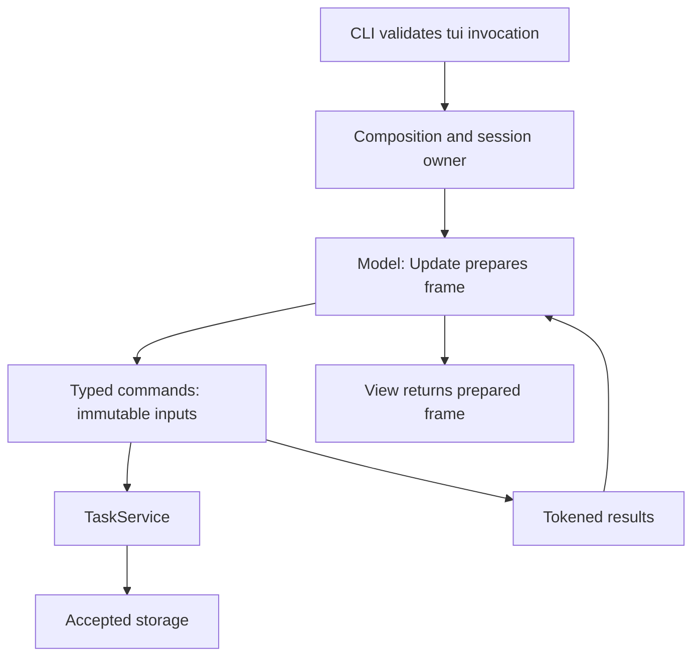
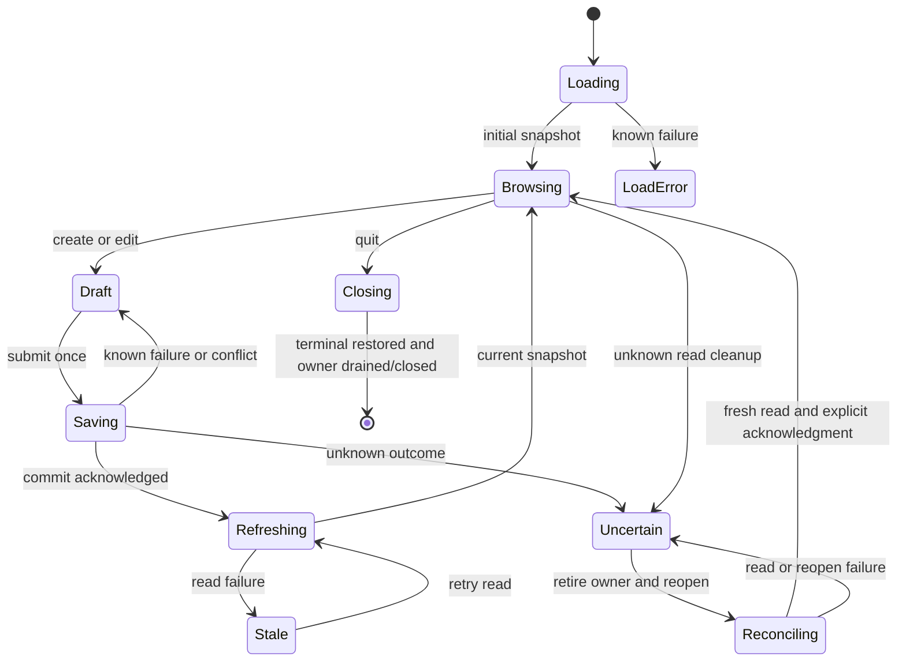
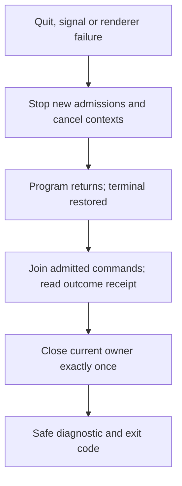
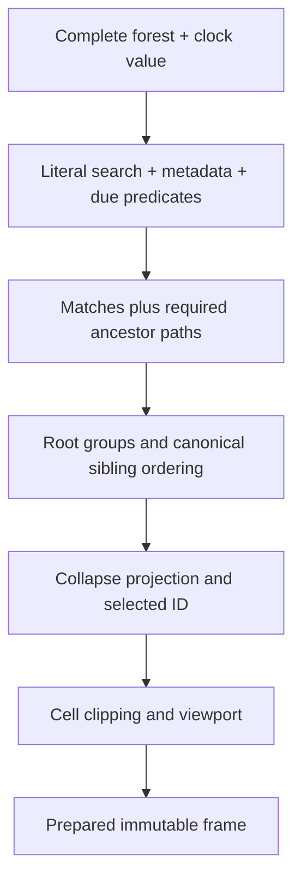

# Feature Plan 005: Interactive TUI Application

## Goal Capsule

Deliver `tusk tui`: a keyboard-driven task tree, details and timeline, live
search, and forms over the accepted task service. Keep rendering pure, preserve
drafts when operations fail, and restore the terminal on exit.

- **Authority:** [AGENTS.md](../../AGENTS.md), [MASTERPLAN.md](../../MASTERPLAN.md)
  and the [product contract](2026-09-06-001-feat-tusk-modern-task-system-plan.md).
- **Pack:** this plan, its [verification plan](../verification-plans/2026-09-06-005-feat-interactive-tui-application-verification-plan.md)
  and [issue workorder](../workorders/2026-09-06-005-feat-interactive-tui-application-issues-workorder.md).
  Artifacts belong under `docs/` in this first-party repository.
- **Surfaces:** CLI/TUI, internal service consumer, persistence lifecycle, and
  documentation. No browser, HTTP API, migration or release automation work.
- **Execution:** U1 → U7 → U2 → U3 → U4 → U5 → U8 → U6. U1–U6 retain the original
  masterplan identities; U7 splits runtime ownership from U1, U8 splits deletion
  and recovery interactions from U5. Tests accompany every unit; U6 is acceptance,
  not the first opportunity to write tests.
- **Execution authorization:** the owner invoked ce-work on 2026-09-29 with
  hands-on owned Kitty verification. U1 and U7 are locally accepted; U2 is active.
  See [U1 receipt](../verification-evidence/005/u1.json). Later unit and release
  acceptance remains pending; planning observations below remain historical.
- **Completion boundary:** each implemented unit needs red/green evidence,
  applicable terminal evidence, `make validate`, synchronized triplet/masterplan,
  and its own coherent local commit before advancing. Push, PR, merge and release
  require separate authority. Feature 006 retains native/hosted release gates.

---

## Live Baseline and Reconciled Assumptions

Planning inspected clean `main` at `e899491b9b897f5c958758c54567006aa5fb4a7a`
(merge of PR #4). Phase 4 local acceptance is recorded in the masterplan; its
old final-publication-watch pointer is stale. This observation is local Git
evidence, not a fresh hosted-check audit.

| Observed fact | Planning consequence |
| --- | --- |
| `internal/tui/` and a `tui` command do not exist | The old four-scenario outline was not an executable pack despite its frontmatter |
| Go 1.25.0, Cobra 1.10.2, Lipgloss 1.1.0, modernc SQLite 1.58.0/libc 1.75.6 are installed | Preserve the accepted runtime and CLI; prove the combined UI graph in U1 |
| `ports.TaskService` is synchronous and returns detached committed results | Commands own I/O; the UI owns stale-result rejection, drafts and recovery |
| `UpdateTaskCommand.Base`, lifecycle `Base`, and delete `Expected` exist | Use these contracts; do not add a second conflict protocol |
| Bare invocation displays help without opening storage | Only explicit `tusk tui` starts the session |
| Product R18/R24–R26 and KTD14 specify timeline, groups, debounce and refresh | Retain these even though the feature outline omitted them |
| Bubbles textarea v0.21.0 `View` calls a pointer-backed memoization cache | Render child components during constructor/Update; root `View` returns a prepared frame |
| Bubble Tea v1 does not join arbitrary running commands on shutdown | The session must cancel and drain admitted work before closing storage |
| Service history and tree are separate read snapshots | Show independent loading/freshness; do not claim an atomic tree/timeline snapshot |

Grounding: [service contracts](../../internal/ports/task_service.go),
[service handoff](../service.md), [CLI root](../../internal/cli/root.go),
[composition](../../cmd/tusk/app.go), [signal ownership](../../cmd/tusk/signal.go),
[terminal escaping](../../internal/cli/sanitize.go),
[outcome preservation learning](../solutions/database-issues/preserve-transaction-outcomes-through-error-redaction.md),
and [Makefile](../../Makefile). The service/core/storage APIs are implementation
authority; archived TUI code is not a template to revive.

---

## Product Contract

### Scope and actors

The developer browses, creates, edits, completes, reopens, reparents and deletes
tasks locally. A concurrent CLI/agent may change the same database. The maintainer
must distinguish committed, rolled-back and unknown outcomes and reproduce
terminal behavior. Existing CLI commands remain the automation surface for every
durable TUI action.

In scope: grouped complete forest, context-preserving search and filters, details,
safe Markdown, metadata timeline, create/edit forms, lifecycle toggles, explicit
recursive delete consent, refresh/conflict/recovery, supported terminal startup
and shutdown, minimum-Go/cross-build proof and CLI performance non-regression.

Out of scope: schema changes, sync/network access, accounts, mouse interactions,
external editor/clipboard integration, link opening, notifications, undo,
tombstones, persistent UI preferences, fuzzy search, themes/configuration files,
v2 migration, new service capabilities and release automation. Feature 006 owns
native macOS/Windows and final hosted packaging; local Linux terminal acceptance
is required here. System clipboard shortcuts are disabled; terminal-delivered
bracketed paste remains supported.

### Requirements

IDs here are feature-local. `P-Rn` denotes the unchanged product requirement.

| ID | Required behavior | Product source |
| --- | --- | --- |
| R1 | Explicit `tusk tui` with zero positional arguments; bare/help/version/syntax remain storage-free | P-R1,R19,R22,R23 |
| R2 | Require terminal stdin/stdout; use existing DB, timezone and parent-completion precedence; reject invalid config before open | P-R2,R9,R23 |
| R3 | Own one session repository, restore terminal and close exactly once per owner after admitted work finishes | P-R10,R12,R22,R29 |
| R4 | Pin the v1 UI family on Go 1.25; keep CGO-free release builds and existing CLI/storage contracts | P-R24,R27,R29 |
| R5 | Root `View() string` is read-only, deterministic and performs no component work, I/O or time queries | P-R24 |
| R6 | Every service call, wait and asynchronous render runs as a typed command; no model/service goroutine pool | P-R24,R29 |
| R7 | Represent initial loading, empty, filtered-empty, loaded, refreshing, stale, load failure, saving and save failure explicitly | P-R25 |
| R8 | Start/post-write/manual/2-second refresh; at most one service operation at a time; reject obsolete replies | P-R25; product KTD14 |
| R9 | Stable 40/60 list/details geometry at 80×24 and larger; smaller terminals preserve state and offer bounded resize/quit | P-R26 |
| R10 | Complete forest grouped Today/Upcoming/Backlog/Completed; canonical sibling order, depth context and selection by ID | P-R6,R13,R14,R25 |
| R11 | Literal Unicode search with 150 ms debounce and filters; include matching descendants' ancestors without corrupting the graph | P-R13,R16,R25 |
| R12 | Contextual keyboard routing, scrolling, focus indicators and modal focus trap; text never invokes browse actions | P-R24,R26 |
| R13 | Details show identity, metadata, local dates and numeric progress; asynchronous Markdown is bounded by viewport and freshness | P-R3,R7,R15,R26 |
| R14 | Timeline shows actual ordered metadata events; independent load/failure state, no fabricated old values | P-R18,R25 |
| R15 | User text cannot inject terminal controls, bidi overrides or OSC; plain presentation remains readable | P-R23,R26 |
| R16 | Create defaults and all editable fields map to existing commands; unchanged/clear/set remain distinct | P-R3,R4,R19 |
| R17 | Edit/lifecycle operations carry detached Base; preserve drafts on validation/storage/conflict failures | P-R5–R10,R25 |
| R18 | Manual leaf progress, moves, subtree completion and reopen obey service invariants; no optimistic persisted state | P-R5–R9 |
| R19 | One admitted mutation, no duplicate submit; known save plus failed refresh never offers resubmission | P-R10,R22,R25 |
| R20 | Delete previews target and exact scope; default Cancel, separate recursive intent, Expected check, no Force | P-R20 |
| R21 | Unknown outcomes freeze writes, retire the owner and require fresh-owner readback; never replay uncertain intent | P-R10,R22,R25 |
| R22 | Quit, Ctrl+C, process cancellation and output failures preserve outcome evidence and terminal/resource cleanup | P-R22,R26 |
| R23 | Long/unsupported editable text is never silently truncated or normalized; preserve raw unchanged fields | P-R4,R19,R23 |
| R24 | External edits/deletes/reparenting and resize cannot overwrite a different selection, form, history or render | P-R25 |
| R25 | Keep the existing CLI latency distribution gate; characterize TUI projection/render/startup with retained evidence | P-R28 |
| R26 | Synthetic, disk, PTY, owned Kitty, cross-build, native and hosted evidence remain distinct | P-R27,R29 |
| R27 | Red-first tests and ≥95% per nonexempt package coverage; canonical validation and separate commit per unit | P-R29 |
| R28 | Document command, keys, failures, recovery and accessibility; synchronize product/feature handoffs without claiming execution | P-R19,R22,R26,R29 |

---

## Planning Contract

### Key technical decisions

- KTD1. **Pinned compatibility, not a framework upgrade.** Add Bubble Tea
  `v1.3.10`, Bubbles `v0.21.0`, Glamour `v0.9.1`; retain Lipgloss `v1.1.0`.
  Bubble Tea requires `x/ansi v0.10.1`, upgrading the current `v0.8.0`; retain
  existing higher `x/sys v0.47.0`. Glamour `v0.10.0` requires a newer Lipgloss
  pseudo-version, so it is not selected. U1 verifies module resolution, minimum
  Go, license inventory and existing CLI formatting. These are source-backed
  selections, not claims that the combined graph has compiled.
- KTD2. **Prepare frames before View.** Constructor/Update exclusively own
  components, styles, derived rows, viewport content and the final frame string.
  Root View returns that string. Child View methods, including textarea's
  cache-writing View, run only in frame preparation. Init only returns startup
  commands. No shallow copy is claimed to isolate component caches. Explicit
  per-session renderer/color/background configuration avoids global detection.
- KTD3. **Compose runtime outside adapters.** Add an optional `RunTUI` function
  to `cli.Options`, supplied by `cmd/tusk`; the CLI validates grammar/config/TTY
  then delegates. `internal/tui` imports core/ports and UI libraries, never
  storage or CLI. `cmd/tusk` binds the existing service factory, streams,
  terminal profile, clock and pure `dateparse.DayBounds` function. Storage opens
  lazily through an initial command after terminal validation. No schema/API
  extension and no generic application framework.
- KTD4. **One service operation, bounded pending intent.** A session has one
  active service command; refresh/detail requests coalesce to flags/latest ID.
  An accepted write waits for a current read to finish (cancel that read first),
  then runs before refresh/history. Never queue two writes. Independent Markdown
  work has at most one active render plus the newest pending request. Commands
  capture cloned values and immutable tokens, never the live model or widgets.
- KTD5. **Generations are relevance, not database revisions.** Track owner epoch,
  active operation ID, forest generation, selection/incarnation, form instance
  and render width/content generation. Results must match their channel tokens.
  Service Base/Expected performs actual concurrency checks; timestamps alone are
  insufficient. A refresh never resets a form's base or raw draft.
- KTD6. **Use whole-tree projection.** GetTaskTree with empty ID supplies one
  complete snapshot, including done nodes. Project/filter that detached forest;
  never BuildTree from a filtered task list. Use core.FilterTasks for literal
  search and metadata predicates; use the injected DayBounds for due-day bounds
  with inclusive start/exclusive end. No new tree/service query or cache.
- KTD7. **Use the existing mutation contract.** Build patches only from dirty
  fields. Clone Base when opening an edit/toggle. Do not synthesize rollups,
  events or IDs in the UI. A committed task is a receipt; refresh the forest
  for authoritative ancestors and descendants. Nil/zero error results are not
  success placeholders.
- KTD8. **Uncertainty outranks error category.** Detect value and pointer
  `ports.TransactionError` through errors.As, including joined errors, before
  errors.Is. Unknown read cleanup also retires the owner. Recovery closes the
  old owner before opening the same resolved database; it never redirects paths,
  retries a write or deletes database/WAL/SHM files.
- KTD9. **Render untrusted notes off the event loop.** Use an isolated Glamour
  renderer per admitted Markdown command with fixed built-in style, explicit
  width/profile and no environment style path or terminal background query.
  Sanitize source controls, then strip generated non-SGR escapes; disable OSC
  links. Renderer failures show safe plain text. Ignore obsolete render replies.
- KTD10. **Share only demonstrated display policy.** Extract the existing CLI
  scalar sanitizer into `internal/terminaltext` with byte-for-byte CLI regression
  fixtures. Add a multiline variant preserving LF and expanding tabs to four
  spaces; other controls retain visible escapes. No global renderer or broad
  formatter rewrite. Widget drafts remain raw; sanitization is a display concern.
- KTD11. **Real lifecycle evidence is required.** Keep Bubble Tea's panic
  protection and one process signal owner; add local panic-to-safe-message
  guards around model transitions and admitted commands to avoid leaking panic
  payloads. A private session admission/drain guard covers work Bubble Tea does
  not join. It lives at the runtime boundary, not in service/domain code.
- KTD12. **No new universal latency promise.** Existing CLI thresholds remain
  blocking. TUI fixture budgets and baseline measurements are defined in the
  verification plan; no numeric View-only result is presented as key-to-screen
  latency or proof for arbitrary data size.

### Dependency evidence

Checked version-specific primary sources on 2026-09-29:

| Source | Decision supported |
| --- | --- |
| [Bubble Tea module](https://raw.githubusercontent.com/charmbracelet/bubbletea/v1.3.10/go.mod) | Go 1.24 minimum, Lipgloss 1.1.0, ansi 0.10.1 |
| [Bubbles module](https://raw.githubusercontent.com/charmbracelet/bubbles/v0.21.0/go.mod) | Go 1.23, compatible v1 Bubble Tea/Lipgloss dependencies |
| [Glamour 0.9.1 module](https://raw.githubusercontent.com/charmbracelet/glamour/v0.9.1/go.mod) and [0.10.0 module](https://raw.githubusercontent.com/charmbracelet/glamour/v0.10.0/go.mod) | 0.9.1 preserves the selected Lipgloss version |
| [Textarea source](https://raw.githubusercontent.com/charmbracelet/bubbles/v0.21.0/textarea/textarea.go) | Pointer cache in View, line ceiling, clipboard command defaults |
| [Bubble Tea runtime](https://raw.githubusercontent.com/charmbracelet/bubbletea/v1.3.10/tea.go) and [options](https://raw.githubusercontent.com/charmbracelet/bubbletea/v1.3.10/options.go) | v1 View signature, asynchronous command shutdown, signal options |
| [Glamour renderer](https://raw.githubusercontent.com/charmbracelet/glamour/v0.9.1/glamour.go) | Explicit style/width/profile avoids environment style-file and auto-background paths |

### High-level design

These sketches define responsibilities and ordering. Helpers may be smaller
than the boxes; do not implement a framework to mirror the diagrams.





```mermaid
sequenceDiagram
  participant U as User
  participant M as Model
  participant C as Command
  participant S as Service
  U->>M: Submit draft
  M->>M: Freeze submit; invalidate pending reads
  M->>C: Detached patch + Base + operation token
  C->>S: Atomic mutation
  S-->>C: Committed result or typed error
  C->>C: Record outcome before publishing message
  C-->>M: Matching operation result
  M->>M: Close saved form or retain failed draft
  M->>C: Refresh committed state or fresh-owner recovery
```





### Invocation and lifecycle

`tusk tui [--timezone ZONE] [--auto-complete-parent[=BOOL]]` accepts inherited
policy flags, `--help`, and no `--json` or positional arguments. Syntax returns
2; invalid config, non-TTY input/output or `TERM=dumb` returns 1 with safe CLI
guidance before storage/raw-mode initialization. `tui --help` returns 0 even with
invalid configuration or pipes. `NO_COLOR` selects monochrome content; it does
not disable the cursor/alternate-screen control sequences needed by a capable
terminal. An unset TERM with real terminal streams uses the conservative profile.

Sample terminal facts and resolve config once. Resolve the database identity at
first open and retain it for recovery; do not resample environment/cwd on reopen.
Reuse the current factory with an explicit resolved storage option in the
composition root if necessary; CLI defaults and precedence stay unchanged.
No UI constructor or View opens storage, queries terminal appearance or reads
files. TUI output goes directly to supplied stdout; don't accumulate frames in
the CLI result buffer. Final errors go to supplied stderr after terminal restore.
Wrap the supplied terminal writer to record its first short/error write and
cancel the run; do not assume Bubble Tea's renderer propagates writer errors.
The wrapper must serialize its own failure record, retain the original error
category and never write diagnostic text into a frame. The runner merges that
record with final service/cleanup outcome after draining.

The CLI seam is `RunTUI(context.Context, Config) (TUIResult, error)` on Options.
`TUIResult` contains `HadCommittedChanges` and `OutcomeUnknown` booleans;
cmd/tusk translates the runtime's equivalent result without tui importing cli.
On error, the tui diagnostic checks OutcomeUnknown first, then reports any
earlier acknowledged changes separately. An earlier successful save must not
hide a later unknown mutation/read cleanup, and must not make a later rejected
write sound committed. Otherwise it uses the existing safe error categories.
This session-specific path leaves existing one-command CLI diagnostic precedence
unchanged. A successful q returns 0 and no final task/result payload.

Run Bubble Tea with explicit input/output/context, alternate screen and
WithoutSignalHandler. The existing process context owns SIGINT/SIGTERM (Windows
uses its existing supported interrupt policy); raw Ctrl+C becomes a model key.
Normal browse `q` returns 0. Ctrl+C/process cancellation returns 1. Saved data
stays saved. `q` is literal in text entry; while saving ordinary close/Esc is
disabled and Ctrl+C remains available.

Each service operation has a 10-second context deadline, encompassing the
existing 5-second busy timeout; cancellation remains cooperative. Wait/timer
commands select on the session context. An admission guard registers work when
its command actually starts, under the same lock that shuts admissions; commands
starting after shutdown do no I/O. On Program return, cancel, reject new starts,
wait for registered work, then close storage. A command records acknowledged or
unknown mutation outcome before returning its message, so cancellation between
commit and message delivery cannot erase the outcome. UI results and this small
runtime receipt have separate owners; no goroutine mutates Model.

If graceful drain exceeds 10 seconds, show a safe cleanup-in-progress message
after terminal restoration and keep waiting for the admitted call; never close
under a running callback. Existing subsequent-signal escalation can terminate
the process; forced termination cannot guarantee cleanup. Test the supported
graceful path and retain the documented limitation. Returned run, close and
writer errors map to exit 1; preserve known commit or unknown outcome in the
diagnostic. Do not print raw error wrappers, panic values, notes or paths.

### Refresh and response protocol

The first successful open schedules the first forest load. Start a single
2-second timer chain; consume a tick before scheduling the next. Timer/manual
refresh requests during an active read set one pending refresh flag, without
invalidating the active read endlessly. Search debounce has its own generation
and 150 ms delay; superseded timers cannot apply prior search text.

Dispatch priority after an active service command completes: required recovery,
admitted mutation, forest refresh, latest selected-task history. A mutation
invalidates earlier forest/history generations immediately; saving ends only
on the matching write result. After success schedule exactly one fresh tree
load, then current history. Periodic refresh never steals modal focus, rebases
a draft or queues another write. An operation's result clears its busy slot
even when its payload has become irrelevant.
For the matching active owner/operation, process transaction uncertainty and
resource completion before rejecting stale display payloads. An obsolete read
with an unknown outcome still retires that owner. Messages from an already
retired owner cannot close its replacement. A waiting mutation may start after
a deliberately canceled read returns known cancellation; any other read failure
aborts its admission, preserves the draft and requires fresh readback first.

| State/result | Required visible behavior |
| --- | --- |
| No snapshot, load pending/error | Fixed-size loading/error panel; `r` retries reads; `q` exits |
| Empty database | “No tasks”; `a` creates; navigation/delete/edit are safe no-ops |
| Nonempty forest with no matches | “No matching tasks”; show active filters and clear action |
| Refresh pending | Keep rows, selection and drafts; show Refreshing |
| Refresh failed | Keep snapshot labeled Stale; mutations disabled until fresh load |
| Save known failure | Keep raw draft/field focus; show trusted error; explicit retry only |
| Save conflict | Keep draft and old Base; refresh current state for comparison; no automatic rebase |
| Save success, refresh failure | Close saved form; “Saved; refresh failed”; disable writes pending readback |
| Owner outcome unknown | Block writes; quarantine uncertain intent; offer Reload/readback or Quit |

Refresh can update the underlying forest during editing, but the form retains
its original Base. For conflict, offer **Keep draft** or **Reload task (discard
draft)** with Keep draft focused. Keep draft stays non-submittable until the user
resolves the conflict; no force-overwrite or automatic merging. Read-only draft
text remains visible for manual comparison. If the task disappeared, allow
discard/quit; do not convert an edit into a creation.

### Projection, search and navigation

Use one clock value supplied by a result/tick, never View. Groups appear in
Today, Upcoming, Backlog, Completed order; omit empty group headings. Today is
every open root due before the next local day (including overdue); Upcoming is
open roots due on later days; Backlog is undated open roots; Completed is done
roots regardless of due. Descendants stay with their root. Sort siblings with
core's canonical order. Default expansion shows all levels; collapse state is
session-local and keyed by ID. Group headings are not selectable.

`/` enters search; the live draft applies after debounce. Enter accepts; Esc
restores the query/selection/collapse state from entry. `f` opens a filter form
for status, priority, all-of tags and due-day expression; empty status selection
means all statuses in this TUI forest, including done. OR within status/priority,
AND across fields. Enter on Apply commits filters; Clear resets them. Resolve
relative due-day expressions on Apply and display the resulting local date;
they stay that day until changed. Search uses the current forest, not a DB call
on every key. Predicate matches plus ancestors form the visible projection;
ancestors show “context”. A matching parent does not make unrelated descendants
match. Search/filter paths temporarily expand; clearing restores saved collapse
state. Clear all filters with `Esc` while browsing (no modal active).
When Esc restores a pre-search selection/collapse snapshot, reconcile its IDs
against the latest accepted forest; do not resurrect externally removed rows.

Keep selection by task ID and CreatedAt incarnation if still visible. Otherwise
choose the row at the previous selectable index, clamped to the last row; an
empty projection has no selection. Collapsing a branch containing the selection
selects its ancestor. Scroll just enough to keep selection visible. Expansions
for removed IDs are pruned only on an accepted full forest, not filtered output.

| Context | Keys | Behavior |
| --- | --- | --- |
| List | j/k, Up/Down, g/G, PgUp/PgDn | Previous/next, first/last, page; clamp at bounds |
| List | h/l, Left/Right | Collapse/expand selected branch; leaf no-op |
| Browse | Tab/Shift+Tab | Cycle list/details; details scroll with arrows/j/k/pages |
| Browse | a, e, d, x/Space | Create root, edit selected, preview delete, complete/reopen selected |
| Browse | /, f, r, ?, q | Search, filters, refresh, help, quit |
| Search | text, Enter, Esc | Literal input, accept, restore pre-search state |
| Form | Tab/Shift+Tab, Enter, Esc, Ctrl+S | Focus cycle; field-specific Enter; cancel; Save |
| Notes field | Enter | Insert LF; use Ctrl+S or focused Save button to submit |
| Help | ?, Esc, q | Close help and restore prior focus; other mutations suppressed |
| Any | Ctrl+C | Cancel/exit; do not submit, replay or silently mark success |

### Layout and safe presentation

For W≥80 and H≥24: body height H−2, one fixed status/search row and one help row.
List outer width floor(0.4×W); details gets the remainder, including their own
borders. Inner dimensions subtract frame/padding and clamp at zero. At 80×24
the two outer panels are 32×22 and 48×22; titles and controls never change this.
Use two-space tree indentation, bounded to reserve at least one title cell;
deep nodes keep depth/continuation markers when indentation must be clipped.

Modals are centered within the body with outer width min(72,W−4), outer height
min(20,H−4). Their field area scrolls; buttons and errors stay reachable.
Use a bounded cell compositor for the overlay; `lipgloss.Place` alone centers
content but does not merge it onto the existing frame. Clip at cell/grapheme
boundaries, reset styles at clipping boundaries, and pad the full frame without
an extra trailing newline. Width-zero input returns an empty frame; below minimum
show a clipped “Resize to 80×24; Ctrl+C quits” message and retain all model state.
Normal browse `q` still quits there; with a draft it stays draft text and Ctrl+C
is the always-available exit. Resizes during saving do not cancel the mutation.

Use ASCII focus/selection marker `>`, explicit status/priority words and numeric
progress with an optional bar. Colors are supplementary. Fixed neutral styling,
no auto background probe, no animation/spinner requirement; use a steady form
cursor. NO_COLOR renders without SGR, including Markdown. Mouse and clipboard
commands stay disabled. Tab traversal, Help and visible instructions must expose
every action at minimum size. No claim of screen-reader acceptance without
actual assistive-technology evidence; CLI plain/JSON remains available.

### Details, timeline and raw text

Details header shows full ID in a wrappable area, title, status, priority,
parent/root, tags, local due/created/updated/completed times with zone/offset,
and progress. Missing dates use an explicit placeholder. Description and
timeline are scrollable sections of one details viewport; Home/End and page
keys reach either. History uses GetTaskHistory and ascending Sequence, local
time display, event kind and changed field names. An existing task with no
events is “No history”; missing task triggers forest refresh. Previous task
history must disappear immediately when selection changes.

Markdown results carry task ID/incarnation, forest/content generation, width
and profile. Build a new renderer per command; no mutable shared Glamour object.
Width changes invalidate old output. Each successful render becomes immutable
viewport content in Update. A render failure falls back to sanitized text and a
small status label. No remote images, network reads, hyperlinks, file-style
loading or executable code. Test malicious source AND generated output.

Do not let Bubbles' text sanitizers or 10,000-line ceiling rewrite existing data.
Keep raw base/draft strings separate from rendered text. Before loading an
editable field, verify its widget round-trip preserves every byte; unsupported
controls or oversized notes show safe read-only text and an explicit **Replace
field** action (default Cancel, replacement starts empty). Other field edits omit
that field. No automatic unescaping or saving an escaped display value. Validate
incoming paste as a whole before applying it; reject unsupported/truncated input
with a visible error, retaining the prior draft. LF notes and terminal bracketed
paste are supported; NUL/invalid UTF-8 are rejected. Preserve tabs/control bytes
in unchanged stored notes even when their display is escaped.

### Forms, writes and deletion

Create opens a root draft: blank title/notes/due/tags, medium priority, no parent;
service supplies todo/progress 0. Parent is optional exact ID, with a local
searchable picker showing eligible tasks; blank means root. Existing-task edit
also exposes status and leaf progress. Parent picker excludes self/descendants
for usability; authoritative service still enforces cycles and depth. Priority
and status are selects; tags accept the CLI's comma-separated tokens; due accepts
the service grammar and displays the configured timezone. Clear due/parent/tags
is explicit; unchanged existing date is omitted, never reparsed from presentation.

Field order: title, notes, priority, due, tags, parent, edit-only status/progress,
Save, Cancel. Enter advances single-line fields; Enter activates buttons; notes
Enter inserts LF. Ctrl+S invokes the same validation/submit path. First invalid
field receives focus; form-level storage/conflict errors do not erase values.
Esc on a dirty form opens Discard/Keep editing, default Keep; a clean form closes.
All text including q/d/? remains input. Empty/equal edit closes as “No changes”
without a write. Disable Save while a write is admitted, including its wait for
a canceled read to drain; make queued inputs unable to submit another operation.

Only dirty fields become a patch. Leaf progress is 0–99 when open and read-only
when done; parent progress is derived. If progress plus parent/status changed,
show the existing contract error and require separate saves. x/Space completes
the subtree for open tasks; for done tasks it reopens to todo using Base. Show
the subtree effect in help/status; no descendants are reopened implicitly.
The same methods and policy govern form status changes and moves.

`d` starts PreviewDeleteTask without writing. Freeze its target ID/incarnation
and modal instance; navigation cannot change consent. Show escaped target title,
full ID, total count including target, descendant count, and “cannot undo; history
is removed”. Leaf deletion needs focused Delete + Enter. For a parent, **Delete
entire subtree** starts unchecked and Delete stays disabled until explicitly
checked with Space. Cancel is always initially focused. Neither d, y, q nor a
second Enter on the initial Cancel is delete consent. Then call DeleteTask with
Expected=that exact preview, Recursive=explicit checkbox, Force=false.

A stale preview error clears old consent and requests a new preview; reset
Cancel/unchecked recursion. Do not update an existing confirmation count under
the user's cursor and carry consent forward. Removed targets dismiss with
“Task no longer exists”, refresh, and write nothing. Busy/known failures preserve
the dialog but require fresh preview before another delete attempt. On success,
close dialog, refresh and apply the standard neighbor-selection rule.

### Unknown-outcome recovery

Freeze mutation keys and preserve uncertain draft as read-only, labeled
“Outcome unknown — do not resubmit”. Once the active service call has returned,
retire/close its owner; failure to close prevents in-session reopen and requires
exit plus an independent CLI readback. On successful close, Reload opens a new
owner for the same resolved path, loads the complete forest and, for a retained
target, its history. Owner epoch rejects every old message. Failures stay frozen;
retry only the read/reopen path, never the mutation.
The recovery command owns the exclusive service slot and closes the retired
repository there. It must not invoke the shutdown guard's global drain while
registered as active work itself; that would wait on its own completion. Global
admission closure/drain is reserved for Program shutdown.

Fresh state may be old or new, and concurrent actors can also change it. Show
what is now stored without claiming which operation caused it. For uncertain
creation, the service may not expose a created ID: never guess a task by title,
deduplicate automatically or offer “Retry create”. For an absent delete target,
show absence; there is no deleted history to reconstruct. Acknowledge readback
and discard the uncertain intent before enabling new mutations; retain a visible
read-only draft for comparison until that explicit discard. New creates start
blank. Known committed saves do not enter this uncertain path solely because a
later refresh failed.

---

## Implementation Units

All paths below are planned unless already present. Root files shared by later
units change sequentially. Each unit owns its focused tests, documentation and
evidence; no unit can claim a later unit's acceptance. Expected red failures below
are specifications, not observed results.

### U1. Pure root, dependency graph and deterministic seams — 005-1

- **Goal / requirements:** R4–R7,R27; product U16. Establish KTD1/KTD2 and testable
  constructor options before consumers.
- **Dependencies / ownership:** accepted Phase 4; `go.mod`, `go.sum`,
  `internal/tui/model.go`, `messages.go`, `model_test.go`, `compatibility_test.go`,
  shared fixture helpers, and Makefile targets `test-tui`/`build-tui`.
- **Approach:** inject service/session functions, clock, cancellable wait and
  render seam; initialize components/styles and prepared frame. Model contains
  no storage owner. Do not implement forms or navigation early.
- **Red first:** TestView_ColdAndRepeatedCallsPreserveDeepState (before first
  render, then 100 calls with populated textarea), TestCommand_NoLiveModelCapture,
  TestTUI_V1Compatibility fail on missing model/API or cache mutation. Add tests
  before pins/implementation; package-not-found is an initial compile Red only,
  followed by behavioral failing cases before their code.
- **Verify:** `make test-tui TUI_TEST_RUN='TestView_|TestCommand_|TestTUI_'`;
  minimum-Go `make test-unit build-tui`; `make check-modules validate`.
- **Failure / reviews:** graph/minimum-Go/CLI ANSI regression blocks U7; do not
  silently move to v2. Architecture, purity, portability and test reviews;
  source/pin receipts plus V01–V12. No visible session yet.

### U7. CLI registration and session lifecycle — 005-7

- **Goal / requirements:** R1–R3,R6,R21,R22,R24,R27; establish KTD3/KTD4/KTD8/KTD11.
- **Dependencies / ownership:** U1; `internal/cli/tui.go`, `root.go` Options seam,
  `cmd/tusk/tui.go`, composition/signal tests, `internal/tui/session.go` and
  lifecycle/fault tests. Runtime guard is session-local.
- **Approach:** lazy command-based open, config/TTY admission, typed run result,
  canceled-command drain and close ownership; inject real terminal streams only
  in cmd. Provide recovery lifecycle before mutation consumers.
- **Red first:** TestTUIAdmission_NoOpen, TestSession_CancelDrainsBeforeClose,
  TestSession_LateCommandDoesNotOpen, TestSession_CommitBeforeDroppedMessage,
  TestSession_ReopenSamePath fail on missing dispatch/early close/outcome loss.
- **Verify:** `make test-cli CLI_TEST_RUN='TestTUI|TestSession'` and
  `make test-tui TUI_TEST_RUN='TestSession'`; `make validate build`;
  owned Kitty launch/quit/Ctrl+C with isolated DB.
- **Failure / reviews:** constructor/run/read/write/close faults must preserve
  outcome and restore terminal; no close-under-command. Lifecycle, concurrency,
  safe diagnostics and CLI contract review; V13–V26 receipts.

### U2. Bounded geometry and shared terminal text — 005-2

- **Goal / requirements:** R5,R9,R12,R15,R23; product U16; KTD2/KTD10.
- **Dependencies / ownership:** U7; `internal/tui/layout.go`, `styles.go`,
  `frame.go`, `keymap.go`, layout fixtures; `internal/terminaltext/` and the
  minimal CLI sanitizer delegation with its existing fixtures retained.
- **Approach:** fixed dimensions, cell-safe overlay, small-screen state, explicit
  monochrome styling and prepared component frames.
- **Red first:** TestResize_CellBoundsAndDraftRetention, TestOverlay_FocusAndClip,
  TestTerminalText_ControlAndUnicode, TestCLI_SanitizerCompatibility fail on
  overflow, View cache changes, control injection or changed CLI bytes.
- **Verify:** `make test-tui TUI_TEST_RUN='TestResize|TestOverlay|TestTerminal'`;
  `make test-cli`; `make validate build`; owned Kitty size/NO_COLOR inspection.
- **Failure / reviews:** zero/negative dimensions never panic or destroy state;
  no field-value clipping feeds persistence. Design, accessibility, security,
  purity and non-regression review; V27–V39.

### U3. Forest navigation, search and refresh — 005-3

- **Goal / requirements:** R7,R8,R10–R12,R24; product U17; KTD4–KTD6.
- **Dependencies / ownership:** U2; `internal/tui/navigation.go`, `projection.go`,
  `refresh.go`, `search.go`, `filters.go`, messages and corresponding tests.
- **Approach:** complete-snapshot projection, coalesced single service operation,
  independent timer tokens, selection by ID and retained modal drafts.
- **Red first:** TestRefresh_ReorderedRepliesAndWriteBarrier,
  TestSearch_ContextCollapseAndDebounce, TestSelection_RemovedOrMoved,
  TestProjection_DueDayDST fail on stale overwrite, lost ancestors or wrong day.
- **Verify:** `make test-tui TUI_TEST_RUN='TestRefresh|TestSearch|TestSelection|TestProjection|TestNavigation'`;
  `make validate build`; Kitty search/resize/external CLI change inspection.
- **Failure / reviews:** known refresh errors label stale and block writes;
  unknown reads use U7 recovery; bounded pending flags avoid retry storms.
  Concurrency, correctness, performance and keyboard review; V40–V56.

### U4. Details, safe Markdown and history — 005-4

- **Goal / requirements:** R13–R15,R23,R24; product U18; KTD5/KTD9/KTD10.
- **Dependencies / ownership:** U3; `internal/tui/details.go`, `markdown.go`,
  `history.go`, viewport/security/render tests and fixtures.
- **Approach:** immutable content results with width/task tokens; history has its
  own freshness; no hidden external process/file/network renderer behavior.
- **Red first:** TestDetails_LateHistoryForOtherTask,
  TestMarkdown_ControlsAndNoExternalEffects, TestMarkdown_ResizeDiscardsOldRender,
  TestDetails_LongNotesAndFallback fail on cross-task content or unsafe output.
- **Verify:** `make test-tui TUI_TEST_RUN='TestDetails|TestMarkdown|TestHistory'`;
  `make validate build`; Kitty long notes/history/plain presentation.
- **Failure / reviews:** safe text fallback and last-good content only for the
  same target; no silent timeline fabrication. Privacy, dependency behavior,
  async races and usability review; V57–V67.

### U5. Forms and nondestructive mutation interactions — 005-5

- **Goal / requirements:** R12,R16–R19,R23,R24; product U19; KTD5/KTD7.
- **Dependencies / ownership:** U4; `internal/tui/forms.go`, `draft.go`,
  `mutations.go`, form/lifecycle/disk integration tests.
- **Approach:** dirty-field patching, exact Base, raw-string preservation,
  explicit clearing, conflict/discard flows and one admitted mutation.
- **Red first:** TestForm_LiteralKeysAndRawRoundTrip,
  TestForm_ConflictKeepsBaseAndDraft, TestSave_RefreshFailureCannotResubmit,
  TestToggle_SubtreeAndReopen fail on draft loss, stale overwrite or duplicate
  writes. Real disk tests verify rollup/history with two independent owners.
- **Verify:** `make test-tui TUI_TEST_RUN='TestForm|TestSave|TestToggle|TestMove'`;
  `make validate build`; Kitty create/edit/paste/conflict/cancel scenarios.
- **Failure / reviews:** known failures retain editable drafts; uncertain results
  use U7 freeze/retire and U8 reconciliation; no retries or local rollups.
  Contracts, data integrity, races and interaction review; V68–V86.

### U8. Confirmed deletion and uncertainty reconciliation — 005-8

- **Goal / requirements:** R19–R22,R24; product U19; KTD4/KTD5/KTD8.
- **Dependencies / ownership:** U5; `internal/tui/confirm.go`, `recovery.go`,
  consent/reconciliation/disk failure tests; U7 runtime seam only as required.
- **Approach:** pinned preview/explicit recursion, refreshed consent on conflict,
  read-only quarantined drafts, fresh-owner readback and explicit discard.
- **Red first:** TestDelete_DefaultCancelAndSeparateRecursiveIntent,
  TestDelete_ChangedMembershipRequiresNewConsent,
  TestRecovery_UnknownCreateNeverReplays, TestRecovery_OldOwnerMessagesIgnored
  fail on implicit consent, category-first retries or guessed creation identity.
- **Verify:** `make test-tui TUI_TEST_RUN='TestDelete|TestRecovery'`;
  `make validate build`; owned Kitty leaf/parent deletion and recovery UI using
  test-injected outcomes (label injection separately from real SQLite proof).
- **Failure / reviews:** close failure blocks reopen; reopened read failure stays
  frozen; absent target is displayed without claiming who deleted it. Destructive
  action, transaction integrity, diagnostics and state-machine review; V87–V100.

### U6. Workflow, performance, terminal acceptance and handoff — 005-6

- **Goal / requirements:** R1–R28 end-to-end; product U20; KTD12.
- **Dependencies / ownership:** U8; `internal/tui/workflow_test.go`, `bench_test.go`,
  process/PTY fixtures in `cmd/tusk`, Makefile `bench-tui`, `docs/tui.md`, README,
  feature evidence and synchronized product/feature packs.
- **Approach:** full workflow plus disk concurrency, restoration and final
  candidate evidence. Retain earlier unit receipts and source/binary hashes.
- **Red first:** TestWorkflow_EditConflictReadbackAndQuit,
  TestTUIProcess_TerminalRestoredOnFailure,
  TestTUIProcess_CommittedBeforeCancel fail on composition/sequence defects.
  Benchmarks characterize behavior; introduce threshold assertions only where
  this plan defines a fixture budget, not by blessing a failing measurement.
- **Verify:** `make validate build check-generated`; minimum-Go `make test build-tui`;
  `make bench-tui`; `make bench-cli CLI_BENCH_OUTPUT=docs/verification-evidence/005/cli-latency.json`;
  full owned Kitty matrix. No concurrent workload during latency measurement.
- **Failure / reviews:** missing visual proof leaves phase acceptance open;
  performance/cleanup failures block local acceptance; cross-build is not native
  proof. Sequential architecture, correctness, security, simplicity, accessibility,
  concurrency, testing and performance reviews; V101–V110 local, V111–V112 handed
  to Feature 006. Independent corroboration must be named if unavailable.

---

## Verification Contract and Definition of Done

The [verification matrix](../verification-plans/2026-09-06-005-feat-interactive-tui-application-verification-plan.md)
maps all 28 requirements to 112 scenarios. V01–V110 are local feature obligations;
V111–V112 are native/hosted release handoffs. Every box is initially unchecked.
The [workorder](../workorders/2026-09-06-005-feat-interactive-tui-application-issues-workorder.md)
separates corrected planning defects from still-open execution gates.

Planned Makefile additions: `test-tui` (packages internal/tui, internal/cli and
cmd/tusk with `TUI_TEST_RUN`, plus terminaltext once introduced); `build-tui`
(five CGO-free application and TUI/test builds, same target set as build-cli);
`bench-tui` (deterministic fixture measurements and retained machine-readable
results). Existing `make validate` remains mandatory with ≥95% coverage and
module checks; do not exempt the new packages. These targets do not exist yet.

Local completion requires all eight separately committed units, matching
source/evidence revisions, every local scenario actually executed, closed local
blocking findings, successful canonical/minimum-Go gates, unchanged CLI public
behavior and latency acceptance, visible owned Kitty proof and updated docs.
Retain raw benchmark failures/outliers. Record native/hosted release obligations
as pending, never waive them through local green. This planning pass closes only
the planning-pack checklist and does not close any implementation/release box.

No unresolved product question blocks starting U1. Runtime compatibility, exact
candidate performance, real terminal behavior and native/hosted proof remain
execution gates with owners and closure evidence. If those invalidate a selected
dependency or product contract, stop that unit and synchronize the affected
triplets before adopting a replacement; do not silently weaken the gate.

### U7 compatibility finding — eager terminal discovery (2026-09-29)

The first linked application exposes Bubble Tea v1.3.10 `tea_init.go`: its
package initializer calls global `lipgloss.HasDarkBackground` before CLI
admission. An unanswered OSC query delays startup by five seconds and breaks
existing real-PTY CLI confirmation tests. The new no-discovery regression is
Red; see `docs/verification-evidence/005/u7-red-global-terminal-query.log.gz`.

KTD1 is amended before remediation: retain the v1.3.10 APIs and module graph,
but use a repository-local copy under `third_party/bubbletea` with only that
initializer removed. Preserve the upstream MIT license, complete source/test
files, version/checksum provenance and per-file hashes. The TUI already owns
explicit per-session color/background settings. Do not set global renderer
state, require environment workarounds or relax timing/readiness gates.
Canonical module checks, source-integrity tests, the real PTY suite and Kitty
relaunch must pass before U7 can complete. This is a narrow compatibility patch,
not a v2 migration; U6 must repeat final-candidate CLI distribution checks.

### U7 local acceptance — 2026-09-29

[Lifecycle receipt](../verification-evidence/005/u7.json) records V13–V26,
red/green regressions, canonical validation, minimum-Go/race/cross-build proof
and real Kitty app usage. The pinned-source initializer patch is verified;
final CLI distributions remain U6. No test/build/benchmark results run in Kitty.
U2 bounded geometry and shared safe text is next.
