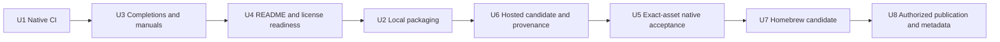
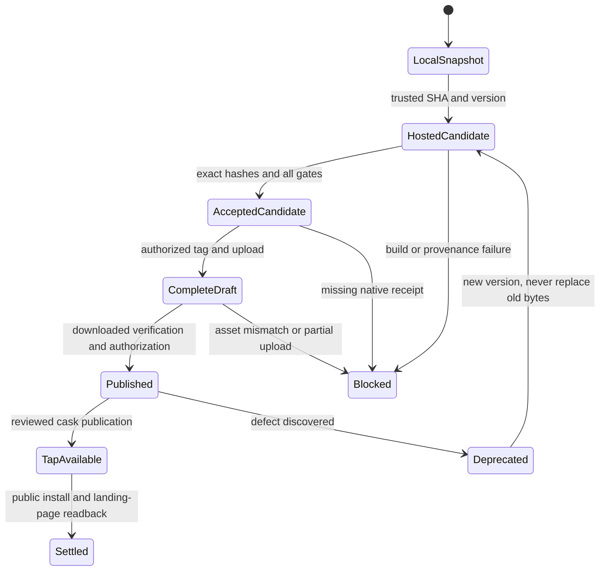

# Feature Plan 006: Automation, Packaging, Release and Public Repository Readiness

## Goal Capsule

Make Tusk installable and understandable from its GitHub repository, with verified
CLI/TUI binaries, useful documentation and a repeatable release process. Users
should be able to select their platform, verify a download, create their first
task and find the data/recovery instructions without reading planning artifacts.

- **Actors:** Terminal users, script/agent users, contributors and release maintainers.
- **Authority:** [AGENTS.md](../../AGENTS.md), the [product contract](2026-09-06-001-feat-tusk-modern-task-system-plan.md), and [MASTERPLAN.md](../../MASTERPLAN.md). The masterplan controls activation and progress.
- **Surfaces:** CLI/TUI integration, infrastructure/operations, installation/data lifecycle, documentation and GitHub repository settings.
- **Artifact pack:** This plan, its [verification plan](../verification-plans/2026-09-06-006-feat-automation-packaging-and-release-verification-plan.md) and [workorder](../workorders/2026-09-06-006-feat-automation-packaging-and-release-issues-workorder.md), under the existing first-party `docs/` root.
- **Readiness:** U1/U3/U4/U2 are locally accepted; U6/U5/U7/U8 local engineering and the repeated local review are complete. Branch/PR publication is authorized. There are 51 local scenario closures; actual hosted/native/release gates remain pending.
- **Sequence:** U1 → U3 → U4 → U2 → U6 → U5 → U7 → U8. U1/U2/U3 preserve the original CI/packaging/completion identities.

The original request authorized planning. The 2026-10-01 `ce-work` invocation
authorizes local implementation and validated per-unit commits in the declared
order. GitHub metadata changes, workflow dispatch, pushes, tags and release
publication retain their separate concrete-candidate authorization gates.

---

## Product Contract

### Problem frame and current evidence

On 2026-10-01, local and remote `main` both resolve to
`2f2d3ffe8c52d780553f2073fff0d07d89bde4ba`; Feature 005 merged in PR #5 at
`42d7c52`. The checkout was clean before this planning pass. The CLI, TUI,
storage, version command and guides exist. Completion is explicitly disabled in
`internal/cli/root.go`; version is the constant `0.2.0-reboot` in
`cmd/tusk/main.go`. `go.mod` requires Go 1.25.0 and contains local Bubble Tea and
Glamour replacements. Those patched modules and their regular Git gallery bytes
must survive source packaging and fresh checkout.

Live GitHub inspection of [newbpydev/tusk](https://github.com/newbpydev/tusk)
found a public repository with admin access, a description, empty topics/homepage,
no detected project license, no releases/tags and zero Actions workflows. Issues
are enabled; Discussions and Pages are disabled. No first-party `LICENSE`,
`CONTRIBUTING.md`, `SECURITY.md`, `.github/` or `.goreleaser.yaml` exists.
`newbpydev/homebrew-tap` returned 404 to the authenticated inspection; it is an
unverified distribution prerequisite, not an existing destination.

The previous short outline's `implementation-ready` label was unsupported. Its
Go 1.24 assumption and binary Homebrew formula approach are superseded below.
Historical local Feature 002–005 receipts remain evidence for those candidates;
they do not prove this release candidate's native consoles or downloaded assets.

### Requirements

#### Native CI and build governance

- R1. CI runs for pull requests targeting `main`, pushes to `main` and explicit dispatch; PR jobs have read-only repository permissions and no publishing secrets.
- R2. Execute canonical native quality/build gates on all five release OS/architecture pairs using the pinned release compiler; additionally prove the Go 1.25.0 source minimum on Linux and compile all five targets with that minimum.
- R3. Windows gates use Git Bash, GNU Make and a matching native C compiler for Go race builds; no WSL result or cross-build closes native Windows acceptance.
- R4. Formatting, generated SQL/schema and module checks fail on source drift; canonical validation preserves the existing ≥95% nonexempt package coverage policy.
- R5. Pin Actions by full upstream commit SHA and downloaded tools by version/digest; preserve the accepted runtime dependencies and local patches.

#### Packaging, identity and data-preserving installation

- R6. Release version is an immutable generated constant matching the tag; snapshots and ordinary source builds cannot claim a published version.
- R7. Package CGO-disabled Linux amd64/arm64, Darwin amd64/arm64 and Windows amd64 binaries, with embedded timezone data and no runtime Go/compiler/database-service requirement.
- R8. Distribute deterministic target archives, completions, man pages, project license, third-party notices, a complete source archive and SHA256 checksums.
- R9. Bind source SHA, version, compiler, tool pins, generated version input, target, payload hashes and workflow identity in a release manifest and verified provenance.
- R10. Local checks/snapshots/candidates do not publish, create remote tags or update taps; failures retain diagnostics and leave unrelated checkout files and user data intact.
- R11. Installing, replacing, upgrading or uninstalling a binary preserves tasks/events and the database/WAL/SHM; newer-schema refusal never attempts an automatic downgrade.
- R12. Document and replay a consistent offline backup/restore procedure, including sidecars and SQLite NORMAL durability limitations, without claiming a new backup command.

#### Storage-free completion and manual generation

- R13. Completion and manual generation work with broken database/date configuration, redirected streams and no terminal or storage initialization.
- R14. `completion bash|zsh|fish` emits only the requested script to stdout; invalid shell, arity or flags exit 2, and output failures exit 1 with a safe stderr diagnostic.
- R15. Shell completion suggests static commands, flags and enums only; it does not query task IDs, notes, tags or any database.
- R16. Generate manuals/completion files from the actual fresh Cobra command tree with stable dates/order and fail on checked-in drift.

#### Public documentation and repository presentation

- R17. README leads with purpose, a real screenshot, verified installation choices and a short first-task workflow; deeper CLI/TUI/install/recovery/contributor guides remain linked.
- R18. Every runnable documentation example matches real command/date/JSON/exit behavior; clearly identify IDs/placeholders and optional tools such as `jq`.
- R19. Support and performance claims cite dated candidate evidence with platform, terminal, fixtures and limits; screenshots have sanitized data, alt text and provenance.
- R20. Fill repository description, homepage, topics and social preview with reviewed values; verify GitHub's rendered README, links, badges, license detection and release visibility after publication.
- R21. Owner selects the project license and confirms authority before redistribution; archive all required notices, including dependencies reached through local replacements.
- R22. Add concise contributor and security/support guidance with working GitHub contact routes, issue/PR templates and a version policy; do not invent an email, response SLA, donation link or maintenance team.

#### Native runtime, terminal and performance acceptance

- R23. Execute exact packaged bytes natively on every target for first-use storage, path/Unicode/space handling, named timezones, WAL concurrency, JSON/pipes and graceful/forced interruption.
- R24. Inspect packaged TUI input, resize, plain mode, save/conflict/delete/recovery and terminal restoration on native terminals; synthetic or headless checks remain separate.
- R25. Re-run candidate CLI/TUI performance evidence on the declared measurement host; keep the reference criteria and all failed/raw samples visible.

#### Trusted distribution and unit closure

- R26. A trusted manual candidate workflow builds and attests downloadable artifacts without creating a public release; native tests consume those exact archived bytes.
- R27. Privileged promotion verifies the trusted workflow/ref/SHA, artifact identity and accepted manifest digest; PR artifacts, branch names and release text cannot become executable shell input.
- R28. Create a complete draft, verify downloaded assets, then publish only an explicitly authorized tag/version/candidate; retries cannot replace published bytes or move a release tag.
- R29. Provide a tested macOS Homebrew cask in the owner-controlled tap, using the verified release URLs/checksums and preserving data on uninstall.
- R30. Each implementation unit retains red/green, review and applicable evidence, synchronizes its triplet/masterplan and passes `make validate` before its coherent local commit; publication and merge need their own authorization.

### Acceptance examples

- AE1. A Linux user downloads the matching archive, verifies SHA256, puts `tusk` on PATH, runs version/help without a database, then adds a task and opens it in the TUI.
- AE2. A Windows user follows native PowerShell extraction/hash/PATH instructions, creates data under a path containing spaces/Unicode and exits the TUI with the console usable afterward.
- AE3. A script user reads one clean JSON value from `list --all --json`; completion generation with unusable `TUSK_DB_PATH` still creates no data directory.
- AE4. A maintainer's incomplete/tampered candidate or mismatched SHA cannot publish. Replacing/removing a verified binary preserves fixture tasks/history.
- AE5. A visitor understands available installation routes, the tested platform scope and limitations from GitHub's About panel and README; badges never suggest an absent release or unexecuted gate.

### Scope boundaries

In scope: CI portability repairs justified by red tests, release version/build
metadata, five-platform archives, static completions/manuals, native acceptance,
license/notices, install/backup docs, README, community files, repository metadata,
macOS Homebrew distribution and authorized release settlement.

Deferred to follow-up: apt/rpm/winget/Scoop registries, container images, a curl-to-shell
installer, a self-updater, Apple signing/notarization and Windows code signing.
Unsigned download behavior is documented and inspected; failure to install through
normal platform controls blocks that route rather than adding a security bypass.
A separately hosted GitHub Pages website, custom domain, cloud sync, telemetry,
new schema, task semantics and application feature work are outside this scope.

---

## Planning Contract

### Key technical decisions

- KTD1. **Build tooling is separate from runtime.** Keep Go 1.25.0 as the source compatibility floor. Pin Go 1.27.1 for production artifacts and native CI, GoReleaser OSS v2.18.2 and actionlint v1.7.12, observed in official release feeds on 2026-10-01. U1 records verified archive hashes and Action SHAs in `scripts/tool-versions.json`; sqlc retains v1.31.1 and its existing digest catalogue. Recheck availability/security before execution; a changed pin is a synchronized amendment, never a floating `latest` download. Vulnerability tooling must support the selected compiler; unavailable analysis stays a release blocker.
- KTD2. **Native matrix, separate minimum job.** Use `ubuntu-24.04` amd64, `ubuntu-24.04-arm` arm64, `macos-15-intel` amd64, `macos-15` arm64 and `windows-2025` amd64. Assert actual OS/architecture/tool versions. These are tested baselines, not claims about every older OS. The minimum-compiler job runs full canonical gates and existing `build-tui` cross-builds on Linux. Windows release users are additionally inspected in Windows Terminal on Windows 11. If a runner is unavailable, the gate stays pending; do not silently drop an architecture.
- KTD3. **Portability without a second gate system.** All automation invokes Make targets. Windows uses `shell: bash`, Git for Windows and verified GNU Make/GCC on PATH; Go remains the native Windows toolchain. Native macOS has clang and Bash/Make; Linux has GCC. Race/coverage use CGO support, while release builds use `CGO_ENABLED=0`. Ensure LF checkout, bounded jobs (30 minutes), read-only CI credentials, fail-fast disabled and post-gate source-diff failure. Cache downloaded modules, never promote a cached executable as accepted evidence.
- KTD4. **One fresh command-tree builder.** Refactor only the construction seam in `internal/cli/root.go` so runtime, static completion and `scripts/docgen` share an invocation-owned tree. No exported mutable Cobra singleton. Generator options refuse service/TUI/confirmation access. Disable autogenerated help footer/today timestamps in manuals. No public `man` command is added.
- KTD5. **Immutable version overlay.** Move the existing `Version` constant to `cmd/tusk/version.go` with a development label. A release helper generates a validated, immutable Go constant file and JSON `go build -overlay` mapping in owned temporary storage. GoReleaser receives that build flag; explicitly override its default `-X` linker injections. Record the generated input hash, use `-trimpath`, and avoid wall-clock build timestamps. Clean checkout and local replacements remain unchanged. Package-level mutable version variables are prohibited. Test actual built output, not only the manifest text.
- KTD6. **Stable, complete payloads.** Names are `tusk_<version>_<linux|darwin|windows>_<amd64|arm64>.<tar.gz|zip>`; version omits the leading `v`. Unix archives contain `tusk`, Windows `tusk.exe`. Include `README.md`, `LICENSE`, `THIRD_PARTY_NOTICES.md`, `completions/tusk.{bash,zsh,fish}` and `man/*.1`; archive members have no absolute/traversal paths or user database. Root binary remains directly extractable. Include a tagged source tarball with patched `third_party/` modules. `checksums.txt` hashes payloads, source and notices; `release-manifest.json` inventories those hashes and the checksum-file digest without a self-hash cycle. Attest payloads and manifest separately.
- KTD7. **CGO-free is a precise claim.** Assert binary build metadata has CGO disabled and the expected dependencies/tzdata. Linux ELF inspection proves no interpreter or shared-library requirement. Darwin/Windows may use normal OS libraries; do not describe them as fully static ELF binaries. Target runtime tests, rather than a filename, prove architecture compatibility.
- KTD8. **Build once, accept and promote.** U2 adds local snapshot and tagged-candidate modes. Candidate mode uses an owned temporary checkout at an exact SHA and a local-only intended version tag; `goreleaser release --skip=publish --clean` packages it without remote writes. U6 creates the trusted hosted candidate workflow and attests its output. U5 downloads and tests that candidate. U8 uploads and publishes those accepted files through GitHub release APIs, without rebuilding. GoReleaser OSS remains the packager; promotion is a small manifest-driven script, not a presumed OSS publish-existing subcommand.
- KTD9. **Release lifecycle and authorization.** Proposed first tag is `v0.3.0`, continuing beyond the current `0.2.0-reboot` development label; owner confirms the actual tag/SHA in U8. Semantic versions reject malformed input, existing conflicting tags and a tag outside authorized `main` history. No automatic public release on ordinary push/PR. Draft creation/promotion are separate Make targets and explicit maintainer actions. Before publication all assets, native receipts, notices and hashes are complete. Enable immutable releases only as an owner-reviewed setting; if unavailable, retain a no-overwrite/no-retag policy. Bad published versions are deprecated in notes and superseded by a new version, not overwritten.
- KTD10. **Least privilege across the promotion boundary.** Candidate generation uses no tap or release-publishing secrets; only its provenance job gets `id-token: write` and `attestations: write`. Promotion uses repository contents write for the authorized draft/release and validates artifact run, trusted workflow, main SHA and manifest digest. Action checkout credentials are not persisted. No `pull_request_target` execution of PR code, untrusted privileged cache/artifact reuse, raw environment dumps or shell interpolation of externally supplied text. Use structured arguments/body files for release notes and metadata writes.
- KTD11. **Homebrew cask, staged after acceptance.** Use current `homebrew_casks` configuration with upload disabled. Proposed tap is `newbpydev/homebrew-tap`, `Casks/tusk.rb`; owner must establish destination/access before U7. macOS Intel/ARM archives, SHA256, binary, completions and manpages are configured and tested; no uninstall/zap hook touches data and no quarantine-removal hook is added. Validate a local candidate cask before publication; publish the reviewed cask only after the release URL exists. Tap update is initially an explicit maintainer commit/push, avoiding a permanent cross-repository secret; a failure leaves verified direct downloads usable but Phase 6 open. Linuxbrew is not advertised by this macOS route.
- KTD12. **Honest installation routes.** Before the first release, document source checkout plus `make setup build` and the current native support limits. After verified publication, lead with binary downloads for all five targets and macOS cask installation; Windows examples use PowerShell, Unix examples use POSIX shell. Versioned `go install github.com/newbpydev/tusk/cmd/tusk@...` is unsupported while local replacements exist. Show hash verification before extraction/install, PATH checks, upgrade/uninstall and recovery from wrong architecture, permission errors, download failure or checksum mismatch. No user must install Go, Make, Kitty or `jq` to run a prebuilt binary.
- KTD13. **README and About are the repository landing page.** Interpret the requested GitHub page as the existing repository home. Homepage points to `https://github.com/newbpydev/tusk#readme`. Proposed description: `Local task management in your terminal: a keyboard-driven TUI and scriptable CLI, backed by SQLite.` Proposed topics: `go`, `golang`, `cli`, `tui`, `task-manager`, `terminal`, `sqlite`, `bubbletea`, `productivity`, `offline`, `command-line`. Social preview uses a sanitized real TUI capture with readable title; manually upload only if the API cannot support that field. Leave absent funding/website links empty and preserve existing settings unless a reviewed change has a concrete purpose.
- KTD14. **Evidence serves users.** README order: purpose/status, real screenshot with alt text, install options/platform table, quick start, core features, CLI/JSON and TUI pointers, storage/config/backup, verification/support limits, contributing/security/license. Show only a few working badges: CI, released version and selected license after each exists. Reuse inspected Feature 005 screenshot evidence only with its original date/source label; fresh packaged-app capture is preferred for release. Link raw benchmark/acceptance receipts and contextualize finite-sample measurements. Do not turn internal workorders or implementation IDs into the user's installation workflow.
- KTD15. **License is an owner decision.** The owner selected MIT and confirmed first-party redistribution rights in U4. Existing third-party licenses remain intact. Generate a dependency/license inventory that includes local replaced trees and embedded images; unclassified obligations block distribution. `SECURITY.md` uses GitHub private vulnerability reporting only after verified enabled; otherwise name the repository owner's GitHub contact route without claiming confidentiality for public issues. Issues/PR templates request OS/arch/version/reproduction, redact personal task data and distinguish security reports.
- KTD16. **Keep terminal and measurement evidence distinct.** Bash runs all Make/tests/latency; owned Kitty windows on Linux/macOS operate only the actual app with isolated data. Windows uses an owned native Windows Terminal/PowerShell session for separate native-console evidence. Retain identity/dimensions/observations, sanitized captures and cleanup. Existing benchmark targets rebuild their binary; U5 adds `bench-cli-release` and `bench-tui-release` to consume `RELEASE_BINARY` unchanged, with hash-preservation failure fixtures. Source-model TUI measurements remain separate from packaged startup. The accepted Feature 005 Ryzen profile was scoped to PR #5; do not silently extend it to release acceptance. U5 applies the reference CLI criteria, retains any separate calibrated result and seeks an explicit release decision if the unchanged reference gate fails.

### High-level technical design

### Output structure and public-content specification

Planned additions include `.github/workflows/{ci,release}.yml`, issue/PR templates,
`.goreleaser.yaml`, `scripts/tool-versions.json`, `scripts/docgen/`, release/check
helpers and their tests, `docs/install.md`, `docs/releasing.md`, `docs/man/`,
`docs/completions/`, `docs/assets/`, `CONTRIBUTING.md`, `SECURITY.md`, `LICENSE`
and `THIRD_PARTY_NOTICES.md`. These paths do not yet exist. Build outputs stay in
an ignored, owner-selected `dist/`; durable receipts belong under
`docs/verification-evidence/006/` only during execution.

README quick start uses `tusk --version`, `tusk add 'Plan the release' --priority
high --due tomorrow`, `tusk list --all`, `tusk tree`, `tusk list --all --json` and
`tusk tui`. An ID-dependent example explicitly says to copy the complete ID from
the add/list result. Explain `?`, `a`, `e`, `q`, the 80×24 minimum and the linked
TUI guide. Optional `jq` examples state that prerequisite. Deletion is documented
in the guide with independent recursion/force consent and no undo; never use a
destructive command as a first-run demonstration.

The install guide has separate Unix and PowerShell examples, actual release
asset names, archive checksum/provenance verification, user-writable install
directories, PATH verification, completions/man installation and precise platform
support. Source instructions keep the local patched directories and distinguish
the minimum compiler from the release compiler. Explain nonempty `TUSK_DB_PATH`,
absolute `XDG_DATA_HOME`, then the home fallback on every OS; Windows does not
silently switch to AppData. Backup guidance stops all owners, preserves the
closed DB and any remaining WAL/SHM together, restores to an isolated directory,
checks integrity and compares tasks/events before use. Never copy only a live DB.

---

## Implementation Units

Every unit starts with an observed failing test or negative fixture before
implementation. Documentation and metadata units use missing/broken-content or
readback checks, rather than manufacturing application unit tests. Each unit
owns its named files, adds only the needed Make targets, synchronizes the triplet
and masterplan and passes canonical validation before its local commit. Planned
target names below are defined in the verification plan; none is runnable yet.

### U1. Native CI matrix and portable canonical tooling

**Goal / requirements:** R1–R5, R30; product U21. Make canonical checks executable on native targets.

**Dependencies:** Features 004/005 accepted; this planning pack and a new implementation instruction.

**Files / ownership:** `.github/workflows/ci.yml`, `scripts/tool-versions.json`, `scripts/ci-check.sh`, `scripts/test/test_ci.sh`, necessary existing setup/fmt/coverage/sqlc/script-test changes, `.gitattributes`, `Makefile`.

**Approach:** Apply KTD1–KTD3/KTD10. Add workflow lint/contract and prerequisite checks; preserve generator/runtime pins. Fix only reproduced BSD/GNU/MSYS/path incompatibilities. CI reports all native jobs and a minimum-Go job; generated checks run through existing targets and the tracked diff is checked afterward.

**Red-first tests:** Missing matrix/race gate, floating Action ref, failed tool download/digest, absent Make/compiler and stale generated output each fail the intended fixture. A spaced/Unicode checkout and LF/CRLF fixture exposes unsafe path parsing before modifying formatting scripts.

**Verification:** V01–V16; planned `make test-ci check-ci`, existing `make validate build check-generated`; hosted U1 closure requires exact-SHA job URLs. If publication is not authorized, record local U1 completion and keep hosted acceptance open.

**Failure / recovery:** Bootstrap failure explains the missing dependency; no continuing green job or global PATH/config modification. Preserve logs and repair bounded portability defects before retry.

**Reviews:** Architecture, portability, correctness, supply-chain security, testing, simplicity.

**Local checkpoint (2026-10-01):** [U1 receipt](../verification-evidence/006/u1.json)
records the observed failing fixtures, both compiler canonical gates, five
minimum-Go cross-builds and digest-pinned govulncheck v1.4.0 compatibility.
Hosted native execution remains pending; this checkpoint does not close release
acceptance. U3 starts after U1's coherent local commit.

### U3. Storage-free completions and deterministic manuals

**Goal / requirements:** R13–R16, R30; product U23 completion boundary.

**Dependencies:** U1; generation must exist before release payload assembly.

**Files / ownership:** `internal/cli/root.go`, `internal/cli/completion.go`, `internal/cli/completion_test.go`, `internal/cli/root_test.go`, `scripts/docgen/main.go`, `scripts/docgen/main_test.go`, `scripts/test/test_completions.sh`, `docs/completions/`, `docs/man/`, `Makefile`, relevant `go.mod/go.sum` changes only if Cobra doc introduces a required import.

**Approach:** KTD4 and static R15 suggestions. Preserve existing invocation/error/output handling and share construction with the generator. Register exactly three supported shells; no ID/tag service completion or application startup hook. Generate all command manuals and parse/load real scripts with disposable shell configuration.

**Red-first tests:** Missing completion command, malformed/extra shell arguments, terminal/service/config callback invocation, short/failed output writer and wall-clock/manual drift. Bash/Zsh/Fish load fixtures assert representative subcommand/flag/enum suggestions without creating storage.

**Verification:** V17–V30; planned `make test-completions generate-docs check-docs`, existing focused CLI/full/canonical gates. U3 real-shell inspection uses owned Kitty on the applicable host.

**Failure / recovery:** Invalid usage exits 2 with empty stdout; filesystem/output failure exits 1 without partial accepted generated output. Missing shell is a pending acceptance result, not a skipped pass.

**Reviews:** CLI contract, lazy startup/performance, documentation generation, shell portability, testing.

**Local checkpoint (2026-10-01):** V17–V30 pass on the declared Linux host,
including actual Bash/Zsh/Fish Tab completion and rendered manuals in an owned
Kitty window. Red/Green, canonical/minimum compiler checks, source hashes and
sequential review are retained in [the U3 receipt](../verification-evidence/006/u3.json).
Native Windows ACL fixtures await native CI execution; hosted/native release
acceptance is separate. U4 begins after the coherent U3 local commit.

### U4. README, installation guides, community files and license readiness

**Goal / requirements:** R12, R17–R22, R30; public-content draft and redistribution prerequisites.

**Dependencies:** U3; owner license decision gates license addition and U2 distributable payload closure.

**Files / ownership:** `README.md`, `docs/install.md`, `docs/releasing.md`, `docs/cli.md`, `docs/tui.md`, `docs/assets/`, `CONTRIBUTING.md`, `SECURITY.md`, `LICENSE`, `THIRD_PARTY_NOTICES.md`, `.github/ISSUE_TEMPLATE/`, `.github/pull_request_template.md`, `scripts/test/test_docs.sh`, documentation/notice check helper and `Makefile`.

**Approach:** KTD12–KTD15. Produce a source-install-first README until releases exist. Draft the precise release-install sections and metadata values in the release guide for U8 activation. Inventory third-party code/assets; confirm owner license before writing the selected first-party grant. Reuse safe existing app evidence with accurate provenance or capture it during applicable later app checks. Test links/examples, not marketing adjectives.

**Red-first checks:** Missing install platform/source prerequisite, nonexistent release/badge, unsupported versioned go-install recommendation, broken relative link, missing notice and invalid date grammar fail the documentation fixtures. Replay backup instructions on a closed temporary data fixture.

**Verification:** V31–V44; planned `make test-docs check-notices`, existing canonical validation and human documentation-usability review. Hosted metadata is previewed here and applied/read back in U8.

**Failure / recovery:** Unknown license/contact/destination remains an owned gate; do not invent values. Broken install route stays labeled unavailable. Revert only owned documentation/content changes if readback contradicts the proposed behavior.

**Reviews:** Product/scope, documentation usability, licensing/privacy boundaries, data safety, simplicity.

**Local checkpoint (2026-10-01):** V31–V44 pass as local documentation/readiness
scenarios. MIT/rights were owner-approved; complete generated notices cover the
71-module selected graph, replacement trees and assets, Go and embedded timezone
data. Fresh source installation, actual-process quick start/closed backup and
local Chrome preview of GitHub-rendered Markdown pass. Private reporting is
verified disabled; the guide names the verified owner route without promising
privacy. [The receipt](../verification-evidence/006/u4.json) binds source hashes,
canonical/minimum gates and sequential review. Draft binary commands are not
native/public installation acceptance; settings, public URLs, badges and hosted
rendering remain U5/U8. U2 follows the coherent U4 local commit.

### U2. Reproducible CGO-free payloads and immutable version metadata

**Goal / requirements:** R5–R11, R21, R30; product U22 packaging boundary.

**Dependencies:** U4 accepted license/notices and U3 generated docs; U1 tool pins.

**Files / ownership:** `.goreleaser.yaml`, `.gitignore`, `cmd/tusk/main.go`, `cmd/tusk/version.go`, `cmd/tusk/main_test.go`, `scripts/release.sh`, `scripts/release_check.sh`, `scripts/test/test_release.sh`, `Makefile`, `docs/releasing.md`.

**Helper implementation amendment:** `scripts/releasecheck/` owns a build-time
Go standard-library inspector/generator, invoked by `scripts/release_check.sh`.
It validates tar/zip members and ELF/Mach-O/PE/build metadata without relying on
host-specific inspectors; it is outside the shipped application's dependency
graph. Canonical package coverage applies without exemption. Release parameters
cross Make as raw environment data, never interpolated recipe code. Before the
unit commit, private local validation commits may exercise exact-SHA packaging;
their artifacts remain preliminary local evidence, not trusted hosted candidates.

Source archive modes use Git's tracked executable bits on every host. The owned
checkout fixes `tar.umask=0022` and LF checkout; its Git global PAX header accepts
only one initial full-commit comment. Component Red/Green has exposed and fixed
configuration hooks/extra payloads, incomplete manifest input inventories,
trailing tar streams, special archive permission bits, missing fresh-checkout sqlc
and OS-dependent source modes.
The [U2 receipt](../verification-evidence/006/u2.json) records actual GoReleaser
five-target payloads, two-location byte reproducibility, minimum-Go source-archive
build and owned Kitty consumption. V45–V62 are locally accepted. Private validation
objects and their payloads remain preliminary; they do not close hosted U6 or U5.

GoReleaser's top-level `dist` is literal. Its canonical value is `dist`; the helper
creates an external runtime config that changes only this field to owned temporary
storage. The manifest hashes the canonical source config; the actual path override
is retained outside the assets as a per-run diagnostic. The observed failed local
run remains evidence and cannot become an accepted candidate.

**Approach:** KTD5–KTD9. Add separate check/snapshot/candidate modes and an owned temporary checkout/overlay. Package all five targets from the full main package and include local replacements/source. Check payload membership, architecture/build metadata, version/hash/notice consistency and deterministic binary rebuilds; archive determinism uses the same version, source time and tool pins. No network publishing credentials are needed locally.

**Red-first tests:** Constant/tag mismatch, malformed version injection, default `-X` metadata, missing target/tzdata/patched source/notice, wrong hash, unsafe archive member and failed generation/download. Snapshot and candidate fixtures trap attempted remote publication or changes to the original checkout.

**Verification:** V45–V62; planned `make test-release release-check release-snapshot release-candidate`; existing canonical/generated/minimum-Go gates. Local native smoke uses the extracted local payload, while hosted exact-byte acceptance is U5.

**Failure / recovery:** Refuse output collisions unless the path is an explicitly owned throwaway run directory; retain failed receipts outside cleanup. No cleanup glob can remove user databases or unrelated outputs. Changed bytes invalidate the prior manifest and acceptance.

**Reviews:** Build/API contract, reproducibility, portability, data lifecycle, supply chain, reliability.

### U6. Trusted hosted candidate workflow and artifact provenance

**Goal / requirements:** R9, R10, R26, R27, R30; generate the bytes native acceptance will inspect.

**Dependencies:** U2; hosted operation requires authorized publication of the workflow/code and dispatch.

**Files / ownership:** `.github/workflows/release.yml`, reusable source-SHA seam
in `.github/workflows/ci.yml`/`scripts/ci-check.sh`, verified release Action pins
in `scripts/tool-versions.json`, `scripts/candidate.sh`,
`scripts/test/test_candidate.sh`, `Makefile`, `docs/releasing.md`. The separate
candidate helper keeps the U2 local-only packager free of GitHub credentials.

**Approach:** Manual default-branch candidate dispatch takes an exact trusted SHA/version, calls canonical packaging, records manifest/workflow/run identity, attests payloads/manifest and uploads bounded artifacts with 90-day retention. Publication jobs are separate and disabled by default; U8 consumes the accepted run. Reusable CI gates run on the candidate SHA before packaging. Build and provenance inputs include the immutable version overlay and tool lock.

**Execution contract:** The requested SHA must equal the main dispatch and
workflow SHA; historical ancestor dispatch is intentionally refused. Reusable
CI tests that exact SHA. Build and provenance are separate jobs, with only the
latter receiving OIDC/attestation write. Checkout retrieves tags with credentials
unpersisted. The verifier binds the API run/attempt/repository/artifact and every
asset plus run receipt to signed certificate fields and subject digests. GitHub's
minimal run repository lacks a required default branch, so use a separate current
repository readback. API ZIP digest is retained, not misrepresented as a computed
transport hash; cryptographic verification binds the complete extracted payload
set. Verification output cannot be within candidate/Git storage and is never
replaced. ID-based Action downloads explicitly merge at the reviewed root.

**Red-first tests:** PR/fork artifact promotion, different SHA/version/run, tampered checksum, missing attestation and release/tap secret access fail before remote writes. Fake GitHub API boundaries expose canceled upload and lost responses without public publication.

**Verification:** V63–V72; planned `make test-release check-ci verify-candidate`; hosted workflow URL, artifact ID/digest and verified provenance are required and unexecuted here.

**Failure / recovery:** An incomplete/canceled candidate is never accepted; rerun as a new run ID with new hashes. Artifact expiry blocks promotion until a new candidate receives acceptance. No trusting an artifact based only on its filename.

**Reviews:** Security/authz, deployment/reliability, artifact contract, testing/evidence, scope.

### U5. Exact-artifact native lifecycle, terminal and performance acceptance

**Goal / requirements:** R7, R11, R12, R18, R19, R23–R25, R30; inherited native handoffs.

**Dependencies:** U6 hosted candidate and exact artifact download/verification.

**Files / ownership:** `scripts/release_smoke.sh`, `scripts/release_smoke.ps1`, `scripts/test/test_release_smoke.sh`, process/docs/lifecycle selectors in `internal/cli/`, measurement identity in `internal/tui/bench_test.go`, `scripts/cli-bench/main.go` and tests only if needed for supplied-binary verification, candidate startup selectors/tests in `cmd/tusk/`, `Makefile`, `docs/install.md`, `docs/releasing.md`, execution receipts under `docs/verification-evidence/006/`. Any production fix requires a new candidate and affected prior gates.

**Approach:** Execute packaged bytes on all KTD2 targets; Linux/macOS owned Kitty and Windows native console checks satisfy their separate tiers. Test untouched/space/Unicode homes, explicit paths, embedded zones, first data creation, JSON/pipe/signals, WAL ownership and TUI lifecycle. Compare normalized tasks/events around binary replacement and removal; newer-schema refusal uses a fixture and file hashes. Replay consistent backup/restore. Run measured CLI/TUI gates sequentially on the declared reference host with actual candidate binaries.

**Red-first tests:** Existing-data recreation, wrong architecture, destructive uninstall, newer-schema mutation and lost terminal restoration are failing lifecycle/smoke fixtures before repair. A benchmark fixture first fails when the existing build prerequisite overwrites its supplied binary. Native runtime failures become bounded review-fix units; historical cross-build passes cannot close them.

**Verification:** V73–V86; planned `make test-release-smoke release-smoke`, existing canonical and benchmark gates with unique retained outputs; native receipts include exact archive/executable SHA256 and terminal/OS versions.

**Failure / recovery:** Preserve DB/WAL/SHM on failure; read back after uncertain mutations. Missing native terminal access or reference latency failure keeps the respective release gate pending. Do not substitute synthetic PTY or hosted console logs for visual app acceptance.

**Reviews:** Data integrity, terminal/concurrency lifecycle, portability, performance, documentation usability.

### U7. Homebrew cask candidate and destination readiness

**Goal / requirements:** R11, R17, R21, R29, R30; tested alternate macOS installation.

**Dependencies:** U5; owner-controlled tap location/access verified before hosted tap changes.

**Files / ownership:** `.goreleaser.yaml` macOS build/archive/cask sections, `scripts/releasecheck/cask.go` and tests, `scripts/homebrew.sh`, release/candidate helpers and workflow cask attestation/tests, `docs/install.md`, `docs/releasing.md`, `Makefile`; eventual `Casks/tusk.rb` in the separately owned tap, never assumed part of this checkout's commit.

**Approach:** KTD11. Generate the cask without upload, audit syntax/checksums/architecture/manual/completion directives, test local candidate installation and removal on native Intel/ARM macOS. Temporary local asset URLs used for prepublication tests are labeled fixture evidence; U8 proves final public URLs and live tap install. Do not create a cross-repository token by default.

**Red-first tests:** Wrong arch/hash, absent asset, invalid cask syntax, accidental tap upload and database-deleting uninstall fail before the cask is enabled. Missing tap destination produces a named prerequisite failure.

**Verification:** V87–V94; planned `make test-homebrew check-homebrew`, native Homebrew lint/install/version/completion/man/removal and data-preservation records.

**Failure / recovery:** Tap unavailability cannot masquerade as a successful brew route. Preserve working direct downloads; retry only tap publication when the accepted release/cask bytes remain unchanged.

**Reviews:** Distribution/operations, data lifecycle, supply chain, macOS portability, documentation.

### U8. Authorized release, public metadata and final settlement

**Goal / requirements:** R17–R22, R27–R30; product U22/U23 release closure and requested GitHub landing page.

**Dependencies:** U7 and every native/hosted/performance gate; explicit release/tag/SHA and hosted-setting authorization.

**Files / ownership:** `scripts/promote.sh`, `scripts/repository_metadata.sh`,
their boundary fixtures, `.github/repository-metadata.json`, `Makefile`,
`docs/release-acceptance.md`, `docs/releasing.md`, candidate/tap host and diagnostic
guards, `README.md`, `docs/install.md`, approved public assets, eventual GitHub
metadata/social preview and separately authorized tap publication, plus
synchronized product/feature governance artifacts.

**Implemented local interface:** Preparation performs no API request and emits
explicitly unaccepted/unapplied asset or metadata plans. Promotion binds the nine
native/performance/cask gate receipts, complete reference sample matrices,
reviewed notes and a separate exact-action owner approval record. It freshly
verifies candidate signatures/expiry, tap access, local tool history and remote
main. Draft approval includes the exact source tag; publish needs separate
authority. API loss is reconciled against the paginated release/asset state and
all downloaded hashes; no clobber/delete/retag occurs. Metadata writes only the
reviewed About/topics fields after public-release/current-documentation readback.
Read [the acceptance contract](../release-acceptance.md) before operating these
helpers. Approval records document actual permission and cannot create it.

**Approach:** Compare current SHA and accepted manifest with terminal/hosted receipts. Create a complete draft with existing accepted artifacts, re-download and verify every asset/version/provenance, then publish the authorized tag. Publish the reviewed cask and prove anonymous direct-download/live-tap installs. Activate README release links/badges/platform claims; apply reviewed About/topics/homepage/social preview and verify rendered GitHub content at the published documentation SHA. Documentation-only changes after the binary SHA retain both identities and must not claim identical commits.

**Final source freeze:** Finish and locally validate/commit all release helper,
test-driver, benchmark-selector and cask configuration changes before selecting
the publishable source SHA. If later units changed those inputs after the first
U6 candidate, regenerate through the existing candidate workflow and rerun affected
U5/U7 gates against its exact bytes. These are acceptance reruns, not new units.
Only documentation/receipt changes may carry a later separate SHA without a new
binary candidate; any changed build input invalidates acceptance. Hosted gate
closure may follow a validated local engineering checkpoint, but a pending
external result cannot become a completed release unit or Phase 6 checkbox.

**Red-first checks:** Missing receipt, tampered asset, conflicting existing tag, stale source acceptance, expired candidate artifact and unsafe retry refuse publication. Repository readback fixtures expose incomplete metadata, bad links or nonexistent badges. A failed release/tap/metadata response is reconciled through readback before retry.

**Verification:** V95–V102; planned `make test-release test-docs verify-candidate release-draft release-publish`, existing fresh `make validate`; final browser/manual/API evidence and anonymous installs required. Draft/publish commands are intentionally separate from snapshot/check targets.

**Failure / recovery:** Before publication, preserve incomplete draft state for targeted repair; no deletion/replacement of published assets or retagging. After publication, deprecate defects and prepare a new version. Partial tap/metadata success is recorded and retried independently; Phase 6 remains open until required readbacks pass.

**Reviews:** Adversarial release audit, security, deployment/data integrity, documentation/product, evidence/coherence.

---

## Verification Contract and Definition of Done

The [verification plan](../verification-plans/2026-09-06-006-feat-automation-packaging-and-release-verification-plan.md)
maps all 30 requirements to 102 scenarios with local closures below; hosted/native/publication scenarios pending, exact Make interfaces,
fixtures and evidence tiers. The [workorder](../workorders/2026-09-06-006-feat-automation-packaging-and-release-issues-workorder.md)
owns planning corrections and external decisions. Code/config/documentation
tests, generated-diff checks, canonical ≥95% coverage/race validation and focused
review precede each unit commit. Native tests run release payloads, not a locally
rebuilt look-alike. A receipt records UTC time, source and documentation SHAs,
binary/archive/manifest hashes, host/tool/terminal identity, exact command or
observed actions, results, failed samples and links to retained evidence.

Local engineering is complete when U1/U3/U4/U2 and all locally executable portions
of U6/U5/U7/U8 pass and are separately committed. Hosted/native/release acceptance
stays open for missing external evidence. Phase 6 is complete only when all 102
scenarios have applicable execution evidence, every required platform/terminal
and installed artifact is accepted, license/destination decisions are closed,
the authorized release and cask are publicly installable, metadata/README readback
passes and the synchronized product G4/master checklist are actually closed.
No planning checkbox closes a release scenario.

Publication authorization is a final action against a concrete candidate, not
permission inferred from planning or a local commit. GitHub settings changes use
the reviewed payload and current-state comparison; setting availability or an
essential unknown becomes a workorder gate, not an invented field value.

---

## Open Decisions, Dependencies and Risks

- **License/rights:** Owner selected MIT and confirmed first-party redistribution authority on 2026-10-01. U4 still owns the grant and complete replacement-aware notices before U2 distribution; 006-ISS-001.
- **Native access:** Release maintainer arranges all five native targets and required terminal sessions before U5; blocked/absent results remain pending; 006-ISS-002.
- **Tap ownership:** Owner establishes or supplies the accessible tap before U7. Proposed destination was not found during inspection; 006-ISS-003.
- **Release identity/authority:** Owner confirms actual version, SHA and hosted actions against U8's completed candidate. Proposed v0.3.0 is not a pushed tag; 006-ISS-004.
- **Security contact/settings:** Maintainer verifies private vulnerability reporting and the supported contact route before U4 public claims; 006-ISS-005.
- **Runtime/platform control:** OS unsigned-download restrictions, changing runner availability and analyzer/compiler support are execution risks with failing/pending gates. No broad OS support, authenticated draft install or cross-build substitutes for the named evidence.
- **Artifact/source drift:** A source/tool/version/payload change invalidates affected native/performance/provenance receipts. A documentation-only publication records its separate SHA and preserves executable identity.

---

## References and Planning Review

Repository sources: `go.mod`, `cmd/tusk/main.go`, `internal/cli/root.go`,
`Makefile`, `scripts/sqlc.sh`, `README.md`, `docs/cli.md`, `docs/tui.md`,
the Feature 002–005 triplets and
[owned-Kitty learning](../solutions/workflow-issues/verify-owned-kitty-window-without-focus-or-environment-leaks.md).
No runtime gate was executed in this planning pass.

External guidance, checked 2026-10-01:

- [Go module install restrictions](https://go.dev/ref/mod#go-install) support the source-checkout route while local replacements remain.
- [Go build overlays](https://pkg.go.dev/cmd/go#hdr-Compile_packages_and_dependencies) and [GoReleaser Go build configuration](https://goreleaser.com/customization/builds/builders/go/) support immutable version generation without linker-injected globals.
- [Go downloads](https://go.dev/dl/), [GoReleaser v2.18.2](https://github.com/goreleaser/goreleaser/releases/tag/v2.18.2) and [actionlint v1.7.12](https://github.com/rhysd/actionlint/releases/tag/v1.7.12) supply the observed tool versions, not proof of this project's compatibility.
- [GitHub runner matrix](https://docs.github.com/en/actions/reference/runners/github-hosted-runners) supports the selected native runner labels.
- [GitHub secure workflow use](https://docs.github.com/en/actions/reference/security/secure-use) supports SHA pins, least privilege and trusted artifact promotion.
- [GoReleaser deprecations](https://goreleaser.com/resources/deprecations/) and [Homebrew casks](https://goreleaser.com/customization/publish/homebrew_casks/) supersede binary `brews` formula guidance; [Cask Cookbook](https://docs.brew.sh/Cask-Cookbook) governs the installed files/lifecycle.
- [GitHub artifact attestations](https://docs.github.com/en/actions/concepts/security/artifact-attestations) and [immutable releases](https://docs.github.com/en/code-security/concepts/supply-chain-security/immutable-releases) support verified provenance and complete-draft promotion.
- [GitHub README guidance](https://docs.github.com/en/repositories/managing-your-repositorys-settings-and-features/customizing-your-repository/about-readmes) and [repository topics](https://docs.github.com/en/repositories/managing-your-repositorys-settings-and-features/customizing-your-repository/classifying-your-repository-with-topics) support the public presentation decisions.

Planning review is sequential in the main thread under the repository tool map.
Architecture/dependency, product/scope, coherence/feasibility, correctness/recovery,
test/evidence, security/supply-chain, data lifecycle, performance, portability,
documentation usability and simplicity lenses inspect the triplet together.
Their final dispositions live in the workorder; no independent reviewer or
executed application acceptance is claimed.

### 1. GitHub Actions CI Pipeline (`.github/workflows/ci.yml`)
- Triggers on push and pull requests to `main`.
- Matrix: Ubuntu Latest, macOS Latest, Windows Latest.
- Steps:
  - Checkout repository.
  - Setup Go 1.24+.
  - Run `make validate` (`fmt`, `vet`, `test`, `race`).
  - Run binary build test.

### 2. Multi-Platform Packaging with GoReleaser (`.goreleaser.yaml`)
- Builds:
  - Linux (`amd64`, `arm64`)
  - Darwin (`amd64`, `arm64`)
  - Windows (`amd64`)
- CGO-free configuration guarantees static binaries without dynamic C library dependencies.
- Generates SHA256 checksums and Homebrew formula.

### 3. Shell Completions & Documentation
- Cobra completion commands: `tusk completion bash`, `tusk completion zsh`, `tusk completion fish`.
- Automated man page generation via `cobra/doc`.

---

## Verification Scenarios

1. Local dry-run of GoReleaser (`goreleaser check` and `goreleaser build --snapshot --clean`).
2. Verification that generated shell completion scripts load without syntax errors in Bash and Zsh.
3. CI workflow linter check validating GitHub Actions YAML syntax.

### U6 local engineering checkpoint — 2026-10-01

The manual workflow, reusable same-SHA native/minimum CI, verified Action pins and
fail-closed candidate/API/certificate policy pass canonical, minimum and actionlint
checks. [Receipt](../verification-evidence/006/u6.json) retains observed Red/Green
and sequential security/reliability review. All V63–V72 hosted closure remains open:
no workflow has been pushed/dispatched and fake signatures are component evidence.
The committed local checkpoint enables U5's local driver/selector implementation
under the source-freeze contract; exact hosted artifact acceptance still depends
on an authorized trusted run after all release build inputs are committed.

### U5 local engineering contract — 2026-10-01

Supplied-binary selectors feed existing real CLI/docs/backup and Linux child PTY
tests without rebuilding the candidate. Drivers require pinned manifest/executable
identity and a trusted verification receipt; `local-fixture` is explicitly
preliminary. Fresh evidence lives outside candidate storage and source checkout.
Owned process fixtures are retained on success/failure. Replacement/removal checks
protect task/event identity and data files; newer-schema refusal protects all
pre-existing DB/sidecar bytes and forbids writes into any newly created WAL.
SQLite may create an empty WAL and read-cache SHM on read-only inspection; absence
of these metadata files is not the data-preservation contract. Observed overly
strict presence assertion and failed run are retained, not relabeled as passes.

CLI release measurements use the reference profile. TUI model measurements require
a clean exact-source checkout; packaged startup and binary/measurement compiler
identities remain separate. PowerShell native execution, actual trusted five-target
runtime/terminal proof and candidate timing remain pending. V73–V86 stay open.

### U5 local engineering checkpoint — 2026-10-01

Supplied-artifact selectors, native smoke drivers, retained owned fixtures and
reference measurement entry points pass canonical validation, Go 1.25 checks
and all five application/test cross-builds. The preliminary Linux payload passes
real CLI/docs/backup/replacement/newer-schema and child PTY checks with its hash
unchanged. [Receipt](../verification-evidence/006/u5.json) retains unsafe-output
Red/Green and the corrected SQLite metadata assertion. No production app change,
trusted candidate timing or other-platform native acceptance is claimed. All
V73–V86 and the parent U5 checkbox remain open. The coherent local engineering
commit enables U7 configuration; final source freeze requires a fresh hosted run.

### U7 local cask engineering contract — 2026-10-01

Separate macOS build/archive IDs preserve five targets and nine public assets,
while current `homebrew_casks` selects only the two macOS archives. Upload is
disabled; the cask declares macOS, installs the binary, three static completions
and all 12 manuals, and has no hooks/zap/security bypass. The strict Go audit
compares complete nonblank statements with manifest architecture/hash/member
identity without evaluating downloaded Ruby. Only indentation and blank lines
are ignored; comment/statement boundaries and a pinned no-zap comment are retained.

The candidate bundle now also includes `homebrew/Casks/tusk.rb`, digest-bound in
`candidate-run.json` and separately attested by the same trusted workflow. It
stays outside the nine-file public-asset inventory. Missing/tampered casks refuse
complete candidate acceptance. These workflow/run-schema changes require a fresh
hosted candidate; earlier U6 component receipts remain historical. Failed local
packaging retains the generated cask before auditing. Native Ruby/Homebrew and
Intel/ARM macOS install/removal/security behavior remain unexecuted. The current
read-only tap lookup is HTTP 404; 006-ISS-003 and V87–V94 stay open.

### U7 local engineering checkpoint — 2026-10-01

Pinned GoReleaser creates a macOS-only Intel/ARM cask with the exact archive hashes,
12 manuals and three completions; upload is disabled. Real fresh local packaging
and strict declarative audit pass after retained ordering/comment failures. The
candidate workflow now uploads/attests the separate run-bound cask. Canonical and
minimum-compiler component checks pass; inspector coverage remains above 95%.
[Receipt](../verification-evidence/006/u7.json) retains source/hash/config and review.
Native Ruby/Homebrew/Intel/ARM security/runtime checks are unexecuted; current tap
readback is HTTP404. Parent U7 and V87–V94 remain open. The coherent local commit
enables U8 promotion/readback engineering, with final hosted candidate required.

### U8 local engineering checkpoint — 2026-10-02 UTC

Promotion and repository metadata helpers pass canonical Go 1.27.1 validation,
minimum-Go focused checks and strict Bash lint. Read-only preparation consumes the
real preliminary U7 C manifest/cask and emits nine exact asset digests plus the
approved About/topics/image preview, explicitly unaccepted/unapplied. Fake API
fixtures expose and fix stale main, duplicate timing cases, malformed memory
samples, missing tap, absent draft tag, failed source diff and inherited host/debug
or API-host redirection. Lost create/upload/publish responses reconcile existing
state and downloaded bytes without clobber/delete/retag. The current tap still
returns HTTP404. The custom host compiler notice failure and superseded mixed
source gate remain retained failures; the final pinned gate passes.

[Receipt](../verification-evidence/006/u8.json) records the local boundary scope.
No fixture approval is owner consent or real provenance/native/performance proof.
Parent U8 and V95–V102 remain open; local scenario closures stay 51. Final local
simplification/code review and source freeze follow the coherent engineering
commit. No push, workflow dispatch, remote tag/draft/release, metadata or tap write
has occurred. Hosted/native/publication acceptance requires its separate actual
evidence and concrete owner authorization.

### Final local review-fix and source-freeze checkpoint — 2026-10-02 UTC

All eight local checkpoints are committed. The actual ce-code-review receipt
(`status: complete`, run `20261002-000427-b58e9f8f`, reviewed c027114) retained three
validated findings. Caller-owned Red/Green fixes now require native gate target,
executable and archive digests to match the verified manifest; bound all four
GitHub helpers with a portable stdlib process driver; and require exactly one
candidate/overlay JSON value. The driver preserves streams/arguments/exit codes,
limits every operation to five minutes and joins the owned child/pipes. A shorter
positive `GH_REQUEST_TIMEOUT` is allowed; unbounded/longer values fail. Canonical
Go 1.27.1, Go 1.25 fast/script checks and strict ShellCheck pass; helper coverage
is 97.2%. The real bounded tap readback still returns HTTP404.

[Final local receipt](../verification-evidence/006/review-local/acceptance.json)
retains the completed report, peer admission decisions, all Red/Green/failure
logs and focused fix review. Local lenses/finish roles ran sequentially under the
Task mapping; Claude returned an authentication failure, and the alternate
Composer receipt did not verify its actual model/effort or serving family. No
independent model agreement is claimed. No justified review finding remains open.

The containing coherent review-fix commit is the local source freeze. Next is
separate owner authorization to push this branch and open its reviewable PR;
merge, main candidate dispatch, tags/releases, settings and tap writes remain
separate. Select the final main SHA only after authorized integration, generate
a fresh hosted candidate and rerun affected exact-byte native/cask/reference
gates. Earlier private local candidates are preliminary. Parent U6/U5/U7/U8,
Phase 6/G4 and unexecuted scenarios stay open; local scenario closures remain 51.

### Owner-requested renewed local review loop — 2026-10-02 UTC

The owner deferred publication and requested another ce-simplify-code pass, then
a full ce-code-review and Red/Green remediation loop for all confirmed P0–P2
findings. The prior acceptance at `72c5eeb` remains historical. The active target
is this local review loop; no push, PR, tag, workflow dispatch or release is
authorized. Each completed fix unit must pass canonical validation, synchronize
this triplet and MASTERPLAN, and be committed before advancing. Actual native,
hosted, tap and publication evidence remains pending; the 51 local scenario
closures do not close those parent gates.

### Renewed local review-fix checkpoint — 2026-10-02 UTC

The owner-requested simplification found no worthwhile behavior-preserving change
(0 reuse/quality/efficiency edits; three deliberate structures retained). Full
review `20261002-140940-86eb372b` confirmed two P2 issues; caller focused review
caught a third. Seven Red cases now refuse concatenated approval/acceptance/report
and verification objects; policy fixture hashes support shasum without GNU
sha256sum; a failed Windows native path conversion refuses selected-binary
acceptance. All existing identity, hash, sample and owner-approval guards remain.

[Receipt](../verification-evidence/006/review-r2/acceptance.json) retains the
original completed review, focused addendum, failed/incomplete fixtures, Green
checks and source hashes. Focused checks, Go 1.25 script suite and strict
ShellCheck pass. Fresh final canonical validation/build/generated/docs/notices/workflow checks
pass before this coherent local fix commit; repeat full review on the committed
head.
Local roles ran sequentially, Claude authentication failed and Composer serving
model/effort/independence is unverified. No independent agreement is claimed.

Local scenario closures remain 51; parent U6/U5/U7/U8, Phase 6/G4 and actual
native/hosted/tap/publication gates remain open. No remote mutation or publication
is authorized. The active target remains this review/fix loop.

### Renewed local review loop completion — 2026-10-02 UTC

- [x] Apply ce-simplify-code to the full Feature 006 branch (no worthwhile edits).
- [x] Fix all three confirmed P2 issues with observed Red/Green, focused review,
  minimum-Go/lint/canonical checks and coherent local commit `df10217`.
- [x] Repeat full ce-code-review on that committed head to a clean local pass.

Run `20261002-143551-fd10da2c` is complete with no remaining confirmed P0–P2
finding or unresolved review gate. [Clean repeat receipt](../verification-evidence/006/review-r3/acceptance.json)
retains full coverage, all five rejected peer claims with current guards and
source binding. Local lenses/finish roles ran sequentially; Claude returned
HTTP401 and Composer's actual model/effort/independence is unverified. No
independent agreement is claimed. Both consumed peer jobs are deleted.

Fresh closure canonical validation/build/generated/docs/notices/workflow checks
pass before the governance/evidence commit. The reviewed executable sources remain unchanged. The local review loop
is complete and publication remains deferred by the owner. Actual native/hosted,
tap, cask/performance and publication gates remain open; parent U6/U5/U7/U8,
Phase 6/G4 and the 51 local scenario count do not change. No push/PR, workflow
dispatch, tag, draft/release, settings or tap write occurred.

### Learning and authorized PR publication — 2026-10-02 UTC

The owner invoked ce-compound followed by ce-commit-push-pr, superseding the
previous publication hold for branch push and PR creation. The reviewed executable
sources remain unchanged from the clean repeat review at `df10217`. The
[release-check learning](../solutions/workflow-issues/prove-release-policy-rejection-at-the-intended-boundary.md)
records how to establish causal Red/Green evidence with controlled fixtures.
Full compounding ran sequentially under root AGENTS; frontmatter, links and six
behavior claims pass grounding checks. No glossary or instruction edit was needed.

- [x] Capture the verified learning and synchronize publication authority after a
  fresh canonical gate. [Receipt](../verification-evidence/006/publication/acceptance.json).

The containing documentation unit passed canonical validation before commit
and publication. The complete branch targets GitHub main for hosted review;
publication of a PR does not close release acceptance. Actual native terminals,
trusted-main candidate provenance, exact-byte cask/performance acceptance, tap
availability and release/settings/tap writes remain pending. Parent U6/U5/U7/U8,
Phase 6/G4 and the 51 local scenario count are unchanged. No merge, release tag,
workflow dispatch, repository settings or tap write is authorized by this request.

### PR #6 complete hosted report batch — 2026-10-02 UTC

[PR #6](https://github.com/newbpydev/tusk/pull/6) is open at
`ced4417a648c3dcd21d4e48a215788ca2cce3112`. The owner requested all reports
before one combined remediation pass. All six CI jobs and Kilo's review completed
on that unchanged commit. The 30 review threads were assessed together: 27
change items and three evidence-based replies. Six failing CI jobs reduce to
Windows tool provisioning, macOS fixture assumptions and undeclared ripgrep
in the shell policy fixtures. Additional instances of those portability
assumptions are included in the same bounded unit.

- [x] Apply the valid review/CI changes with causal Red/Green evidence.
- [x] Pass fresh current-state canonical validation and review the combined diff;
  prepare the complete batch as one coherent commit/push unit.
- [ ] Settle the complete post-push hosted report set before release acceptance.

These reports do not close the pending actual native terminal, exact-byte
performance, trusted-main candidate, cask/tap or release-publication gates.
The 51 local scenario closures and open parent units remain as recorded above.

Native preflight now checks the selected executable’s actual `--version` output.
Every native promotion receipt requires `observed_version` equal to the candidate
manifest version. Copied inventories are rechecked before finalize succeeds.
The complete batch is retained in [the R1 receipt](../verification-evidence/006/pr6-r1/acceptance.json).

The first combined canonical gate passed functional/race tests but rejected
release-inspector coverage at 92.6%. Malformed PE tables, ordinal imports and
bounded/corrupt timezone ZIPs now raise focused coverage to 95.5%; final
canonical validation is pending. The failed gate remains retained.

A follow-up inventory regression rejects a standalone notice that differs from
the accepted source even when its bundle hashes/checksums are repaired. The
minimal source-digest binding passed focused Red/Green; final current-state
canonical validation follows the already-passing intermediate gate.

The final current-state canonical gate passed: `make validate build
check-generated check-docs check-notices check-ci check-candidate-workflow
lint-release-promotion`, using official `GOTOOLCHAIN=go1.27.1`. Release-inspector
coverage is 95.2%. The containing commit is the coherent local remediation unit;
publication, visible thread replies/resolution and fresh hosted reports are
verified separately on PR #6. Pending native/release gates remain unchanged.

### PR #6 second complete hosted report batch — 2026-10-02 UTC

All six Native CI jobs and Kilo review completed on unchanged
`79646a31bae6b95980b8bd518b744c15944a4fb7` before this repair unit began.
Linux release/minimum compiler jobs pass. Both macOS runners pass functional
checks but reject release-inspector coverage at 94.9%. Windows now passes tool
setup and exposes build-output quoting, checkout-byte conversion and platform
fixture assumptions. One new import-policy suggestion and four carried summary
claims are assessed against current source and retained evidence together.

- [x] Repair the complete confirmed batch with causal Red/Green.
- [x] Pass fresh canonical validation and review the complete applied diff.
- [ ] Commit/push one coherent repair and settle all fresh hosted reports.

Parent units, the 51 local scenario closures and native/release acceptance
remain unchanged. No merge, release, tag, workflow dispatch, settings or tap
mutation is included.

The second combined repair passes frozen-state `make validate build
check-generated check-docs check-notices check-ci check-candidate-workflow
lint-release-promotion` with official `GOTOOLCHAIN=go1.27.1`. Inspector coverage
is 96.2% on Linux. Five-target verification-test compilation, the actual vendor
checkout inventories under `autocrlf=true`, and all 30 native-binding rejection
checks with zero fake GitHub calls pass. See [the R2 receipt](../verification-evidence/006/pr6-r2/acceptance.json).
The containing commit prepares one coherent repair. Windows ACL execution and
macOS/Windows coverage require the next complete hosted report set.

### PR #6 third complete report-batch repair (2026-10-02)

All seven reports finished on `eaa8791c2f82e1320620354fb2da95f5062cd52c`
before repair edits. Linux/minimum compiler and Kilo pass; both macOS jobs fail
at the release-smoke fixture's physical-path assertion, and Windows passes
functional/race tests but misses native coverage in confirmation and the CLI
measurement process launcher. Previous ACL, checkout-byte and inspector fixes
pass their native checks. This is progressive failure migration.

- [x] Collect the complete third hosted set before starting one combined pass.
- [x] Repair physical/native measurement paths and exercise native confirmation
      and process launching without weakening the 95% package coverage gate.
- [x] Validate the frozen repair and audit the complete applied diff.
- [ ] Commit/push one coherent repair and settle its fresh reports.

The minimum Go 1.25.0 hosted job passes the actual isolated build-output test,
refuting Kilo's new portability suggestion. Physical native terminal, trusted
candidate, exact-byte performance/cask and release/tap acceptance stay pending.

The third combined repair passes frozen-state `make validate build
check-generated check-docs check-notices check-ci check-candidate-workflow
lint-release-promotion` with official `GOTOOLCHAIN=go1.27.1`. Linux coverage is
96.1% for cmd/tusk, 95.6% for CLI measurements and 96.2% for the inspector.
Five-target CLI/verification tests compile. See [the R3 receipt](../verification-evidence/006/pr6-r3/acceptance.json).
The containing commit records one coherent repair. Fresh Windows EOF/cancellation
runtime and package coverage, both macOS smoke fixtures and all other current-head
hosted reports remain required; no native/release acceptance gate closes here.

### PR #6 fourth complete report-batch repair (2026-10-02)

All seven reports finished on `268f0c812c87a4dd894cbc4bec58b1885ac543a1`
before repair edits. Both macOS jobs, all three Linux jobs and Kilo pass. Windows
passes real EOF/answer/invalid-handle/cancellation tests and coverage (cmd/tusk
97.4%, CLI measurements 95.6%), then fails the first shell hash fixture. Git
Bash's default copy-style `ln -s` separates a restricted-PATH executable from
its adjacent runtime. A passing owned resolved-image control and copy-semantics
Red establish the fixture defect; native runtime confirmation remains required.
The related SQLC tool snapshots and archive-member refusal are reviewed together.

- [x] Collect the complete fourth hosted set before repair edits.
- [x] Preserve installed tool runtimes in restricted snapshots and prove the
      SQLC archive-member refusal at its intended boundary.
- [x] Pass frozen-state canonical validation and audit the applied diff.
- [ ] Commit/push one coherent repair and settle its fresh reports.

This remains progressive failure migration: the earlier native repairs pass and
the Windows job reaches a later gate. Coverage, latency and archive security
contracts remain unchanged; physical native and release acceptance stay pending.

The fourth combined repair passes frozen-state `make validate build
check-generated check-docs check-notices check-ci check-candidate-workflow
lint-release-promotion` with official `GOTOOLCHAIN=go1.27.1`. The complete shell
suite also passes the owned link-copy/runtime model, including exact archive
refusal and missing-prerequisite diagnostics. See [the R4 receipt](../verification-evidence/006/pr6-r4/acceptance.json).
The containing commit records one coherent fixture repair. Actual Windows
execution of the repaired snapshots and the full fresh hosted set remain required.
No native terminal or release acceptance gate closes here.

### PR #6 fifth complete report-batch repair (2026-10-02)

All seven reports finished on `79dd1e574481187dd568c63c1da81f4ce2e66a67`
before repair edits. Both macOS jobs, all three Linux jobs and Kilo pass. Windows
passes functional/race/coverage and both hash fixtures, then the negative CLI
Make test runs the real compiler instead of its extensionless shell fixture.
GNU Make 4.4.1's Windows lookup searches `.exe` across PATH first. The bounded
repair forces shell lookup only on Make calls injecting fake tools, including
recursive catalog generation, and checks the fake compiler trace and `Error 19`.
Actual native re-execution remains required; Linux checks alone cannot close it.

Kilo's one new suggestion assumes `command -v awk` resolves a symlink target.
It retains the command alias instead. The real BusyBox 1.35.0 awk applet passes
both ordinary and restricted hash fixtures; invoking the resolved target directly
fails as the reviewer describes, but that is not the generated launcher.
The evidence-based verdict is not-addressing; no launcher code change is needed.

- [x] Collect the complete fifth hosted set before repair edits.
- [x] Repair fake-tool selection and assert its intended failure boundary.
- [x] Pass frozen-state canonical validation and audit the applied diff.
- [ ] Commit/push one coherent repair and settle its fresh reports.

This remains progressive failure migration, with the old hash refusal repaired.
No test expectation, coverage threshold, tool pin or canonical recipe changes.
The 51 local scenario closures remain unchanged. Physical five-host terminals,
trusted-main candidate/provenance, exact-byte performance/cask and authorized
release/tap publication remain pending. See [the R5 receipt](../verification-evidence/006/pr6-r5/acceptance.json).
The frozen official-Go canonical gate and the full shell suite pass. The containing
commit records one coherent fixture repair; its fresh hosted set remains required.

### PR #6 sixth complete report-batch repair (2026-10-02)

All seven reports finished on `ffe87310c0b5970fec73ff32973ab4ff057accb9`
before repair edits. Both macOS jobs, all three Linux jobs and Kilo pass with
zero open review threads. Windows confirms both repaired negative CLI compiler
traces, then fails the next profile-output lexical assertion. MSYS converts the
POSIX path passed to native Make; the fixture still expects its original spelling.
The repair explicitly selects `cygpath -m` on MINGW/MSYS, preserves the spaced
absolute path, and checks both the dry recipe and actual fake-compiler arguments.

- [x] Collect the complete sixth hosted set before repair edits.
- [x] Reproduce the exact path-conversion assertion in an owned model, then pass
      the same minimum-Go model with both profile compiler arguments checked.
- [x] Pass frozen-state canonical validation and audit the applied diff.
- [ ] Commit/push one coherent repair and settle its fresh reports.

The native failing test and controlled Red/Green remain distinct. This is
progressive failure migration, not recurrence of the compiler lookup defect.
No canonical recipe, tool pin, coverage/latency threshold or test expectation
changes. The 51 local scenario closures and all physical native/release gates
remain unchanged. Fresh native Windows and complete hosted verification remain
required; see [the R6 receipt](../verification-evidence/006/pr6-r6/acceptance.json).
The frozen official-Go canonical gate passes. The containing commit records one
coherent fixture repair; its fresh hosted reports remain required.

### PR #6 seventh complete report-batch repair (2026-10-02)

All seven reports finished on `5c3f63ff9d818071deb6585b9ea6b5c0b12f9349`
before remediation. Both macOS jobs, all three Linux jobs and Kilo pass with no
open threads. Windows fails an unchanged no-LFS dependency-checkout fixture
before the profile repair executes. A failed-only same-head retry reproduces the
same Git staging failure after roughly ten seconds, invalidating the initial
transient-failure classification as a sufficient remedy.

The fixture shared one ten-second context across three Git operations. A controlled
five-second delay before each real operation reproduces the failure and passes
the same complete checkout after repair. Each operation now has its own bounded
30-second resource budget; cancellation is immediate and failures include context
expiry and elapsed time. This explicitly changes the fixture resource budget,
while preserving every no-LFS/pointer assertion and product latency/coverage limit.

- [x] Wait for the complete seventh set and preserve the failed same-head retry.
- [x] Observe the delayed real-Git checkout Red/Green and retain an owned stalled
      process negative that confirms deadline refusal.
- [x] Pass frozen-state canonical validation and audit the applied diff.
- [ ] Commit/push one coherent repair and settle its fresh reports.

The old native logs did not print `ctx.Err()`; precise expiry attribution remains
an inference supported by timing and the controlled reproducer. The 51 local
scenario closures and all physical native/release gates remain unchanged. Fresh
Windows execution and the complete new hosted set remain required; see [the R7 receipt](../verification-evidence/006/pr6-r7/acceptance.json).
The frozen official-Go canonical gate passes. The containing commit records one
coherent fixture repair; its fresh hosted reports remain required.

### PR #6 eighth complete report-batch repair (2026-10-02)

All seven reports finished on `c2e5039cd7664f5b2621261ddee461dbc7ff4c04`
before repair edits. Both macOS jobs, all three Linux jobs and Kilo pass with no
open threads. Windows confirms functional/race/coverage, the no-LFS checkout,
all 57 script assertions, profile arguments and restricted SQLC fixtures, then
fails one CI negative that expects the ambient Windows identity to be wrong.
On a native Windows host that identity is valid, so its successful exit is correct.

The bounded repair uses the existing owned windows/amd64 identity and explicitly
requests windows/arm64. It keeps exit 1 and asserts the exact OS/architecture
refusal diagnostic. A controlled Windows-identity full shell suite reproduces
the old false failure and validates the same guard after repair. Product and
workflow implementation, coverage/latency limits and tool pins are unchanged.

- [x] Wait for the complete eighth report set before edits.
- [x] Reproduce the native-identity negative in an owned control and require the
      intended rejection diagnostic after repair.
- [x] Pass frozen-state canonical validation and audit the applied diff.
- [ ] Commit/push one coherent repair and settle its fresh reports.

This is progressive failure migration: the earlier Windows repairs now execute
and pass. Controlled Linux fixture identities do not replace native re-execution.
The 51 local closures and physical five-host terminals, trusted-main provenance,
exact-byte performance/cask and authorized release/tap gates remain unchanged.
See [the R8 receipt](../verification-evidence/006/pr6-r8/acceptance.json).
The frozen official-Go canonical gate and controlled full shell suite pass.
The containing commit records one coherent fixture repair; all fresh hosted
reports remain required before declaring the PR settled.

### PR #6 ninth complete report-batch repair (2026-10-02)

All seven reports finished on `fbde2f8929377ef47c68214389580e28ed87f1c6`
before edits or replies. Five CI jobs pass; Windows confirms the architecture
negative and documentation gate, then its notices positive control fails with
an incomplete asset inventory. Kilo identifies missing negative coverage for the
OS operand of the native-job predicate. One combined pass handles both items.

The same owned windows/amd64 control now separately requests linux/amd64 and
requires the exact OS/architecture refusal diagnostic. An owned predicate
mutation escaped the old suite and is detected after repair; production identity
logic stays intact. A CRLF JSON-output notices control reproduces the exact
native refusal. Maintainer helpers, fixture producers and the Make compiler-pin
lookup explicitly use jq binary output, preserving LF paths/records without
changing JSON filters or source license bytes. jq 1.7+ is an explicit build-only
prerequisite. The full controlled JSON-output shell suite passes after repair.

- [x] Wait for the complete ninth report set before changes or replies.
- [x] Reproduce both gaps and pass the same bounded identity/line-ending controls.
- [x] Pass frozen-state canonical validation and audit the applied diff.
- [ ] Commit/push one coherent combined repair, reply with proof and settle every
      fresh hosted report.

Original native inventory lists were not retained by that job; precise CRLF
attribution remains a hypothesis supported by jq documentation and the matching
controlled refusal. Linux model checks do not replace fresh native execution.
The 51 local closures and physical native/trusted-main/exact-byte release gates
remain unchanged; see [the R9 receipt](../verification-evidence/006/pr6-r9/acceptance.json).
The frozen official-Go canonical gate, complete CRLF-output shell model and
precise OS-predicate mutation control pass. The containing commit records one
combined repair; fresh hosted/native reports remain required for settlement.
