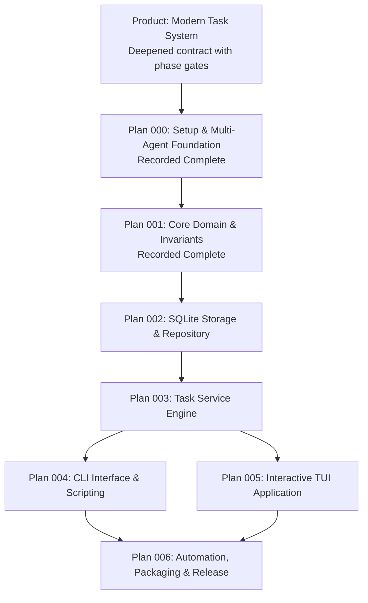

# Tusk Feature Plan Registry

This directory contains the canonical Brainstorm specification, modular implementation plans, verification plans, and issue workorders for the Tusk task management reboot.

> **Authoritative Orchestration**: The live, real-time checklist tracking active phases, implementation units, and agent execution pointers is maintained at [MASTERPLAN.md](../../MASTERPLAN.md) in the repository root.

## Planning Hierarchy & Execution Sequence

## Plan Catalog & Ultrathink Planning Packs

| Plan ID | Title | Implementation Plan | Verification Plan | Issue Workorder | Status |
| :--- | :--- | :--- | :--- | :--- | :--- |
| **TUSK / Product** | Modern Task System | [Product Plan](2026-09-06-001-feat-tusk-modern-task-system-plan.md) | [Verification Plan](../verification-plans/2026-09-06-001-feat-tusk-modern-task-system-verification-plan.md) | [Workorder](../workorders/2026-09-06-001-feat-tusk-modern-task-system-issues-workorder.md) | `deepened; phase gates open` |
| **000** | Setup & Multi-Agent Foundation | [Plan 000](2026-09-06-000-feat-setup-and-multi-agent-foundation-plan.md) | Embedded in Plan | Tested by scripts | `completed` |
| **001** | Core Domain & Invariants | [Plan 001](2026-09-06-001-feat-core-domain-and-invariants-plan.md) | [Verification Plan](../verification-plans/2026-09-06-001-feat-core-domain-and-invariants-verification-plan.md) | [Workorder](../workorders/2026-09-06-001-feat-core-domain-and-invariants-issues-workorder.md) | `completed; historical evidence` |
| **002** | SQLite Storage & Repository | [Plan 002](2026-09-06-002-feat-sqlite-storage-and-repository-plan.md) | [Verification Plan](../verification-plans/2026-09-06-002-feat-sqlite-storage-and-repository-verification-plan.md) | [Workorder](../workorders/2026-09-06-002-feat-sqlite-storage-and-repository-issues-workorder.md) | `locally accepted; native/hosted release proof pending` |
| **003** | Task Service Engine | [Plan 003](2026-09-06-003-feat-task-service-engine-plan.md) | [Verification Plan](../verification-plans/2026-09-06-003-feat-task-service-engine-verification-plan.md) | [Workorder](../workorders/2026-09-06-003-feat-task-service-engine-issues-workorder.md) | `locally accepted; consumer/native gates pending` |
| **004** | CLI Interface & Scripting | [Plan 004](2026-09-06-004-feat-cli-interface-and-scripting-plan.md) | [Verification Plan](../verification-plans/2026-09-06-004-feat-cli-interface-and-scripting-verification-plan.md) | [Workorder](../workorders/2026-09-06-004-feat-cli-interface-and-scripting-issues-workorder.md) | `planning complete; execution not started` |
| **005** | Interactive TUI Application | [Plan 005](2026-09-06-005-feat-interactive-tui-application-plan.md) | Planned | Planned | `pending` |
| **006** | Automation, Packaging & Release | [Plan 006](2026-09-06-006-feat-automation-packaging-and-release-plan.md) | Planned | Planned | `pending` |

The product triplet defines cross-phase contracts and acceptance. Feature 002 has six locally accepted units; native/hosted release proof remains pending. Product U24 maps its compatibility prerequisite. Feature 003 now has 22 requirements, seven units ordered U1 → U2 → U3 → U6 → U7 → U4 → U5, and 91 locally verified scenarios. Product U6–U10 map to that service pack; feature-local U6/U7 split its orchestrator work. Feature 004 now has 25 requirements, seven units ordered U1 → U5 → U4 → U2 → U7 → U3 → U6, and 91 unexecuted scenarios. Product U11–U15 map to that CLI pack; U7 splits deletion from its mutation unit. Feature 005–006 outline frontmatter is not proof of readiness. Consult `MASTERPLAN.md` before implementation. Feature 003 implementation receipts now close its local gates; [PR #3](https://github.com/newbpydev/tusk/pull/3) is merged; later consumer/release gates remain pending.
