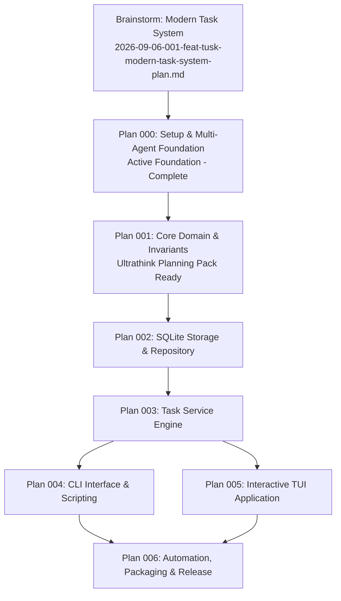

# Tusk Feature Plan Registry

This directory contains the canonical Brainstorm specification, modular implementation plans, verification plans, and issue workorders for the Tusk task management reboot.

> **Authoritative Orchestration**: The live, real-time checklist tracking active phases, implementation units, and agent execution pointers is maintained at [MASTERPLAN.md](../../MASTERPLAN.md) in the repository root.

## Planning Hierarchy & Execution Sequence

## Plan Catalog & Ultrathink Planning Packs

| Plan ID | Title | Implementation Plan | Verification Plan | Issue Workorder | Status |
| :--- | :--- | :--- | :--- | :--- | :--- |
| **Brainstorm** | Modern Task System | [Brainstorm Plan](2026-09-06-001-feat-tusk-modern-task-system-plan.md) | — | — | `approved` |
| **000** | Setup & Multi-Agent Foundation | [Plan 000](2026-09-06-000-feat-setup-and-multi-agent-foundation-plan.md) | Embedded in Plan | Tested by scripts | `completed` |
| **001** | Core Domain & Invariants | [Plan 001](2026-09-06-001-feat-core-domain-and-invariants-plan.md) | [Verification Plan](../verification-plans/2026-09-06-001-feat-core-domain-and-invariants-verification-plan.md) | [Workorder](../workorders/2026-09-06-001-feat-core-domain-and-invariants-issues-workorder.md) | `ready` |
| **002** | SQLite Storage & Repository | [Plan 002](2026-09-06-002-feat-sqlite-storage-and-repository-plan.md) | Planned | Planned | `pending` |
| **003** | Task Service Engine | [Plan 003](2026-09-06-003-feat-task-service-engine-plan.md) | Planned | Planned | `pending` |
| **004** | CLI Interface & Scripting | [Plan 004](2026-09-06-004-feat-cli-interface-and-scripting-plan.md) | Planned | Planned | `pending` |
| **005** | Interactive TUI Application | [Plan 005](2026-09-06-005-feat-interactive-tui-application-plan.md) | Planned | Planned | `pending` |
| **006** | Automation, Packaging & Release | [Plan 006](2026-09-06-006-feat-automation-packaging-and-release-plan.md) | Planned | Planned | `pending` |
