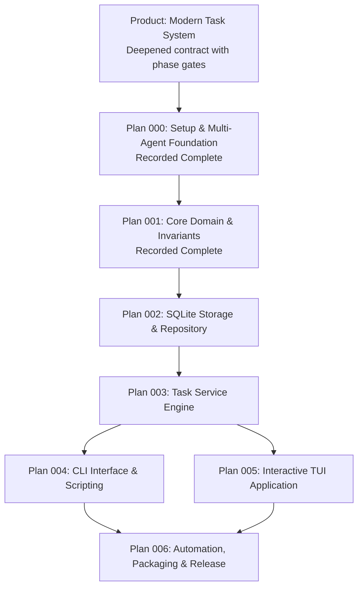

# Tusk Feature Plan Registry

This directory contains the canonical Brainstorm specification, modular implementation plans, verification plans, and issue workorders for the Tusk task management reboot.

> **Authoritative Orchestration**: The live, real-time checklist tracking active phases, implementation units, and agent execution pointers is maintained at [MASTERPLAN.md](../../MASTERPLAN.md) in the repository root.

## Planning Hierarchy & Execution Sequence

```mermaid
graph TD
    B[Product: Modern Task System<br/>Deepened contract with phase gates] --> P0[Plan 000: Setup & Multi-Agent Foundation<br/>Recorded Complete]
    P0 --> P1[Plan 001: Core Domain & Invariants<br/>Recorded Complete]
    P1 --> P2[Plan 002: SQLite Storage & Repository]
    P2 --> P3[Plan 003: Task Service Engine]
    P3 --> P4[Plan 004: CLI Interface & Scripting]
    P3 --> P5[Plan 005: Interactive TUI Application]
    P4 --> P6[Plan 006: Automation, Packaging & Release]
    P5 --> P6
```

## Plan Catalog & Ultrathink Planning Packs

| Plan ID | Title | Implementation Plan | Verification Plan | Issue Workorder | Status |
| :--- | :--- | :--- | :--- | :--- | :--- |
| **TUSK / Product** | Modern Task System | [Product Plan](2026-09-06-001-feat-tusk-modern-task-system-plan.md) | [Verification Plan](../verification-plans/2026-09-06-001-feat-tusk-modern-task-system-verification-plan.md) | [Workorder](../workorders/2026-09-06-001-feat-tusk-modern-task-system-issues-workorder.md) | `deepened; phase gates open` |
| **000** | Setup & Multi-Agent Foundation | [Plan 000](2026-09-06-000-feat-setup-and-multi-agent-foundation-plan.md) | Embedded in Plan | Tested by scripts | `completed` |
| **001** | Core Domain & Invariants | [Plan 001](2026-09-06-001-feat-core-domain-and-invariants-plan.md) | [Verification Plan](../verification-plans/2026-09-06-001-feat-core-domain-and-invariants-verification-plan.md) | [Workorder](../workorders/2026-09-06-001-feat-core-domain-and-invariants-issues-workorder.md) | `completed; historical evidence` |
| **002** | SQLite Storage & Repository | [Plan 002](2026-09-06-002-feat-sqlite-storage-and-repository-plan.md) | [Verification Plan](../verification-plans/2026-09-06-002-feat-sqlite-storage-and-repository-verification-plan.md) | [Workorder](../workorders/2026-09-06-002-feat-sqlite-storage-and-repository-issues-workorder.md) | `locally accepted; native/hosted release proof pending` |
| **003** | Task Service Engine | [Plan 003](2026-09-06-003-feat-task-service-engine-plan.md) | [Verification Plan](../verification-plans/2026-09-06-003-feat-task-service-engine-verification-plan.md) | [Workorder](../workorders/2026-09-06-003-feat-task-service-engine-issues-workorder.md) | `locally accepted; consumer/native gates pending` |
| **004** | CLI Interface & Scripting | [Plan 004](2026-09-06-004-feat-cli-interface-and-scripting-plan.md) | [Verification Plan](../verification-plans/2026-09-06-004-feat-cli-interface-and-scripting-verification-plan.md) | [Workorder](../workorders/2026-09-06-004-feat-cli-interface-and-scripting-issues-workorder.md) | `locally accepted; PR #4 merged; native/hosted release gates pending` |
| **005** | Interactive TUI Application | [Plan 005](2026-09-06-005-feat-interactive-tui-application-plan.md) | [Verification Plan](../verification-plans/2026-09-06-005-feat-interactive-tui-application-verification-plan.md) | [Workorder](../workorders/2026-09-06-005-feat-interactive-tui-application-issues-workorder.md) | `locally accepted; all eight units complete; native/hosted release proof pending` |
| **006** | Automation, Packaging & Release | [Plan 006](2026-09-06-006-feat-automation-packaging-and-release-plan.md) | Planned | Planned | `pending` |

The product triplet defines cross-phase contracts and acceptance. Features
002–005 are locally accepted; native/hosted release proof remains pending.
Product U24 maps Feature 002's runtime prerequisite; U6–U10 map Feature 003 and
U11–U15 map Feature 004. Feature 004 has seven completed local units and 89 local
scenarios, with V90–V91 handed to Feature 006. Local main records PR #4 merged.

Feature 005 has 28 requirements, eight units ordered U1 → U7 → U2 → U3 → U4 →
U5 → U8 → U6, and 112 verification scenarios. All eight units are separately
committed. The approved Spacious workspace and due-date calendar pass canonical,
minimum-Go and real Kitty checks. All 84 CLI and 78 TUI measurement case-runs pass.
The later U6 hierarchy/Darkmatter refinement is owner-approved, with canonical,
Kitty and TUI timing checks passing; its fresh CLI timing gate remains open.
See the [follow-up checkpoint](../verification-evidence/005/u6-hierarchy/checkpoint.json).
Product U16→U1/U7/U2, U17→U3,
U18→U4, U19→U5/U8 and U20→U6 preserve the existing handoff IDs. V01–V110 are
locally complete; V111–V112 are native/hosted release handoffs. Feature 006
outline metadata is not readiness. Consult MASTERPLAN.md before implementation;
no Feature 006 implementation or release is authorized by this checkpoint.
